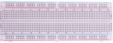

# Project 05：Traffic Lights

### **Introduction**

Traffic lights are closely related to people's daily lives, which generally show red, yellow, and green. Everyone should obey the traffic rules, which can avoid many traffic accidents. In this project, we will use Raspberry Pi Pico and some LEDs (red, green and yellow) to simulate the traffic lights.

### **Components Required**

|  |             |                 |
| ------------------------ | ----------------------------------- | --------------------------------------- |
| Raspberry Pi Pico*1      | Raspberry Pi Pico Expansion Board*1 | Red LED*1                               |
|  |             |  |
| Green LED*1              | USB Cable*1                         | 220ΩResistor*3                          |
|  |             |                 |
| Yellow LED*1             | Breadboard*1                        | Jumper Wires                            |

### **Circuit Diagram and Wiring Diagram**


Note:

How to connect an LED


How to identify the 220Ω 5-band resistor


### **Test Code**

The code used in this project is saved in the file KS3020 Keyestudio Raspberry Pi Pico Learning Kit Ultimate Edition\\2. Windows
System\\1.Python\_Tutorial\\2. Python Projects\\Project 05：Traffic Lights. You can move the code to anywhere, for example, we can save the code in the Disk(D), the route is D:\\2. Python Projects.)

Open“Thonny”, click“This computer”→“D:”→“2. Python Projects”→”Project 05：Traffic Lights”and double left-click the“Project\_05\_Traffic\_Lights.py”.


```python
from machine import Pin
import time

led_red = machine.Pin(16, machine.Pin.OUT)  # create red led object from Pin 16, Set Pin 16 to output
led_yellow = machine.Pin(17, machine.Pin.OUT)  # create yellow led object from Pin 17, Set Pin 17 to output
led_green = machine.Pin(18, machine.Pin.OUT) # create green led object from Pin 18, Set Pin 18 to output

while True:
    led_red.value(1)  # Set red led turn on
    time.sleep(5)   # Sleep 5s
    led_red.value(0) # Set red led turn off 
    led_yellow.value(1)
    time.sleep(0.5)
    led_yellow.value(0)
    time.sleep(0.5)
    led_yellow.value(1)
    time.sleep(0.5)
    led_yellow.value(0)
    time.sleep(0.5)
    led_yellow.value(1)
    time.sleep(0.5)
    led_yellow.value(0)
    time.sleep(0.5)
    led_green.value(1)
    time.sleep(5) 
    led_green.value(0) 
```

### **Test Result**

Ensure that the Raspberry Pi Pico is connected to the computer, click “Stop/Restart backend”.


Click“Run current script”, the code starts executing, what we will see are below:

1.  First, the green light will be on for 5 seconds and then off; 

2.  Next, the yellow light blinks three times and then goes off. 

3.  Then, the red light goes on for five seconds and then goes off. 
    

Repeat steps 1 to 3 above and press“Ctrl+C”or click“Stop/Restart backend” to exit the program.


