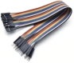

# Project 09：4-Digit Digital Tube

### **Introduction**

The 4-digit 7-segment digital tube is a very practical display device, and it is used for devices such as electronic clocks and
score counters. Due to the low price and it is easy to use, more and more projects will use 4-digit 7-segment digital tubes. In this project, we will use the Raspberry Pi Pico to control a 4-bit 7-segment digital tube to create a manual counter.

### **Components Required**

|       |             |                          |
| ----------------------------- | ----------------------------------- | ------------------------ |
| Raspberry Pi Pico*1           | Raspberry Pi Pico Expansion Board*1 |                          |
|       |             |  |
| 4-Digit Digital Tube Module*1 | M-F Dupont Wires                    | USB Cable*1              |

### **Component Knowledge**

**TM1650 4-digit digital tube:** It is a 12-pin 4-digit tube display module with clock dots. The driver chip is TM1650 which only needs 2 signal lines to enable the microcontroller to control the 4-digit 8-segment digital tube. The control interface level can be 5V or 3.3V.

**Specifications of 4-bit digital tube module:**

Working voltage: DC 3.3V-5V

Maximum current: 100MA

Maximum power: 0.5W

**Schematic diagram of 4-digit digital tube module:**


### **Circuit Diagram and Wiring Diagram**


### **Test Code**

The code used in this project is saved in the file KS3020 Keyestudio Raspberry Pi Pico Learning Kit Ultimate Edition\\2. Windows System\\1.Python\_Tutorial\\2. Python Projects\\Project 09：4-Digit Digital Tube. You can move the code to anywhere, for example, we can save the code in the Disk(D), the route is D:\\2. Python Projects.

Open“Thonny”, click“This computer”→“D:”→“2. Python Projects”→“Project 09：4-Digit Digital Tube”. Select“TM1650.py”，right-click and select“Upload to /”， and wait for“TM1650.py to be uploaded to the Raspberry Pi Pico. And double left-click the“Project\_09\_Four\_Digit\_Digital\_Tube.py”.


```python
from machine import Pin, I2C
from TM1650 import TM1650
import time

# Define IIC interfaces and frequencies
i2c=I2C(0, scl=Pin(21),sda=Pin(20), freq=100000)

display = TM1650(i2c)

# Display the numbers 1111-9999 circulately
while True:
    display.display(1111)
    time.sleep(1)
    display.display(2222)
    time.sleep(1)
    display.display(3333)
    time.sleep(1)
    display.display(4444)
    time.sleep(1)
    display.display(5555)
    time.sleep(1)
    display.display(6666)
    time.sleep(1)
    display.display(7777)
    time.sleep(1)
    display.display(8888)
    time.sleep(1)
    display.display(9999)
    time.sleep(1)
```

### **Test Result**

Ensure that the Raspberry Pi Pico is connected to the computer，click“Stop/Restart backend”.


Click“Run current script”, the code starts executing, we will see that the 4-digit digital tube circularly displays numbers from 0000 to 9999. Press“Ctrl+C”or click“Stop/Restart backend”to exit the program.


