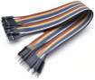

# Project 10：8×8 Dot-matrix Display

### **Introduction**

The dot-matrix display is an electronic digital display device that can show information on machines, clocks and many other devices. In this project, we will use the Raspberry Pi Pico to control the 8x8 LED dot matrix to make a“❤”pattern.

### **Components Required**

|   |             |                          |
| ------------------------- | ----------------------------------- | ------------------------ |
| Raspberry Pi Pico*1       | Raspberry Pi Pico Expansion Board*1 |                          |
|   |             |  |
| 8*8 Dot-matrix Display *1 | M-F Dupont Wires                    | USB Cable*1              |

### **Component Knowledge**

**8\*8 Dot-matrix display module:**

The 8\*8 dot matrix is composed of 64 LEDs, and each LED is placed at the intersection of a row and a column. When using a single-chip microcomputer to drive an 8\*8 dot matrix, we need to use a total of 16 digital ports, which greatly wastes the data of the single-chip microcomputer. For this reason, we specially designed this module, using the HT16K33 chip to drive an 8\*8 dot matrix, and only need to use the I2C communication port of the single-chip microcomputer to control the dot matrix, which greatly saves the microcontroller resources.

**Specifications:**

Working voltage: DC 5V

Current: 200MA

Maximum power: 1W

### **Schematic diagram:**

Some modules have three DIP switches that you can flip at will. These switches are used to set the I2C communication address. The setting method is as follows. The module has fixed the communication address. A0, A1 and A2 are connected to GND, and the address is 0x70.  

<table>
<tbody>
<tr class="odd">
<td>A0（1）</td>
<td>A1（2）</td>
<td>A2（3）</td>
<td>A0（1）</td>
<td>A1（2）</td>
<td>A2（3）</td>
<td>A0（1）</td>
<td>A1（2）</td>
<td>A2（3）</td>
</tr>
<tr class="even">
<td>0（OFF）</td>
<td>0（OFF）</td>
<td>0（OFF）</td>
<td>1（ON）</td>
<td>0（OFF）</td>
<td>0（OFF）</td>
<td>0（OFF）</td>
<td>1（ON）</td>
<td>0（OFF）</td>
</tr>
<tr class="odd">
<td>0X70</td>
<td>0X71</td>
<td>0X72</td>
<td></td>
<td></td>
<td></td>
<td></td>
<td></td>
<td></td>
</tr>
<tr class="even">
<td>A0（1）</td>
<td>A1（2）</td>
<td>A2（3）</td>
<td>A0（1）</td>
<td>A1（2）</td>
<td>A2（3）</td>
<td>A0（1）</td>
<td>A1（2）</td>
<td>A2（3）</td>
</tr>
<tr class="odd">
<td>1（ON）</td>
<td>1（ON）</td>
<td>0（OFF）</td>
<td>0（OFF）</td>
<td>0（OFF）</td>
<td>1（ON）</td>
<td>1（ON）</td>
<td>0（OFF）</td>
<td>1（ON）</td>
</tr>
<tr class="even">
<td>0X73</td>
<td>0X74</td>
<td>0X75</td>
<td></td>
<td></td>
<td></td>
<td></td>
<td></td>
<td></td>
</tr>
<tr class="odd">
<td>A0（1）</td>
<td>A1（2）</td>
<td>A2（3）</td>
<td>A0（1）</td>
<td>A1（2）</td>
<td>A2（3）</td>
<td></td>
<td></td>
<td></td>
</tr>
<tr class="even">
<td>0（OFF）</td>
<td>1（ON）</td>
<td>1（ON）</td>
<td>1（ON）</td>
<td>1（ON）</td>
<td>1（ON）</td>
<td></td>
<td></td>
<td></td>
</tr>
<tr class="odd">
<td>0X76</td>
<td>0X77</td>
<td></td>
<td></td>
<td></td>
<td></td>
<td></td>
<td></td>
<td></td>
</tr>
</tbody>
</table>
### **Circuit Diagram and Wiring Diagram**


### **Test Code**

The code used in this project is saved in the file KS3020 Keyestudio Raspberry Pi Pico Learning Kit Ultimate Edition\\2. Windows System\\1.Python\_Tutorial\\2. Python Projects\\Project 10：8×8 Dot-matrix Display.You can move the code to anywhere, for example, we can save the code in the Disk(D), the route is D:\\2. Python Projects.

Open“Thonny, click “This computer” → “D:” → “2. Python Projects” → “Project 10：8×8 Dot-matrix Display”. Select “ht16k33\_matrix.py” and “matrix\_fonts.py”, right-click and select “Upload to /” and wait for “ht16k33\_matrix.py” and “matrix\_fonts.py” to be uploaded to the Raspberry Pi Pico. And double left-click the “Project\_10\_8×8\_Dot\_Matrix\_Display.py”.


```python
from machine import Pin,I2C
import time
import json
import matrix_fonts
from ht16k33_matrix import ht16k33_matrix
## Tool To Make Sprites https://gurgleapps.com/tools/matrix
#i2c config
clock_pin = 21
data_pin = 20
bus = 0
i2c_addr_left = 0x70
use_i2c = True

def scan_for_devices():
    i2c = machine.I2C(bus,sda=machine.Pin(data_pin),scl=machine.Pin(clock_pin))
    devices = i2c.scan()
    if devices:
        for d in devices:
            print(hex(d))
    else:
        print('no i2c devices')

if use_i2c:
    scan_for_devices()
    left_eye = ht16k33_matrix(data_pin, clock_pin, bus, i2c_addr_left)

def show_char(left):
    if use_i2c:
        left_eye.show_char(left)
        
def scroll_message(font,message='hello',delay=0.05): #Scrolling display
    left_message = '   ' + message
    right_message = message + '   '
    length=len(right_message)
    char_range=range(length-1)
    for char_pos in char_range:
      right_left_char=font[right_message[char_pos]]
      right_right_char=font[right_message[char_pos+1]]
      left_left_char=font[left_message[char_pos]]
      left_right_char=font[left_message[char_pos+1]]
      for shift in range(8):
        left_bytes=[0,0,0,0,0,0,0,0]
        right_bytes=[0,0,0,0,0,0,0,0]
        for col in range(8):
          left_bytes[col]=left_bytes[col]|left_left_char[col]<<shift
          left_bytes[col]=left_bytes[col]|left_right_char[col]>>8-shift;
          right_bytes[col]=right_bytes[col]|right_left_char[col]<<shift
          right_bytes[col]=right_bytes[col]|right_right_char[col]>>8-shift;
        if use_i2c:
                left_eye.show_char(left_bytes)
        time.sleep(delay)


while True:
    show_char(matrix_fonts.textFont1['A']) #Show the letter A
    time.sleep(1)
    show_char(matrix_fonts.textFont1['B'])
    time.sleep(1)
    show_char(matrix_fonts.textFont1['C'])
    time.sleep(1)
    scroll_message(matrix_fonts.textFont1, ' Hello World ')
```

### **Test Result**

Ensure that the Raspberry Pi Pico is connected to the computer，click“Stop/Restart backend”.


Click“Run current script”, the code starts executing, we will see that the 8 x 8 dot matrix displays the character "A" 1S, "B" 1S, and "C" 1S. Then scroll to display the string "Hello World”repeatedly. Press“Ctrl+C”or click“Stop/Restart backend”to exit the program.


