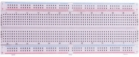

# Project 16：Burglar Alarm

### **Introduction**

PIR motion sensor measures the thermal infrared (IR) light emitted by moving objects. The sensor can detect the movement of people, animals, and cars to trigger safety alarms and lighting. They are used to detect movement and ideal for security such as burglar alarms and security lighting systems. In this project, we will use a Raspberry Pi Pico to control PIR motion sensor, buzzers and LEDs to simulate burglar alarms.

### **Components Required**

|  |             |  |  |  |
| ------------------------ | ----------------------------------- | ------------------------ | ------------------------ | ------------------------ |
| Raspberry Pi Pico*1      | Raspberry Pi Pico Expansion Board*1 | PIR Motion Sensor*1      | Active Buzzer*1          | Red LED*1                |
|  |             |  |  |  |
| Breadboard*1             | F-F Dupont Wires                    | 220ΩResistor*1           | USB Cable*1              | Jumper Wires             |

### **Component Knowledge**

**PIR motion sensor:** The principle is that when certain crystals, such as lithium tantalate and triglyceride sulfate, are heated, the two ends of the crystal will generate an equal number of charges with opposite signs. These charges can be converted into voltage output by an amplifier. And the human body will release infrared light, although relatively weak, but still can be detected. When the PIR motion sensor detects the movement of a nearby person, the sensor signal terminal outputs a high level 1. 

Otherwise, it outputs a low level 0. Pay special attention that this sensor can detect people, animals and cars in motion. People, animals and cars at rest cannot be detected. The maximum detection distance is about 7 meters.

**Note:** Since vulnerable to radio frequency radiation and temperature changes, the PIR motion sensor should be kept away from heat sources like radiators, heaters and air conditioners, as well as direct irradiation of sunlight, headlights and incandescent light.

**Features:**

Maximum input voltage: DC 3.3 \~ 5V

Maximum operating current: 50MA

Maximum power: 0.3W

Operating temperature: -20 \~ 85℃

Output high level is 3V, low level is 0V.

Delay time: about 2.3 to 3 seconds

Detection Angle: about 100 degrees

Maximum detection distance: about 7 meters

Indicator light output (when the output is high, it will light up)

Pin limiting current: 50MA

**Schematic diagram:**


### **Circuit Diagram and Wiring Diagram**


### **Test Code**

The code used in this project is saved in the file KS3020 Keyestudio Raspberry Pi Pico Learning Kit Ultimate Edition\\2. Windows System\\1.Python\_Tutorial\\2. Python Projects\\Project 16：Burglar Alarm. You can move the code to anywhere, for example, we can save the code in the Disk(D), the route is D:\\2. Python Projects.

Open“Thonny”, click“This computer”→“D:”→“2. Python Projects”→“Project 16：Burglar Alarm”. And double left-click
the“Project\_16\_Burglar\_Alarm.py”.


```python
from machine import Pin
import time

sensor_pir = machine.Pin(2, machine.Pin.IN)
led = machine.Pin(22, machine.Pin.OUT)
buzzer = machine.Pin(19, machine.Pin.OUT)

def pir_handler(pin): 
    print("ALARM! Motion detected!") 
    for i in range(50): 
        led.toggle() 
        buzzer.toggle() 
        time.sleep_ms(100)

sensor_pir.irq(trigger=machine.Pin.IRQ_RISING, handler=pir_handler)

while True: 
    led.toggle() 
    time.sleep(5)
```

### **Test Result**

Ensure that the Raspberry Pi Pico is connected to the computer，click“Stop/Restart backend”.


Click “Run current script”, the code starts executing, we will see that If the PIR motion sensor detects someone nearby, the buzzer will give an alarm and the LEDs will flash continuously. At the same time, the "Shell" window of the Thonny IDE will print the string "ALARM\! Motion detected\!" Press“Ctrl+C”or click“Stop/Restart backend”to exit the program.


