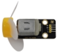
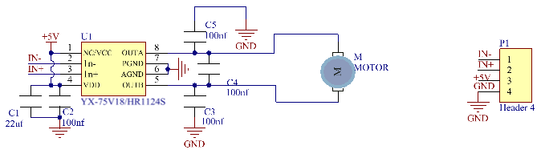

# Project 18：Small Fan

### **Introduction**

In the hot summer, we need an electric fan to cool us down, so in this project, we will use a Raspberry Pi Pico to control 130 motor module and small blade to make a small fan.

### **Components Required**

|  |             |                          |
| ------------------------ | ----------------------------------- | ------------------------ |
| Raspberry Pi Pico*1      | Raspberry Pi Pico Expansion Board*1 |                          |
|  |             |  |
| 130 Motor Module*1       | M-F Dupont Wires                    | USB Cable*1              |

### **Component Knowledge**


130 motor module: The motor control module uses the HR1124S motor control chip, which is a single-channel H-bridge driver chip for DC motor. The H-bridge driving part of the HR1124S features low on-resistance PMOS and NMOS power tube. The low on-resistance ensures low power loss of the chip, making the chip work safely for a longer time. In addition, HR1124S has low standby current and low quiescent current, which makes HR1124S easy to be used in toy scheme.

**Features:**

Working voltage: 5V

Working current: 200MA

Working power: 2W

Working temperature: -10℃\~ +50℃

**Schematic diagram:**



### **Circuit Diagram and Wiring Diagram**


### **Test Code**

The code used in this project is saved in the file KS3020 Keyestudio Raspberry Pi Pico Learning Kit Ultimate Edition\\2. Windows System\\1.Python\_Tutorial\\2. Python Projects\\Project 18：Small Fan. You can move the code to anywhere, for example, we can save the code in the Disk(D), the route isD:\\2. Python Projects.

Open“Thonny”, click“This computer”→“D:”→“2. Python Projects”→“Project 18：Small Fan”. And double left-click the“Project\_18\_ Small\_Fan.py”.


```python
from machine import Pin
import time

motor1a = Pin(17, Pin.OUT) # create motor1a object from Pin 17, Set Pin 17 to output
motor1b = Pin(16, Pin.OUT) # create motor1b object from Pin 16, Set Pin 16 to output

def forward():
    motor1a.high() # Set motor1a high
    motor1b.low() # Set motor1b low
def backward():
    motor1a.low()
    motor1b.high()
def stop():
    motor1a.low()
    motor1b.low()

def test():
    forward() # motor forward
    time.sleep(5) #delay
    stop() # motor stop
    time.sleep(2)
    backward()# motor backward 
    time.sleep(5)
    stop()
    time.sleep(2)
    
for i in range(5):
    test()
```

### **Test Result**

Ensure that the Raspberry Pi Pico is connected to the computer，click“Stop/Restart backend”.


Click “Run current script”, the code starts executing, we will see that the small fan turns counterclockwise for 5 seconds and stops for 2 seconds, and then turns clockwise for 5 seconds and stops for 2 seconds. Repeat this rule for 5 times and then the small fan stops. Press“Ctrl+C”or click“Stop/Restart backend”to exit the program.

# 
