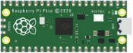
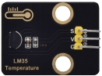

# Project 27：Temperature Measurement

### **Introduction**

LM35 is a commonly used and easy-to-use temperature sensor. It does not require other hardware, only needs an analog port. The difficulty lies in compiling the code and converting the analog values to Celsius temperature. In this project, we use a temperature sensor and 3 LEDs to make a temperature tester. When the temperature sensor touches objects with different temperature, the LEDs will show different colors.

#### **Components Required**

|  |             |  |  |
| ------------------------ | ----------------------------------- | ------------------------ | ------------------------ |
| Raspberry Pi Pico*1      | Raspberry Pi Pico Expansion Board*1 | LM35Temperature Sensor*1 | USB Cable*1              |
|  |             |  |  |
| 220Ω Resistor*3          | Red LED*1                           | Yellow LED*1             | Green LED*1              |
|  |             |  |                          |
| F-F Dupont Wires         | Breadboard*1                        | Jumper Wires             |                          |

### **Component Knowledge**


**Working principle of LM35 temperature sensor:** LM35 is a widely used temperature sensor with many different package types. At room temperature, it can achieve the accuracy of 1/4°C without additional calibration processing. LM35 temperature sensor can produce different voltage by different temperature. When the temperature is 0 ℃, it outputs 0V. If increasing 1 ℃, the output voltage will increase 10mv. The output temperature is 0℃ to 100℃, the conversion formula is as follows.


### **Read the Temperature Value**

We first use a simple code to read the value of the temperature sensor, print it in the serial monitor. The wiring diagram is shown below.


LM35 output is given to analog pin GP26 of theRaspberry Pi Pico. This analog voltage is converted to its digital form and processed to get the temperature reading.

The code used in this project is saved in the file KS3020 Keyestudio Raspberry Pi Pico Learning Kit Ultimate Edition\\2. Windows System\\1.Python\_Tutorial\\2. Python Projects\\Project 27：Temperature Measurement. You can move the code to anywhere, for example, we can save the code in the Disk(D), the route is D:\\2. Python Projects.

Open“Thonny”, click“This computer”→“D:”→“2. Python Projects”→“Project 27：Temperature Measurement”. And double left-click
the“Project\_27.1\_Read\_LM35\_Temperature\_Value.py”.


```python
from machine import ADC, Pin
import time

# Initialize the Sound sensor to pin 26 (ADC function)
# Select ADC input 0 (GPIO26)
sensor_temp = ADC(26)
conversion_factor = 3.3 / (65535)

while True:
    reading = sensor_temp.read_u16() * conversion_factor 
    temperature = reading * 102.4 
    print(temperature)
    time.sleep(1)
```

### **Test Result**

Ensure that the Raspberry Pi Pico is connected to the computer，click“Stop/Restart backend”.


Click “Run current script”, the code starts executing, we will see that the "Shell" window of Thonny IDE will print the temperature values read by the LM35 temperature sensor. Hold the LM35 element by hand, the temperature value read by the LM35 temperature sensor will change. Press“Ctrl+C”or click“Stop/Restart backend”to exit the program.


### **Circuit Diagram and Wiring Diagram**

Now we use a LM35 temperature sensor and three LED lights to do a temperature test. When the LM35 temperature sensor senses different temperatures, different LED lights will light up. Follow the diagram below for wiring.


### **Test Code**

The code used in this project is saved in the file KS3020 Keyestudio Raspberry Pi Pico Learning Kit Ultimate Edition\\2. Windows System\\1.Python\_Tutorial\\2. Python Projects\\Project 27：Temperature Measurement. You can move the code to anywhere, for example, we can save the code in theDisk(D), the route is D:\\2. Python Projects.

Open“Thonny”, click“This computer”→“D:”→“2. Python Projects”→“Project 27：Temperature Measurement”. And double left-click
the“Project\_27.2\_Temperature\_Measurement.py”.

Note: The temperature threshold in the code can be reset itself as required.  


```python
from machine import ADC, Pin
import time

# Initialize the Sound sensor to pin 26 (ADC function)
# Select ADC input 0 (GPIO26)
sensor_temp = ADC(26)
conversion_factor = 3.3 / (65535)

# create red led object from Pin 19, Set Pin 19 to output
led_red = machine.Pin(19, machine.Pin.OUT)  
# create yellow led object from Pin 21, Set Pin 21 to output
led_yellow = machine.Pin(21, machine.Pin.OUT)
# create green led object from Pin 22, Set Pin 22 to output
led_green = machine.Pin(22, machine.Pin.OUT) 

while True:
    reading = sensor_temp.read_u16() * conversion_factor 
    temperature = reading * 102.4
    print(temperature)
    time.sleep(1)
    if temperature <28:
        led_red.value(1)  # Set red led turn on
        led_yellow.value(0) # Set yellow led turn off 
        led_green.value(0)  # Set green led turn off
    elif temperature >28 and temperature <31:
        led_red.value(0)  # Set red led turn off
        led_yellow.value(1) # Set yellow led turn on 
        led_green.value(0)  # Set green led turn off
    else:
        led_red.value(0)  # Set red led turn off
        led_yellow.value(0) # Set yellow led turn off 
        led_green.value(1)  # Set green led turn on
```

### **Test Result**

Ensure that the Raspberry Pi Pico is connected to the computer，click“Stop/Restart backend”.


Click “Run current script”, the code starts executing, we will see that the "Shell" window of Thonny IDE will print the temperature values read by the LM35 temperature sensor. When the LM35 temperature sensor senses different temperatures, different LEDS will light up. Press“Ctrl+C”or click“Stop/Restart backend”to exit the program.


