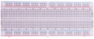

# Project 33：Keypad Door

### **Introduction**

In common digital button sensors, one button uses an IO port. However, sometimes it will occupy several IO ports when we need a lot of buttons . In order to save the use of IO ports, we are supposed to make a plurality of buttons into a matrix type, through the control of lines to achieve less IO port control the multiple buttons. In this project, we will learn a Raspberry Pi Pico and a 4\*4 membrane matrix keyboard control a servo and a buzzer.   

### **Components Required**

|         |             |  |  |
| ------------------------------- | ----------------------------------- | ------------------------ | ------------------------ |
| Raspberry Pi Pico*1             | Raspberry Pi Pico Expansion Board*1 | Servo*1                  | Active Buzzer*1          |
|         |             |  |  |
| 4*4 Membrane Matrix Keyboard *1 | Jumper Wires                        | Breadboard*1             | USB Cable*1              |

### **Component Knowledge**

**4\*4 Matrix keyboard:**The keyboard is a device that integrates many keys. As shown in the figure below, a 4x4 keyboard integrates 16 keys.


As with the LED matrix integration, in the 4x4 keyboard, each row of keys is connected to a pin, each column of keys is the same. This connection reduces the use of processor ports. The internal circuit is shown below.


You can use row scan or column scan methods to detect the state of the keys on each column or each line. Take the column scan method as an example. Send a low level to column 4 (Pin4), detect the state of rows 1, 2, 3 and 4, and determine whether the A, B, C and D keys are pressed. Then send the low level to columns 3, 2, 1 in turn, and detect whether other keys are pressed. Then you can get the state of all keys.

### **Read the Value**

We start with a simple code to read the values of the 4\*4 matrix keyboard and print them in the serial monitor. Its wiring diagram is shown below.


The code used in this project is saved in the file KS3020 Keyestudio Raspberry Pi Pico Learning Kit Ultimate Edition\\2. Windows System\\1.Python\_Tutorial\\2. Python Projects\\Project 33：Keypad Door. You can move the code to anywhere, for example, we can save the code in the Disk(D), the route is D:\\2. Python Projects.

Open“Thonny”, click“This computer”→“D:”→“2. Python Projects”→“Project 33：Keypad Door”. Select“keypad.py”, right-click and select“Upload to/”，waiting for“keypad.py”to be uploaded to the Raspberry Pi Pico. And double left-click the “Project\_33.1\_4x4\_Matrix\_Keypad\_Display.py”.


```python
from keypad import KeyPad
import time

keyPad = KeyPad(26, 22, 21, 20, 19, 18, 17, 16)

def key():
    keyvalue = keyPad.scan()
    if keyvalue != None:
        print(keyvalue, end="\t")
        time.sleep_ms(300)
        return keyvalue
            
while True:
    key()
```


Ensure that the Raspberry Pi Pico is connected to the computer, click“Stop/Restart backend”.


Click “Run current script”, the code starts executing, we will see that press the keyboard and the "Shell" window of Thonny IDE will print the corresponding key value, as shown below. Press“Ctrl+C”or click“Stop/Restart backend”to exit the program.


### **Circuit Diagram and Wiring Diagram**

In the last experiment, we have known the key values of the 4\*4 matrix keyboard. Next, we use it as the keyboard to control the servo and the buzzer.  


### **Test Code**

The code used in this project is saved in the file KS3020 Keyestudio Raspberry Pi Pico Learning Kit Ultimate Edition\\2. Windows System\\1.Python\_Tutorial\\2. Python Projects\\Project 33：Keypad Door. You can move the code to anywhere, for example, we can save the code in the Disk(D), the route is D:\\2. Python Projects.

Open“Thonny”, click“This computer”→“D:”→“2. Python Projects”→“Project 33： Keypad Door”. 

Select“keypad.py”and“myservo.py”， right-click and select“Upload to /”，waiting for the “keypad.py”and“myservo.py”to be
uploaded to the Raspberry Pi Pico. And double left-click the“Project\_33.2\_Keypad\_Door.py”.


```python
from myservo import Servo
from keypad import KeyPad
from machine import Pin
import time

keyPad = KeyPad(26, 22, 21, 20, 19, 18, 17, 16)
servo = Servo(2)
servo.ServoAngle(0)
activeBuzzer = Pin(0, Pin.OUT)

passWord = "1234"
keyIn = ""
def key():
    keyvalue = keyPad.scan()
    if keyvalue != None:
        print('Your input:', keyvalue)
        time.sleep_ms(200)
        return keyvalue

while True:
    keydata = key()
    if keydata != None:
        activeBuzzer.value(1)
        time.sleep_ms(100)
        activeBuzzer.value(0)
        keyIn += keydata 
        
    if len(keyIn) == 4:
        if keyIn == passWord:
            print("passWord right!")
            servo.ServoAngle(90)
            time.sleep_ms(1000)
            servo.ServoAngle(0)
        else:
            print("passWord error!")
            activeBuzzer.value(1)
            time.sleep_ms(1000)
            activeBuzzer.value(0)
        keyIn = ""
```

### **Test Result**

Ensure that the Raspberry Pi Pico is connected to the computer，click“Stop/Restart backend”.


Click “Run current script”, the code starts executing, we will see that press the keyboard to enter a four-character password. If the password is correct (correct password: 1234), the servo will turn at an angle and return to its original position. If the input is incorrect, an input error alert will be issued. Press“Ctrl+C”or click“Stop/Restart backend”to exit the program.


