# Python_Tutorial(Raspberry-Pi)

## 1. Preparation before class for Python

Raspberry Pi is a card computer whose official system is Raspberry Pi OS, and can be installed on the Raspberry Pi, such as: ubuntu, Windows IoT. Raspberry Pi can be used as a personal server, performing camera monitoring and recognition, as well as voice interaction by connecting a camera and a voice interactive assistant. 

Also, Raspberry Pi leads out 40Pin pins that can be connected to various sensors and control LEDs, motors, etc. This can be used to make a robot with a Raspberry Pi.

### 1.1. Tools needed for the Raspberry Pi system

#### 1.1.1. Hardware Tool:

- Raspberry Pi 4B/3B/2B

- Above 16G TFT Memory Card

- Card Reader

- Computer and other parts

#### 1.1.2. Install Software Tools(Windows System):

##### (1) Putty

Download link:

[https://www.chiark.greenend.org.uk/\~sgtatham/putty/](https://www.chiark.greenend.org.uk/~sgtatham/putty/)


1). After downloading the package file , double-click it and tap “Next”.
    
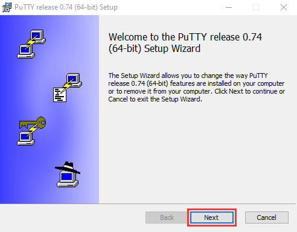
    
2). Click “Next”.
    


3). Choose “Install PuTTY files” and click “Install”.
    


4). After a few seconds, click "Finish".


##### (2) SSH Remote Login software -WinSCP

Download Link: [https://winscp.net/eng/download.php](https://winscp.net/eng/download.php)

1). After downloading the package file , click .
    

    
2). Click “Accept”.


3). Follow the below steps to finish the installation.


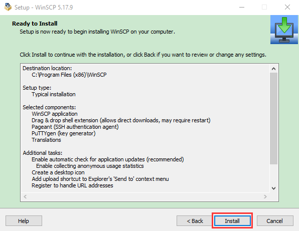


##### (3) SD Card Formatter

Format TFT card tool, download SD Card Formatter :

[http://www.canadiancontent.net/tech/download/SD\_Card\_Formatter.html](http://www.canadiancontent.net/tech/download/SD_Card_Formatter.html)


1). Unzip the SDCardFormatterv5\_WinEN package, double-click to run it.
    
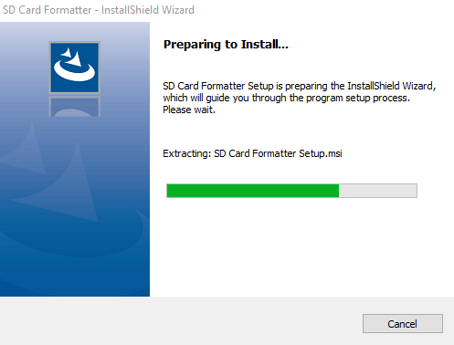
    

2). Click“Next”and choose  , then tap“Next” .


    
3). Click “Next” and “Install”.
    

    


4). After a few seconds, click "Finish".
    


##### (4) Burn Win32DiskImager 

Download Link：[https://sourceforge.net/projects/win32diskimager/](https://sourceforge.net/projects/win32diskimager/)


a. After the download, double-click and tap“Run”.


b. Select  and tap“Next”.


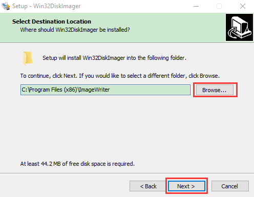

c. Click “Browse...”and find out the folder where the Win32DiskImager is located, tap “Next”. 

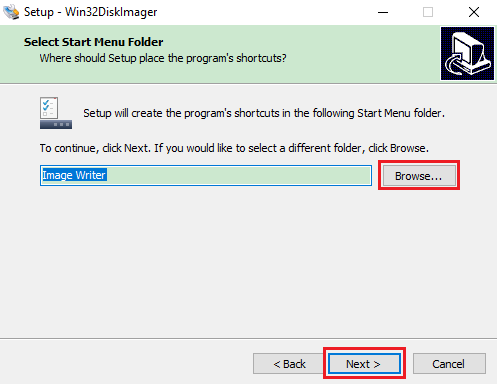

d. Tick  , click “Next” and “Install”.

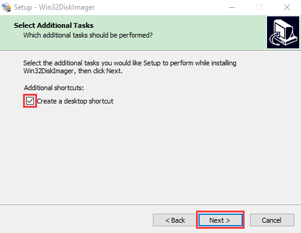

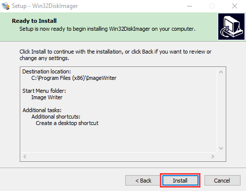

e. After a few seconds, click“Finish”. The installation is finished. 

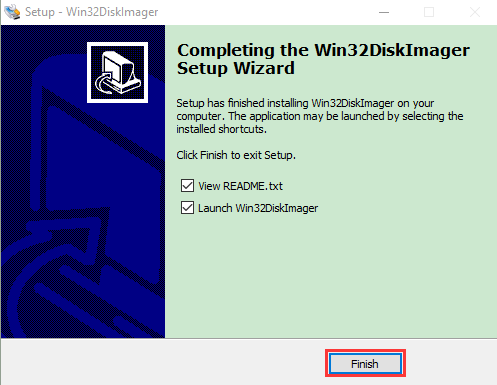

##### (5) Scan for IP address software tool---WNetWatcher
    
Download Link：[http://www.nirsoft.net/utils/wnetwatcher.zip](http://www.nirsoft.net/utils/wnetwatcher.zip)
        
##### (6) Raspberry Pi Imager

Download link for **the latest version**:

[https://www.raspberrypi.org/downloads/raspberry-pi-os/](https://www.raspberrypi.org/downloads/raspberry-pi-os/)

**Old version**：

Raspbian：[https://downloads.raspberrypi.org/raspbian/images/](https://downloads.raspberrypi.org/raspbian/images/)

Raspbian full：[https://downloads.raspberrypi.org/raspbian_full/images/](https://downloads.raspberrypi.org/raspbian_full/images/)

Raspbian lite：[https://downloads.raspberrypi.org/raspbian_lite/images/](https://downloads.raspberrypi.org/raspbian_lite/images/)

We use the 2020.05.28 version in the tutorial and recommend you to use this version

(Please download this version as shown in the picture below.)

[https://downloads.raspberrypi.org/raspios_full_armhf/images/raspios_full_armhf-2021-05-28/](https://downloads.raspberrypi.org/raspios_full_armhf/images/raspios_full_armhf-2021-05-28/)

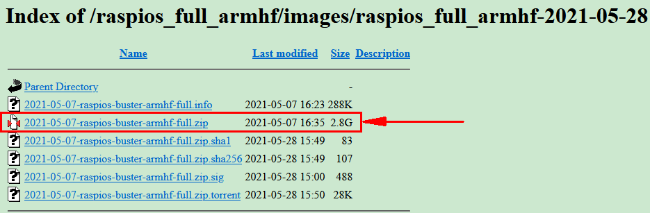

### 1.2. Install Raspberry Pi OS on Raspberry Pi 4B

#### 1.2.1. Connect the TFT memory card to a card reader, then plug the card reader into a computer’s USB port.

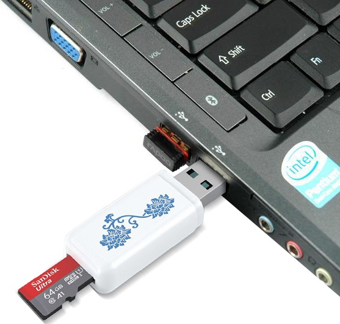

#### 1.2.2. Use the SD Card Formatter to format a TFT memory card, as illustrated below：

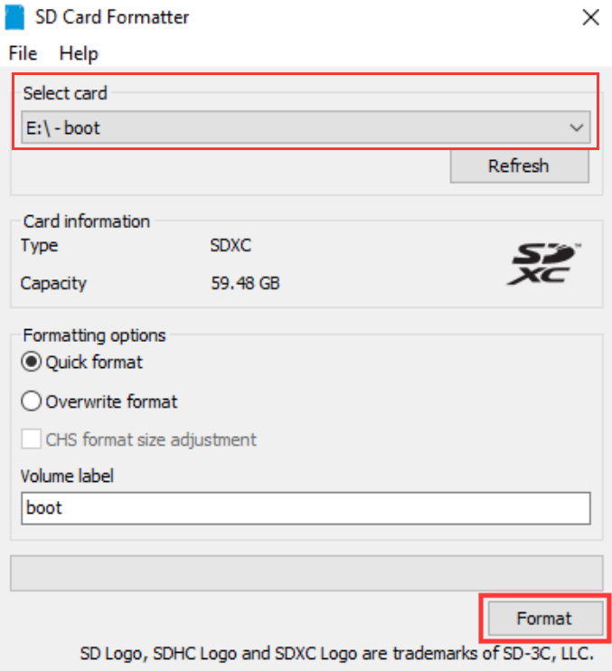


#### 1.2.3. Burn System:

（1）Use **Win32DiskImager** to burn the official **Raspberry Pi OS** mirror to the TFT memory card.


（2）After the mirror system is burned, don’t pull out the card reader, use a notepad to create a file named **SSH** and delete **.txt** , then copy it to the boot directory of the TFT card, so that you can open the SSH login function, as shown in the following figure:


（3） Pull out the card reader.

#### 1.2.4. Log in system:

（<span style="color: rgb(255, 76, 65);">The following operations require raspberry to share the same LOCAL area network with the PC</span>）

A. Insert the burned TFT memory card into the Raspberry Pi, connect internet cables and plug in power. If there is a screen and a HDMI cable of Raspberry Pi, connect the screen, and you can see the Raspberry Pi OS startup screen. If there is not a HDMI cable of Raspberry Pi, you can enter the desktop of Raspberry Pi via SSH remote login software---WinSCP and xrdp.

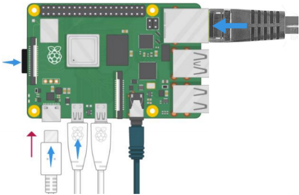

B. Use the WNetWatcher software to find the IP address of the Raspberry Pi.
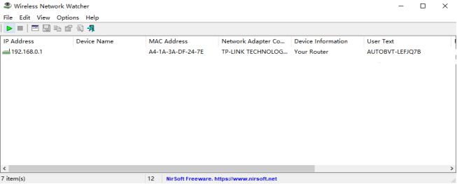

C. If there is no IP address as shown in the figure above, follow the following steps to set it.


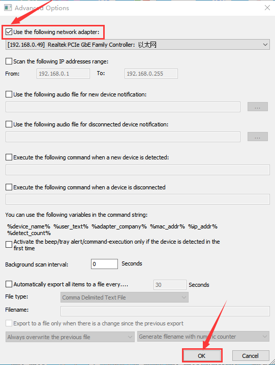

D. Once the setup is complete, record the IP and MAC addresses of the Raspberry Pi. As shown in the red box below, the MAC address of the Raspberry Pi is **b8:27:eb:17:16:01**, and the ip address is **192.168.0.57**. 

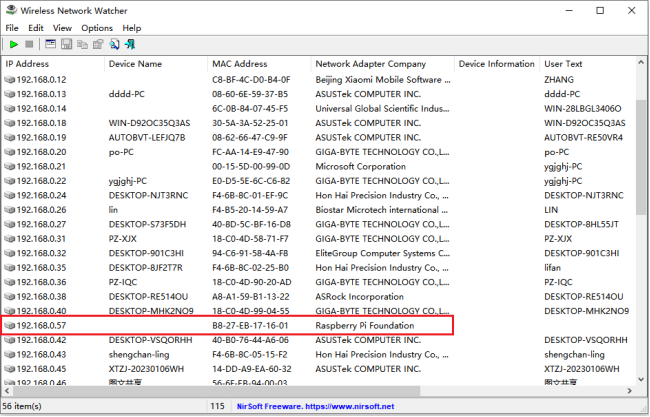

E. If you do not know the mac address and the ip address of the Raspberry Pi, then unplug the network cable of the Raspberry PI first, open the **WNetWatcher** query, and the detection times will be displayed on the right side of the interface. Connect the Raspberry Pi cable and query it once using **WNetWatcher**, and the Raspberry Pi address is detected one less time than the other addresses. Then write down the ip and mac addresses.

#### 1.2.5. Remote login

Enter default user name, password and host name on WinSCP to log in. Only a Raspberry Pi is connected in the same network.


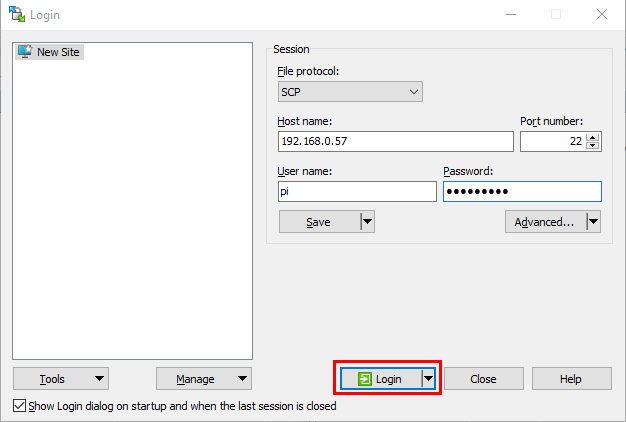

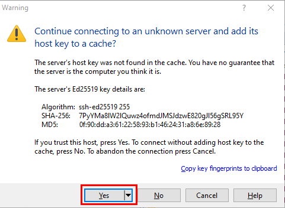

#### 1.2.6. View the ip address and mac address


Click to open terminal and input the password: <span style="color: rgb(255, 76, 65);">raspberry</span>, and tap“**Enter**”on keyboard.

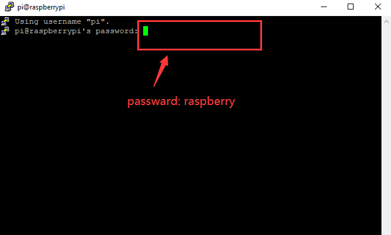


After successfully login, open the terminal, input <span style="color: rgb(255, 76, 65);">ip a</span> and tap“**Enter**”keyboard to view the ip address and mac address.


#### 1.2.7. Fix the IP address of Raspberry Pi

IP address is changeable, therefore, we need to make IP address fixed for convenient use.

Follow the below steps:

Switch to root user

If without root user’s password

① Set root password

Input password in the terminal: **sudo passwd root** to set password.

② Switch to root user

Input **su root**

③ Fix the configuration file of IP address

Firstly change IP address of the following configuration file.

（<span style="color: rgb(255, 76, 65);">\#New IP address:：address 192.168.0.57</span>）

Copy the above new address to terminal and tap“**Enter**”keyboard.

**Configuration File:**

```
echo -e '

auto eth0

iface eth0 inet static

\#Change IP address

address 192.168.0.57

netmask 255.255.255.0

gateway 192.168.1.1

network 192.168.1.0

broadcast 192.168.1.255

dns-domain 119.29.29.29

dns-nameservers 119.29.29.29

metric 0

mtu 1492

'\>/etc/network/interfaces.d/eth0
```
Example operation diagram, as follows：

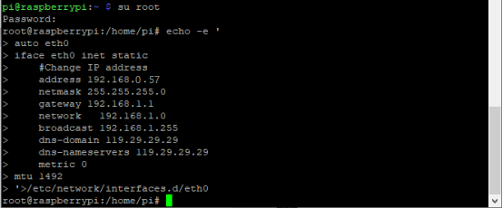


④ Reboot the system to activate the configuration file.

Input the restart command in the terminal: **sudo reboot**

You could log in via fixed IP afterwards.

⑤ Check IP to ensure IP address fixed well.


#### 1.2.8. Log in desktop on Raspberry Pi wirelessly

If we don't have an HDMI cable to connect to the display, can we wirelessly log in to the Raspberry Pi desktop from the Windows desktop? Yes, there are many methods, VNC and Xrdp are commonly used to log in desktop of Raspberry Pi wirelessly.

Let’s take an example of Xrdp.

①Install Xrdp Service in the terminal

Installation commands:

Switch to root User: <span style="color: rgb(255, 76, 65);">su root</span>

Installation commands: <span style="color: rgb(255, 76, 65);">apt-get install xrdp</span>

Enter y and tap“**Enter**”keyboard.

As shown below:


Open the remote desktop connection on Windows

Press **WIN+R** on keyboard and enter **mstsc.exe**.

As shown below:


Enter the IP address of the Raspberry Pi, as shown below. Click “Connect” and then click “Connect”again.**192.168.0.57** is the ip address we use, you could change it into your IP address.

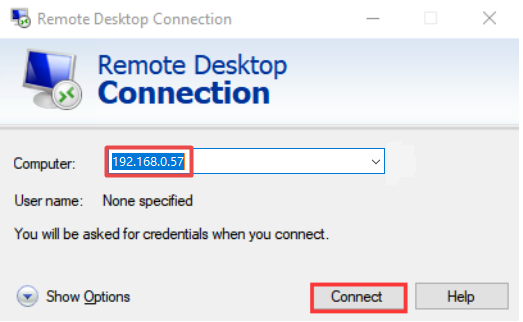

A prompt will appear and you can click “Yes”.


Then enter the user name: <span style="color: rgb(255, 76, 65);">pi</span> ,and the default password: <span style="color: rgb(255, 76, 65);">raspberry</span>, as shown below:

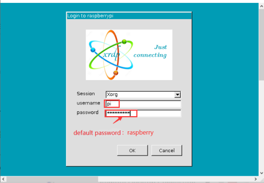

Click“OK”or tap“Enter”keyboard, you will view the desktop of Raspberry Pi OS, as shown below:


Now, we finish the basic configuration of the Raspberry Pi OS system.

### 1.3. Preparations for Python

Python is a programming language that lets you work more quickly and integrate your systems more effectively.

Python is an interpreted, high-level and general-purpose programming language. Python's design philosophy emphasizes code readability with its notable use of significant whitespace. Its language constructs and object-oriented approach aim to help programmers write clear, logical code for small and large-scale projects.

Next to pick up Python to control 40 pin of Raspberry Pi.

#### 1.3.1. Hardware：

| **Raspberry Pi 4B**     | **Raspberry Pi 4B Model** |
| :---------------------: | :-----------------------: |
|  ||

**Hardware Interfaces：**


**40-Pin GPIO Header Description：**

GPIO pins are divided into BCM GPIO number, physics number and WiringPi GPIO number.

We usually use WiringPi GPIO when using C language and BCM GPIO and physics number are used to Python, as shown below;

In these lessons, we use Python, so BCM GPIO number is adopted.

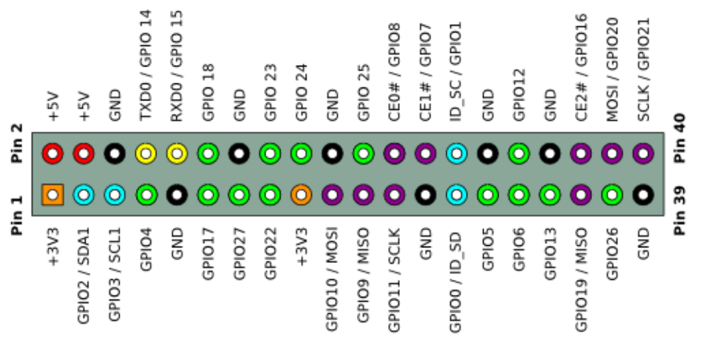

Note: pin(3.3 V) on the left hand is square, but other pins are round. Turn Raspberry Pi over, there is a square GPIO on the back.(you could tell from pin(3.3V).


<span style="color: rgb(255, 76, 65);">Note:</span> the largest current of each pin on Raspberry Pi 4B is 16mA and the aggregate current of all pins is not less than 51mA.

#### 1.3.2. Copy Example Code Folder to Raspberry Pi：

Place example code folder to the pi folder of Raspberry Pi. and extract the example code from “<span style="color: rgb(255, 76, 65);">**Python_Codes(Raspberry-Pi).zip**</span>” file, as shown below:


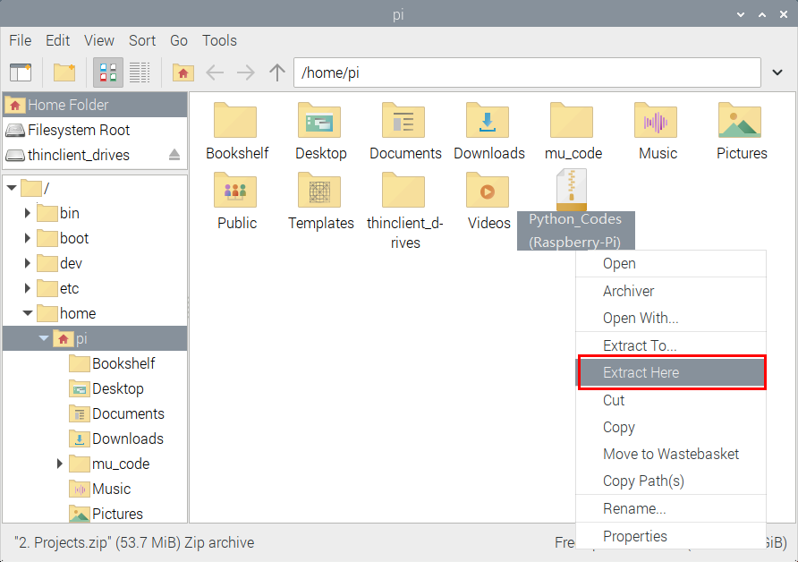

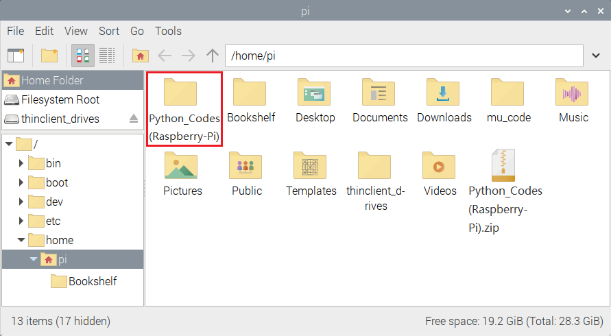

Double-click “<span style="color: rgb(255, 76, 65);">**Python_Codes(Raspberry-Pi)**</span>” to check <span style="color: rgb(255, 76, 65);">.py</span> files.

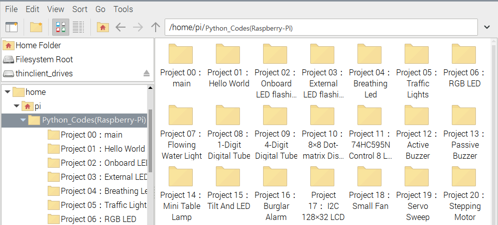


####  1.3.3. Micropython firmware and Thonny

##### (1) Update the firmware of Micropython

If you want to run the MicroPython on the Pi Pico board, you need to upload a firmware to the pico board.

You can program via C language or MicroPython on the pico board. But you need to download the MicroPython firmware.

<span style="color: rgb(255, 76, 65);">Note: </span>

MicroPython firmware is required to be downloaded once. You don’t need to download it again when programming with MicroPython. 

If you have downloaded the .uf2 program firmware written in C language, the MicroPython firmware will be overwritten, so next time you use MicroPython, you need to follow the steps below to update the Raspberry Pi Pico's firmware.

**Download the firmward of Micropython**

<span style="color: rgb(255, 76, 65);">Method 1:</span> 

Click to enter the website：[https://www.raspberrypi.com/documentation/microcontrollers/](https://www.raspberrypi.com/documentation/microcontrollers/)


Click “**MicroPython(**Getting started MicroPython**)**” to go to the firmware download page.


<span style="color: rgb(255, 76, 65);">Method 2:</span>

Clickto open the browser，click [https://micropython.org/download/rp2-pico/rp2-pico-latest.uf2](https://micropython.org/download/rp2-pico/rp2-pico-latest.uf2) to download the firmware.

<span style="color: rgb(255, 76, 65);">**Note：** transfer the firmware（rp2-pico-20210902-v1.17.uf2）to the desktop of Raspberry pi imager.</span>


##### (2) Program the firmware of MicroPython

Hold down **BOOTSEL** , connect a microUSB cable to the USB port of the pico board.


Release the button, then there pops up a page.

Enter “**raspberry**” in the Password box, click “**OK**”.


The drive **RPI-RP2** will appear on the desktop of the Raspberry Pi imager.


<span style="color: rgb(255, 76, 65);">Note：</span>

The latest Raspberry Pi mirroring system will not display the above dialog box, but the old version will display the above dialog box.

<br>
<br>

Click “**OK**” and open “**drive(RPI-RP2)**”. Copy or drag the file（**rp2-pico-20210902-v1.17.uf2**）to the RPI-RP2.


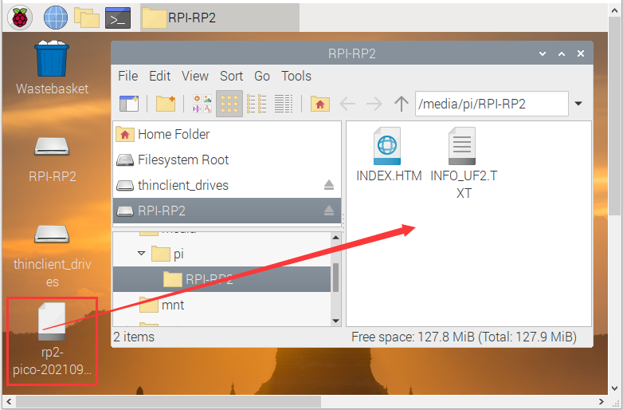

After the firmware is programmed, the Pico board will reboot. Then you can run Micropython.

**Serial Ports**

The MicroPython firmware is equipped with a virtual USB serial port which is accessed through the micro USB connector on Raspberry Pi Pico.

Your computer should notice this serial port and list it as a character device, most likely **/dev/ttyACM0**.

You can run **ls /dev/tty\*** to list your serial ports. There may be quite a few, but MicroPython’s USB serial will start with **/dev/ttyACM**. If in doubt, unplug the micro USB connector and see which one disappears. If you don’t see anything, you can try rebooting your Raspberry Pi.

Enter the following command to install minicom:

<span style="color: rgb(0, 209, 0);">sudo apt install minicom</span>

<br>
<br>

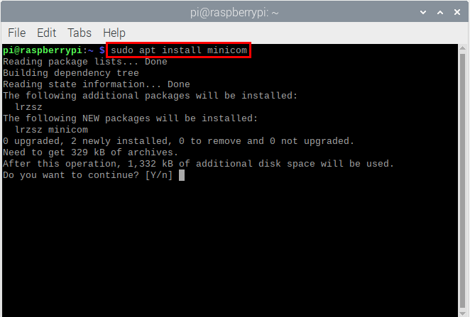

Select **Y** .


Enter the following commander, press **Enter** and open minicom

<span style="color: rgb(0, 209, 0);">minicom -o -D /dev/ttyACM0</span>

<br>
<br>

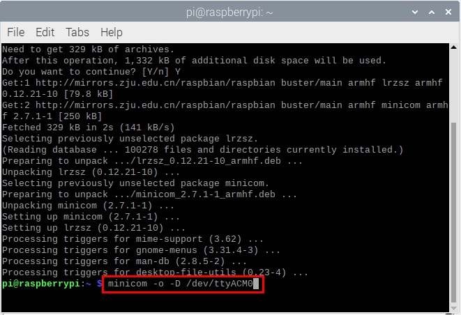

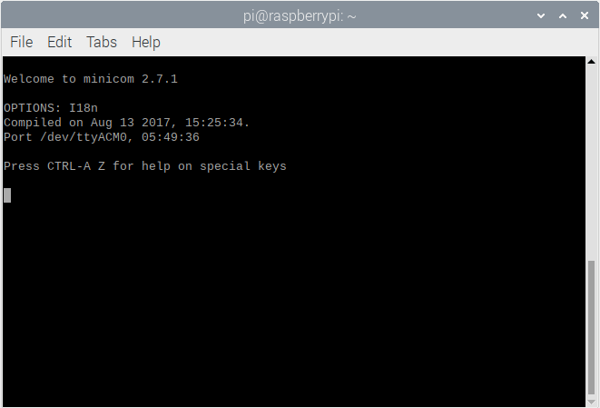

Press **Ctrl + B** .

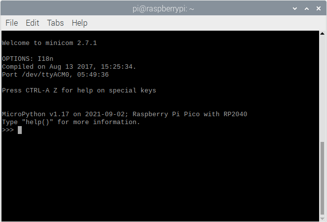

Enter print("Hello World") at the terminal and press **Enter**，then **Hello World** will be displayed.

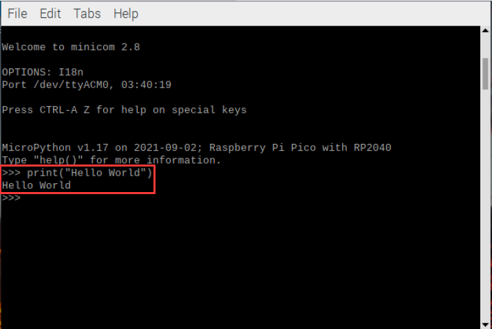

##### (3) Install Thonny

The Raspberry Pi Imager that we downloaded comes with some commonly used software, and Thonny is among them.

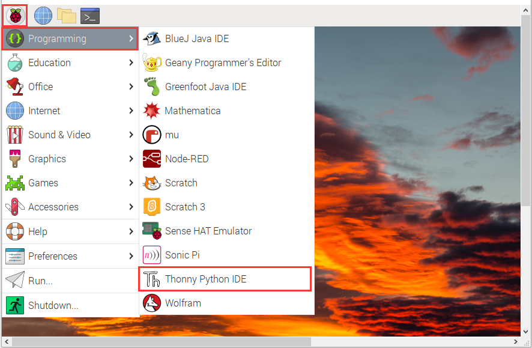

If the Raspberry Pi Imager does not have Thonny, you need to manually download it yourself. Enter the following command in the terminal to download and install Thonny.

<span style="color: rgb(255, 169, 0);">sudo apt install thonny</span>

<br>
<br>

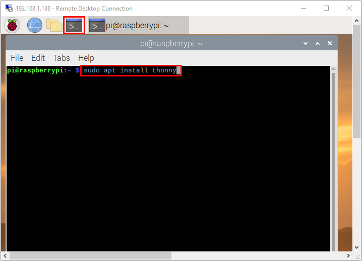

Open Thonny, click“**Switch to regular mode**”to switch modes, and click OK to reopen the Thonny.

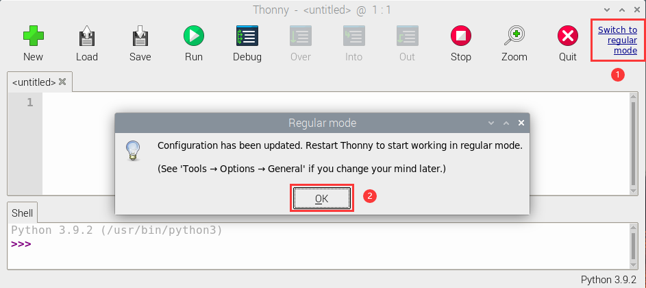

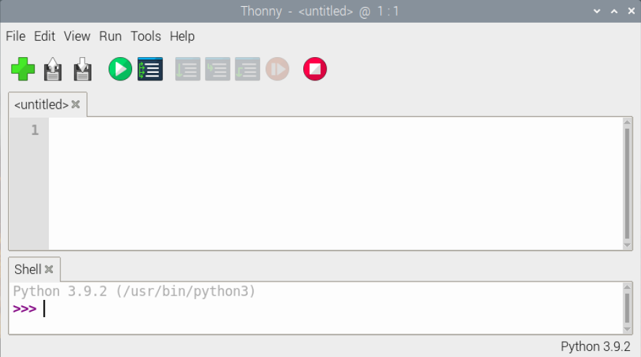

**Connect the Raspberry Pi Pico on the Thonny**

Click “**Python3.9.2**” and select “**MicroPython(Raspberry Pi Pico)**”.

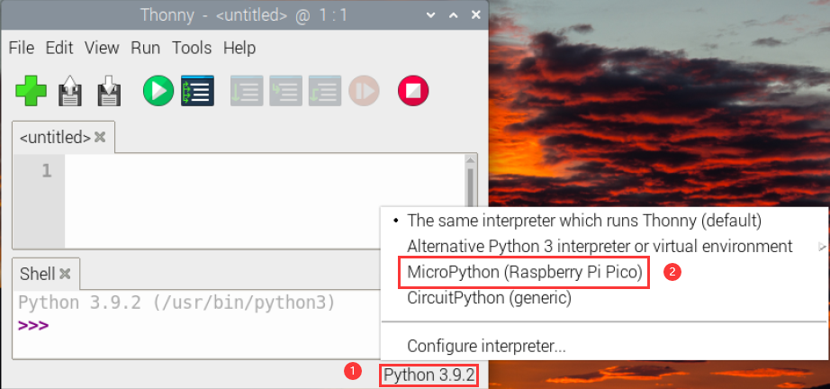

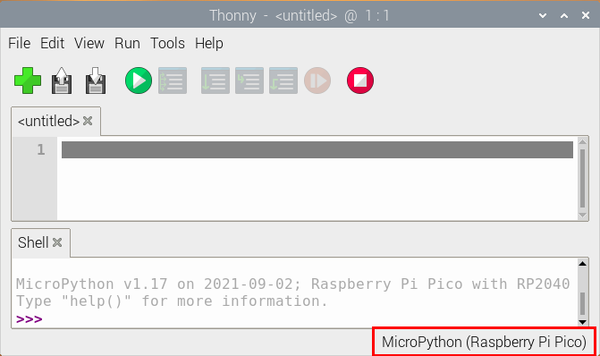

Click “**Tools**” → “**Options...**”.

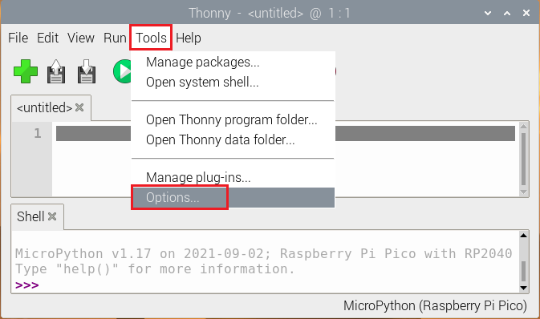

Select “**Micropython (generic)**” or “**Micropython (Raspberry Pi Pico)**”. How to choose Micropython(Raspberry Pi Pico)? As shown below;

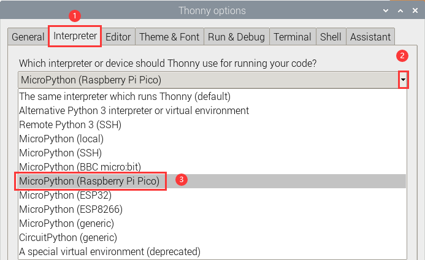

Click “**Port**” to **select corresponding port** and click "**OK**".

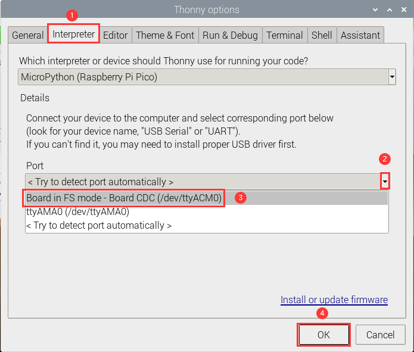


Click “**View**” → “**Files**”, then “**This computer**” and “**Raspberry Pi Pico**” will appear.

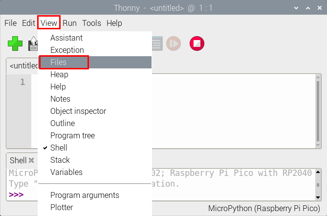

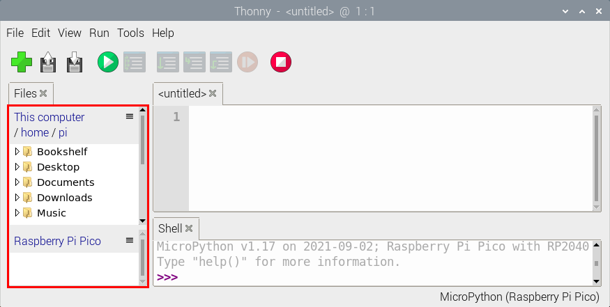

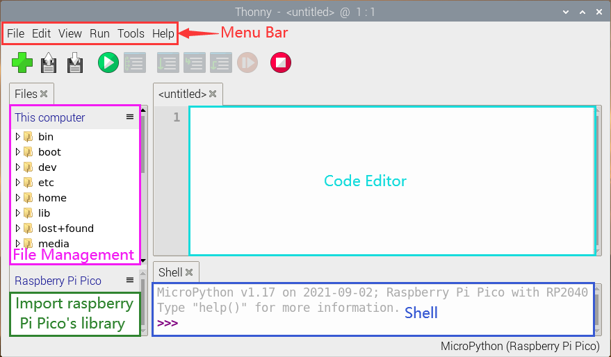

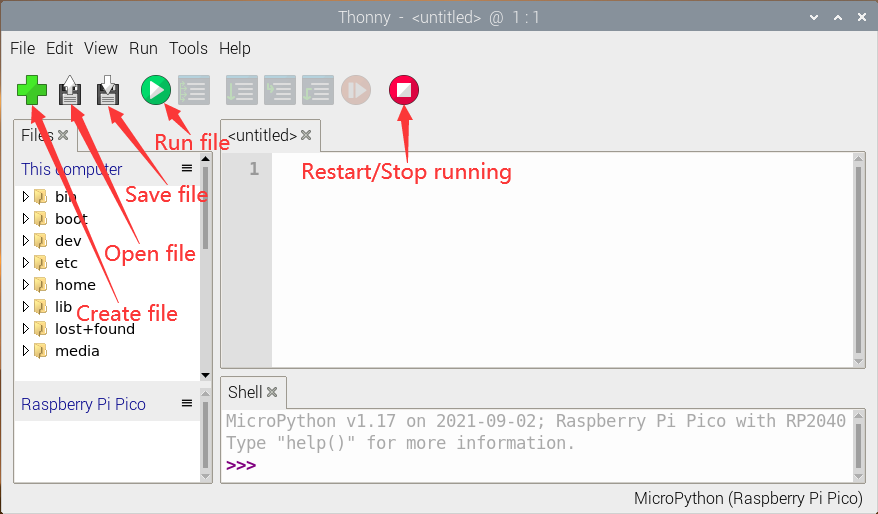

### 1.4. Test Code

<span style="color: rgb(255, 169, 0);">Test the Shell commander</span>

<br>
<br>

Enter “**print(Hello World\!)**” in the Shell and press “**Enter**”.

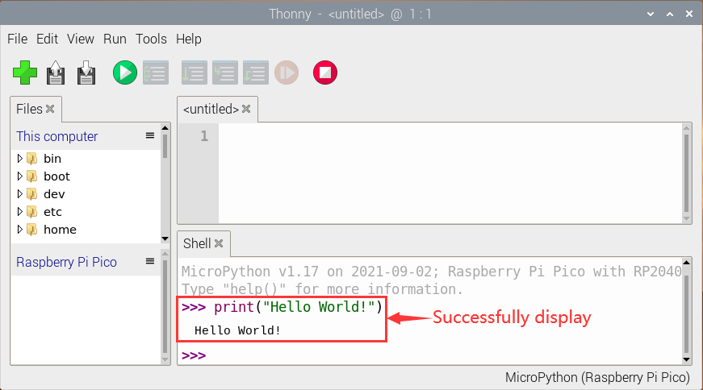

#### Online running：

To run Raspberry Pi Pico online, we need to connect the Raspberry Pi Pico to our computer, which allows us to compile or debug programs using Thonny software.  

**Advantages**: you can compile or debug programs using Thonny software.  

Through the "**Shell**" window, we can view the error information and output results generated during the operation of the program, and query related function information online to help improve the program.  

**Disadvantages**: To run Raspberry Pi Pico online, you must connect Raspberry Pi Pico to a computer and run it with Thonny software.  

If the Raspberry Pi Pico is disconnected from the computer, when they reconnect, the program won't run again.  

<span style="color: rgb(255, 76, 65);">basic operation:</span>

<br>

Open Thonny and click “**Open...**”.


Click“**This computer**”.

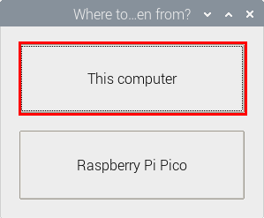

Enter "<span style="color: rgb(255, 76, 65);">.../home/pi/Python_Codes(Raspberry-Pi)/Project 01: Hello World</span>" to select **Project\_01\_HelloWorld.py** and click **OK**.

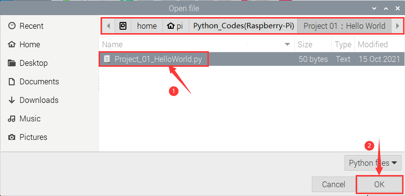

Click “Run current script to program **Hello World\!**, "**Welcome Keyestudio**" will be displayed on the **Shell**.

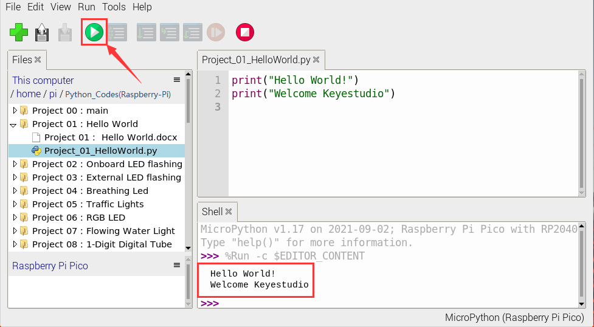

**Exit online**

When running online, click “**Stop /Restart Backend**” on Thonny to exit the program.  


#### Offline running:

When running offline, the Raspberry Pi Pico doesn't need to connect to a computer and Thonny. Once powered up, it can run the main.pyprogram stored in the Raspberry Pi Pico.  

**Pros**: We don't need to connect a computer to Thonny's software to run the program.  

**Cons**: The program stops automatically when an error occurs or the Raspberry Pi Pico runs out of power, and the code is hard to change.

**Basic Operation:**

Once powered up, the Raspberry Pi Pico will  check for the presence of main\.py on the device automatically. If so, run the program in main\.py and go to the shell command system. (If we want the code to run offline, we can save it as main\.py); If the main\.py does not exist, go directly to the shell command system.   

Click “**File**” → “**New**”, create and write code.


Enter the code in the newly opened file. Here we use the Project\_02\_Onboard\_LED\_Flashing. Py code as an example.  

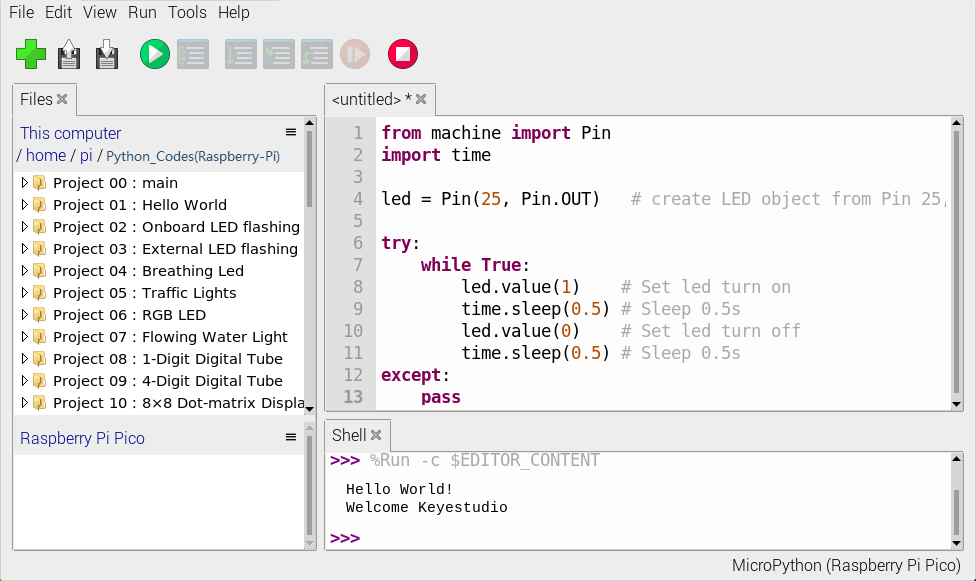

Click “**Save**” on the menu bar, we can save the code in This computer or MicroPython device.

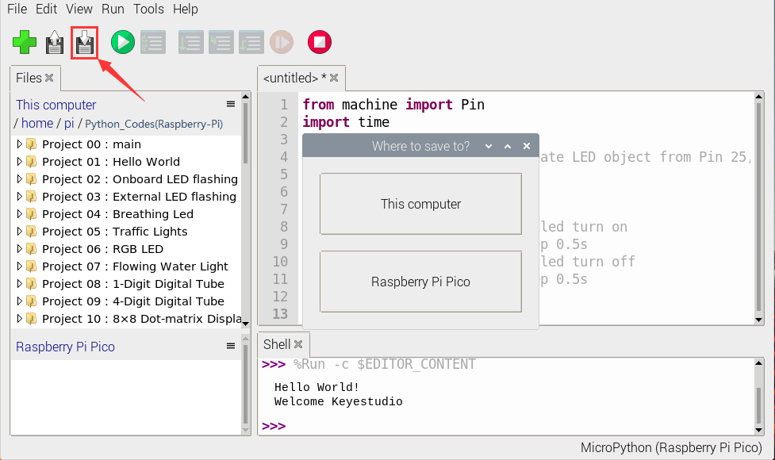

Select “**MicroPython device**”，enter “**main\.py**”in the new pop-up window and click “**OK**”.


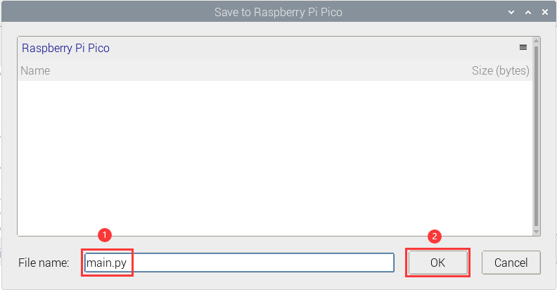

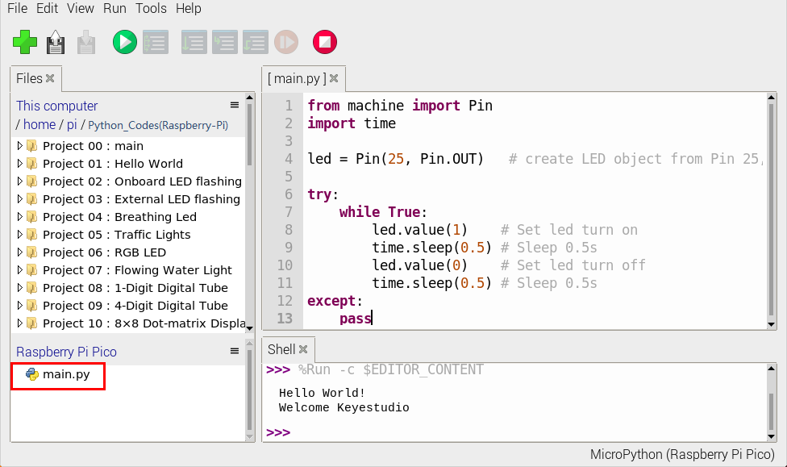

Disconnect the microUSB cable to the Raspberry Pi Pico and reconnect, and the LEDs on the Raspberry Pi Pico will  flash repeatedly. 

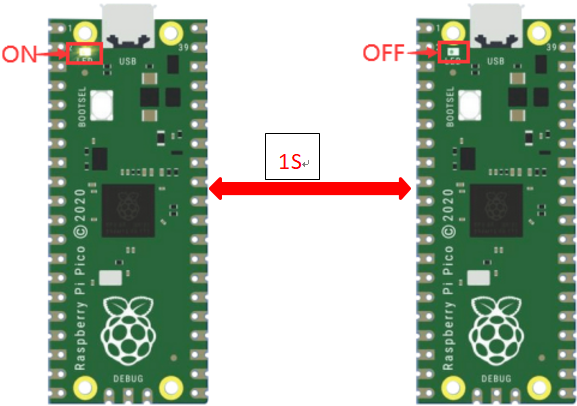

**Exit from Offline operation**

Connect Raspberry Pi Pico to the computer，click  “Stop/Restart backend”on Thonny to end the offline operation.  

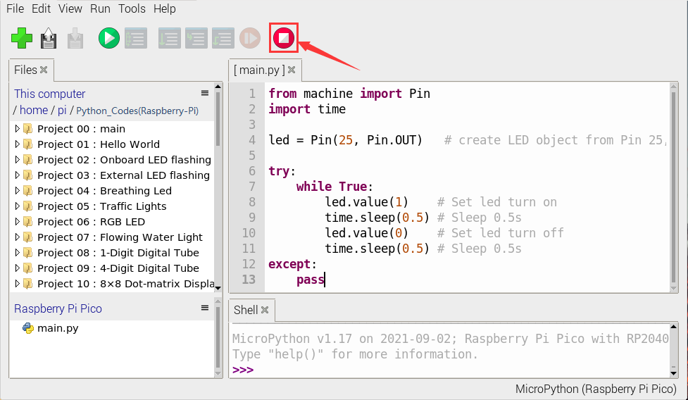

If it does’t work, click  “Stop/Restart backend” on Thonny several times or reconnect to the Raspberry Pi Pico.

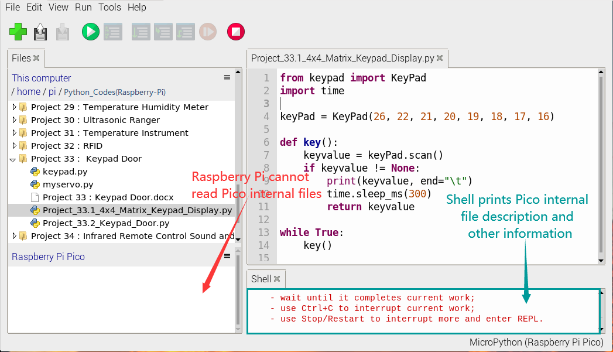

We provide a main\.py file to run offline.  The code added to main\.py is the bootstrap that executes the user code file. We just need to upload the offline project's code file (<span style="color: rgb(255, 76, 65);">.py</span>) to the "<span style="color: rgb(255, 76, 65);">MicroPython Device</span>".

Move the folder <span style="color: rgb(255, 76, 65);">**Python_Codes(Raspberry-Pi)**</span> to the folder home/pi of Raspberry Pi system and open Thonny.

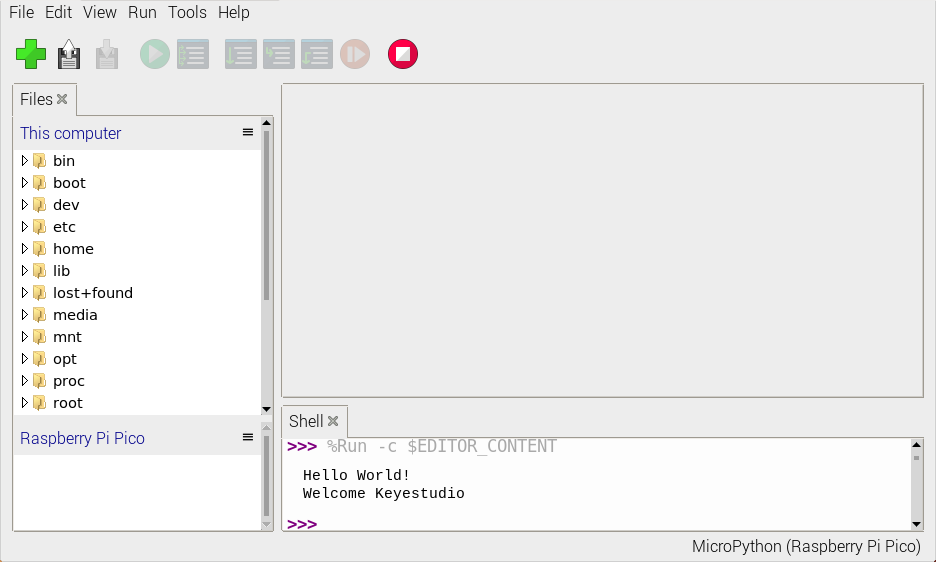

Expand Project 00 : main in <span style="color: rgb(255, 169, 0);">.../home/pi/Python_Codes(Raspberry-Pi)</span> directory . Double-click "**main\.py**" to make the code in "**MicroPython Device**" run offline.  

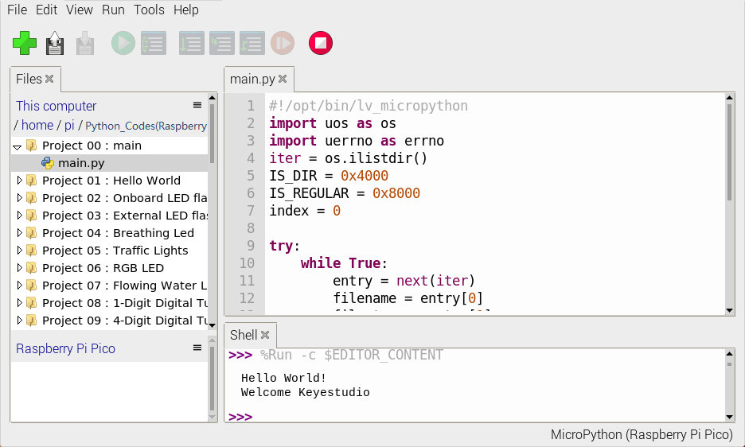

Here, we use project 00 and Project 02 cases as examples.  

The results are displayed using an LED(GP25 pin) on a Raspberry Pi Pico.  If we have modified the Project\_02\_Onboard\_LED\_Flashing. Py file, then we need to modify it accordingly. 

Right-click the Project\_02\_Onboard\_LED\_Flashing. Py file and select '**Upload to/**' to upload the code to Raspberry Pi Pico, as shown below.  

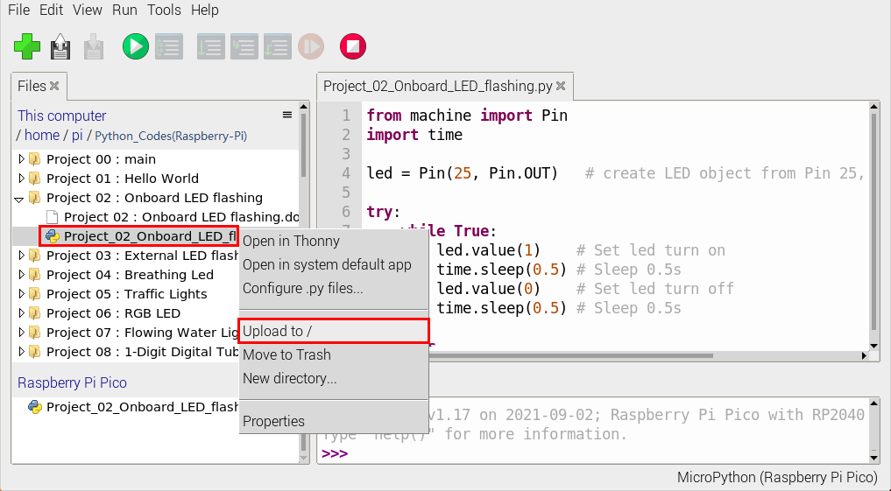

Upload the **main\.py** in the same way.

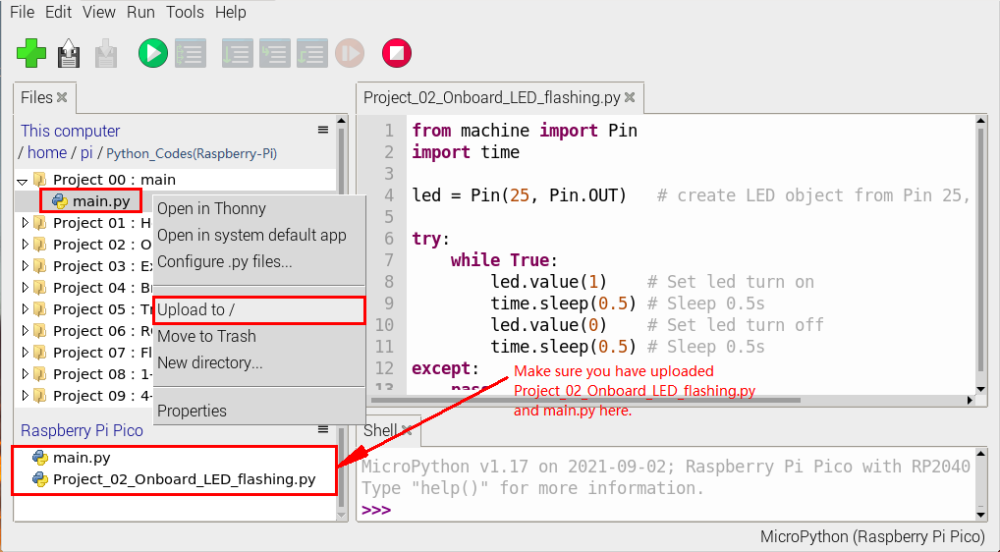

Disconnect and reconnect the microUSB cable to the Raspberry Pi Pico, and the LEDs will flash repeatedly .

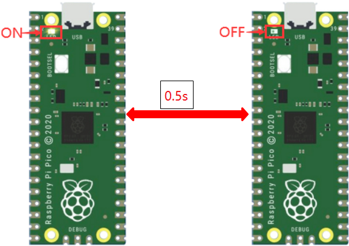

<span style="color: rgb(255, 76, 65);">**Note:**</span>

The code here runs offline. If we want to stop running offline and go to "Shell", simply click "Stop/Restart Backend" on Thonny software.


### 1.5. Thonny common operations

#### (1) Upload the code to Raspberry Pi Pico

In the Project 01：Hello World file, right-click and select Project\_01\_HelloWorld.py，select “**Upload to /**”and upload the code to the root directory of the Raspberry Pi Pico.


#### (2) Download the code to the computer

In the “**MicroPython device**”, right-click and select Project\_01\_HelloWorld.py，select “**Download to ...**” to download the code to our computer.


#### (3) Delete the files in the Raspberry Pi Pico root directory

In the “**MicroPython device**”，right-click and select Project\_01\_HelloWorld.py，select “**Delete**”，delete the Project\_01\_HelloWorld.py from the Raspberry Pi Pico root directory.

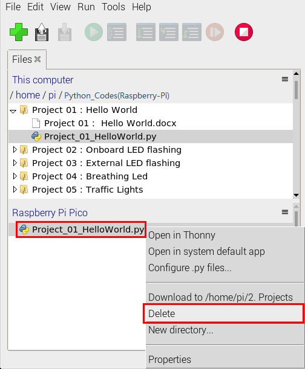

#### (4) Delete files from the computer's directory

In the Project\_01 : Hello World file, right-click and select Project\_01\_HelloWorld.py，select “**Move to Recycle Bin**”，then it can be deleted from the Project\_01\_HelloWorld file.

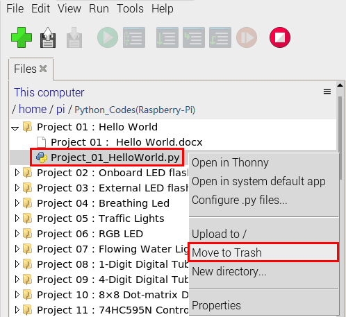

#### (5) Create and Save Code

Click “**File**” → “**New**” to create and compile code.

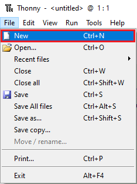

Enter code in the newly opened file, here we use Project\_02\_Onboard\_LED\_Flashing.py code as an example.


Click “**Save**”，and we can save the code to our computer or the Raspberry Pi Pico.


Select “**MicroPython device**”，enter “**main\.py**” in the new pop-up window and click“**OK**”.


We can see the code has been uploaded to the Raspberry Pi Pico.


Click “**Run current script**”, the LED on the Raspberry Pi Pico will flash periodically.

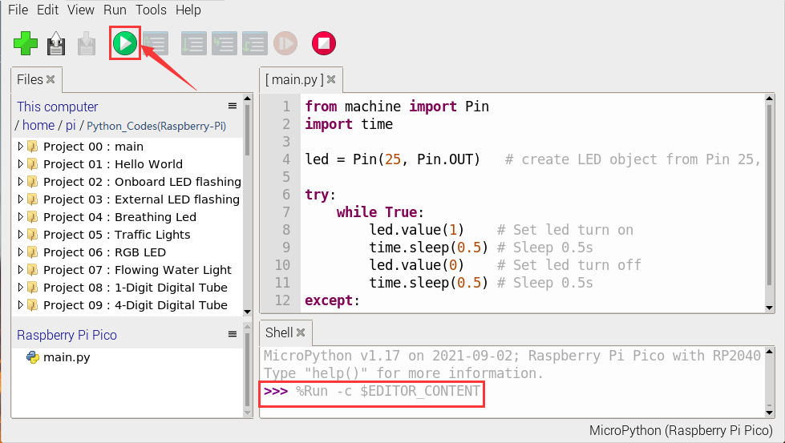


## Projects

### Project 01: Hello World

1.**Introduction**
    
For Raspberry Pi Pico beginners, we will start with some simple things. In this project, you only need a Raspberry Pi Pico and a USB cable to complete the "Hello World\!" project, which is a test of communication between Raspberry Pi Pico and the PC as well as a primary project.
    
2.**Components**

<table>
<tbody>
<tr class="odd">
<td>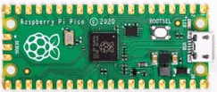</td>
<td></td>
</tr>
<tr class="even">
<td>Raspberry Pi Pico*1</td>
<td>USB Cable*1</td>
</tr>
</tbody>
</table>

3.**Wiring Up**
    
In this project, we use a USB cable to connect the Raspberry Pi Pico to Raspberry Pi.
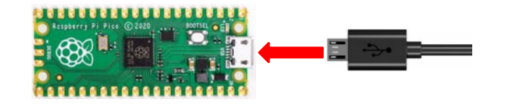

    
4.**Test Code**
    
Connect the pico board to the Raspberry Pi, then the Thonny can compile or debug.
    
Advantages：
    
1)\. You can use Thonny software to compile or debug programs.
    
2)\. In the "Shell" window, you can view the error information and output results generated during the running of the program, and you can query related functional information online to help improve the program.
    
    
    
Disadvantages：

You have to connect the pico board with the Raspberry Pi then run the Thonny.
    
If disconnecting pico board and the Raspberry Pi and rebooting them, programming may fail.
    
  
Open "Thonny" and click“Open...”
    

    
Then click“This computer”.
    

    
Select“Project\_01\_HelloWorld.py”and click“OK”.

Check the code in the folder "**...\6.Codes\Python_Codes(Raspberry-Pi)**".

You can move the code anywhere. For example, We copy the **Python_Codes(Raspberry-Pi).zip** to the <span style="color: rgb(255, 76, 65);">pi</span> folder of the Raspberry Pi system.

<span style="color: rgb(255, 76, 65);">Path: home/pi/Python_Codes(Raspberry-Pi)</span>

<br>
<br>
 
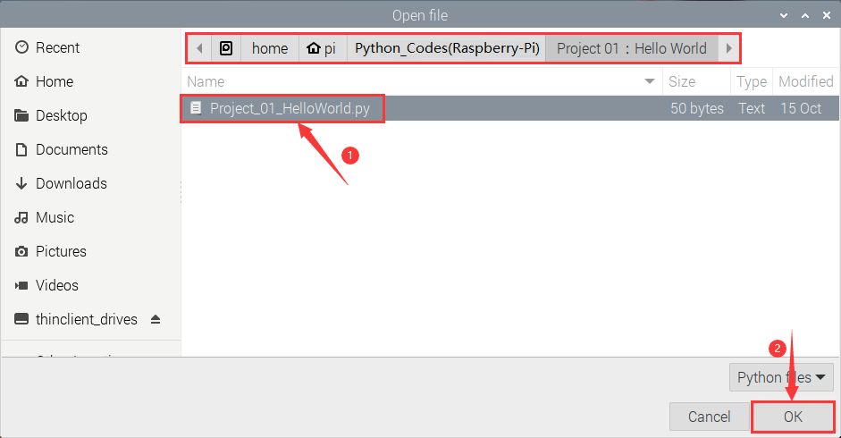

Click to run the code Hello World\!. Then Welcome Keyestudio will be displayed on the Shell.

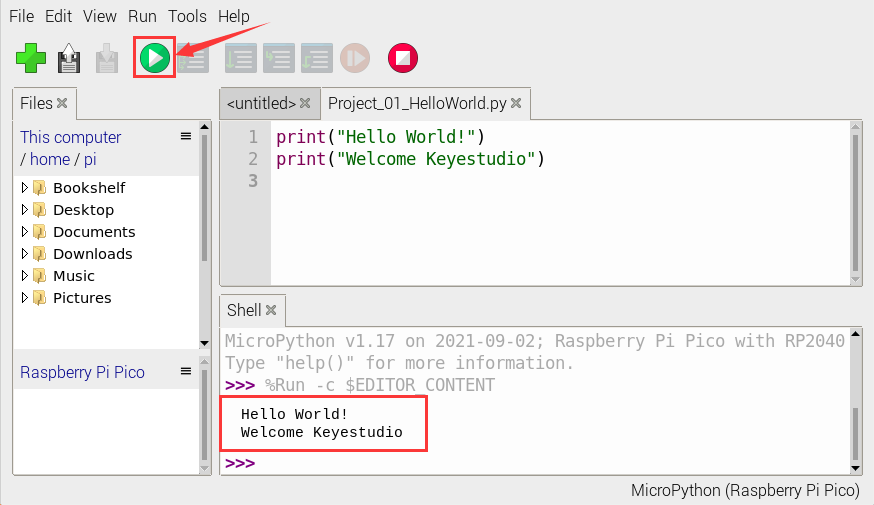

**Exit online running**

When running online，click“Stop /Restart backend”to exit.


5.**Test Code：**

```Python
print("Hello World!")
print("Welcome Keyestudio")
```
### Project 02: Onboard LED flashing

1.**Description：**

There is an onboard LED in Raspberry Pi Pico,which is a GP25 pin attached to the Raspberry Pi Pico. In this project, we will learn the effect of making the onboard LED blink.

2.**Components**

<table>
<tbody>
<tr class="odd">
<td>
</td>
<td></td>
</tr>
<tr class="even">
<td>Raspberry Pi Pico*1</td>
<td>USB Cable*1</td>
</tr>
</tbody>
</table>

3.**Wiring Up**
    
In this project, we use a USB cable to connect the Raspberry Pi Pico to Raspberry Pi.

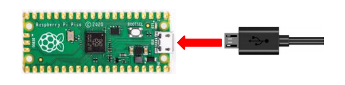


4.**Test Code**

Check the code in the folder "**...\6.Codes\Python_Codes(Raspberry-Pi)**".

You can move the code anywhere. For example, We copy the **Python_Codes(Raspberry-Pi).zip** to the <span style="color: rgb(255, 76, 65);">pi</span> folder of the Raspberry Pi system.

<span style="color: rgb(255, 76, 65);">Path: home/pi/Python_Codes(Raspberry-Pi)</span>

<br>
<br>

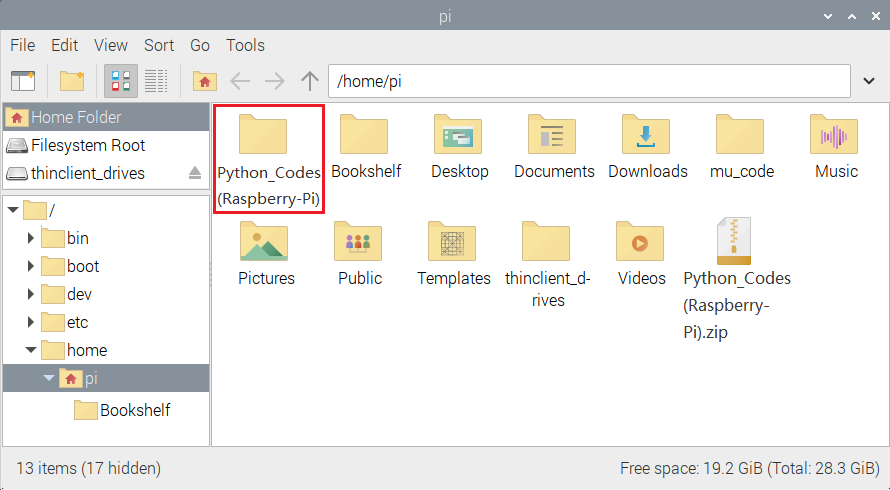

**Online running**

Open“Thonny”, click “This computer”→“home”→“pi”→“2. Projects”→“Project 02：Onboard LED flashing”


Go to the folder Project 02：Onboard LED flashing\<double-click “Project\_02\_Onboard\_LED\_flashing.py”, as shown below;

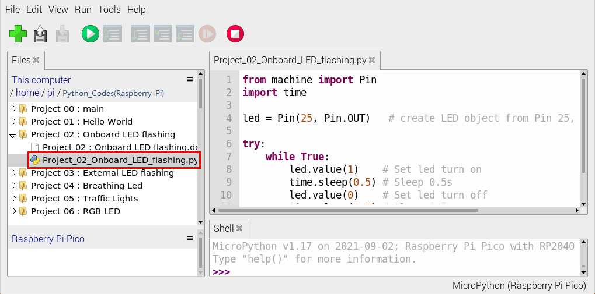

```Python
from machine import Pin
import time

led = Pin(25, Pin.OUT)   # create LED object from Pin 25, Set Pin 25 to output

try:
    while True:
        led.value(1)    # Set led turn on
        time.sleep(0.5) # Sleep 0.5s
        led.value(0)    # Set led turn off
        time.sleep(0.5) # Sleep 0.5s
except:
    pass
```

Connect the pico board to the Raspberry Pi. Click to check the Shell

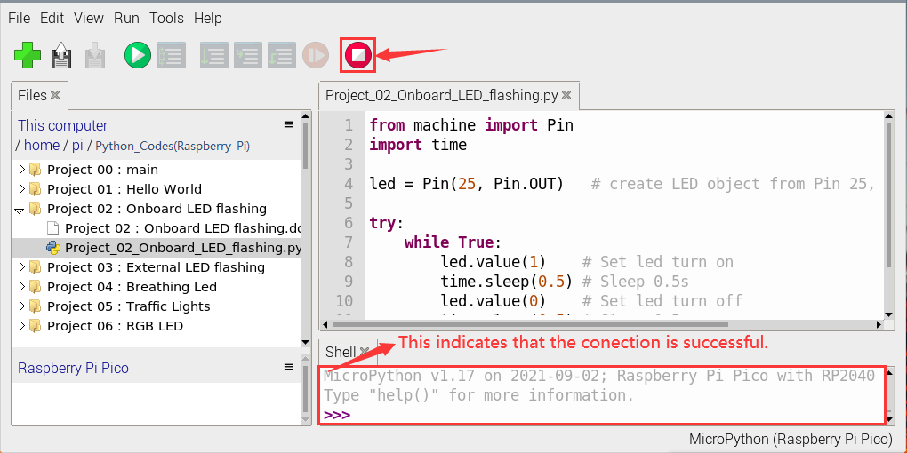

Click  to run the code. Then the LED on the pico board will flash; click to exit the program.


<span style="color: rgb(255, 76, 65);">Note:</span> This is the code that runs online.  If you disconnect the USB cable and restart Raspberry Pi Pico, the LEDS on Raspberry Pi Pico stop flashing. The following information will be displayed in the "Shell" window of Thonny software:  

<br>
<br>

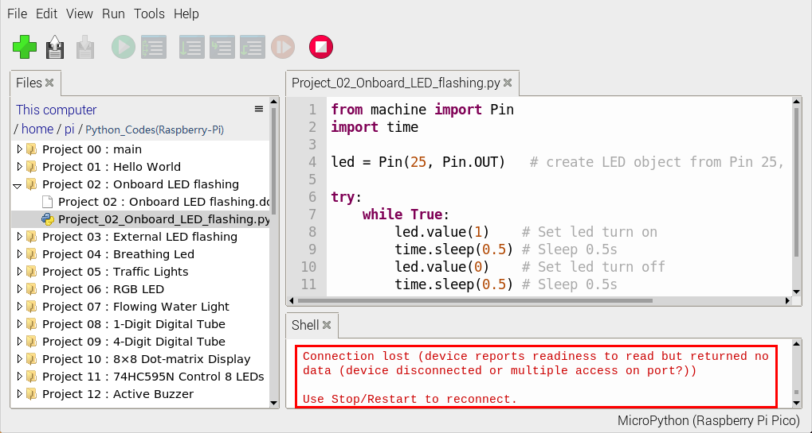

**Code to run offline** (upload code to Raspberry Pi Pico) :

Ensure that the Raspberry Pi Pico is connected to the computer and click .  

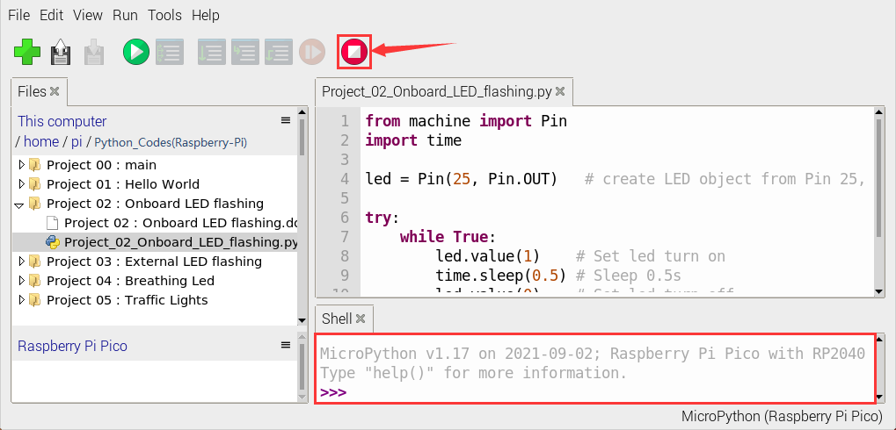

As shown in the following figure, right-click the file“Project\_02\_Onboard\_LED\_Flashing. py”and choose“**Upload to/**”to upload the code to Raspberry Pi Pico.  

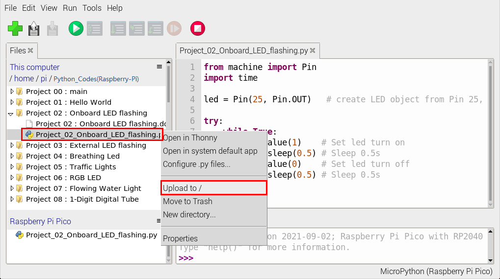

Upload **main\.py** in the same way.


Disconnect the USB cable from the Raspberry Pi Pico and reconnect, and the Raspberry Pi Pico's LED flashes repeatedly.  


Note: The code here runs offline.  If you want to Stop running offline and display the information in the “Shell” window, simply clickin Thonny software.


### Project 03：External LED flashing 

1.**Introduction**
    
In this project, we are going to show you the external LED flashing effect.  We will use the Raspberry Pi Pico's digital pins to turn on the LED and make it flash.
    
2.**Components**

<table>
<tbody>
<tr class="odd">
<td>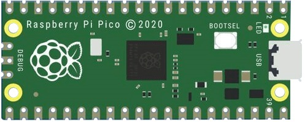</td>
<td>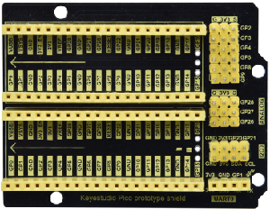</td>
<td></td>
<td></td>
</tr>
<tr class="even">
<td>Raspberry Pi Pico*1</td>
<td>Raspberry Pi Pico Expansion Board*1</td>
<td>Jumper Wire*2</td>
<td>USB Cable*1</td>
</tr>
<tr class="odd">
<td></td>
<td></td>
<td>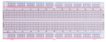</td>
<td></td>
</tr>
<tr class="even">
<td>Red LED*1</td>
<td>220Ω Resistor*1</td>
<td>Breadboard*1</td>
<td></td>
</tr>
</tbody>
</table>


3.**Knowledge**

**（1）LED:**


The LED is a kind of semiconductor called “light-emitting diode”, which is an electronic device made from semiconducting materials (silicon, selenium, germanium, etc.).  It has a anode and a cathode.  The short lead is cathode, which connects to GND, the long lead is anode , which connects to3.3V or 5V.


**（2）5-band Resistor**

A resistor is an electronic component in a circuit that restricts or regulates the flow current flow. On the left is the appearance of
the resistor and on the right is the symbol for the resistance in the circuit . Its unit is(Ω). 1 mΩ= 1000 kΩ，1kΩ= 1000Ω.

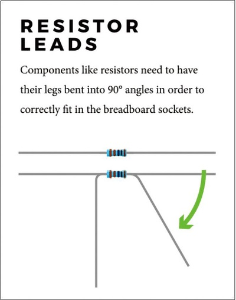


We can use resistors to protect sensitive components, such as LEDs. The strength of the resistance is marked on the body of the resistor with an electronic color code. Each color code represents a number, and you can refer to it in a resistance card.

\-Color 1 – 1st Digit

\-Color 2 – 2nd Digit

\-Color 3 – 3rd Digit

\-Color 4 – Multiplier

\-Color 5 – Tolerance


In this kit, we provide three 5-band resistors with different resistance values. Take three 5-band resistors as an example.

220Ω resistor\*10


10KΩ resistor\*10


1KΩ resistor\*10

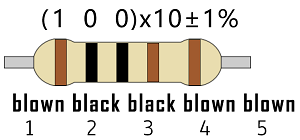

In the same voltage, there will be less current and more resistance. The connection between current, voltage, and resistance can be expressed by the formula: I=U/R. In the figure below, if the voltage is 3V, the current through R1 is: I = U / R = 3 V / 10 KΩ= 0.0003A=0.3mA.

Do not directly connect resistors with very low resistance to the two poles of the power supply, as this will cause excessive current to damage the electronic components. Resistors do not have positive and negative poles.

** (3) Breadboard**

A breadboard is used to build and test circuits quickly before finalizing any circuit design. The breadboard has many holes , into
which circuit components like integrated circuits and resistors can be inserted. A typical breadboard is as follows.


The bread board has strips of metal , which run underneath the board and connect the holes on the top of the board. The metal strips are laid out as shown below. Note that the top and bottom rows of holes are connected horizontally while the remaining holes are connected vertically.


The first two rows (top) and the last two rows (bottom) of the breadboard are used for the positive (+) and negative (-) terminals of the power supply, respectively. The conductive layout of the breadboard is shown in the following diagram.


When we connect DIP (Dual In-line Packages) components, such as integrated circuits, microcontrollers, chips and so on, we can see that a groove in the middle isolates the middle part, so the top and bottom of the groove is not connected. DIP components can be connected as shown in the figure below:

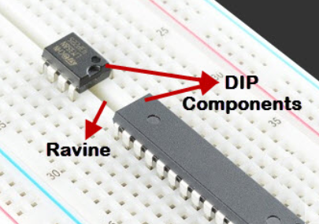


4.**How to use the keyestudio raspberry pico expansion board.**

Stack the Raspberry Pi Pico on the expansionboardto use, as shown below:


5.**Power Supply:**

In this project, we use a USB to connect the Raspberry Pi Pico to the computer. Please refer to the documentation for connection methods: Preparation for Python


6.**Circuit Diagram and Wiring Diagram**

First, cut all power to the Raspberry Pi Pico.  Then build the circuit according to the circuit diagram and wiring diagram.  After the circuits are set up and verified, using a USB cable to connect the Raspberry Pi Pico to a computer .

**Note:** Avoid any possible short circuits(especially connecting 3.3V and GND)\!

**Warning:** A short circuit may cause a large current in the circuit, causing components to overheat and permanent damage to the hardware.


7.**Wiring Diagram**

Note:

How to connect a LED


How to identify the 220Ω five-band resistor


8.**Test Code**

According to the circuit diagram, when the GP16 output of the Pico is high, the LED will light up;  When the output power is low, the LED will light off.Therefore, we can make the LED flash repeatedly by controlling the GP16 to repeatedly output high and low levels.  

Check the code in the folder "**...\6.Codes\Python_Codes(Raspberry-Pi)**".

You can move the code anywhere. For example, We copy the **Python_Codes(Raspberry-Pi).zip** to the <span style="color: rgb(255, 76, 65);">pi</span> folder of the Raspberry Pi system.

<span style="color: rgb(255, 76, 65);">Path: home/pi/Python_Codes(Raspberry-Pi)</span>

<br>
<br>


**Code running online:**

Open “Thonny”, clickThis computer”→“home”→“pi”→“2. Projects”→“Project 03：External LED flashing”.

Enter the file“Project 03：External LED flashing”, double left-click“Project\_03\_External\_LED\_flashing.py”,open it, as shown below:


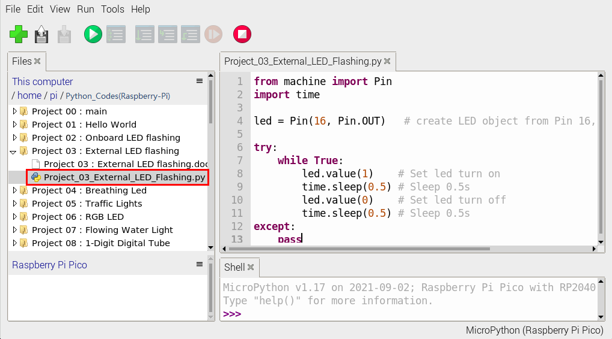

```Python
from machine import Pin
import time

led = Pin(16, Pin.OUT)   # create LED object from Pin 16, Set Pin 16 to output

try:
    while True:
        led.value(1)    # Set led turn on
        time.sleep(0.5) # Sleep 0.5s
        led.value(0)    # Set led turn off
        time.sleep(0.5) # Sleep 0.5s
except:
    pass
```

Connect the pico board to the Raspberry Pi. Click to check the Shell

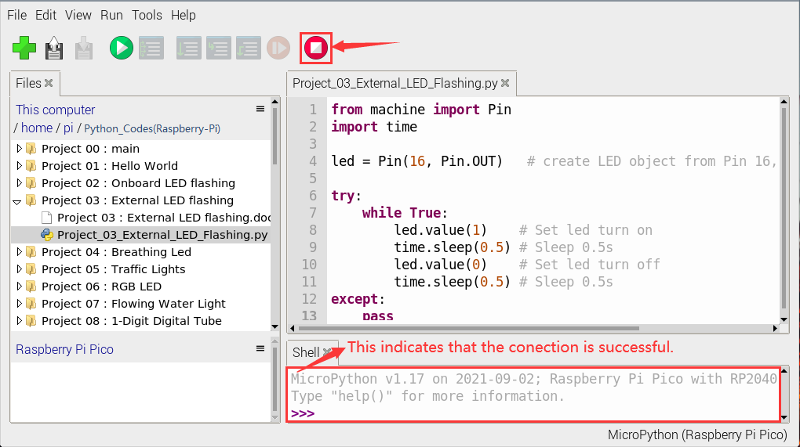

Click  to run the code. Then the LED on the pico board will flash; click to exit the program.

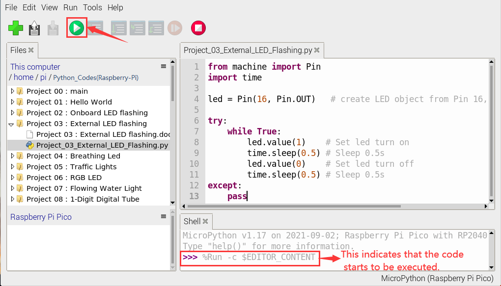


<span style="color: rgb(255, 76, 65);">Note:</span> This is the code that runs online, if we disconnect the USB cable, then restart the“Raspberry Pi Pico”, the LED will stop flashing. The following information will be displayed in the "Shell" window of Thonny software:
 
<br>
<br>

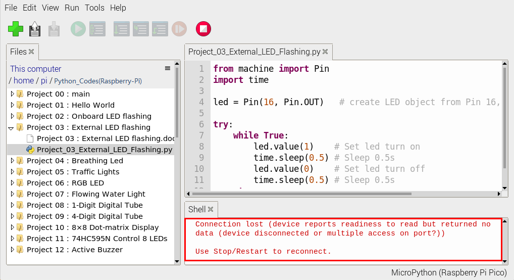

**Code running offline** （Upload the code to the Raspberry Pi Pico）：

Ensure that the Raspberry Pi Pico is connected to the computer, click“Stop/Restart backend”


As shown below, right-click the file“Project\_03\_External\_LED\_flashing.py”，select**Upload to/**”to upload the code to the Raspberry Pi Pico.

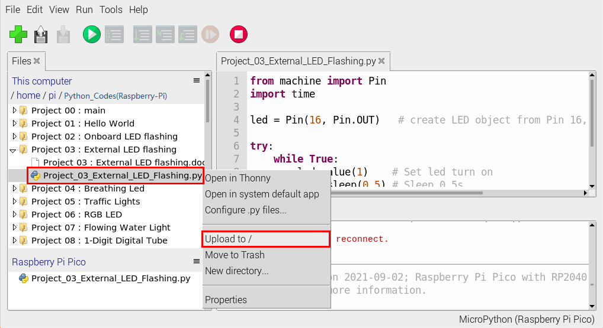

Upload main.py in the same way


Disconnect the USB from the Raspberry Pi Pico and reconnect, the LED in the circuit will flash repeatedly.


**Note:** The code here runs offline. If you want to stop and display the information in the Shell window, simply click“Stop/Restart backend” in Thonny software.


### Project 04: Breathing Led

1.**Introduction**
    
In previous studies, we know that LEDS have on/off state, so how to enter the intermediate state?  How to output an intermediate state to make the LED "half bright"?  That's what we're going to learn.  Breathing lights, or LEDS turn on and off again, which are like "breathing".  So, how to control the brightness of LEDS?  We will use the Raspberry Pi Pico PWM to achieve this goal.  
    
2.**Components**

<table>
<tbody>
<tr class="odd">
<td></td>
<td></td>
<td></td>
<td></td>
</tr>
<tr class="even">
<td>Raspberry Pi Pico*1</td>
<td>Raspberry Pi Pico Expansion Board*1</td>
<td>Jumper Wire*2</td>
<td>USB Cable*1</td>
</tr>
<tr class="odd">
<td></td>
<td></td>
<td></td>
<td></td>
</tr>
<tr class="even">
<td>Red LED*1</td>
<td>220ΩResistance*1</td>
<td>Breadboard*1</td>
<td></td>
</tr>
</tbody>
</table>

3.**Knowledge**


**Analog & Digital**

Analog signals are continuous signals in both time and value.  In contrast, a digital or discrete time signal is a time series consisting of a series of numbers.  Most signals in life are analog signals.  A familiar example of an analog signal is how temperatures change continuously throughout the day, rather than suddenly changing from 0 to 10 in a flash.  However, the value of a digital signal can change instantaneously. This change is represented numerically as 1 and 0(the basis of binary code).  It's easier to see the difference, as shown below:


In practical applications, we often use a binary as a digital signal, which are a series of 0 and 1. Since binary signals have only two values(0 or 1), they have great stability and reliability.  Finally, analog and digital signals can be converted to each other. 

**PWM：**

Pulse Width Modulation (PWM) is an effective method to control analog circuit by digital signal.  Ordinary processors cannot directly output analog signals.  The PWM makes this conversion (convert digital signal to analog signal) very convenient, which uses digital pins to send square waves at a certain frequency, which is high and low output to alternate for a period of time.  The total time of each set of high and low levels is generally fixed, which is called the period (Note: the reciprocal of the period is the frequency). The time of the high level output is usually called pulse width, and the duty cycle is the percentage of the pulse width (PW) to the total period (T) of the waveform. 

The longer the duration of the high level output as well as the duty cycle is, the higher the corresponding voltage in the analog
signal will be. The figure below shows the variation of analog signal voltage from 0V to 3.3V(high level is 3.3V) corresponding to pulse width of 0% to 100%.  


We all know that the longer the PWM duty cycle is, the higher the output power will be. Therefore, we can use PWM to control the brightness of LEDS or the speed of dc motors and so on.  As can be seen from the above, the PWM is not a real analog signal, and the effective value of the voltage is equal to the corresponding analog signal.  Therefore, we can control the output power of LEDS and other output modules to achieve different effects.

**Raspberry Pi Pico and PWM**

The Raspberry Pi Pico has 16 PWM channels, each of which can control frequency and duty cycle independently. The clock frequency ranges from 7Hz to 125MHz.  Each pin on the Raspberry Pi Pico can be configured for PWM output.  

4.**Circuit Diagram and Wiring Diagram**


Note:

How to connect the LED


How to identify the 220Ω 5-band resistor


5.**Test Code**

The design of this project makes the GP16 output PWM, and the pulse width gradually increases from 0% to 100%, and then gradually decreases from 100% to 0%.  

Check the code in the folder "**...\6.Codes\Python_Codes(Raspberry-Pi)**".

You can move the code anywhere. For example, We copy the **Python_Codes(Raspberry-Pi).zip** to the <span style="color: rgb(255, 76, 65);">pi</span> folder of the Raspberry Pi system.

<span style="color: rgb(255, 76, 65);">Path: home/pi/Python_Codes(Raspberry-Pi)</span>

<br>
<br>


Open“Thonny”, click“This computer”→“home”→“pi”→“Python_Codes(Raspberry-Pi)”→”Project 04：Breathing Led”. And double-click “Project\_04\_Breathing\_Led.py”.

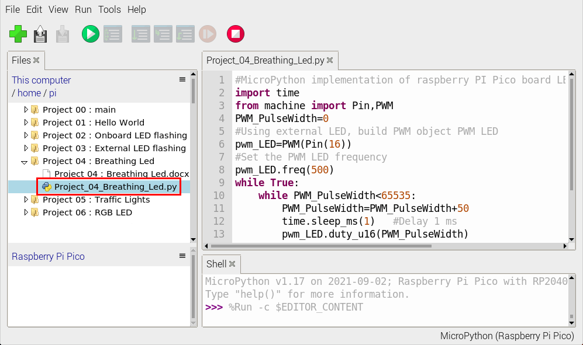

```Python
#MicroPython implementation of raspberry PI Pico board LED breathing lamp program example
import time
from machine import Pin,PWM
PWM_PulseWidth=0
#Using external LED, build PWM object PWM LED
pwm_LED=PWM(Pin(16))
#Set the PWM LED frequency
pwm_LED.freq(500)
while True:
    while PWM_PulseWidth<65535:
        PWM_PulseWidth=PWM_PulseWidth+50
        time.sleep_ms(1)   #Delay 1 ms 
        pwm_LED.duty_u16(PWM_PulseWidth)
    while PWM_PulseWidth>0:
        PWM_PulseWidth=PWM_PulseWidth-50
        time.sleep_ms(1)
        pwm_LED.duty_u16(PWM_PulseWidth)
```

6.**Test Result：**

Connect the pico board to the Raspberry Pi. Click to check the Shell

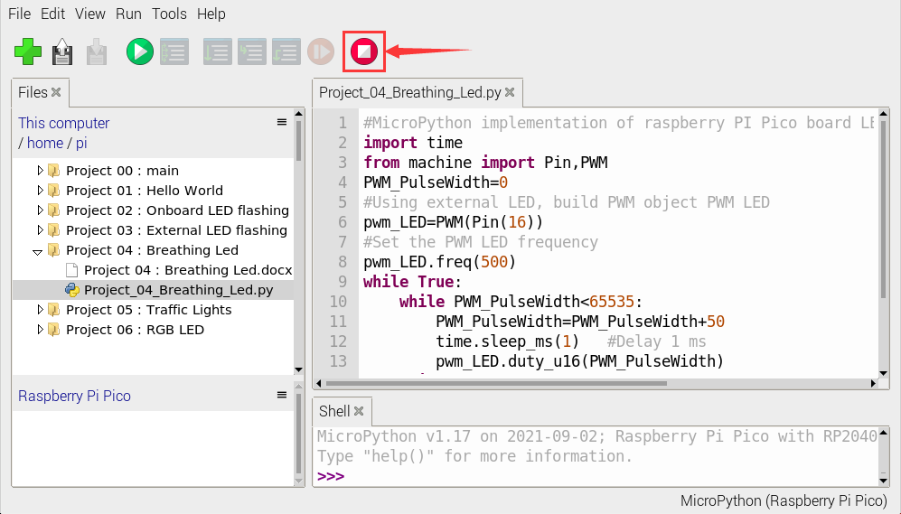

Click  to run the code. Then the LED on the pico board will flash; click to exit the program.

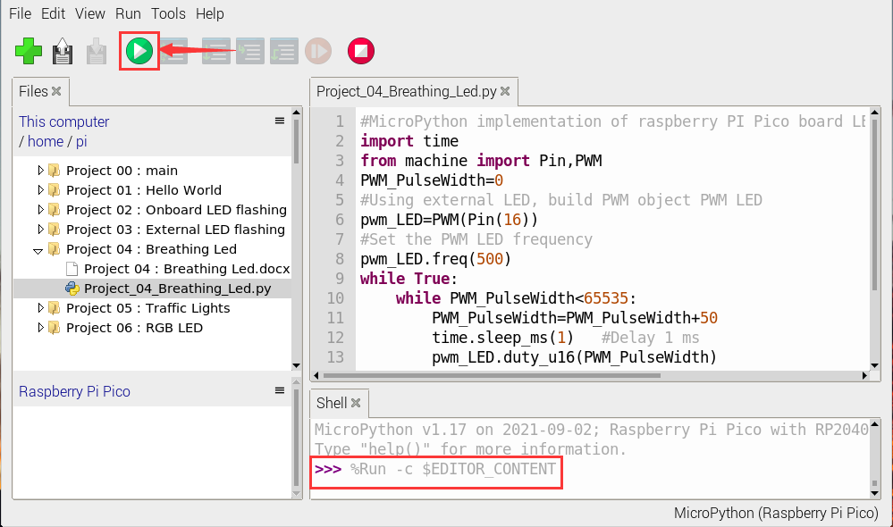


### Project 05: Traffic Lights

1.**Introduction**

Traffic lights are closely related to people's daily lives, which generally show red, yellow, and green. Everyone should obey the traffic rules, which can avoid many traffic accidents. In this project, we will use Raspberry Pi Pico and some LEDs (red, green and yellow) to simulate the traffic lights.

2.**Components Required**

<table>
<tbody>
<tr class="odd">
<td>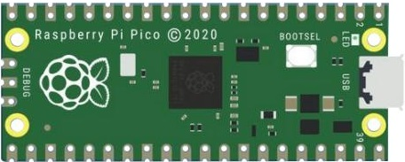</td>
<td></td>
<td></td>
<td>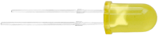</td>
<td></td>
</tr>
<tr class="even">
<td>Raspberry Pi Pico*1</td>
<td>Raspberry Pi Pico Expansion Board*1</td>
<td>Red LED*1</td>
<td>Yellow LED*1</td>
<td>Jumper Wires</td>
</tr>
<tr class="odd">
<td></td>
<td></td>
<td></td>
<td>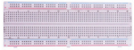</td>
<td></td>
</tr>
<tr class="even">
<td>Green LED*1</td>
<td>USB Cable*1</td>
<td>220ΩResistor*3</td>
<td>Breadboard*1</td>
<td></td>
</tr>
</tbody>
</table>

3.**Circuit Diagram and Wiring Diagram**


Note:

How to connect an LED


How to identify the 220Ω 5-band resistor


4.**Test Code**

Check the code in the folder "**...\6.Codes\Python_Codes(Raspberry-Pi)**".

You can move the code anywhere. For example, We copy the **Python_Codes(Raspberry-Pi).zip** to the <span style="color: rgb(255, 76, 65);">pi</span> folder of the Raspberry Pi system.

<span style="color: rgb(255, 76, 65);">Path: home/pi/Python_Codes(Raspberry-Pi)</span>

<br>
<br>


Open“Thonny”, click“This computer”→“home”→“pi”→“Python_Codes(Raspberry-Pi)”→"Project 05: Traffic Lights”. And double-click“Project\_05\_Traffic\_Lights.py”.

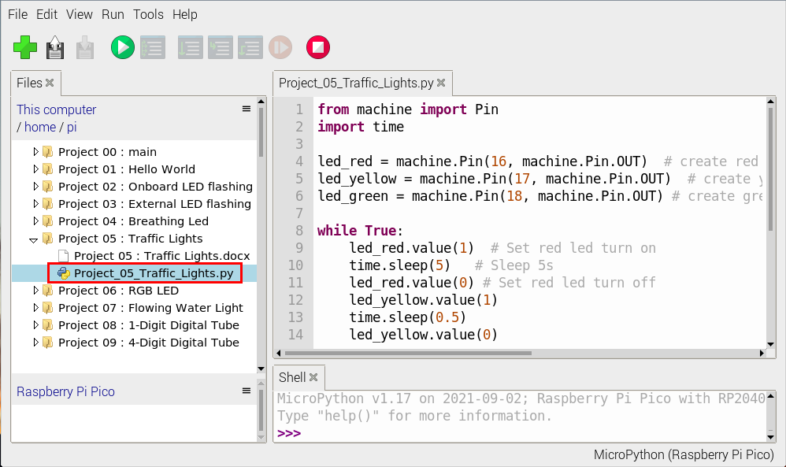

```Python
from machine import Pin
import time

led_red = machine.Pin(16, machine.Pin.OUT)  # create red led object from Pin 16, Set Pin 16 to output
led_yellow = machine.Pin(17, machine.Pin.OUT)  # create yellow led object from Pin 17, Set Pin 17 to output
led_green = machine.Pin(18, machine.Pin.OUT) # create green led object from Pin 18, Set Pin 18 to output

while True:
    led_red.value(1)  # Set red led turn on
    time.sleep(5)   # Sleep 5s
    led_red.value(0) # Set red led turn off 
    led_yellow.value(1)
    time.sleep(0.5)
    led_yellow.value(0)
    time.sleep(0.5)
    led_yellow.value(1)
    time.sleep(0.5)
    led_yellow.value(0)
    time.sleep(0.5)
    led_yellow.value(1)
    time.sleep(0.5)
    led_yellow.value(0)
    time.sleep(0.5)
    led_green.value(1)
    time.sleep(5) 
    led_green.value(0) 
```

5.**Test Result：**

Connect the pico board to the Raspberry Pi. Click to check the Shell

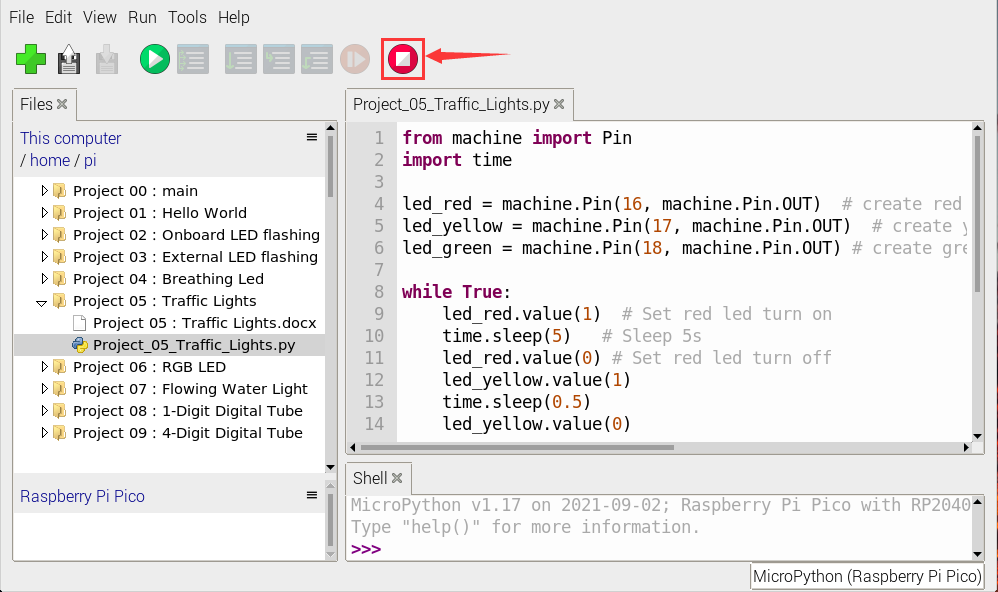

Click“”, the code starts executing, what we will see are below:

1). First, the green light will be on for 5 seconds and then off; 

2). Next, the yellow light blinks three times and then goes off. 

3). Then, the red light goes on for five seconds and then goes off. 
    
Repeat steps 1 to 3 above and press“Ctrl+C”or click“” to exit the program.

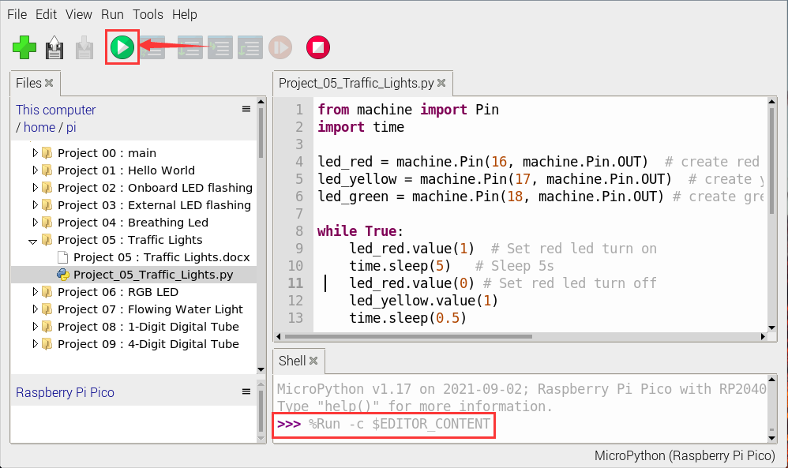

### Project 06: RGB LED

1.**Introduction**

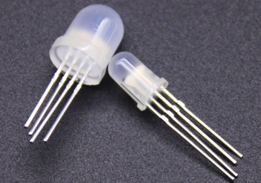

RGB LEDS are made up of three colors (red, green, and blue) , which can emit different colors by mixing these three basic colors. In this project, we will introduce the RGB LED and show you how to use the Raspberry Pi Pico to control the RGB LED. Even though RGB LED is very basic, it is also a great way to learn the fundamentals of electronics and coding.

2.**Components Required**

<table>
<tbody>
<tr class="odd">
<td></td>
<td></td>
<td></td>
<td></td>
</tr>
<tr class="even">
<td>Raspberry Pi Pico*1</td>
<td>Raspberry Pi Pico Expansion Board*1</td>
<td>RGB LED*1</td>
<td>USB Cable*1</td>
</tr>
<tr class="odd">
<td></td>
<td></td>
<td></td>
<td></td>
</tr>
<tr class="even">
<td>220ΩResistor*3</td>
<td>Breadboard*1</td>
<td>Jumper Wires</td>
<td></td>
</tr>
</tbody>
</table>

3.**Component Knowledge**

The monitors mostly adopt the RGB color standard, and all the colors on the computer screen are composed of the three colors of red, green and blue mixed in different proportions.

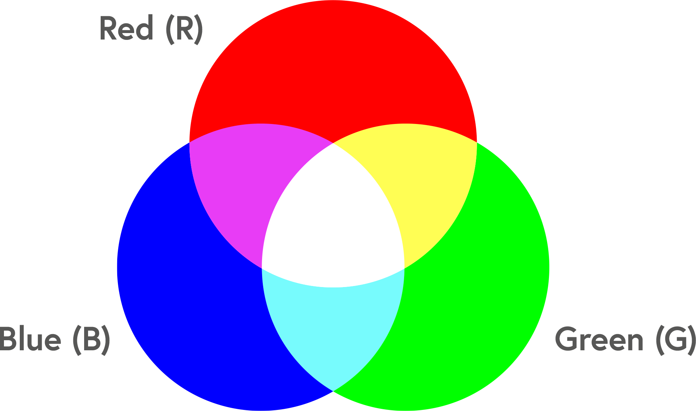

This RGB LED has 4 pins and a common cathode. To change its brightness, we can use the PWM of the Raspberry Pi Pico pins, which can give different duty cycle signals to the RGB LED to produce different colors.

If we use three 10-bit PWM to control the RGBLED, theoretically we can create  = 1,073,741,824(1 billion) colors through different combinations.

4.**Circuit Diagram and Wiring Diagram**


**Note:**

RGB LED longest pin (common cathode) connected to GND.

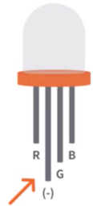

How to identify the 220Ω 5-band resistor


5.**Test Code**

Check the code in the folder "**...\6.Codes\Python_Codes(Raspberry-Pi)**".

You can move the code anywhere. For example, We copy the **Python_Codes(Raspberry-Pi).zip** to the <span style="color: rgb(255, 76, 65);">pi</span> folder of the Raspberry Pi system.

<span style="color: rgb(255, 76, 65);">Path: home/pi/Python_Codes(Raspberry-Pi)</span>

<br>
<br>


Open“Thonny”, click“This computer”→“home”→“pi”→“Python_Codes(Raspberry-Pi)”→“Project 06：RGB LED”and double left-click the“Project\_06\_RGB\_LED.py”.

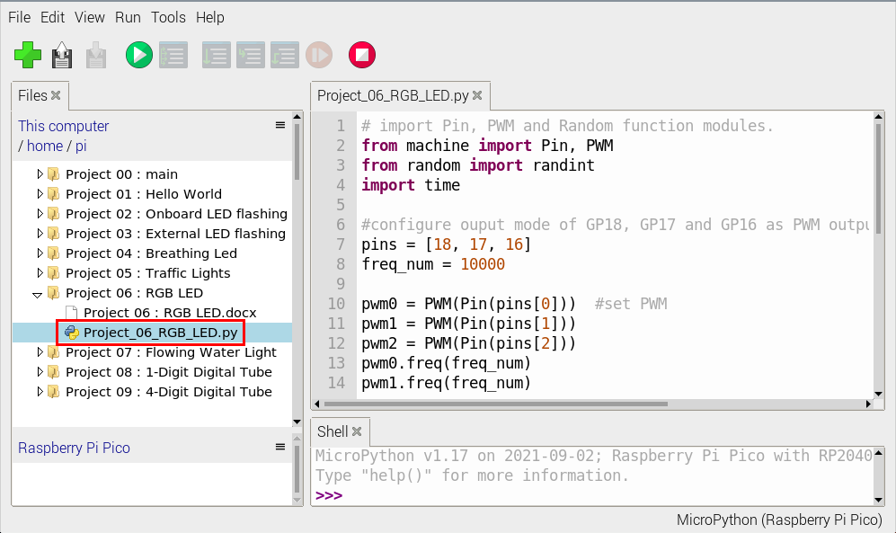

```Python
# import Pin, PWM and Random function modules.
from machine import Pin, PWM
from random import randint
import time

#configure ouput mode of GP18, GP17 and GP16 as PWM output and PWM frequency as 10000Hz.
pins = [18, 17, 16]
freq_num = 10000

pwm0 = PWM(Pin(pins[0]))  #set PWM
pwm1 = PWM(Pin(pins[1]))
pwm2 = PWM(Pin(pins[2]))
pwm0.freq(freq_num)
pwm1.freq(freq_num)
pwm2.freq(freq_num)

#define a function to set the color of RGBLED.
def setColor(r, g, b):
    pwm0.duty_u16(65535 - r)
    pwm1.duty_u16(65535 - g)
    pwm2.duty_u16(65535 - b)
    
try:
    while True:
        red   = randint(0, 65535) 
        green = randint(0, 65535)
        blue  = randint(0, 65535)
        setColor(red, green, blue)
        time.sleep_ms(200)
except:
    pwm0.deinit()
    pwm1.deinit()
    pwm2.deinit()
```

6.**Test Result**

Ensure that the Raspberry Pi Pico is connected to the computer, click “Stop/Restart backend”.


Click “Run current script”, the code starts executing, we will see that RGB LED starts showing random colors. Press“Ctrl+C”or click“Stop/Restart backend”to exit the program.

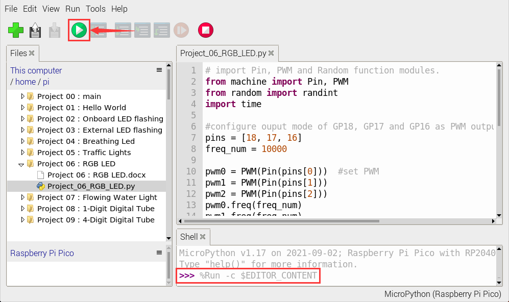

### Project 07: Flowing Water Light

**Project 07: Flowing Water Light**

1.**Introduction**

In our daily life, we can see many billboards made up of different colors of LED. They constantly change the light to attract the attention of customers. In this project, we will use Raspberry Pi Pico to control 10 LEDs to achieve the effect of flowing water.

2.**Components Required**

<table>
<tbody>
<tr class="odd">
<td></td>
<td></td>
<td></td>
<td></td>
</tr>
<tr class="even">
<td>Raspberry Pi Pico*1</td>
<td>Raspberry Pi Pico Expansion Board*1</td>
<td>Red LED*10</td>
<td>USB Cable*1</td>
</tr>
<tr class="odd">
<td></td>
<td></td>
<td></td>
<td></td>
</tr>
<tr class="even">
<td>220ΩResistor*10</td>
<td>Breadboard*1</td>
<td>Jumper Wires</td>
<td></td>
</tr>
</tbody>
</table>

3.**Circuit Diagram and Wiring Diagram**


**Note:**

How to connect the LED


How to identify the 220Ω 5-band resistor


4.**Test Code**

This project is to design and manufacture a flowing water light.Here are the steps: first , turn on LED \#1, then turn it off.Second, turn on LED \#2, then turn off... . Do the same for the 10 LEDs until the last one is turned off.  Repeating the process to achieve the "movement" of the water.

Check the code in the folder "**...\6.Codes\Python_Codes(Raspberry-Pi)**".

You can move the code anywhere. For example, We copy the **Python_Codes(Raspberry-Pi).zip** to the <span style="color: rgb(255, 76, 65);">pi</span> folder of the Raspberry Pi system.

<span style="color: rgb(255, 76, 65);">Path: home/pi/Python_Codes(Raspberry-Pi)</span>

<br>
<br>


Open“Thonny”, click“This computer”→“home”→“pi”→“Python_Codes(Raspberry-Pi)”→”Project 07：Flowing Water Light”and double-click“Project\_07\_Flowing\_Water\_Light.py”


```Python
from machine import Pin
import time

#Use an array to define 10 GPIO ports connected to LED Bar Graph for easier operation.
pins = [16, 17, 18, 19, 20, 21, 22, 26, 27, 28]
#Use two for loops to turn on LEDs separately from left to right and then back from right to left
def showLed():
    for pin in pins:
        print(pin)
        led = Pin(pin, Pin.OUT)
        led.value(1)
        time.sleep_ms(100)
        led.value(0)
        time.sleep_ms(100)        
    for pin in reversed(pins):
        print(pin)
        led = Pin(pin, Pin.OUT)
        led.value(1)
        time.sleep_ms(100)
        led.value(0)
        time.sleep_ms(100)
          
while True:
    showLed()
```

5.**Test Result：**

Connect the pico board to the Raspberry Pi. Clickto check the Shell.

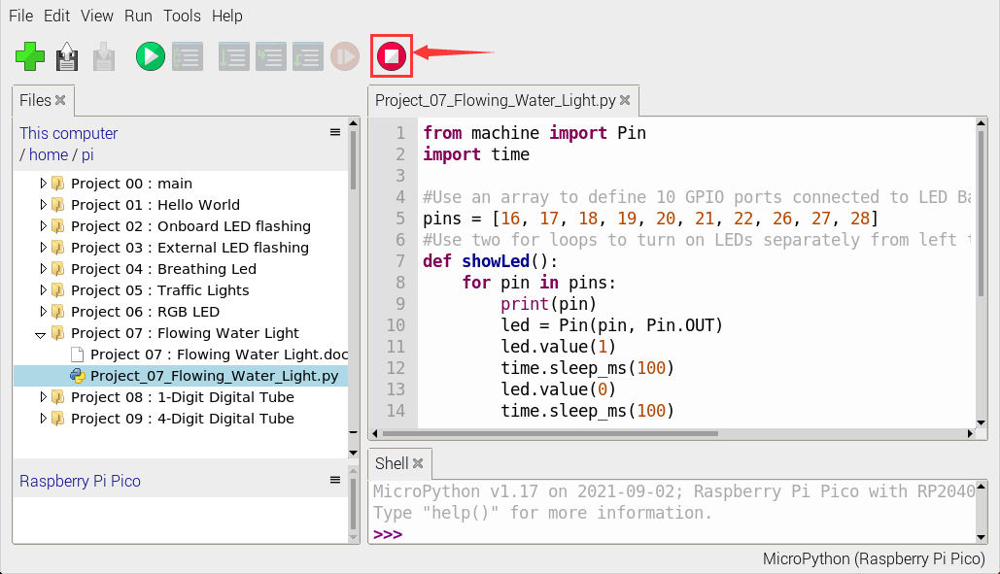

Click “Run current script”, the code starts executing, we will see that the 10 LEDs will light up like a flowing light. Click “Stop/Restart backend”to exit the program.

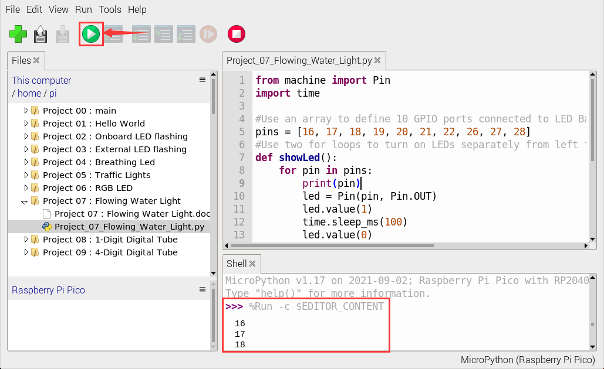

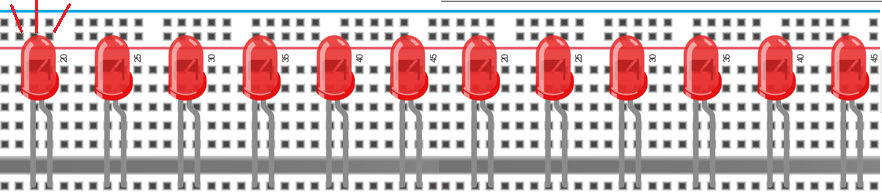

### Project 08: 1-Digit Digital Tube

1.**Introduction**

The seven-segment digital tube is an electronic display device that displays decimal numbers. It is widely used in digital clocks,
electronic meters, basic calculators and other electronic devices that display digital information. The tubes are an alternative to more complex dot-matrix displays that are easy to use in both limited light conditions and strong sunlight. In this project, we will use the Raspberry Pi Pico to control 1-digit digital tube to display numbers.

2.**Components Required**

<table>
<tbody>
<tr class="odd">
<td></td>
<td></td>
<td></td>
<td></td>
</tr>
<tr class="even">
<td>Raspberry Pi Pico*1</td>
<td>Raspberry Pi Pico Expansion Board*1</td>
<td>1-digit Digital Tube*1</td>
<td>USB Cable*1</td>
</tr>
<tr class="odd">
<td></td>
<td></td>
<td></td>
<td></td>
</tr>
<tr class="even">
<td>220ΩResistor*8</td>
<td>Breadboard*1</td>
<td><p>Breadboard</p>
<p>Wires</p></td>
<td></td>
</tr>
</tbody>
</table>

3.**Component Knowledge**

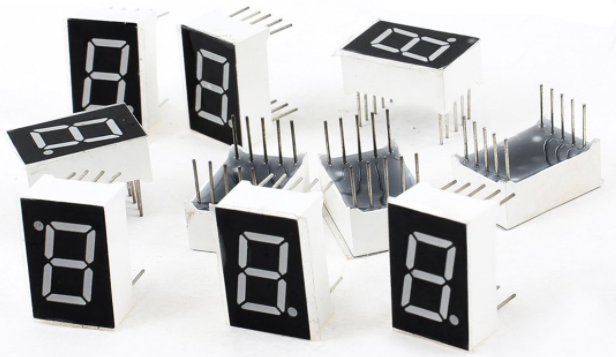

**Display principle:** The digital tube display is a semiconductor light-emitting device. Its basic unit is a light-emitting diode (LED).
The digital tube display can be divided into 7-segment digital tube and 8-segment digital tube according to the number of segments. The 8-segment digital tube has one more LED unit than the 7-segment digital tube (used for decimal point display). Each segment of the 7-segment LED display is a separate LED. According to the connection mode of the LED unit, the digital tube can be divided into a common anode digital tube and a common cathode digital tube.

In the common cathode 7-segment digital tube, all the cathodes (or negative electrodes) of the segmented LEDs are connected together, so you should connect the common cathode to GND. To light up a segmented LED, you can set its associated pin to “HIGH”.

In the common anode 7-segment digital tube, the LED anodes (positive electrodes) of all segments are connected together, so you should connect the common anode to “+5V”. To light up a segmented LED, you can set its associated pin to “LOW”.


Each part of the digital tube is composed of an LED. So when you use it, you also need to use a current limiting resistor. Otherwise, the LED will be damaged. In this experiment, we use an ordinary common cathode one-bit digital tube. As we mentioned above, you should connect the common cathode to GND. To light up a segmented LED, you can set its associated pin to “HIGH”.

4.**Circuit Diagram and Wiring Diagram**


**Note:** The direction of the 7-segment digital tube inserted into the breadboard is the same as the wiring diagram, and there is one more point in the lower right corner.


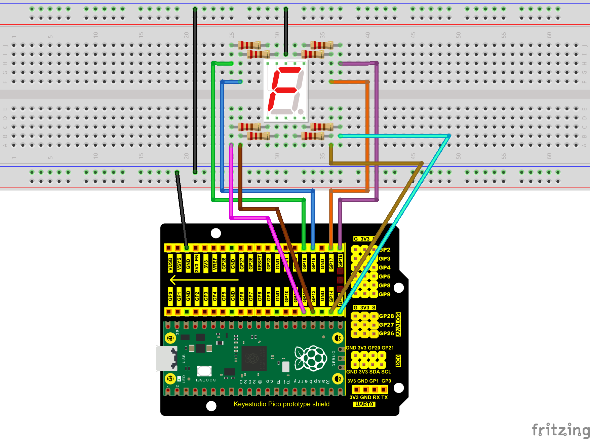

5.**Test Code**

The digital display is divided into 7 segments, and the decimal point display is divided into 1 segment. When certain numbers are displayed, the corresponding segment will be illuminated. For example, when the number 1 is displayed, segments b and c will be opened.

Check the code in the folder "**...\6.Codes\Python_Codes(Raspberry-Pi)**".

You can move the code anywhere. For example, We copy the **Python_Codes(Raspberry-Pi).zip** to the <span style="color: rgb(255, 76, 65);">pi</span> folder of the Raspberry Pi system.

<span style="color: rgb(255, 76, 65);">Path: home/pi/Python_Codes(Raspberry-Pi)</span>

<br>
<br>


Open“Thonny”, click“This computer”→“home”→“pi”→“Python_Codes(Raspberry-Pi)”→”Project 08：1-Digit Digital Tube”and double-click “Project\_08\_One\_Digit\_Digital\_Tube.py”.


```Python
from machine import Pin
import time

a = machine.Pin(17, machine.Pin.OUT)
b = machine.Pin(16, machine.Pin.OUT)
c = machine.Pin(14, machine.Pin.OUT)
d = machine.Pin(13, machine.Pin.OUT)
e = machine.Pin(12, machine.Pin.OUT)
f = machine.Pin(18, machine.Pin.OUT)
g = machine.Pin(19, machine.Pin.OUT)
dp = machine.Pin(15, machine.Pin.OUT)

pins = [machine.Pin(id,machine.Pin.OUT) for id in [17, 16, 14, 13, 12, 18, 19, 15]]

def show(code):
    for i in range(0, 8):
        pins[i].value(~code & 1)
        code = code >> 1

#Select code from 0 to 9
mask_digits = [0xc0, 0xf9, 0xa4, 0xb0, 0x99, 0x92, 0x82, 0xf8,0x80, 0x90]
for code in reversed(mask_digits):
    show(code)
    time.sleep(1)
```

6.**Test Result：**

Connect the pico board to the Raspberry Pi. Clickto check the Shell

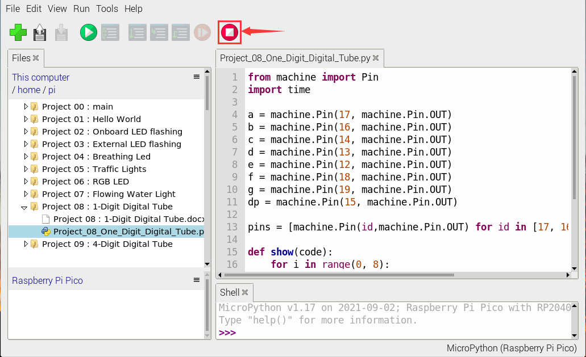

Click  to run the code. Then we will see that the 1-digit digital tube will display numbers from 9 to 0; clickto exit the program.

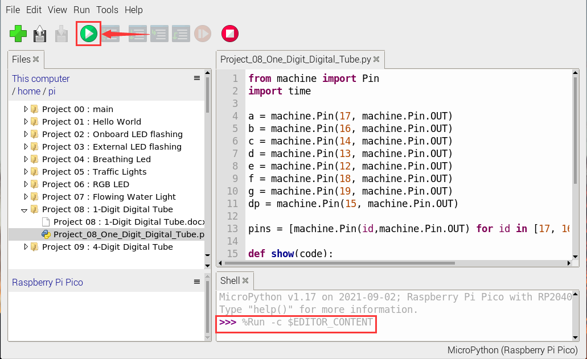


### Project 09：4-Digit Digital Tube

1.**Introduction**
    
The 4-digit 7-segment digital tube is a very practical display device, and it is used for devices such as electronic clocks and score counters. Due to the low price and it is easy to use, more and more projects will use 4-digit 7-segment digital tubes. In this project, we will use the Raspberry Pi Pico to control a 4-bit 7-segment digital tube to create a manual counter.


2.**Components Required**

<table>
<tbody>
<tr class="odd">
<td></td>
<td></td>
<td></td>
</tr>
<tr class="even">
<td>Raspberry Pi Pico*1</td>
<td>Raspberry Pi Pico Expansion Board*1</td>
<td>USB Cable*1</td>
</tr>
<tr class="odd">
<td>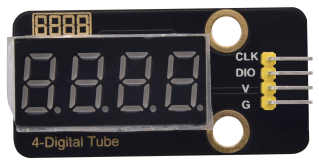</td>
<td>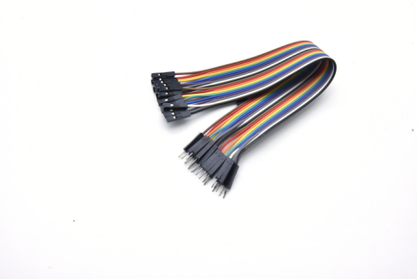</td>
<td></td>
</tr>
<tr class="even">
<td>4-Digit Digital Tube Module*1</td>
<td>M-F Dupont Wires</td>
<td></td>
</tr>
</tbody>
</table>

3.**Component Knowledge**

**TM1650 4-digit digital tube:** It is a 12-pin 4-digit tube display module with clock dots. The driver chip is TM1650 which only needs 2 signal lines to enable the microcontroller to control the 4-digit 8-segment digital tube. The control interface level can be 5V or 3.3V.

**Specifications of 4-bit digital tube module:**

Working voltage: DC 3.3V-5V

Maximum current: 100MA

Maximum power: 0.5W

**Schematic diagram of 4-digit digital tube module:**


4.**Circuit Diagram and Wiring Diagram**

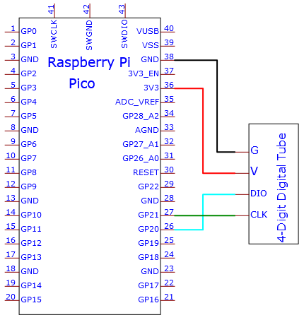


5.**Test Code**

Check the code in the folder "**...\6.Codes\Python_Codes(Raspberry-Pi)**".

You can move the code anywhere. For example, We copy the **Python_Codes(Raspberry-Pi).zip** to the <span style="color: rgb(255, 76, 65);">pi</span> folder of the Raspberry Pi system.

<span style="color: rgb(255, 76, 65);">Path: home/pi/Python_Codes(Raspberry-Pi)</span>

<br>
<br>


Open“Thonny”, click“This computer”→“home”→“pi”→“Python_Codes(Raspberry-Pi)”→“Project 09：4-Digit Digital Tube”. Select“TM1650\.py”，right-click and select“**Upload to /**”， and wait for“TM1650\.py to be uploaded to the Raspberry Pi Pico. And double-click the“Project\_09\_Four\_Digit\_Digital\_Tube.py”.

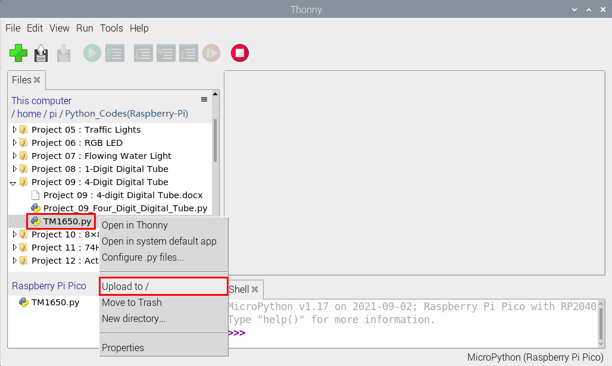

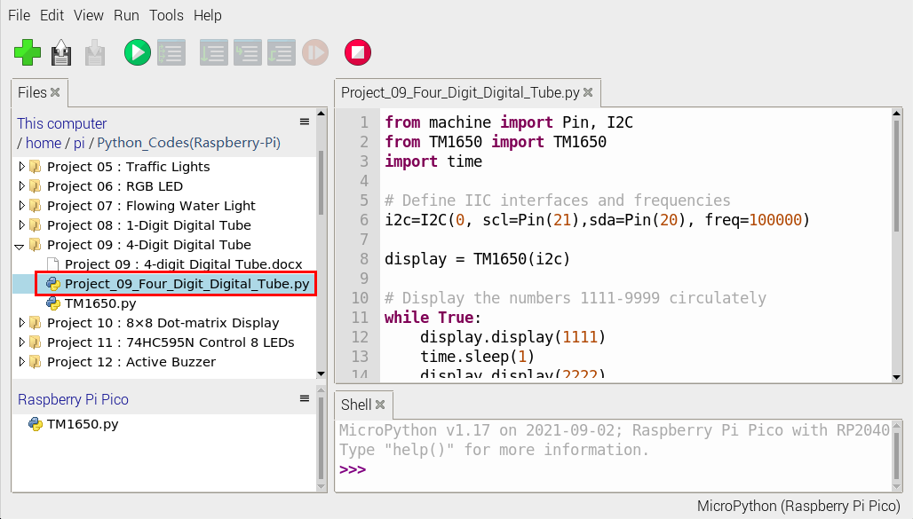

```Python
from machine import Pin, I2C
from TM1650 import TM1650
import time

# Define IIC interfaces and frequencies
i2c=I2C(0, scl=Pin(21),sda=Pin(20), freq=100000)

display = TM1650(i2c)

# Display the numbers 1111-9999 circulately
while True:
    display.display(1111)
    time.sleep(1)
    display.display(2222)
    time.sleep(1)
    display.display(3333)
    time.sleep(1)
    display.display(4444)
    time.sleep(1)
    display.display(5555)
    time.sleep(1)
    display.display(6666)
    time.sleep(1)
    display.display(7777)
    time.sleep(1)
    display.display(8888)
    time.sleep(1)
    display.display(9999)
    time.sleep(1)
```

6.**Test Result：**

Connect the pico board to the Raspberry Pi. Click to check the Shell

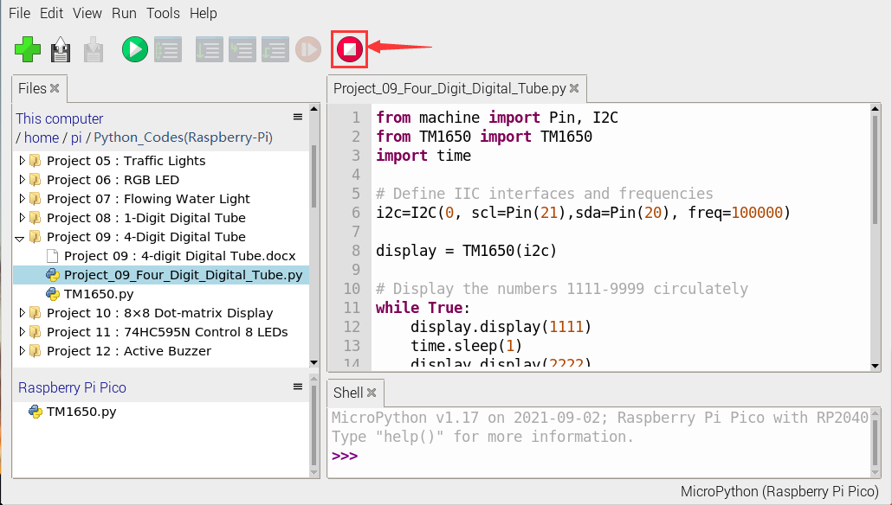

Click “”, the code starts executing, we will see that the 4-digit digital tube circularly displays numbers from 0000 to 9999.

Click“”to exit the program.

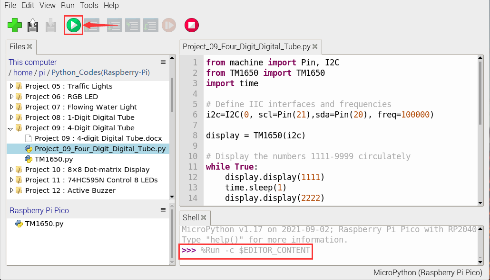


### Project 10：8×8 Dot-matrix Display

1.**Introduction**

The dot-matrix display is an electronic digital display device that can show information on machines, clocks and many other devices. In this project, we will use the Raspberry Pi Pico to control the 8x8 LED dot matrix to make a“❤”pattern.

2.**Components Required**

<table>
<tbody>
<tr class="odd">
<td></td>
<td></td>
<td></td>
</tr>
<tr class="even">
<td>Raspberry Pi Pico*1</td>
<td>Raspberry Pi Pico Expansion Board*1</td>
<td>USB Cable*1</td>
</tr>
<tr class="odd">
<td>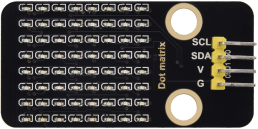</td>
<td>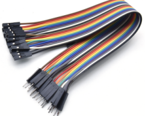</td>
<td></td>
</tr>
<tr class="even">
<td>8*8 Dot-matrix Display *1</td>
<td>M-F Dupont Wires</td>
<td></td>
</tr>
</tbody>
</table>

3.**Component Knowledge**

**8\*8 Dot-matrix display module:**

The 8\*8 dot matrix is composed of 64 LEDs, and each LED is placed at the intersection of a row and a column. When using a single-chip microcomputer to drive an 8\*8 dot matrix, we need to use a total of 16 digital ports, which greatly wastes the data of the single-chip microcomputer. For this reason, we specially designed this module, using the HT16K33 chip to drive an 8\*8 dot matrix, and only need to use the I2C communication port of the single-chip microcomputer to control the dot matrix, which greatly saves the microcontroller resources.

**Specifications:**

Working voltage: DC 5V

Current: 200MA

Maximum power: 1W

**Schematic diagram:**


Some modules have three DIP switches that you can flip at will. These switches are used to set the I2C communication address. The setting method is as follows. The module has fixed the communication address. A0, A1 and A2 are connected to GND, and the address is 0x70.  

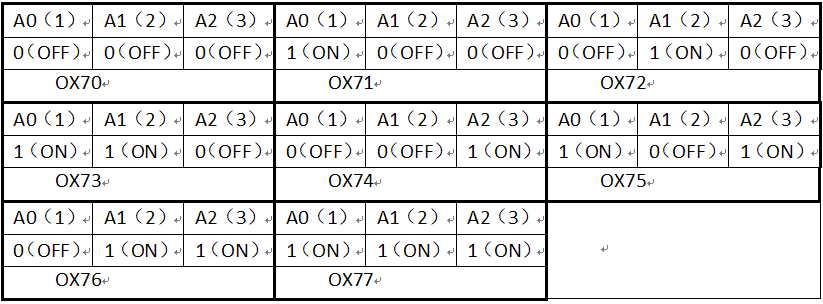

4.**Circuit Diagram and Wiring Diagram**
    

    
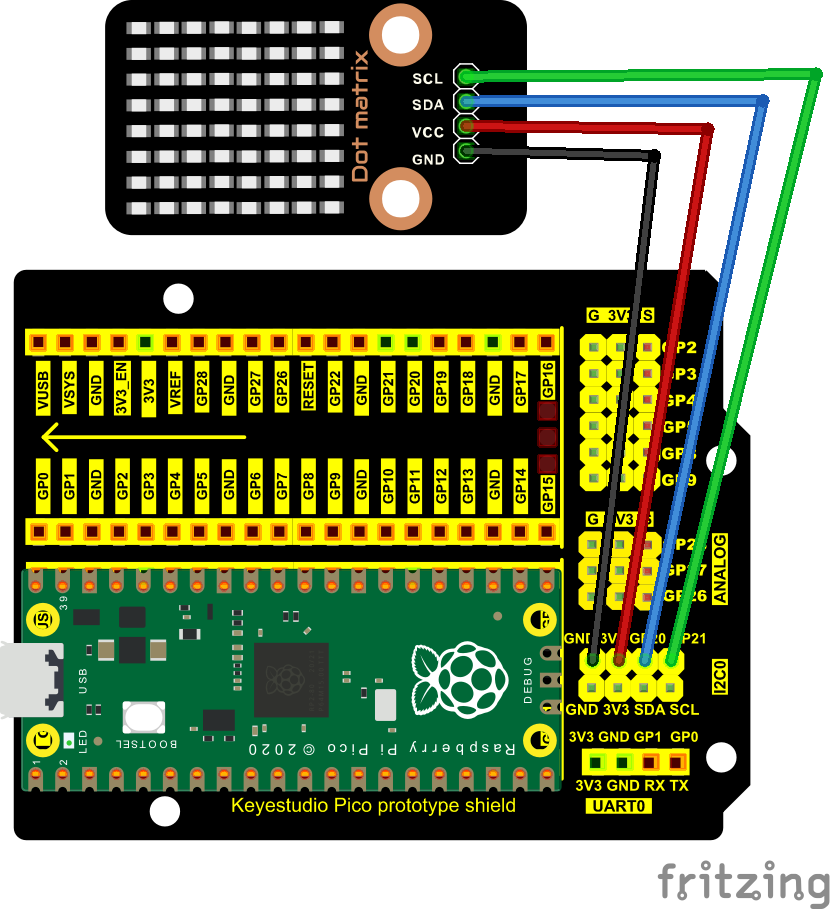
    
5.**Test Code**

Check the code in the folder "**...\6.Codes\Python_Codes(Raspberry-Pi)**".

You can move the code anywhere. For example, We copy the **Python_Codes(Raspberry-Pi).zip** to the <span style="color: rgb(255, 76, 65);">pi</span> folder of the Raspberry Pi system.

<span style="color: rgb(255, 76, 65);">Path: home/pi/Python_Codes(Raspberry-Pi)</span>

<br>
<br>


Open“Thonny”, click“This computer”→“home”→“pi”→“Python_Codes(Raspberry-Pi)”→“Project 10：8×8 Dot-matrix Display”. Select“ht16k33\_matrix.py”and“matrix\_fonts.py”，right-click and select“**Upload to /**”and wait for “ht16k33\_matrix.py”and“matrix\_fonts.py”to be uploaded to the Raspberry Pi Pico. And double-click the“Project\_10\_8×8\_Dot\_Matrix\_Display.py”.

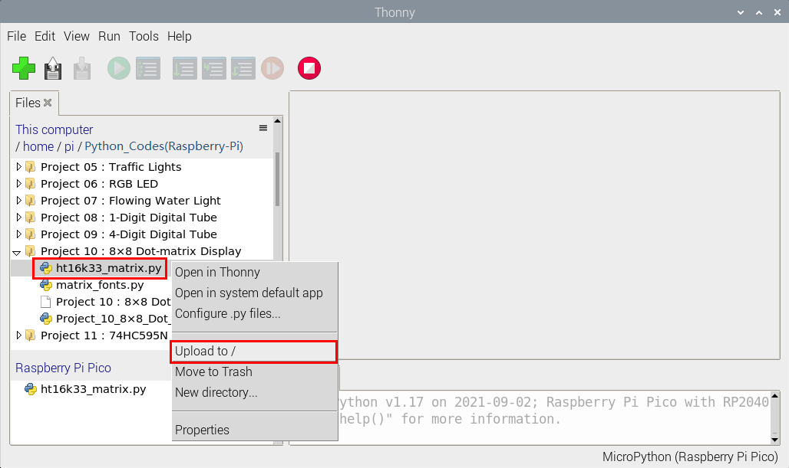

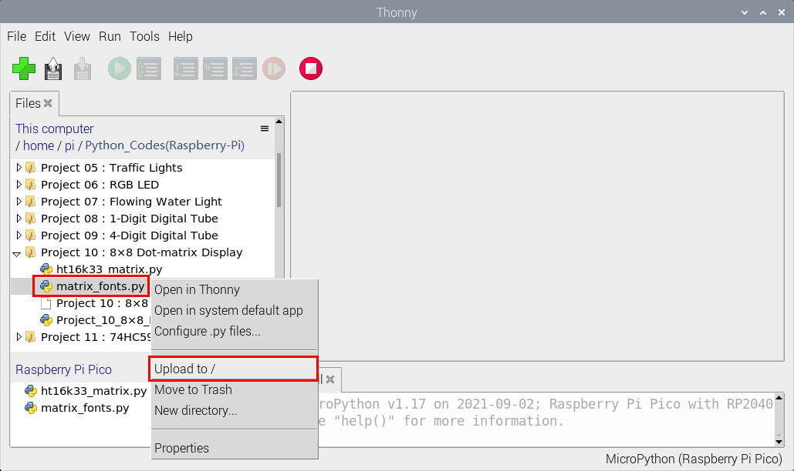

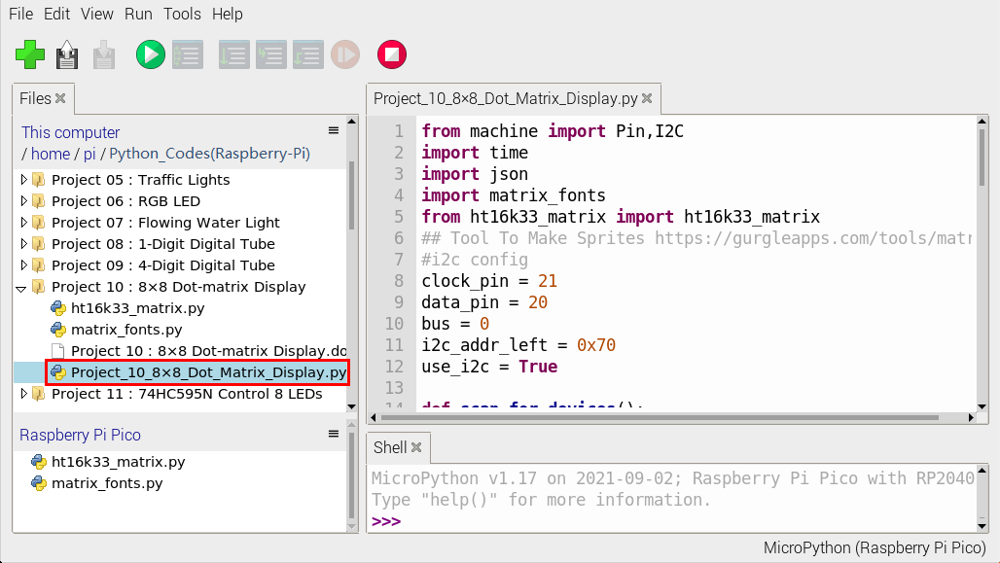

```Python
from machine import Pin,I2C
import time
import json
import matrix_fonts
from ht16k33_matrix import ht16k33_matrix
## Tool To Make Sprites https://gurgleapps.com/tools/matrix
#i2c config
clock_pin = 21
data_pin = 20
bus = 0
i2c_addr_left = 0x70
use_i2c = True

def scan_for_devices():
    i2c = machine.I2C(bus,sda=machine.Pin(data_pin),scl=machine.Pin(clock_pin))
    devices = i2c.scan()
    if devices:
        for d in devices:
            print(hex(d))
    else:
        print('no i2c devices')

if use_i2c:
    scan_for_devices()
    left_eye = ht16k33_matrix(data_pin, clock_pin, bus, i2c_addr_left)

def show_char(left):
    if use_i2c:
        left_eye.show_char(left)
        
def scroll_message(font,message='hello',delay=0.05): #Scrolling display
    left_message = '   ' + message
    right_message = message + '   '
    length=len(right_message)
    char_range=range(length-1)
    for char_pos in char_range:
      right_left_char=font[right_message[char_pos]]
      right_right_char=font[right_message[char_pos+1]]
      left_left_char=font[left_message[char_pos]]
      left_right_char=font[left_message[char_pos+1]]
      for shift in range(8):
        left_bytes=[0,0,0,0,0,0,0,0]
        right_bytes=[0,0,0,0,0,0,0,0]
        for col in range(8):
          left_bytes[col]=left_bytes[col]|left_left_char[col]<<shift
          left_bytes[col]=left_bytes[col]|left_right_char[col]>>8-shift;
          right_bytes[col]=right_bytes[col]|right_left_char[col]<<shift
          right_bytes[col]=right_bytes[col]|right_right_char[col]>>8-shift;
        if use_i2c:
                left_eye.show_char(left_bytes)
        time.sleep(delay)


while True:
    show_char(matrix_fonts.textFont1['A']) #Show the letter A
    time.sleep(1)
    show_char(matrix_fonts.textFont1['B'])
    time.sleep(1)
    show_char(matrix_fonts.textFont1['C'])
    time.sleep(1)
    scroll_message(matrix_fonts.textFont1, ' Hello World ')
```

6.**Test Result**

Ensure that the Raspberry Pi Pico is connected to the computer, click “Stop/Restart backend”.

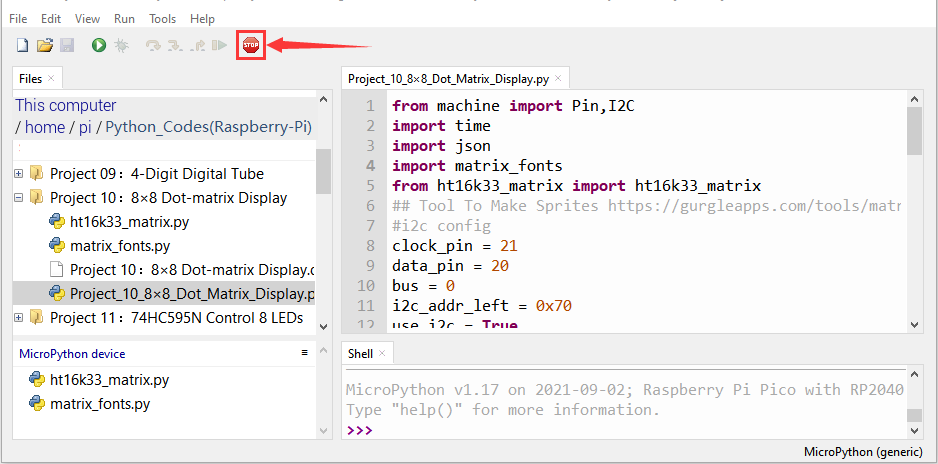

Click “Run current script”, the code starts executing, we will see that the 8 x 8 dot matrix displays the character "A" 1S, "B" 1S, and "C" 1S. Then scroll to display the string "Hello World”repeatedly. Click“Stop/Restart backend”to exit the program.

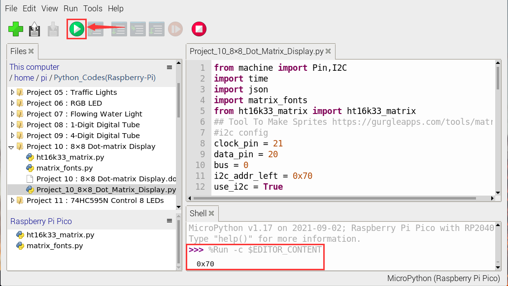


### Project 11：74HC595N Control 8 LEDs 

1.**Introduction**
    
In previous projects, we have learned how to light an LED. However, how to light up a lot of LEDs with only 26 I/O ports on the Raspberry Pi Pico? Sometimes we may run out of pins , at that time, we need to extend it with the shift register. You can use a 74HC595N chip to control up to eight outputs at a time, using only a few pins on your microcontroller. In addition, You can also connect multiple registers together to further expand the output. In this project, we will use a Raspberry Pi Pico, a 74HC595 chip and LEDs to make a flowing water light to understand the function of the chip.  
    
2.**Components Required**

<table>
<tbody>
<tr class="odd">
<td></td>
<td></td>
<td>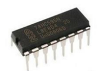</td>
<td></td>
</tr>
<tr class="even">
<td>Raspberry Pi Pico*1</td>
<td>Raspberry Pi Pico Expansion Board*1</td>
<td>74HC595N Chip*1</td>
<td>Red LED*8</td>
</tr>
<tr class="odd">
<td></td>
<td></td>
<td></td>
<td></td>
</tr>
<tr class="even">
<td>220ΩResistor*8</td>
<td>Breadboard*1</td>
<td>Jumper Wires</td>
<td>USB Cable*1</td>
</tr>
</tbody>
</table>

3.**Component Knowledge**
    
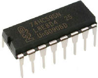

**74HC595N Chip:** To put it simply, 74HC595N chip is a combination of 8-digit shifting register, memorizer and equipped with tri-state output. The shift register and the memorizer are synchronized to different clocks, and the data is input on the rising edge of the shift register clock SCK and goes into the memory register on the rising edge of the memory register clock RCK. If the two clocks are connected together, the shift register is always one pulse earlier than the storage register.

The shift register has a serial shift input (SI) and a serial output(SQH) for cascading. The 8-bit shift register can be reset
asynchronously (low-level reset), and the storage register has an 8-bit Three-state parallel bus output, when the output enable (OE) is enabled(active low), the storage register is output to the 74HC595N pin (bus).


**Pins**：

<table>
<tbody>
<tr class="odd">
<td>Pin13 OE</td>
<td>It is an output enable pin to ensure that the data of the latch is input to the Q0 to Q7 pins or not. When it is low, no high level is output. In this experiment, we directly connect to GND and keep the data output low.</td>
</tr>
<tr class="even">
<td>Pin14 SI</td>
<td>This is the pin for 74HC595 to receive data, i.e. serial data input, only one bit can be input at a time, then 8 times in a row, it can form a byte.</td>
</tr>
<tr class="odd">
<td>Pin10 SCLR</td>
<td>A pin to initialize the storage register pins. It initializes the internal storage registers at a low level. In this experiment, we connect VCC to maintain a high level.</td>
</tr>
<tr class="even">
<td>Pin11 SCK</td>
<td>The clock pin of the shift register. At the rising edge, the data in the shift register is shifted backward as a whole, and new data input is received.</td>
</tr>
<tr class="odd">
<td>Pin12 RCK</td>
<td>The clock input pin of the storage register . At the rising edge, the data is transferred from the shift register to the storage register. At this time, the data is output in parallel from the Q0 to Q7 ports.</td>
</tr>
<tr class="even">
<td>Pin9 SQH</td>
<td>It is a serial output pin dedicated for chip cascading to the SI terminal of the next 74HC595.</td>
</tr>
<tr class="odd">
<td>Q0--Q7(Pin 15,Pin1-7)</td>
<td>Eight-bit parallel output, can directly control the 8 segments of the digital tube.</td>
</tr>
</tbody>
</table>

4.**Circuit Diagram and Wiring Diagram**


Note: Pay attention to the direction in which the 74HC595N chip is inserted.

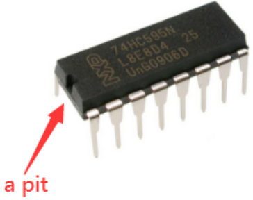

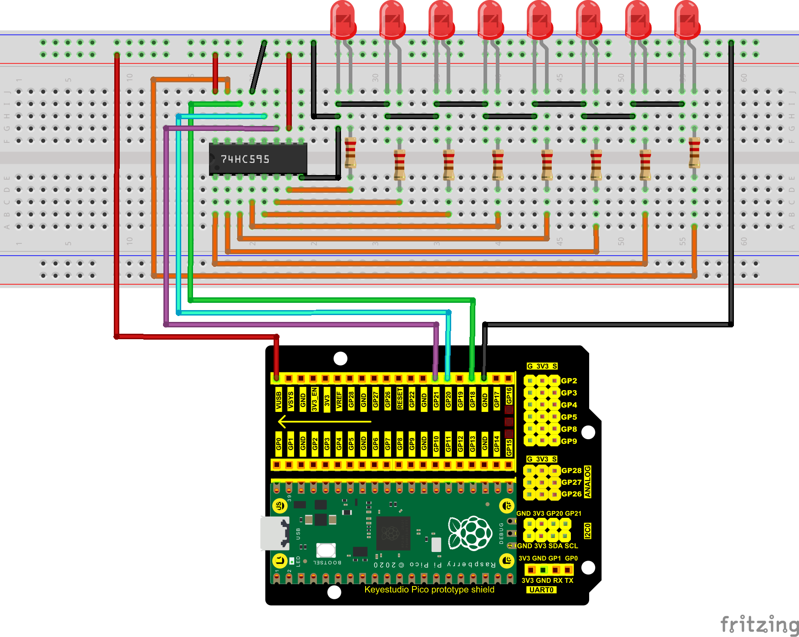

5.**Test Code**

Check the code in the folder "**...\6.Codes\Python_Codes(Raspberry-Pi)**".

You can move the code anywhere. For example, We copy the **Python_Codes(Raspberry-Pi).zip** to the <span style="color: rgb(255, 76, 65);">pi</span> folder of the Raspberry Pi system.

<span style="color: rgb(255, 76, 65);">Path: home/pi/Python_Codes(Raspberry-Pi)</span>

<br>
<br>


Open“Thonny”, click“This computer”→“home”→“pi”→“Python_Codes(Raspberry-Pi)”→“Project 11：74HC595N Control 8 LEDs”. Select“my74HC595\.py”, right-click and select“**Upload to /**”，wait for“my74HC595\.py”to be uploaded to the Raspberry Pi Pico. And double-click the“Project\_11\_74HC595N\_Controls\_8\_LEDs.py”.

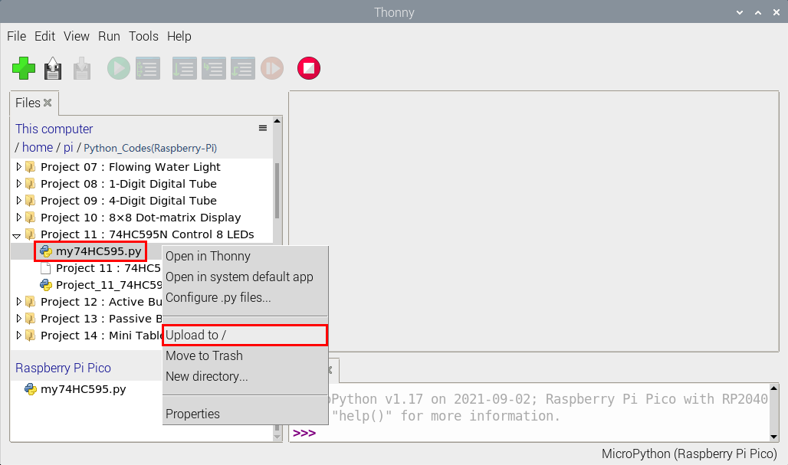

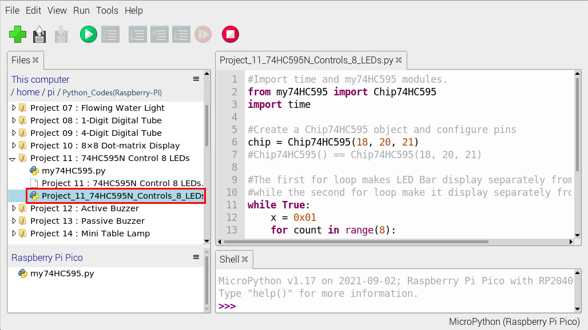

```Python
#Import time and my74HC595 modules.
from my74HC595 import Chip74HC595
import time

#Create a Chip74HC595 object and configure pins
chip = Chip74HC595(18, 20, 21)
#Chip74HC595() == Chip74HC595(18, 20, 21)

#The first for loop makes LED Bar display separately from left to right
#while the second for loop make it display separately from right to left.
while True:
    x = 0x01
    for count in range(8):
        chip.shiftOut(1, x)
        x = x<<1;
        time.sleep_ms(300)
    x = 0x01
    for count in range(8):
        chip.shiftOut(0, x)
        x = x<<1
        time.sleep_ms(300)
```

6.**Test Result**
    
Ensure that the Raspberry Pi Pico is connected to the computer，click“Stop/Restart backend”.

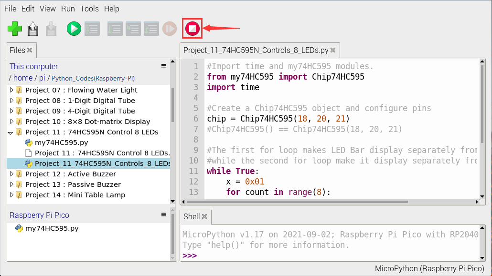

Click “Run current script”, the code starts executing, we will see that the 8 LEDs start flashing in flowing water mode. Press“Ctrl+C”or click“Stop/Restart backend”to exit the program.


### Project 12：Active Buzzer

1.**Introduction**

Active buzzer is a sound making element, which is widely used on computers, printers, alarms, electronic toys, telephones, timers, etc. It has an inner vibration source. In this project, we will use a Raspberry Pi Pico to control the active buzzer to buzz.

2.**Components Required**

<table>
<tbody>
<tr class="odd">
<td></td>
<td></td>
<td></td>
</tr>
<tr class="even">
<td>Raspberry Pi Pico*1</td>
<td>Raspberry Pi Pico Expansion Board*1</td>
<td>USB Cable*1</td>
</tr>
<tr class="odd">
<td></td>
<td></td>
<td></td>
</tr>
<tr class="even">
<td>Active Buzzer*1</td>
<td>Breadboard*1</td>
<td>Jumper Wires</td>
</tr>
</tbody>
</table>


3.**Component Knowledge**


The active buzzer inside has a simple oscillator circuit , which can convert constant direct current into a certain frequency pulse signal. Once active buzzer receives a high level, it will sound. The passive buzzer is an integrated electronic buzzer with no internal vibration source. It must be driven by 2K to 5K square wave instead of a DC signal. The appearance of the two buzzers is very similar, but passive buzzers come with a green circuit board, and active buzzers come with a black tape. Passive buzzers don't have positive pole, but active buzzers have. As shown below:


**4. Circuit Diagram and Wiring Diagram**


Note:

1\. The buzzer power supply in this circuit is 5V.  On a 3.3V power supply, the buzzer will work, but it will reduce the loudness.  

2\. The VUSB should connect to the positive terminal of the USB cable, if it connects to GND, it could burn out the computer or Raspberry Pi Pico.  Similarly, the Raspberry Pi Pico's 36-40 pins need to be connected carefully to avoid short circuits. 

3\. The positive terminal ("+"/long pin) of the active buzzer is connected to pin 16, and the negative terminal (short pin) is connected to GND.

**5. Test Code**

Check the code in the folder "**...\6.Codes\Python_Codes(Raspberry-Pi)**".

You can move the code anywhere. For example, We copy the **Python_Codes(Raspberry-Pi).zip** to the <span style="color: rgb(255, 76, 65);">pi</span> folder of the Raspberry Pi system.

<span style="color: rgb(255, 76, 65);">Path: home/pi/Python_Codes(Raspberry-Pi)</span>

<br>
<br>


Open“Thonny”, click“This computer”→“home”→“pi”→“Python_Codes(Raspberry-Pi)”→“Project 12: Active Buzzer”. And double-click the Project\_12\_Active\_Buzzer.py”.

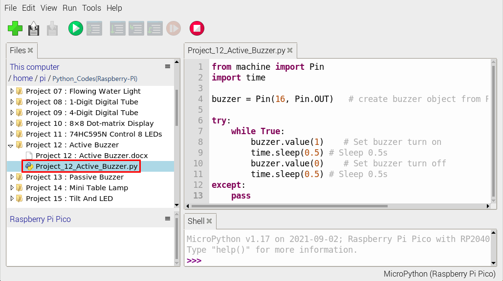

```Python
from machine import Pin
import time

buzzer = Pin(16, Pin.OUT)   # create buzzer object from Pin 16, Set Pin 16 to output

try:
    while True:
        buzzer.value(1)    # Set buzzer turn on
        time.sleep(0.5) # Sleep 0.5s
        buzzer.value(0)    # Set buzzer turn off
        time.sleep(0.5) # Sleep 0.5s
except:
    pass
```

6.**Test Result**
    
Ensure that the Raspberry Pi Pico is connected to the computer，click“Stop/Restart backend”.
    

    
Click “Run current script”, the code starts executing, we will see that the the active buzzer starts to buzz. Click“Stop/Restart backend”to exit the program.
    


### Project 13：Passive Buzzer

**1. Introduction**

In a previous project, we have learned an active buzzer, which can only produce one sound and may let you feel monotonous. In this project, we will learn a passive buzzer and use the Raspberry Pi Pico to control the passive buzzer to sound an alarm. Unlike the active buzzer, the passive buzzer can emit sounds of different frequencies.

2.**Components Required**

<table>
<tbody>
<tr class="odd">
<td></td>
<td></td>
<td></td>
</tr>
<tr class="even">
<td>Raspberry Pi Pico*1</td>
<td>Raspberry Pi PicoExpansion Board*1</td>
<td>USB Cable*1</td>
</tr>
<tr class="odd">
<td>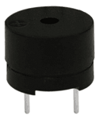</td>
<td></td>
<td></td>
</tr>
<tr class="even">
<td>Passive Buzzer*1</td>
<td>Breadboard*1</td>
<td>Jumper Wires</td>
</tr>
</tbody>
</table>

**3.Component Knowledge**


A passive buzzer is an integrated electronic buzzer with no internal vibration source. It must be driven by 2K to 5K square wave, not a DC signal. The two buzzers are very similar in appearance, but one buzzer with a green circuit board is a passive buzzer, while the other with black tape is an active buzzer. Passive buzzers cannot distinguish between positive polarity while active buzzers can.


**4. Circuit Diagram and Wiring Diagram**


5.**Test Code**
    
Check the code in the folder "**...\6.Codes\Python_Codes(Raspberry-Pi)**".

You can move the code anywhere. For example, We copy the **Python_Codes(Raspberry-Pi).zip** to the <span style="color: rgb(255, 76, 65);">pi</span> folder of the Raspberry Pi system.

<span style="color: rgb(255, 76, 65);">Path: home/pi/Python_Codes(Raspberry-Pi)</span>

<br>
<br>


Open“Thonny”, click“This computer”→“home”→“pi”→“Python_Codes(Raspberry-Pi)”→“Project 13：Passive Buzzer”. And double left-click the“Project\_13\_Passive\_Buzzer.py”.

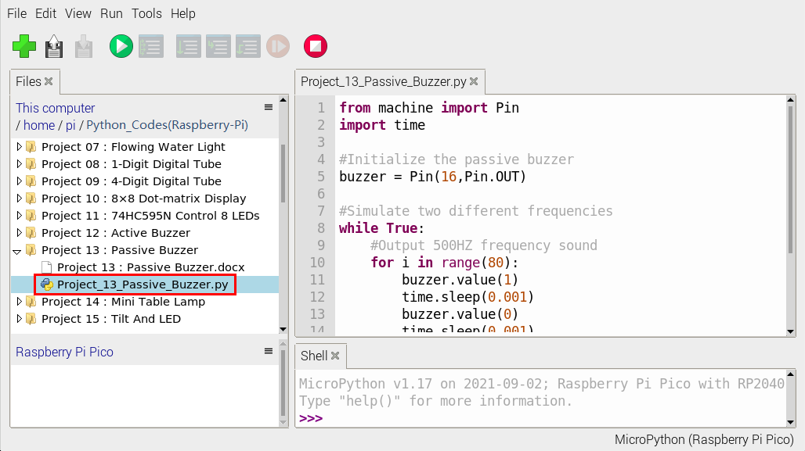

```Python
from machine import Pin
import time

#Initialize the passive buzzer
buzzer = Pin(16,Pin.OUT)

#Simulate two different frequencies
while True:
    #Output 500HZ frequency sound
    for i in range(80):
        buzzer.value(1)
        time.sleep(0.001)
        buzzer.value(0)
        time.sleep(0.001)
    #Output 250HZ frequency sound
    for i in range(100):
        buzzer.value(1)
        time.sleep(0.002)
        buzzer.value(0)
        time.sleep(0.002)
```

6.**Test Result**
    
Ensure that the Raspberry Pi Pico is connected to the computer，click“Stop/Restart backend”.
    
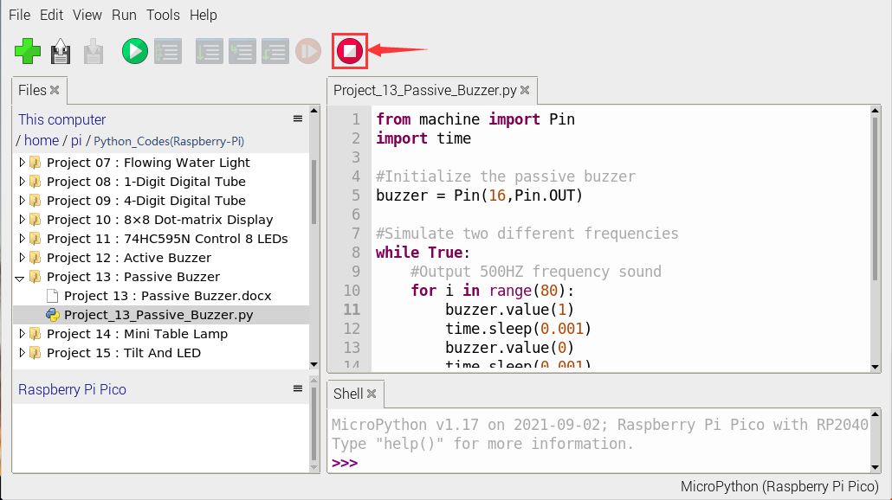
    
Click “Run current script”, the code starts executing, we will see that the the passive buzzer sounds the alarm. Click “Stop/Restart backend”to exit the program.
    


### Project 14 : Mini Table Lamp

1.**Introduction**

Did you know that a Raspberry Pi Pico can light up an LED when you press a button? In this project, we will use the Raspberry Pi Pico, a key switch and an LED to make a Mini Table lamp.

2.**Components Required**

<table>
<tbody>
<tr class="odd">
<td>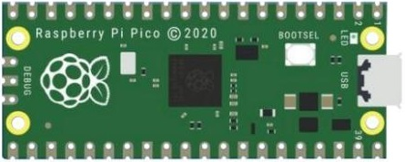</td>
<td></td>
<td></td>
<td></td>
<td></td>
</tr>
<tr class="even">
<td>Raspberry Pi Pico*1</td>
<td>Raspberry Pi Pico Expansion Board*1</td>
<td>Button*1</td>
<td>Red LED*1</td>
<td>10KΩResistor*1</td>
</tr>
<tr class="odd">
<td></td>
<td>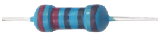</td>
<td></td>
<td></td>
<td></td>
</tr>
<tr class="even">
<td>Breadboard*1</td>
<td>220ΩResistor*1</td>
<td>USB Cable*1</td>
<td><p>Jumper</p>
<p>Wires</p></td>
<td>Button Cap*1</td>
</tr>
</tbody>
</table>

3.**Component Knowledge**


**Button:** The button can control the circuit on and off. The circuit is disconnected when the button is not pressed. But it breaks when you release it. Why does it only work when you press it? It starts from the internal structure of the button, which is shown in the figure:. Before the button is pressed, 1 and 2 are on, 3 and 4 are also on, but 1, 3 or 1, 4 or 2, 3 or 2, 4 are off(not working). Only when the button is pressed, 1, 3 or 1, 4 or 2, 3 or 2, 4 are on. The key switch is one of the most commonly used components in circuit design.

**Schematic diagram of the button:**


**What is button jitter?**

We think of the switch circuit as "press the button and turn it on immediately", "press it again and turn it off immediately". In fact,
this is not the case.

The button usually uses a mechanical elastic switch, and the mechanical elastic switch will produce a series of jitter due to the elastic action at the moment when the mechanical contact is opened and closed (usually about 10ms). As a result, the button switch will not immediately and stably turn on the circuit when it is closed, and it will not be completely and instantaneously disconnected when it is turned off.


**How to eliminate the jitter?**

There are two common methods, namely fix jitter in the software and hardware. We only discuss the jitter removal in the software.

We already know that the jitter time generated by elasticity is about 10ms, and the delay command can be used to delay the execution time of the command to achieve the effect of jitter removal.

Therefore, we delay 0.02s in the code to achieve the key anti-shake function.


**4.** **Circuit Diagram and Wiring Diagram**


**Note:**

How to connect the LED


How to identify the 220Ω 5-band resistor and 10KΩ 5-band resistor


**5.Test Code**

Check the code in the folder "**...\6.Codes\Python_Codes(Raspberry-Pi)**".

You can move the code anywhere. For example, We copy the **Python_Codes(Raspberry-Pi).zip** to the <span style="color: rgb(255, 76, 65);">pi</span> folder of the Raspberry Pi system.

<span style="color: rgb(255, 76, 65);">Path: home/pi/Python_Codes(Raspberry-Pi)</span>

<br>
<br>


Open“Thonny”, click“This computer”→“home”→“pi”→“Python_Codes(Raspberry-Pi)”→“Project 14：Mini Table Lamp”. And double-click the “Project\_14\_Mini\_Table\_Lamp.py”.

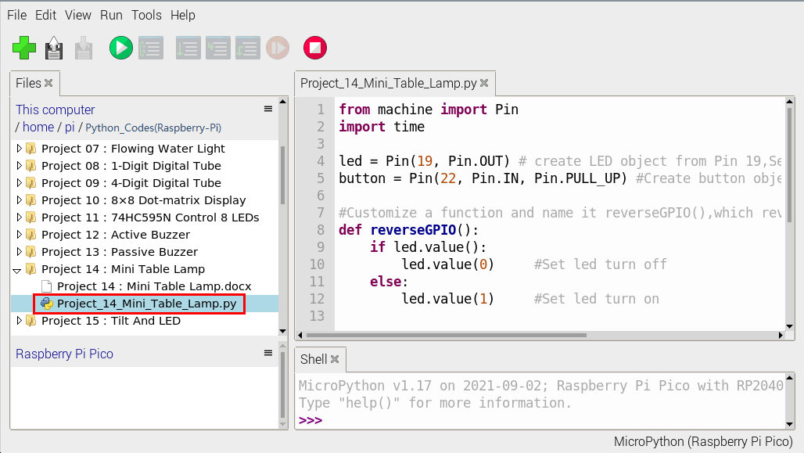

```Python
from machine import Pin
import time

led = Pin(19, Pin.OUT) # create LED object from Pin 19,Set Pin 19 to output                   
button = Pin(22, Pin.IN, Pin.PULL_UP) #Create button object from Pin22,Set GP22 to input

#Customize a function and name it reverseGPIO(),which reverses the output level of the LED
def reverseGPIO():
    if led.value():
        led.value(0)     #Set led turn off
    else:
        led.value(1)     #Set led turn on

try:
    while True:
        if not button.value():
            time.sleep_ms(20)
            if not button.value():
                reverseGPIO()
                while not button.value():
                    time.sleep_ms(20)
except:
    pass
```

6.**Test Result**
    
Ensure that the Raspberry Pi Pico is connected to the computer，click“Stop/Restart backend”.

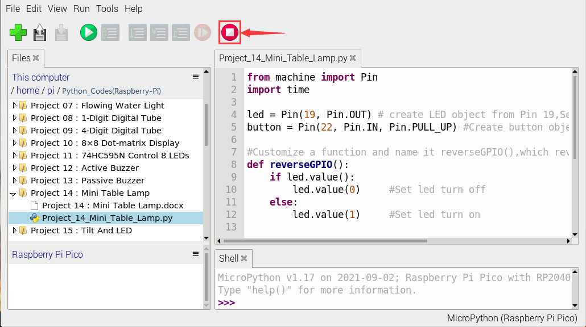

Click“Run current script”, the code starts executing, we will see that press the button, the LED lights up;  when the button is released, the LED remains lit. Press the button again, the LED goes off;  When the button is released, the LED remains off. Doesn't it look like a little lamp? Click“Stop/Restart backend”to exit the program.


### Project 15：Tilt And LED

1.**Introduction**

The ancients without electronic clocks, so the hourglass are invented to measure time.  The hourglass has a large capacity on both sides, and which is filled with fine sand on one side. What’s more, there is a small channel in the middle, which can make the hourglass stand upright , the side with fine sand is on the top. 

However, due to the action of gravity, the fine sand will flow down through the channel to the other side of the hourglass. When the sand reaches the bottom, turn it upside down and record the number of times it has gone through the hourglass, therefore, the next day we can know the approximate time of the day by it. In this project, we will use a Raspberry Pi Pico to control the tilt switch and LED lights to simulate an hourglass and make an electronic hourglass. 

2.**Components Required**

<table>
<tbody>
<tr class="odd">
<td></td>
<td></td>
<td>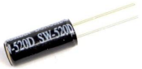</td>
<td></td>
<td></td>
</tr>
<tr class="even">
<td>Raspberry Pi Pico*1</td>
<td>Raspberry Pi Pico Expansion Board*1</td>
<td>Tilt Switch*1</td>
<td>Red LED*4</td>
<td>10KΩResistor*1</td>
</tr>
<tr class="odd">
<td></td>
<td></td>
<td></td>
<td></td>
<td></td>
</tr>
<tr class="even">
<td>Breadboard*1</td>
<td>220ΩResistor*4</td>
<td>USB Cable*1</td>
<td>Jumper Wires</td>
<td></td>
</tr>
</tbody>
</table>

3.**Component Knowledge**


Tilt switch is also called digital switch. Inside is a metal ball that can roll. The principle of rolling the metal ball to contact with the conductive plate at the bottom, which is used to control the on and off of the circuit. When it is a rolling ball tilt sensing switch with single directional trigger, the tilt sensor is tilted toward the trigger end (two gold-plated pin ends), the tilt switch is in a closed circuit and the voltage at the analog port is about 5V (binary number is 1023).

In this way, the LED will light up. When the tilt switch is in a horizontal position or tilted to the other end, it is open and the
voltage of the analog port is about 0V (binary number is 0), the LED will turn off. In the program, we judge the state of the switch based on whether the voltage value of the analog port is greater than 2.5V(binary number is 512).

As shown in the figure, use the internal structure of the tilt switch to illustrate how it works.

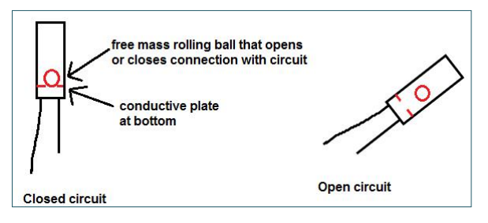

4.**Circuit Diagram and Wiring Diagram**


Note:

How to connect the LED


How to identify the 220Ω 5-band resistor and 10KΩ 5-band resistor


5.**Test Code**

Check the code in the folder "**...\6.Codes\Python_Codes(Raspberry-Pi)**".

You can move the code anywhere. For example, We copy the **Python_Codes(Raspberry-Pi).zip** to the <span style="color: rgb(255, 76, 65);">pi</span> folder of the Raspberry Pi system.

<span style="color: rgb(255, 76, 65);">Path: home/pi/Python_Codes(Raspberry-Pi)</span>

<br>
<br>


Open“Thonny”, click“This computer”→“home”→“pi”→“Python_Codes(Raspberry-Pi)”→“Project 15：Tilt And LED. And double-click the“Project\_15\_Tilt\_And\_LED.py”.

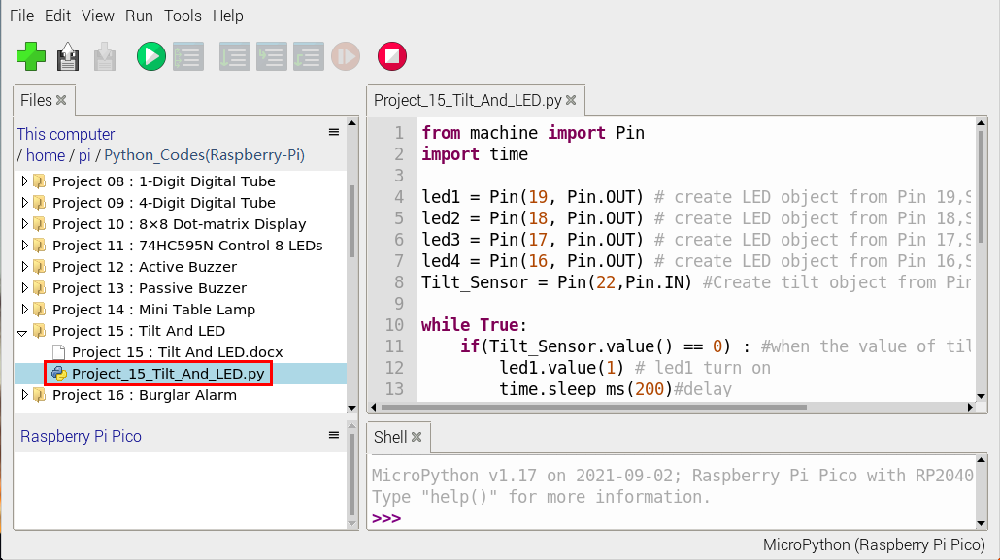

```Python
from machine import Pin
import time

led1 = Pin(19, Pin.OUT) # create LED object from Pin 19,Set Pin 19 to output
led2 = Pin(18, Pin.OUT) # create LED object from Pin 18,Set Pin 18 to output
led3 = Pin(17, Pin.OUT) # create LED object from Pin 17,Set Pin 17 to output
led4 = Pin(16, Pin.OUT) # create LED object from Pin 16,Set Pin 16 to output
Tilt_Sensor = Pin(22,Pin.IN) #Create tilt object from Pin22,Set GP22 to input

while True:
    if(Tilt_Sensor.value() == 0) : #when the value of tilt sensor is 0
        led1.value(1) # led1 turn on
        time.sleep_ms(200)#delay
        led2.value(1) # led2 turn on
        time.sleep_ms(200)#delay
        led3.value(1) # led3 turn on
        time.sleep_ms(200)#delay
        led4.value(1) # led4 turn on
        time.sleep_ms(200)#delay 
    else :           #when the value of tilt sensor is 1
        led4.value(0) # led4 turn off
        time.sleep_ms(200)#delay
        led3.value(0) # led3 turn off
        time.sleep_ms(200)#delay
        led2.value(0) # led2 turn off
        time.sleep_ms(200)#delay
        led1.value(0) # led1 turn off
        time.sleep_ms(200)#delay
```

6.**Test Result**
    
Ensure that the Raspberry Pi Pico is connected to the computer，click“Stop/Restart backend”.

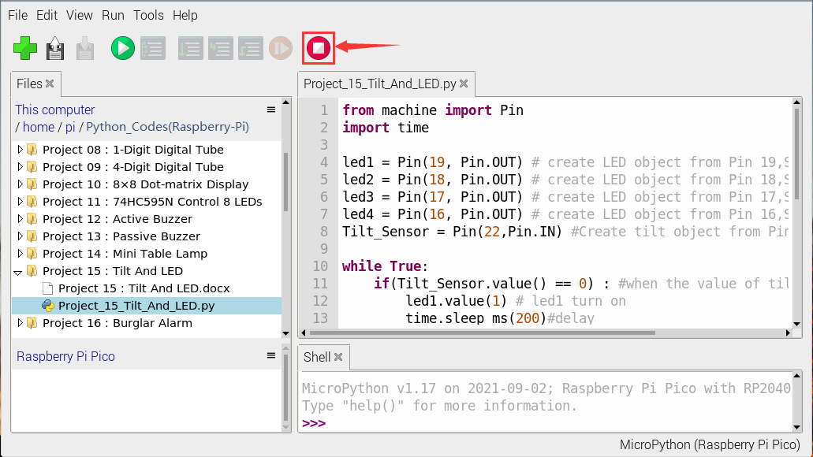

Click“Run current script”, the code starts executing, we will see that when you tilt the breadboard to an angle, the LEDs will light up one by one. When you turn the breadboard to the original angle, the LEDs will turn off one by one. Like the hourglass, the sand will leak out over time.

Click“Stop/Restart backend”to exit the program.

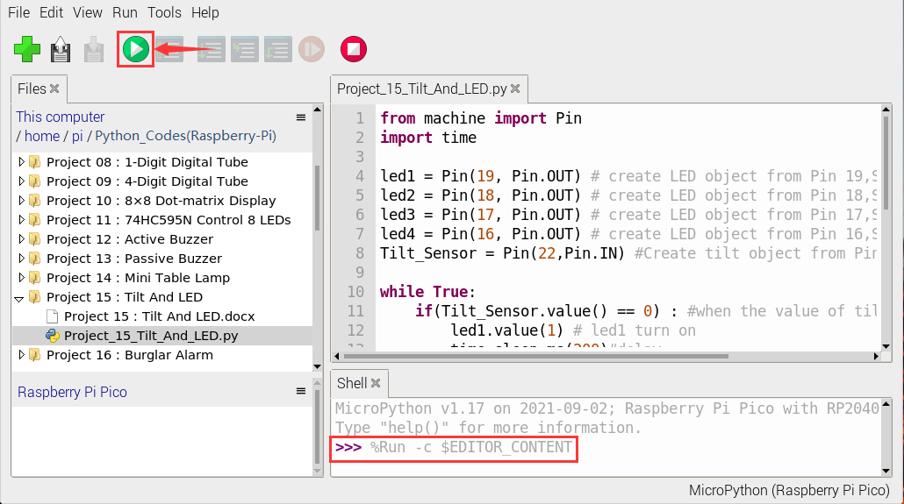


### Project 16：Burglar Alarm

1.**Introduction**

PIR motion sensor measures the thermal infrared (IR) light emitted by moving objects. The sensor can detect the movement of people, animals, and cars to trigger safety alarms and lighting. They are used to detect movement and ideal for security such as burglar alarms and security lighting systems. In this project, we will use a Raspberry Pi Pico to control PIR motion sensor, buzzers and LEDs to simulate burglar alarms.


2.**Components Required**

<table>
<tbody>
<tr class="odd">
<td>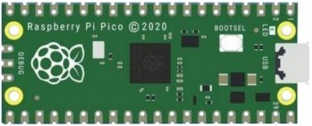</td>
<td></td>
<td>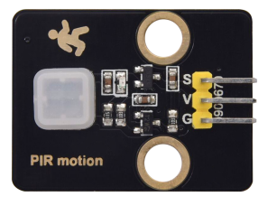</td>
<td></td>
<td></td>
</tr>
<tr class="even">
<td>Raspberry Pi Pico*1</td>
<td>Raspberry Pi Pico Expansion Board*1</td>
<td>PIR Motion Sensor*1</td>
<td>Active Buzzer*1</td>
<td>Red LED*1</td>
</tr>
<tr class="odd">
<td></td>
<td>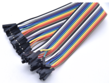</td>
<td></td>
<td></td>
<td></td>
</tr>
<tr class="even">
<td>Breadboard*1</td>
<td>F-F Dupont Wires</td>
<td>220ΩResistor*1</td>
<td>USB Cable*1</td>
<td>Jumper Wires</td>
</tr>
</tbody>
</table>

3.**Component Knowledge**

**PIR motion sensor:** The principle is that when certain crystals, such as lithium tantalate and triglyceride sulfate, are heated, the two ends of the crystal will generate an equal number of charges with opposite signs. These charges can be converted into voltage output by an amplifier. And the human body will release infrared light, although relatively weak, but still can be detected. When the PIR motion sensor detects the movement of a nearby person, the sensor signal terminal outputs a high level 1. 

Otherwise, it outputs a low level 0. Pay special attention that this sensor can detect people, animals and cars in motion. People, animals and cars at rest cannot be detected. The maximum detection distance is about 7 meters.

**Note:** Since vulnerable to radio frequency radiation and temperature changes, the PIR motion sensor should be kept away from heat sources like radiators, heaters and air conditioners, as well as direct irradiation of sunlight, headlights and incandescent light.

**Features:**

Maximum input voltage: DC 3.3 \~ 5V

Maximum operating current: 50MA

Maximum power: 0.3W

Operating temperature: -20 \~ 85℃

Output high level is 3V, low level is 0V.

Delay time: about 2.3 to 3 seconds

Detection Angle: about 100 degrees

Maximum detection distance: about 7 meters

Indicator light output (when the output is high, it will light up)

Pin limiting current: 50MA

**Schematic diagram:**


4.**Circuit Diagram and Wiring Diagram**

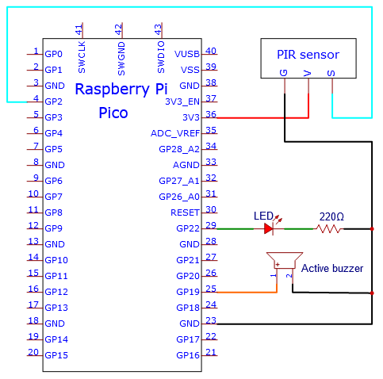


**5.Test Code**

Check the code in the folder "**...\6.Codes\Python_Codes(Raspberry-Pi)**".

You can move the code anywhere. For example, We copy the **Python_Codes(Raspberry-Pi).zip** to the <span style="color: rgb(255, 76, 65);">pi</span> folder of the Raspberry Pi system.

<span style="color: rgb(255, 76, 65);">Path: home/pi/Python_Codes(Raspberry-Pi)</span>

<br>
<br>


Open“Thonny”, click“This computer”→“home”→“pi”→“Python_Codes(Raspberry-Pi)”→”Project 16：Burglar Alarm”. And double-click the“Project\_16\_Burglar\_Alarm.py”.

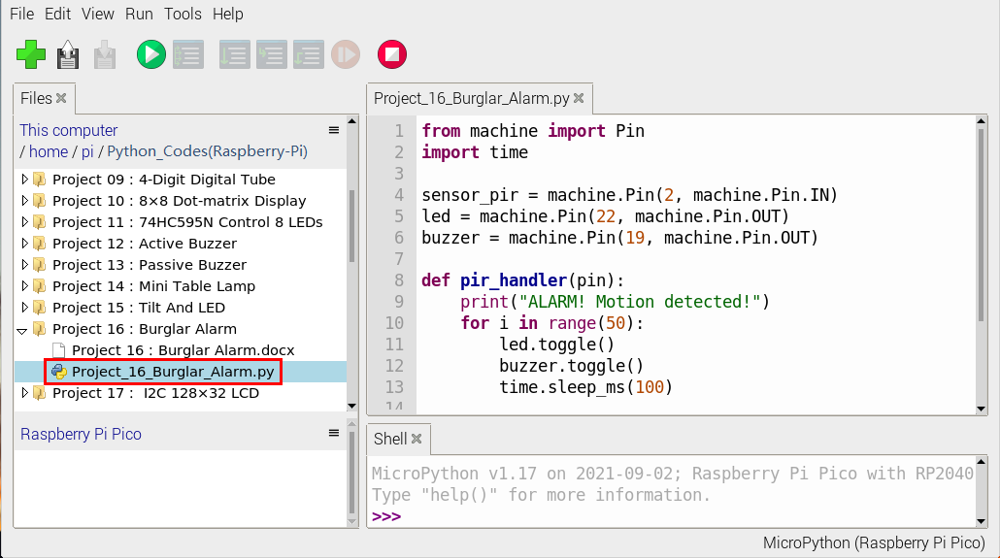

```Python
from machine import Pin
import time

sensor_pir = machine.Pin(2, machine.Pin.IN)
led = machine.Pin(22, machine.Pin.OUT)
buzzer = machine.Pin(19, machine.Pin.OUT)

def pir_handler(pin): 
    print("ALARM! Motion detected!") 
    for i in range(50): 
        led.toggle() 
        buzzer.toggle() 
        time.sleep_ms(100)

sensor_pir.irq(trigger=machine.Pin.IRQ_RISING, handler=pir_handler)

while True: 
    led.toggle() 
    time.sleep(5)
```

6.**Test Result**
    
Ensure that the Raspberry Pi Pico is connected to the computer，click“Stop/Restart backend”.

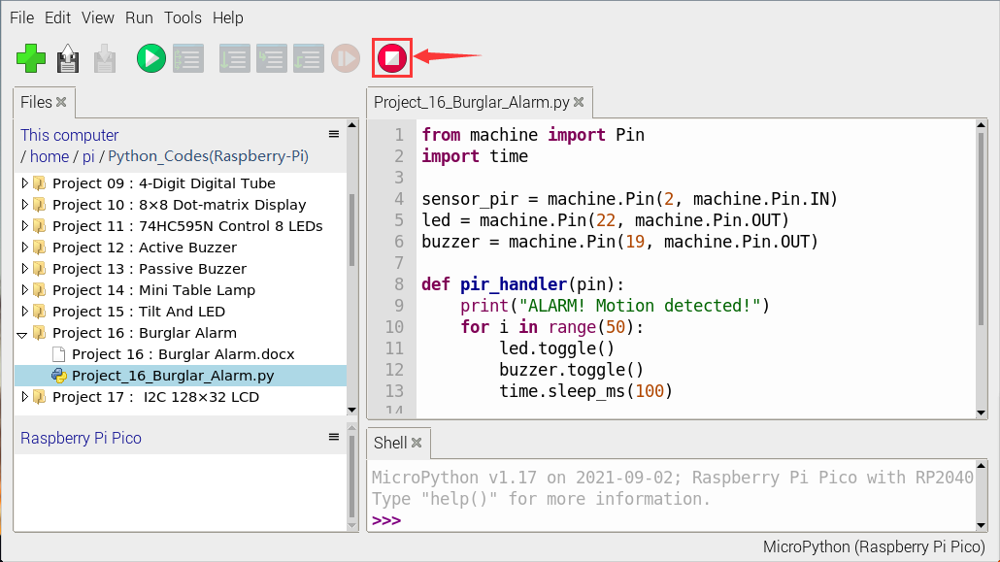

Click “Run current script”, the code starts executing, we will see that If the PIR motion sensor detects someone nearby, the buzzer will give an alarm and the LEDs will flash continuously. At the same time, the "Shell" window of the Thonny IDE will print the string "ALARM\! Motion detected\!" .

Click“Stop/Restart backend”to exit the program.

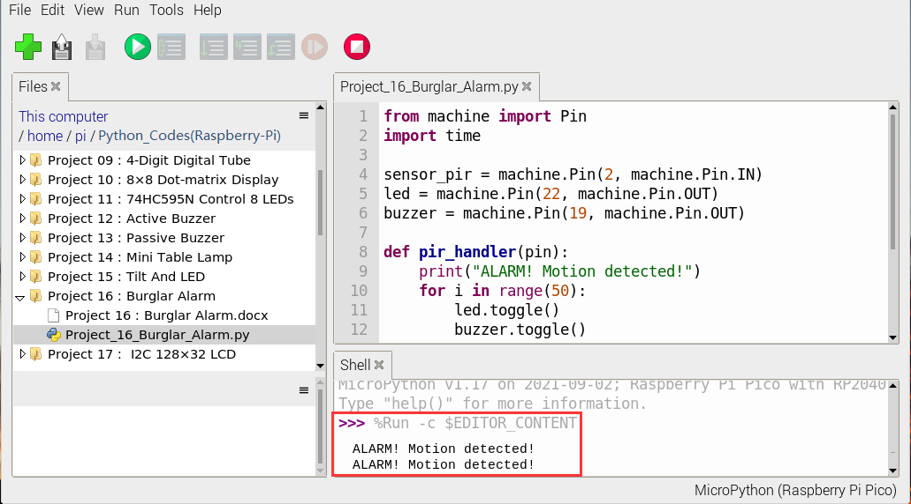


### Project 17： I2C 128×32 LCD

1.**Introduction**
    
We can use modules such as monitors to do various experiments in life. You can also DIY a variety of small objects. For example, you can make a temperature meter with a temperature sensor and display, or make a distance meter with an ultrasonic module and display.
    
In this project, we will use the LCD\_128X32\_DOT module as a display and connect it to a Raspberry Pi Pico, which will be used to control the LCD\_128X32\_DOT display to show various English characters, common symbols and numbers.
    
2.**Components Required**

<table>
<tbody>
<tr class="odd">
<td></td>
<td></td>
<td>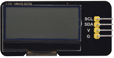</td>
<td>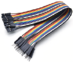</td>
<td></td>
</tr>
<tr class="even">
<td>Raspberry Pi Pico*1</td>
<td>Raspberry Pi Pico Expansion Board*1</td>
<td>LCD_128X32_DOT*1</td>
<td>10CM M-F Dupont Wires</td>
<td>USB Cable*1</td>
</tr>
</tbody>
</table>

3.**Component Knowledge**
    


**LCD\_128X32\_DOT:** It is an LCD module with 128\*32 pixels and its driver chip is ST7567A. The module uses the IIC communication mode, while the code contains a library of all alphabets and common symbols that can be called directly. When using, we can also set it in the code so that the English letters and symbols show different text sizes. To make it easy to set up the pattern display, we also provide a mold capture software that converts a specific pattern into control code and then copies it directly into the test code for use.

**Schematic diagram:**


**Features:**

Pixel：128\*32 character

Operating voltage(chip)：4.5V to 5.5V

Operating current：100mA (5.0V)

Optimal operating voltage(module):5.0V

4.**Circuit Diagram and Wiring Diagram**
    
Note: The LCD\_128X32\_DOT must be connected with 10CM M-F Dupont wires, which can make the LCD\_128X32\_DOT display normally. Otherwise, using 20CM M-F Dupont wires may cause the LCD\_128X32\_DOT display abnormally.  


5.**Test Code**

Check the code in the folder "**...\6.Codes\Python_Codes(Raspberry-Pi)**".

You can move the code anywhere. For example, We copy the **Python_Codes(Raspberry-Pi).zip** to the <span style="color: rgb(255, 76, 65);">pi</span> folder of the Raspberry Pi system.

<span style="color: rgb(255, 76, 65);">Path: home/pi/Python_Codes(Raspberry-Pi)</span>

<br>
<br>


Open“Thonny”, click“This computer”→“home”→“pi”→“Python_Codes(Raspberry-Pi)”→“Project 17： I2C 128×32 LCD”. Select “lcd128\_32.py”and“lcd128\_32\_fonts.py”，right-click and select“**Upload to /**”，wait for the“lcd128\_32.py”and the “lcd128\_32\_fonts.py”to be uploaded to the Raspberry Pi Pico. And double--click the“Project\_17\_I2C\_128\_32\_LCD.py”.

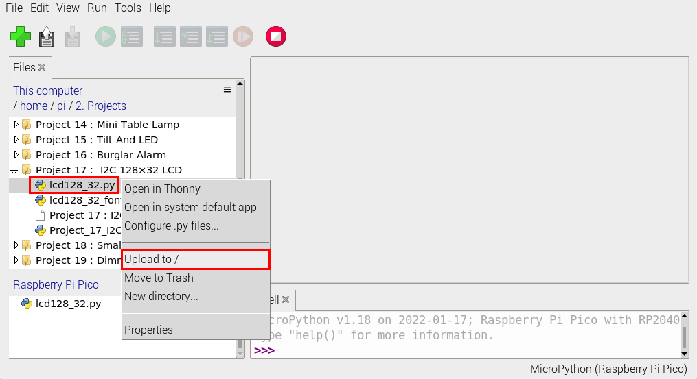

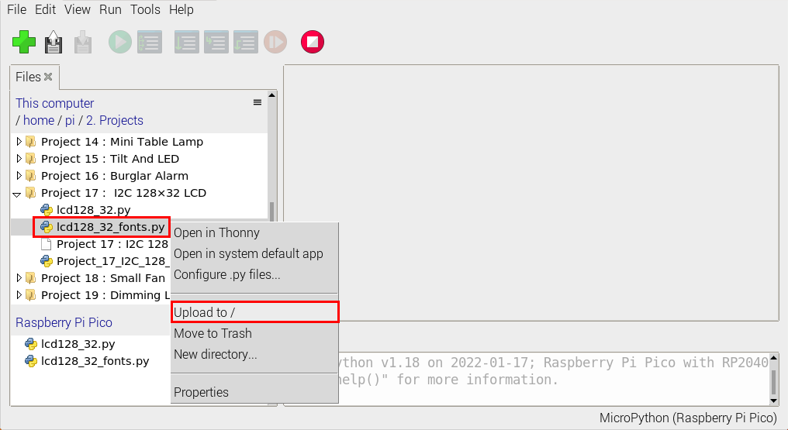

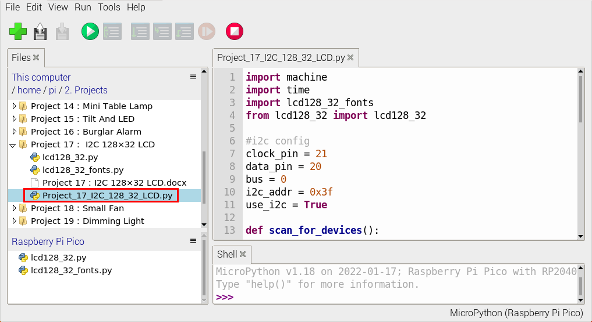

```Python
import machine
import time
import lcd128_32_fonts
from lcd128_32 import lcd128_32

#i2c config
clock_pin = 21
data_pin = 20
bus = 0
i2c_addr = 0x3f
use_i2c = True

def scan_for_devices():
    i2c = machine.I2C(bus,sda=machine.Pin(data_pin),scl=machine.Pin(clock_pin))
    devices = i2c.scan()
    if devices:
        for d in devices:
            print(hex(d))
    else:
        print('no i2c devices')
```

6.**Test Result**
    
Ensure that the Raspberry Pi Pico is connected to the computer，click“Stop/Restart backend”.

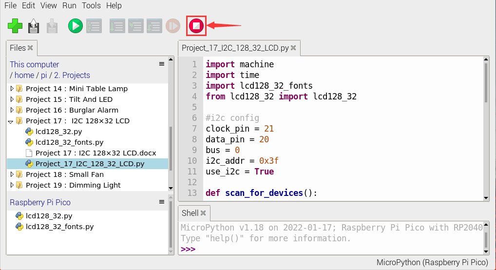

Click “Run current script”, the code starts executing, we will see that the LCD module display will show "KEYESTUDIO" at the first line. "ABCDEFGHIJKLMNOPQR" will be displayed at the second line. "123456789 + - \* / \<\> = $ @ " will be shown at the third line and "% ^ & () {} :; '|?,. \~ \\\\ \[\] " will be displayed at the fourth line. 

Press“Ctrl+C”or click“Stop/Restart backend”to exit the program.

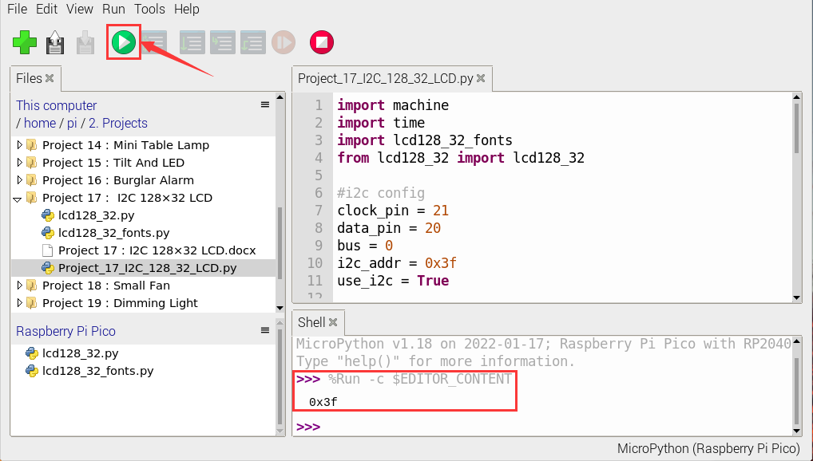


### Project 18：Small Fan

1.**Introduction**

In the hot summer, we need an electric fan to cool us down, so in this project, we will use a Raspberry Pi Pico to control 130 motor module and small blade to make a small fan.

2.**Components Required**

<table>
<tbody>
<tr class="odd">
<td></td>
<td></td>
<td></td>
</tr>
<tr class="even">
<td>Raspberry Pi Pico*1</td>
<td>Raspberry Pi Pico Expansion Board*1</td>
<td>USB Cable*1</td>
</tr>
<tr class="odd">
<td>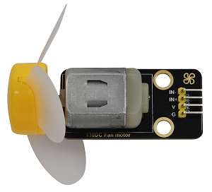</td>
<td>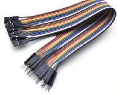</td>
<td></td>
</tr>
<tr class="even">
<td>130 Motor Module*1</td>
<td>M-F Dupont Wires</td>
<td></td>
</tr>
</tbody>
</table>

3.**Component Knowledge**


130 motor module: The motor control module uses the HR1124S motor control chip, which is a single-channel H-bridge driver chip for DC motor. The H-bridge driving part of the HR1124S features low on-resistance PMOS and NMOS power tube. The low on-resistance ensures low power loss of the chip, making the chip work safely for a longer time. In addition, HR1124S has low standby current and low quiescent current, which makes HR1124S easy to be used in toy scheme.

Features:

Working voltage: 5V

Working current: 200MA

Working power: 2W

Working temperature: -10℃\~ +50℃

**Schematic diagram:**


4.**Circuit Diagram and Wiring Diagram**

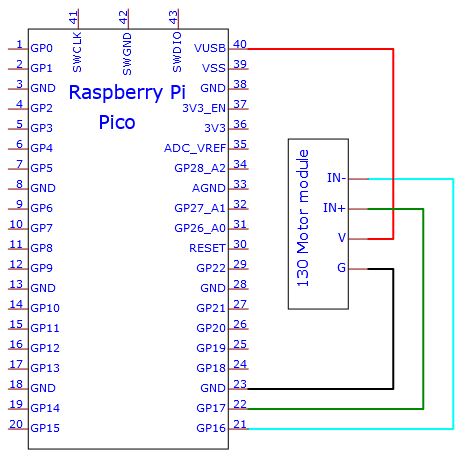

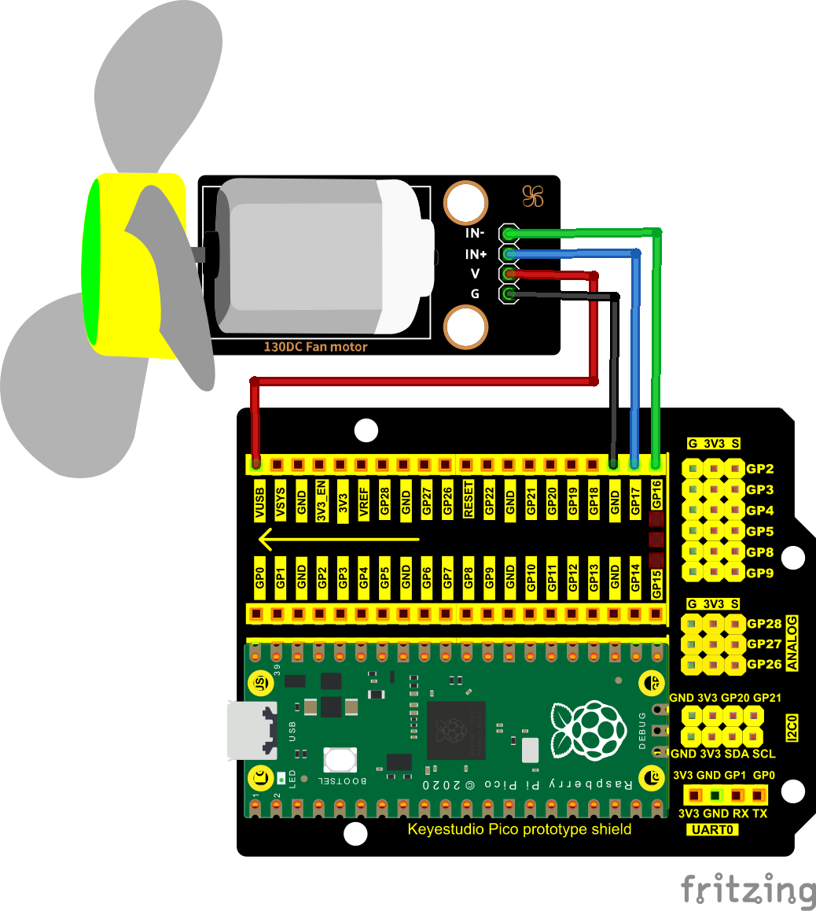

5.**Test Code**

Check the code in the folder "**...\6.Codes\Python_Codes(Raspberry-Pi)**".

You can move the code anywhere. For example, We copy the **Python_Codes(Raspberry-Pi).zip** to the <span style="color: rgb(255, 76, 65);">pi</span> folder of the Raspberry Pi system.

<span style="color: rgb(255, 76, 65);">Path: home/pi/Python_Codes(Raspberry-Pi)</span>

<br>
<br>


Open“Thonny”, click“This computer”→“home”→“pi”→“Python_Codes(Raspberry-Pi)”→“Project 18: Small Fan”. And double-click the“Project\_18\_ Small\_Fan.py”.

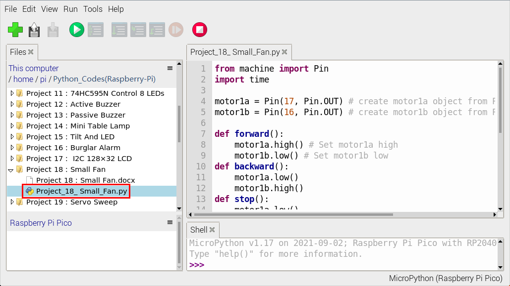

```Python
from machine import Pin
import time

motor1a = Pin(17, Pin.OUT) # create motor1a object from Pin 17, Set Pin 17 to output
motor1b = Pin(16, Pin.OUT) # create motor1b object from Pin 16, Set Pin 16 to output

def forward():
    motor1a.high() # Set motor1a high
    motor1b.low() # Set motor1b low
def backward():
    motor1a.low()
    motor1b.high()
def stop():
    motor1a.low()
    motor1b.low()

def test():
    forward() # motor forward
    time.sleep(5) #delay
    stop() # motor stop
    time.sleep(2)
    backward()# motor backward 
    time.sleep(5)
    stop()
    time.sleep(2)
    
for i in range(5):
    test() 
```

6.**Test Result**
    
Ensure that the Raspberry Pi Pico is connected to the computer，click“Stop/Restart backend”.

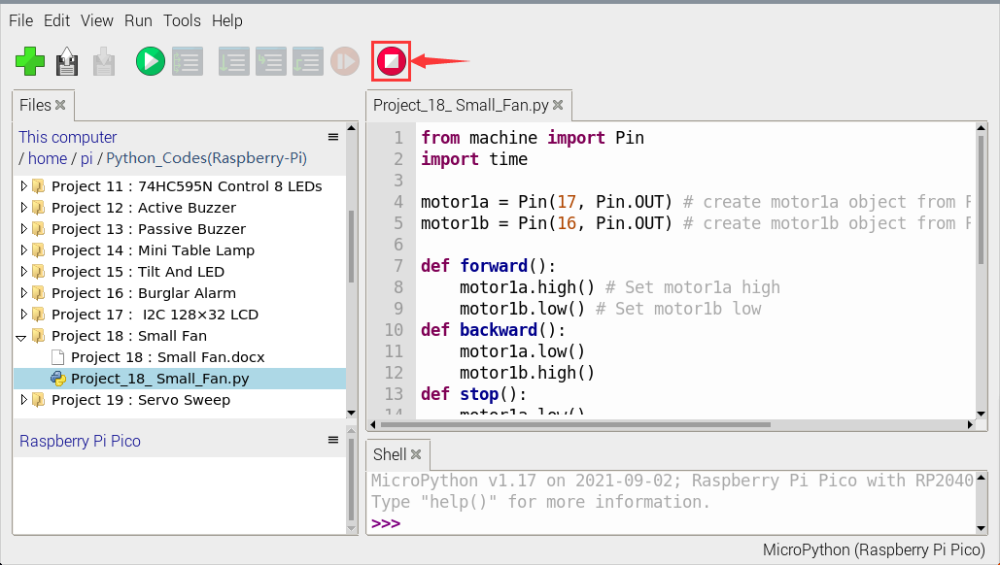

Click “Run current script”, the code starts executing, we will see that The small fan turns counterclockwise for 5 seconds and stops for 2 seconds, and then turns clockwise for 5 seconds and stops for 2 seconds. Repeat this rule for 5 times and then the small fan stops. Click“Stop/Restart backend”to exit the program.

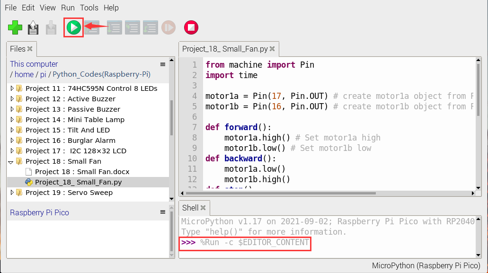


### Project 19：Servo Sweep

1.**Introduction**

Servo is a kind of motor that can rotate very precisely. It has been widely used in toy cars, RC helicopters, airplanes, robots, etc. In this project, we will use a Raspberry Pi Pico to control the rotation of the servo.

2.**Components Required**

<table>
<tbody>
<tr class="odd">
<td></td>
<td></td>
<td></td>
</tr>
<tr class="even">
<td>Raspberry Pi Pico*1</td>
<td>Raspberry Pi Pico Expansion Board*1</td>
<td>USB Cable*1</td>
</tr>
<tr class="odd">
<td>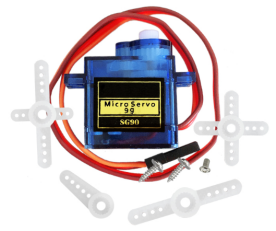</td>
<td></td>
<td></td>
</tr>
<tr class="even">
<td>Servo*1</td>
<td><p>Jumper</p>
<p>Wires</p></td>
<td></td>
</tr>
</tbody>
</table>

3.**Component Knowledge**

**Servo:**


The servo is a kind of position servo driver, which is mainly composed of housing, circuit board, coreless motor, gear and position detector. The working principle is that the receiver or microcontroller sends a signal to the servo, which has an internal reference circuit that generates a reference signal with a period of 20ms and a width of 1.5ms, and compares the DC bias voltage with the voltage of the potentiometer to output voltage difference. 

The IC on the circuit board determines the direction of rotation, and then drives the coreless motor to start rotation and transmits the power to the swing arm through the reduction gear, while the position detector sends back a signal to determine whether it has reached the positioning. It is suitable for those control systems that require constant change of angle and can be maintained. When the motor rotates at a certain speed, the potentiometer is driven by the cascade reduction gear to rotate so that the voltage difference is 0 and the motor stops rotating. The angle range of general servo rotation is 0 to 180 degrees.

The pulse period for controlling the servo is 20ms, the pulse width is 0.5ms to 2.5ms, and the corresponding position is -90° to +90°. The following is an example of a 180 degree servo.


Servo motors have many specifications, but they all have three connecting wires, which are brown, red, and orange (different brands may have different colors). The brown is GND, the red is the positive power supply, and the orange is the signal line.


4.**Wiring Diagram**
    
When supplying the servo, please note that the power supply voltage should be 3.3V-5V. Make sure there are no errors when connecting the servo to the power supply.

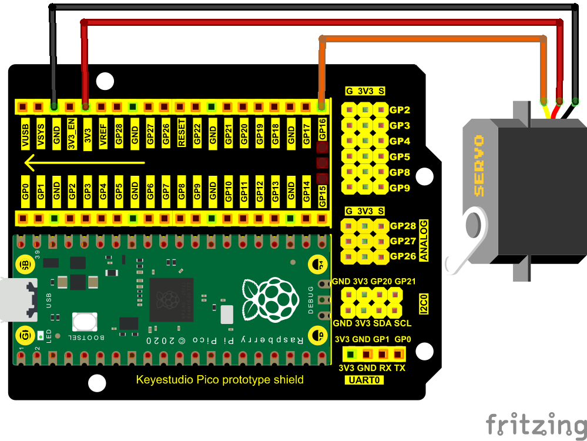

**5.Test Code**

Check the code in the folder "**...\6.Codes\Python_Codes(Raspberry-Pi)**".

You can move the code anywhere. For example, We copy the **Python_Codes(Raspberry-Pi).zip** to the <span style="color: rgb(255, 76, 65);">pi</span> folder of the Raspberry Pi system.

<span style="color: rgb(255, 76, 65);">Path: home/pi/Python_Codes(Raspberry-Pi)</span>

<br>
<br>


Open“Thonny”, click“This computer”→“home”→“pi”→“Python_Codes(Raspberry-Pi)”→“Project 19：Servo Sweep”. Select“myservo\.py”，right-click and select“**Upload to/**”, waiting for the“myservo\.py”to be uploaded to the Raspberry Pi Pico. And double-click the “Project\_19\_Servo\_Sweep.py”.

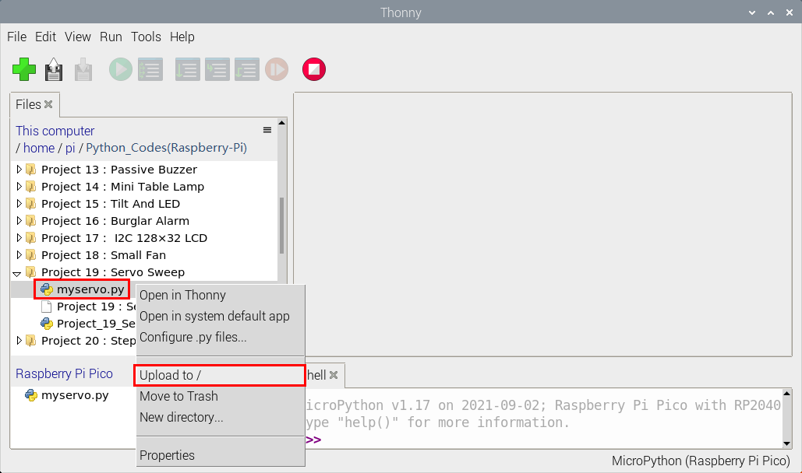

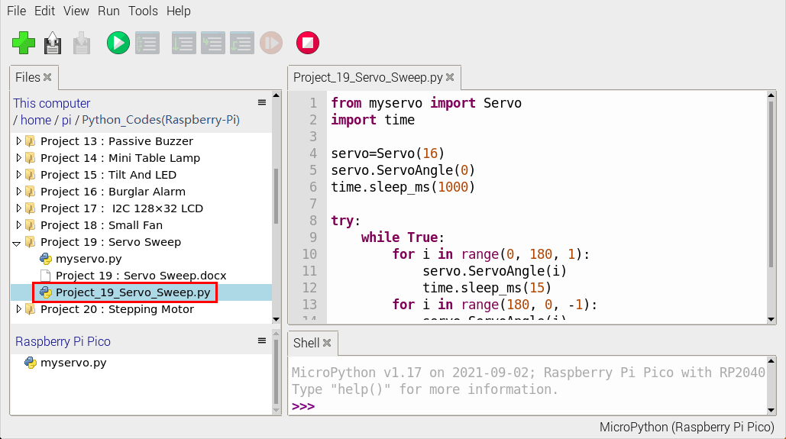

```Python
from myservo import Servo
import time

servo=Servo(16)
servo.ServoAngle(0)
time.sleep_ms(1000)

try:
    while True:       
        for i in range(0, 180, 1):
            servo.ServoAngle(i)
            time.sleep_ms(15)
        for i in range(180, 0, -1):
            servo.ServoAngle(i)
            time.sleep_ms(15)        
except:
    servo.deinit()
```

6.**Test Result**
    
Ensure that the Raspberry Pi Pico is connected to the computer，click“Stop/Restart backend”.

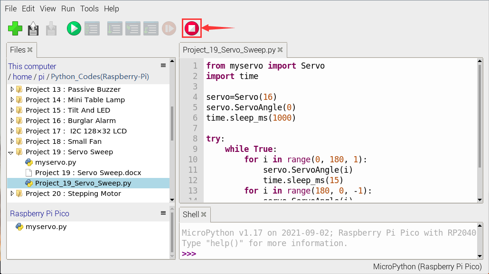

Click “Run current script”, the code starts executing, we will see that the servo will rotate from 0° to 180°, then reverse direction to rotate from 180° to 0°in a loop. Press“Ctrl+C”or click“Stop/Restart backend”to exit the program.

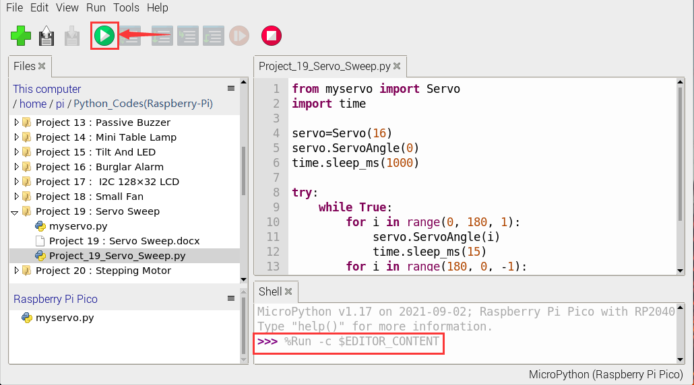


### Project 20：Stepping Motor

1.**Introduction**

Stepping motors are accurately positioned and are the most important components in industrial robots, 3D printers, large lathes, and other mechanical devices. In this project, we will use a Raspberry Pi Pico to control the ULN2003 stepper motor drive board to make the motors rotate.

2.**Components Required**

<table>
<tbody>
<tr class="odd">
<td>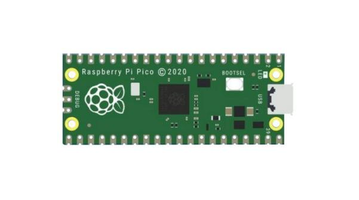</td>
<td>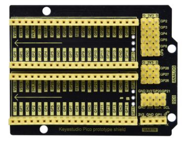</td>
<td>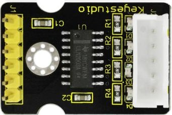</td>
</tr>
<tr class="even">
<td>Raspberry Pi Pico*1</td>
<td>Raspberry Pi Pico Expansion Board*1</td>
<td>ULN2003 Stepper Motor Drive Board*1</td>
</tr>
<tr class="odd">
<td></td>
<td></td>
<td></td>
</tr>
<tr class="even">
<td>Stepper Motor *1</td>
<td>M-F Dupont Wires</td>
<td>USB Cable*1</td>
</tr>
</tbody>
</table>

3.**Component Knowledge**
    


**Stepper motor:** It is a motor controlled by a series of electromagnetic coils. It can rotate by the exact number of degrees (or steps) needed, allowing you to move it to a precise position and keep it there. It does this by supplying power to the coil inside the motor in a very short time, but you must always supply power to the motor to keep it in the position you want. There are two basic types of stepping motors, namely unipolar stepping motor and bipolar stepping motor. In this project, we use a 28-BYJ48 unipolar stepper motor.

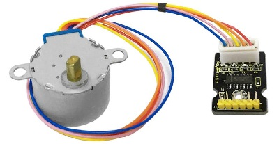

**Working Principle:**

The stepper motor is mainly composed of a stator and a rotor. The stator is fixed. As shown in the figure below, the part of the coil group A, B, C, and D will generate a magnetic field when the coil group is energized. The rotor is the rotating part. As follows, the middle part of the stator, two poles are permanent magnets.


Single -phase four beat: At the beginning, the coils of group A are turned on, and the poles of the rotor point at A coil. Next, the group A coil are disconnected, and the group B coils are turned on. The rotor will turn clockwise to the group B. Then, group B is disconnected, group C is turned on, and the rotor is turned to group C. After that, group C is disconnected, and group D is turned on, and the rotor is turned to group D. Finally, group D is disconnected, group A is turned on, and the rotor is turned to group A coils. Therefore, rotor turns 180° and continuously rotates B-C-D-A, which means it runs a circle (eight phase). As shown below, he rotation principle of stepper motor is A - B C - D - A.

You make order inverse(D - C - B - A - D .....) if you want to make stepper motor rotate anticlockwise.


Half-phase and eight beat: 8 beat adopts single and dual beat way，A - AB B - BC - C - CD - D - DA - A ...... ，rotor will rotate half phase in this order. For example, when A coil is electrified，rotor faces to A coil , then A and B coil are connected, on this condition, the strongest magnetic field produced lies in the central part of AB coil, which means rotating half-phase clockwise.

**Stepper Motor Parameters:**

The rotor rotates one circle when the stepper motor we provide rotates 32 phases and with the output shaft driven by 1:64 reduction geared set. Therefore the rotation (a circle) of output shaft requires 32 \* 64 = 2048 phases.

The step angle of 4-beat mode of 5V and 4-phase stepper motor is 11.25. And the step angle of 8-beat mode is 5.625, the reduction ratio is 1:64.

**ULN2003Stepper Motor Drive Board:** It is a stepper motor driver, which converts the weak signal into a stronger control signal to drive the stepper motor. 

The following schematic diagram shows how to use the ULN2003 stepper motor driver board interface to connect a unipolar stepper motor to the pins of the Raspberry Pi Pico, and shows how to use four TIP120 interfaces.


4.**Schematic Diagram and Wiring Diagram:**
    


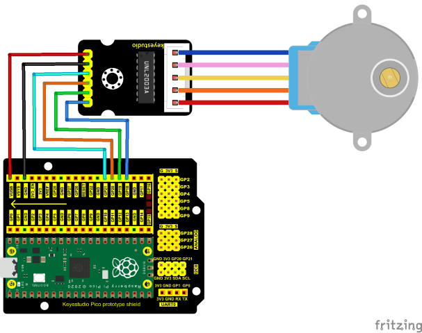

**5.Test Code**

Check the code in the folder "**...\6.Codes\Python_Codes(Raspberry-Pi)**".

You can move the code anywhere. For example, We copy the **Python_Codes(Raspberry-Pi).zip** to the <span style="color: rgb(255, 76, 65);">pi</span> folder of the Raspberry Pi system.

<span style="color: rgb(255, 76, 65);">Path: home/pi/Python_Codes(Raspberry-Pi)</span>

<br>
<br>


Open“Thonny”, click“This computer”→“home”→“pi”→“Python_Codes(Raspberry-Pi)”→”Project 20：Stepping Motor”. And double-click the “Project\_20\_Stepping\_Motor.py”.

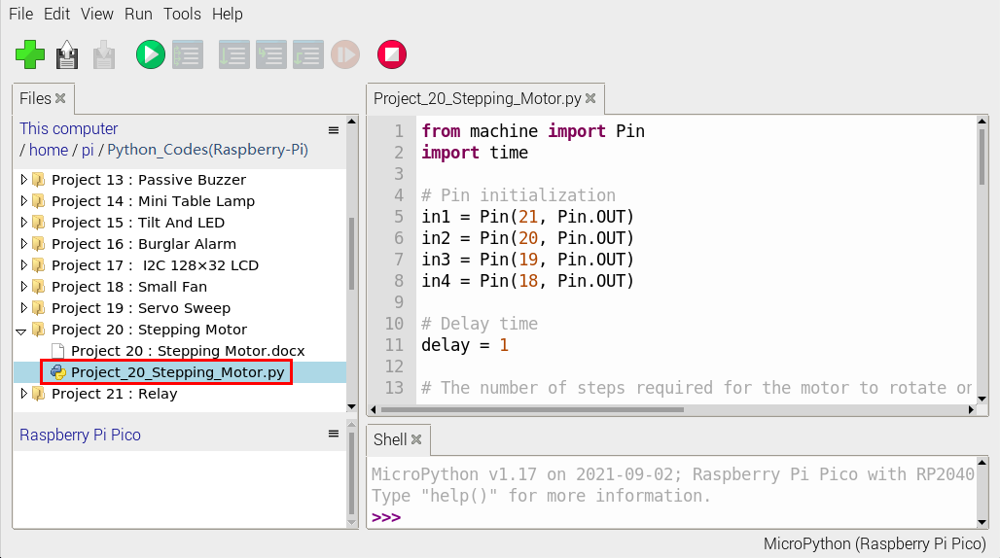

```Python
from machine import Pin
import time
 
# Pin initialization
in1 = Pin(21, Pin.OUT)
in2 = Pin(20, Pin.OUT)
in3 = Pin(19, Pin.OUT)
in4 = Pin(18, Pin.OUT)
 
# Delay time
delay = 1
 
# The number of steps required for the motor to rotate one revolution, (about 360°), with a slight deviation
ROUND_VALUE = 509
 
# The sequence value of the four-phase eight-beat stepper motor: A-AB-B-BC-C-CD-D-DA-A。
STEP_VALUE = [
    [1, 0, 0, 0],
    [1, 1, 0, 0],
    [0, 1, 0, 0],
    [0, 1, 1, 0],
    [0, 0, 1, 0],
    [0, 0, 1, 1],
    [0, 0, 0, 1],
    [1, 0, 0, 1],
]
 
# Pin output low level
def reset():
    in1(0)
    in2(0)
    in3(0)
    in4(0)
 
# If count is positive integers turn clockwise, if count is negative integers turn counterclockwise
def step_run(count):
    direction = 1     # turn clockwise
    if count < 0:
        direction = -1  # turn counterclockwise
        count = -count
    for x in range(count):
        for bit in STEP_VALUE[::direction]:
            in1(bit[0])
            in2(bit[1])
            in3(bit[2])
            in4(bit[3])
            time.sleep_ms(delay)
    reset()
 
# If a is positive integers turn clockwise, if a is negative integers turn counterclockwise
def step_angle(a):
    step_run(int(ROUND_VALUE * a / 360))
 
# Cycle: turn clockwise one circle, then counterclockwise one circle.
while True:
    step_run(509)
    step_run(-509)
    step_angle(360)
    step_angle(-360)
```

6.**Test Result**
    
Ensure that the Raspberry Pi Pico is connected to the computer，click“Stop/Restart backend”.

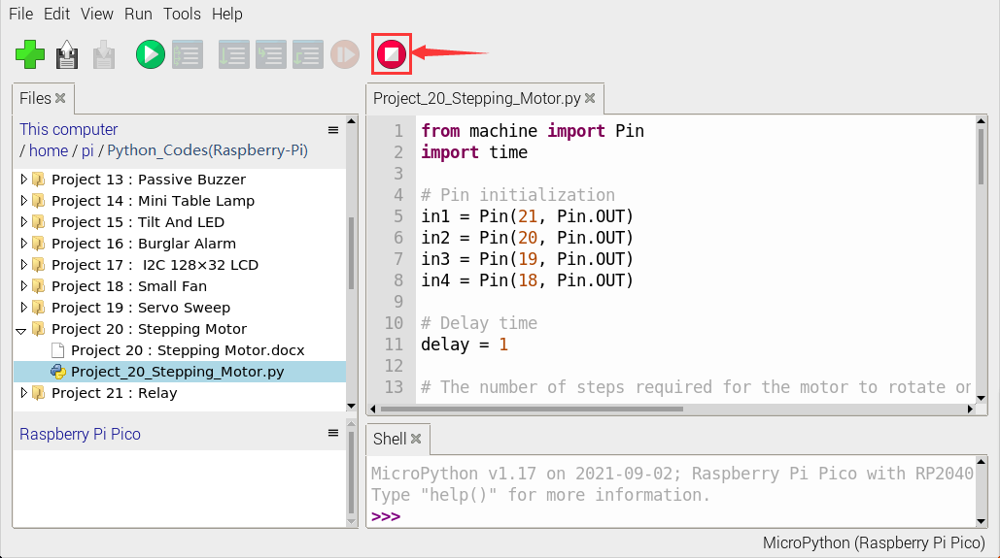

Click“Run current script”, the code starts executing, we will see that the four LEDS ( D1,D2,D3 ,D4) on the ULN2003 drive module will light up. The stepper motor rotates clockwise first, then counterclockwise, and keeps this state circulating.

Click“Stop/Restart backend”to exit the program.

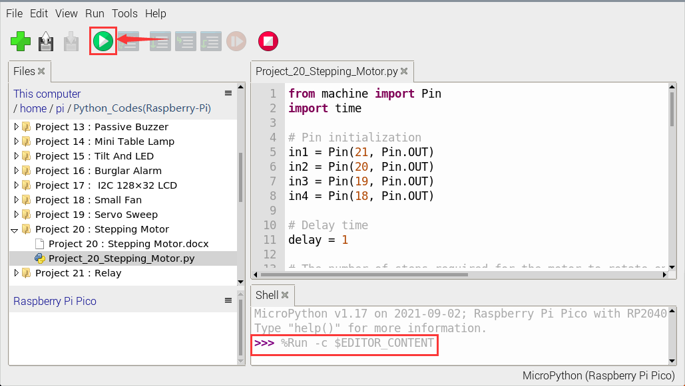


### Project 21：Relay

1.**Introduction**
    
In daily life, we generally use AC to drive electrical equipment, and sometimes we use switches to control electrical appliances. If the switch is directly connected to the AC circuit, once electricity leakage occurs, people are in danger. From a safety point of view, we specially designed this relay module with NO (normally open) and NC (normally closed) terminals. In this lesson we will learn a special and easy-to-use switch, which is the relay module.
    
2.**Components Required**

<table>
<tbody>
<tr class="odd">
<td>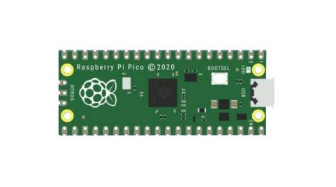</td>
<td>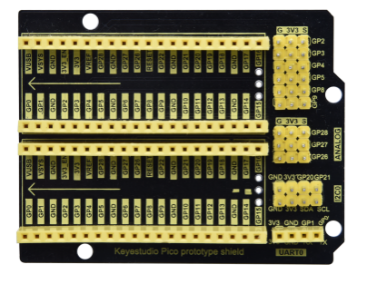</td>
<td>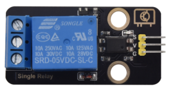</td>
<td>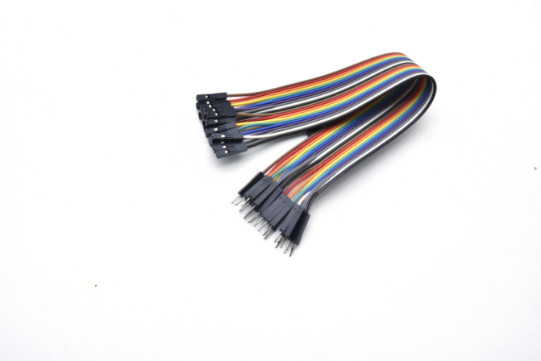</td>
<td></td>
</tr>
<tr class="even">
<td>Raspberry Pi Pico*1</td>
<td>Raspberry Pi Pico Expansion Board*1</td>
<td>Relay Module*1</td>
<td>M-F Dupont Wires</td>
<td>USB Cable*1</td>
</tr>
</tbody>
</table>

3.**Component Knowledge**
    
**Relay:** It is an "automatic switch" that uses a small current to control the operation of a large current.
    
Input voltage：3.3V-5V
    
Rated load：5A 250VAC (NO/NC) 5A 24VDC (NO/NC)
    
The rated load means that devices with dc voltage of 24V or AC voltage of 250V can be controlled using 3.3V-5V microcontrollers.  
    
**Schematic diagram of the Relay:**


4.**Wiring Diagram**


5.**Test Code**

Check the code in the folder "**...\6.Codes\Python_Codes(Raspberry-Pi)**".

You can move the code anywhere. For example, We copy the **Python_Codes(Raspberry-Pi).zip** to the <span style="color: rgb(255, 76, 65);">pi</span> folder of the Raspberry Pi system.

<span style="color: rgb(255, 76, 65);">Path: home/pi/Python_Codes(Raspberry-Pi)</span>

<br>
<br>


Open“Thonny”, click“This computer”→“home”→“pi”→“Python_Codes(Raspberry-Pi)”→“Project 21：Relay”. And double-click the“Project\_21\_Relay.py”.

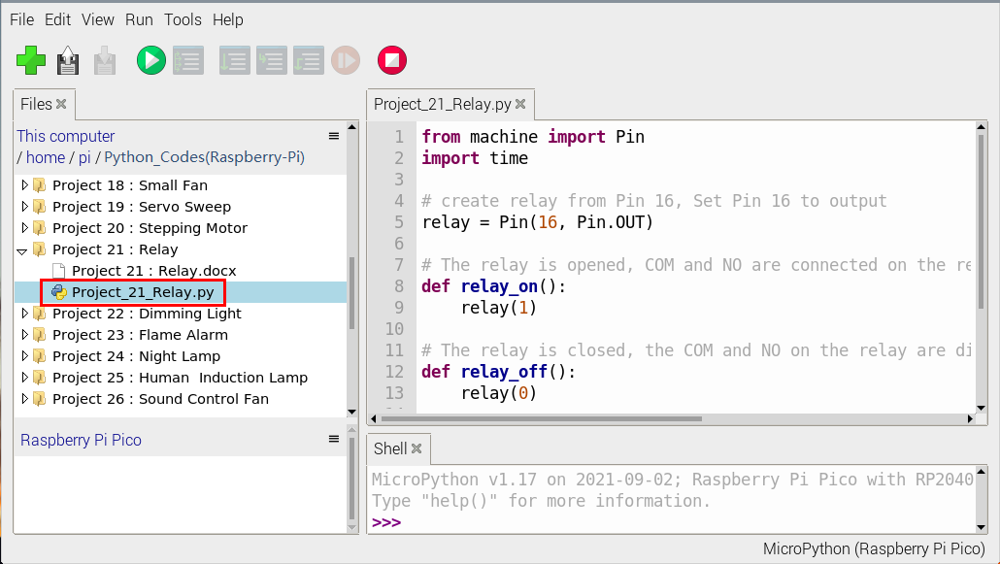

```Python
from machine import Pin
import time

# create relay from Pin 16, Set Pin 16 to output 
relay = Pin(16, Pin.OUT)
 
# The relay is opened, COM and NO are connected on the relay, and COM and NC are disconnected.
def relay_on():
    relay(1)
 
# The relay is closed, the COM and NO on the relay are disconnected, and the COM and NC are connected.
def relay_off():
    relay(0)
 
# Loop, the relay is on for one second and off for one second
while True:
    relay_on()
    time.sleep(1)
    relay_off()
    time.sleep(1)
```

6.**Test Result**
    
Ensure that the Raspberry Pi Pico is connected to the computer，click“Stop/Restart backend”.

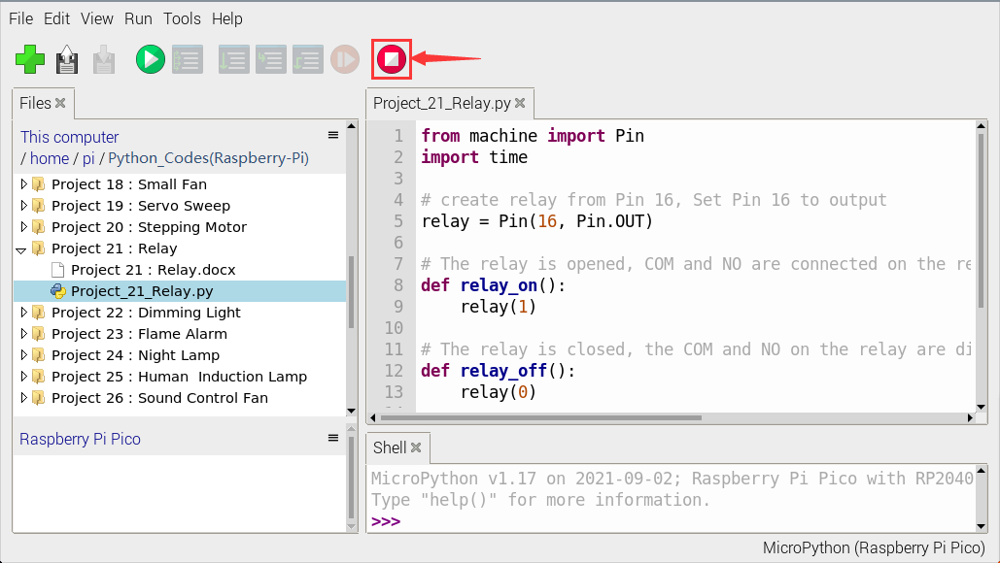

Click“Run current script”, the code starts executing, we will see that the relay will cycle on and off, on for 1 second, off for 1 second.  At the same time, you can hear the sound of the relay on and off, and you can also see the change of the indicator light on the relay. Press“Ctrl+C”or click“Stop/Restart backend”to exit the program.

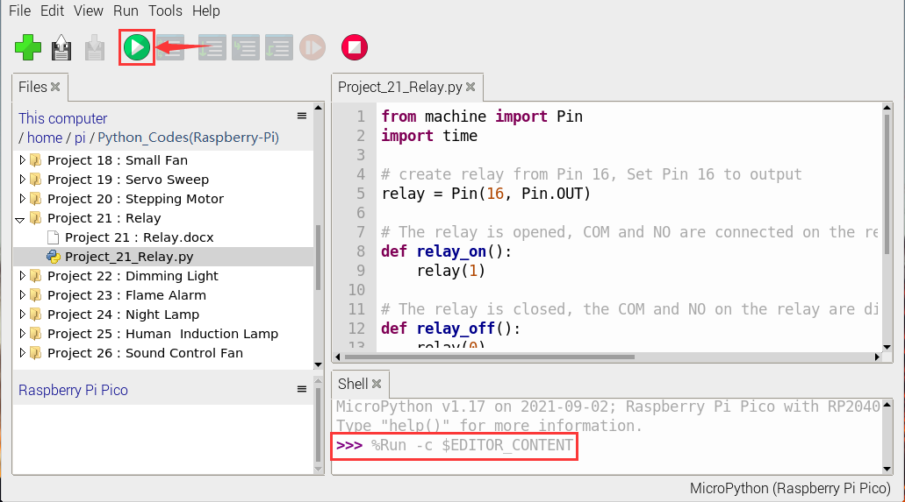


### Project 22 : Dimming Light

1.**Introduction**

A potentiometer is a three-terminal resistor with a sliding or rotating contact that forms an adjustable voltage divider. It works by varying the position of a sliding contact across a uniform resistance. In a potentiometer, the entire input voltage is applied across the whole length of the resistor, and the output voltage is the voltage drop between the fixed and sliding contact.

In this project, we are going to learn how to use Raspberry Pi Pico to read the values of the potentiometer, and make a dimming lamp with LEDs.

2.**Components Required**

<table>
<tbody>
<tr class="odd">
<td></td>
<td></td>
<td>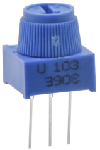</td>
<td></td>
</tr>
<tr class="even">
<td>Raspberry Pi Pico*1</td>
<td>Raspberry Pi Pico Expansion Board*1</td>
<td>Potentiometer*1</td>
<td>Red LED*1</td>
</tr>
<tr class="odd">
<td></td>
<td></td>
<td></td>
<td></td>
</tr>
<tr class="even">
<td>Breadboard*1</td>
<td>220ΩResistor*1</td>
<td>Jumper Wires</td>
<td>USB Cable*1</td>
</tr>
</tbody>
</table>

3.**Component Knowledge**
    


**Adjustable potentiometer:** It is a kind of resistor and an analog electronic component, which has two states of 0 and 1(high level and low level). The analog quantity is different, its data state presents a linear state such as 1 \~ 1024.

4.**Read the Potentiometer Value**
    
We connect the adjustable potentiometer to the analog IO of the Raspberry Pi Pico to read its value and voltage value . Please refer to the following wiring diagram for wiring.

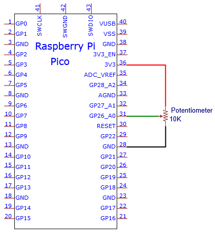

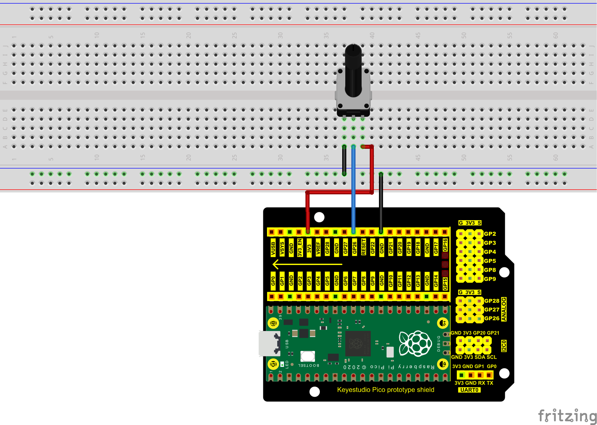

Check the code in the folder "**...\6.Codes\Python_Codes(Raspberry-Pi)**".

You can move the code anywhere. For example, We copy the **Python_Codes(Raspberry-Pi).zip** to the <span style="color: rgb(255, 76, 65);">pi</span> folder of the Raspberry Pi system.

<span style="color: rgb(255, 76, 65);">Path: home/pi/Python_Codes(Raspberry-Pi)</span>

<br>
<br>


Open“Thonny”, click“This computer”→“home”→“pi”→“Python_Codes(Raspberry-Pi)”→“Project 22：Dimming Light”. And double-click the “Project\_22.1\_Read\_Potentiometer\_Analog\_Value.py”.

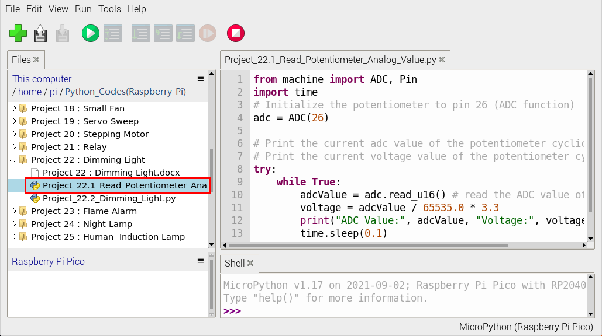

```Python
from machine import ADC, Pin
import time
# Initialize the potentiometer to pin 26 (ADC function)
adc = ADC(26)

# Print the current adc value of the potentiometer cyclically 
# Print the current voltage value of the potentiometer cyclically
try:
    while True:
        adcValue = adc.read_u16() # read the ADC value of potentiometer
        voltage = adcValue / 65535.0 * 3.3
        print("ADC Value:", adcValue, "Voltage:", voltage, "V")
        time.sleep(0.1)
except:
    pass
```

Ensure that the Raspberry Pi Pico is connected to the computer，click“Stop/Restart backend”.

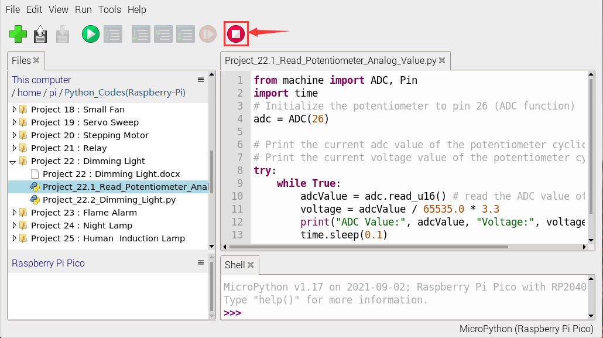

Click“Run current script”, the code starts executing, we will see that the "Shell" window of Thonny IDE will print the ADC value and voltage value of the potentiomete, turn the potentiometer handle, the ADC value and voltage value will change. Click“Stop/Restart backend”to exit the program.

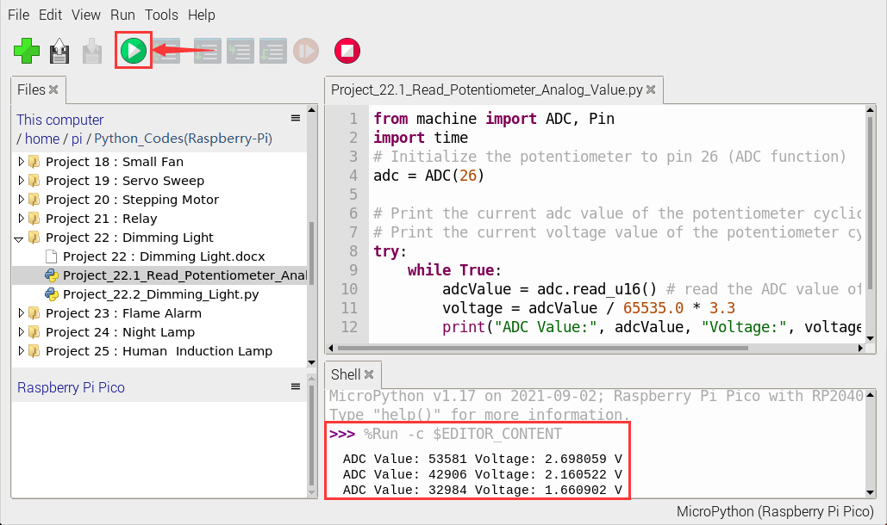


5.**Circuit Diagram and Wiring Diagram**

In the last step, we read the value of the potentiometer, and now we need to convert the value of the potentiometer into the brightness of the LED to make a lamp that can adjust the brightness. The wiring diagram is as follows:


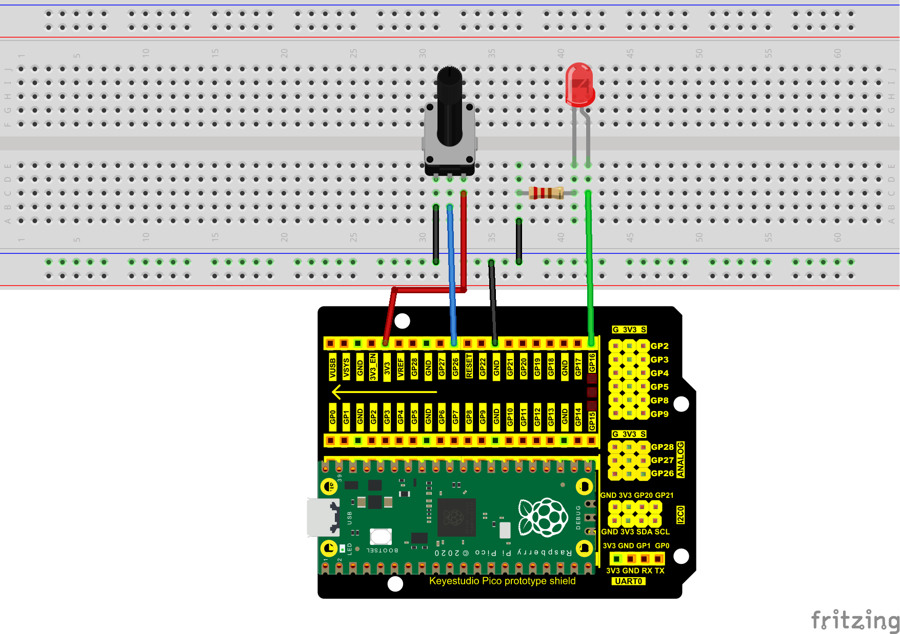

6.**Test Code**

Check the code in the folder "**...\6.Codes\Python_Codes(Raspberry-Pi)**".

You can move the code anywhere. For example, We copy the **Python_Codes(Raspberry-Pi).zip** to the <span style="color: rgb(255, 76, 65);">pi</span> folder of the Raspberry Pi system.

<span style="color: rgb(255, 76, 65);">Path: home/pi/Python_Codes(Raspberry-Pi)</span>

<br>
<br>


Open“Thonny”, click“This computer”→“home”→“pi”→“Python_Codes(Raspberry-Pi)”→“Project 22：Dimming Light”. And double left-click the “Project\_22.2\_Dimming\_Light.py”.

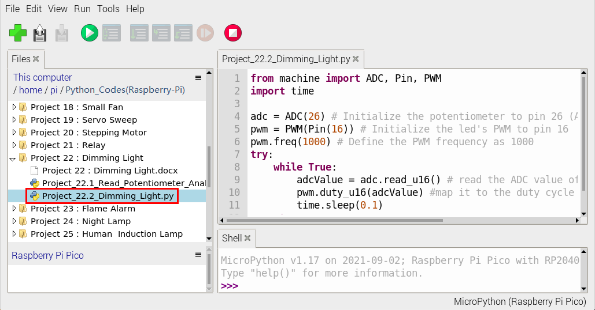

```Python
from machine import ADC, Pin, PWM
import time

adc = ADC(26) # Initialize the potentiometer to pin 26 (ADC function)
pwm = PWM(Pin(16)) # Initialize the led's PWM to pin 16
pwm.freq(1000) # Define the PWM frequency as 1000
try:
    while True:
        adcValue = adc.read_u16() # read the ADC value of potentiometer
        pwm.duty_u16(adcValue) #map it to the duty cycle of PWM to control led brightness 
        time.sleep(0.1)
except:
    pwm.deinit()
```

7.**Test Result**
    
Ensure that the Raspberry Pi Pico is connected to the computer，click“Stop/Restart backend”.

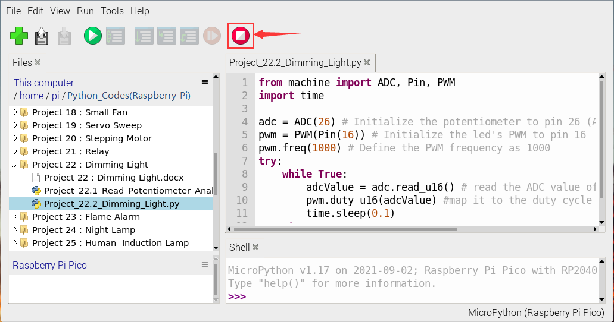

Click “Run current script”, the code starts executing, we will see that turn the potentiometer handle and the brightness of the LED will change accordingly.

Click“Stop/Restart backend”to exit the program.

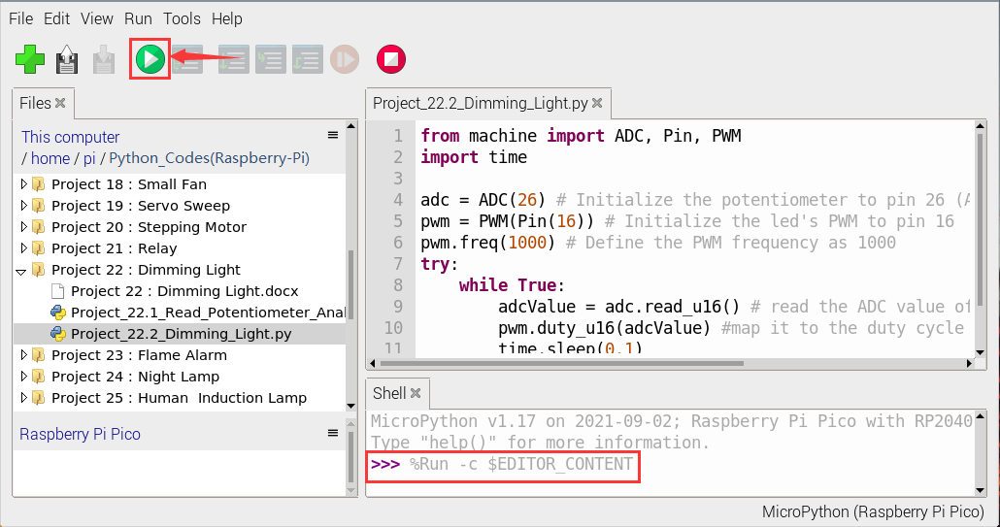


### Project 23：Flame Alarm

1.**Introduction**
    
Fire is a terrible thing and fire alarm systems are very useful in houses, commercial buildings and factories. In this project, we will use a Raspberry Pi Pico to control a flame sensor , a buzzer and LEDs to make fire alarm devices, which is a meaningful maker activity.
    
2.**Components Required**

<table>
<tbody>
<tr class="odd">
<td>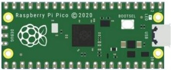</td>
<td></td>
<td>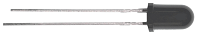</td>
<td></td>
<td></td>
</tr>
<tr class="even">
<td>Raspberry Pi Pico*1</td>
<td>Raspberry Pi Pico Expansion Board*1</td>
<td>Flame Sensor*1</td>
<td>Red LED*1</td>
<td>Active Buzzer*1</td>
</tr>
<tr class="odd">
<td></td>
<td></td>
<td>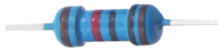</td>
<td></td>
<td></td>
</tr>
<tr class="even">
<td>Breadboard</td>
<td>220ΩResistor*1</td>
<td>10KΩResistor*1</td>
<td>Jumper Wires</td>
<td>USBCable*1</td>
</tr>
</tbody>
</table>

3.**Component Knowledge**
    


**Flame Sensor**：The flame emits a certain degree of IR light, which is invisible to the human eye, but our flame sensor can detect it and alert the microcontroller. If the Raspberry Pi Pico has detected a fire, it has a specially designed infrared receiver to detect the flame, and then convert the flame brightness into a fluctuating level signal. The short pin of the receiving triode is negative pole and the other long pin is positive pole. We should connect the short pin (negative pole) to 5V and the long pin (positive pole) to the analog pin, a resistor and GND. As shown in the figure below.


Note: Since vulnerable to radio frequency radiation and temperature changes, the flame sensor should be kept away from heat sources like radiators, heaters and air conditioners, as well as direct irradiation of sunlight, headlights and incandescent light.

4.**Read the Simulation Value**

We start with a simple code to read the value of the flame sensor and print it on the serial monitor. For wiring, please refer to the
following wiring diagram.


Check the code in the folder "**...\6.Codes\Python_Codes(Raspberry-Pi)**".

You can move the code anywhere. For example, We copy the **Python_Codes(Raspberry-Pi).zip** to the <span style="color: rgb(255, 76, 65);">pi</span> folder of the Raspberry Pi system.

<span style="color: rgb(255, 76, 65);">Path: home/pi/Python_Codes(Raspberry-Pi)</span>

<br>
<br>


Open“Thonny”, click“This computer”→“home”→“pi”→“Python_Codes(Raspberry-Pi)”→“Project 23：Flame Alarm. And double left-click the “Project\_23.1\_Read\_Analog\_Value\_Of\_Flame\_Sensor.py”.

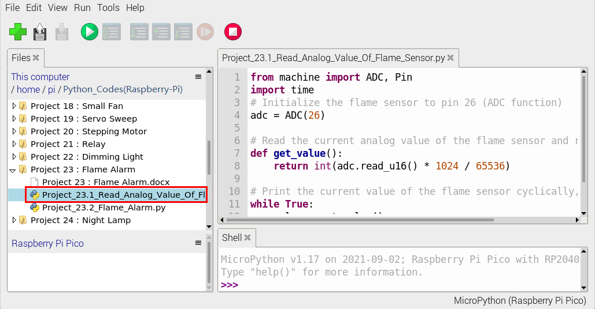

```Python
from machine import ADC, Pin
import time
# Initialize the flame sensor to pin 26 (ADC function)
adc = ADC(26)

# Read the current analog value of the flame sensor and return [0, 1023]
def get_value():
    return int(adc.read_u16() * 1024 / 65536)
 
# Print the current value of the flame sensor cyclically, value=[0, 1023]
while True:
    value = get_value()
    print(value)
    time.sleep(0.1)
```

Ensure that the Raspberry Pi Pico is connected to the computer，click“Stop/Restart backend”.

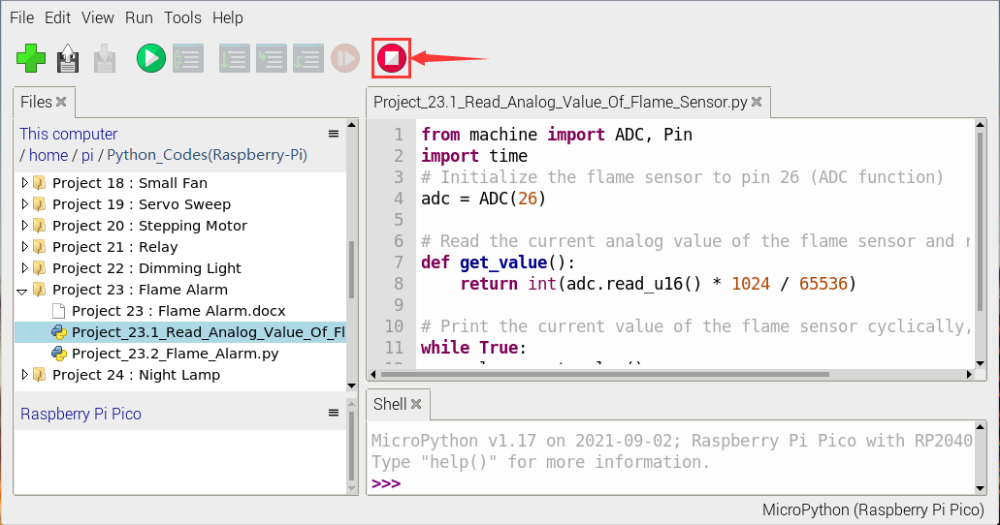

Click “Run current script”, the code starts executing, we will see that the "Shell" window of Thonny IDE will print the simulation value read by the flame sensor. When the flame is close to the sensor, the simulation value increases. On the contrary, the simulated value decreases. Press“Ctrl+C”or click“Stop/Restart backend”to exit the program.

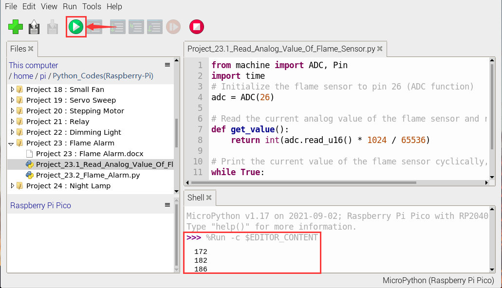


5.**Circuit Diagram and Wiring Diagram**

Next, we will use flame sensor and buzzer, an RGB LED to make an interesting project, that is flame alarm. When flame is detected, RGB LED is red and buzzer alarms.


6.**Test Code**
    
Note：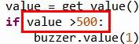 The threshold of 500 in the code can be reset itself as required.

Check the code in the folder "**...\6.Codes\Python_Codes(Raspberry-Pi)**".

You can move the code anywhere. For example, We copy the **Python_Codes(Raspberry-Pi).zip** to the <span style="color: rgb(255, 76, 65);">pi</span> folder of the Raspberry Pi system.

<span style="color: rgb(255, 76, 65);">Path: home/pi/Python_Codes(Raspberry-Pi)</span>

<br>
<br>


Open“Thonny”, click“This computer”→“home”→“pi”→“Python_Codes(Raspberry-Pi)”→“Project 23：Flame Alarm”. And double left-click the “Project\_23.2\_Flame\_Alarm.py”.

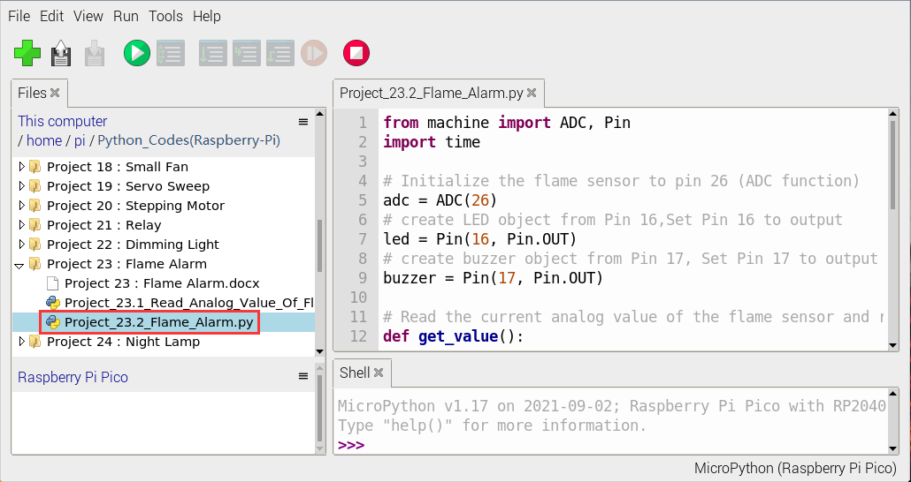

```Python
from machine import ADC, Pin
import time

# Initialize the flame sensor to pin 26 (ADC function)
adc = ADC(26)
# create LED object from Pin 16,Set Pin 16 to output
led = Pin(16, Pin.OUT) 
# create buzzer object from Pin 17, Set Pin 17 to output
buzzer = Pin(17, Pin.OUT)   

# Read the current analog value of the flame sensor and return [0, 1023]
def get_value():
    return int(adc.read_u16() * 1024 / 65536)
 
# If the flame sensor detects a flame, the buzzer will beep
# and the LED will blink when the analog value is greater than 500
# Otherwise, the buzzer does not sound and the LED goes off 
while True:
    value = get_value()
    if value >500:
        buzzer.value(1)    # Set buzzer turn on
        led.value(1)    # Set led turn on
        time.sleep(0.5) # Sleep 0.5s
        led.value(0)    # Set led turn off
        time.sleep(0.5) # Sleep 0.5s
    else:
        buzzer.value(0)    # Set buzzer turn off
        led.value(0)    # Set led turn off
```

**7. Test Result**

Ensure that the Raspberry Pi Pico is connected to the computer，click“Stop/Restart backend”.

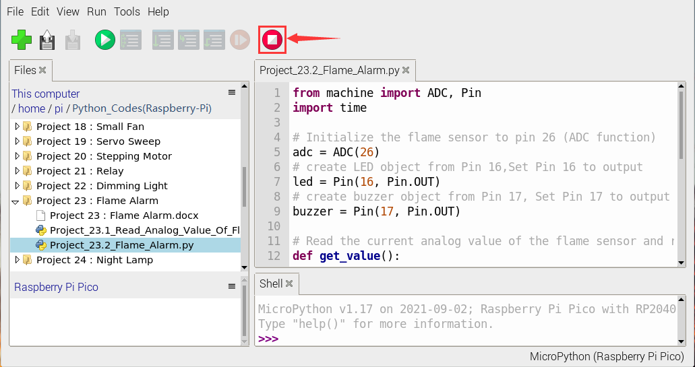

Click“Run current script”, the code starts executing, we will see that when the flame sensor detects the flame, the LED flashes and the buzzer alarms. Otherwise, the LED does not light, the buzzer does not sound. Click“Stop/Restart backend”to exit the program.

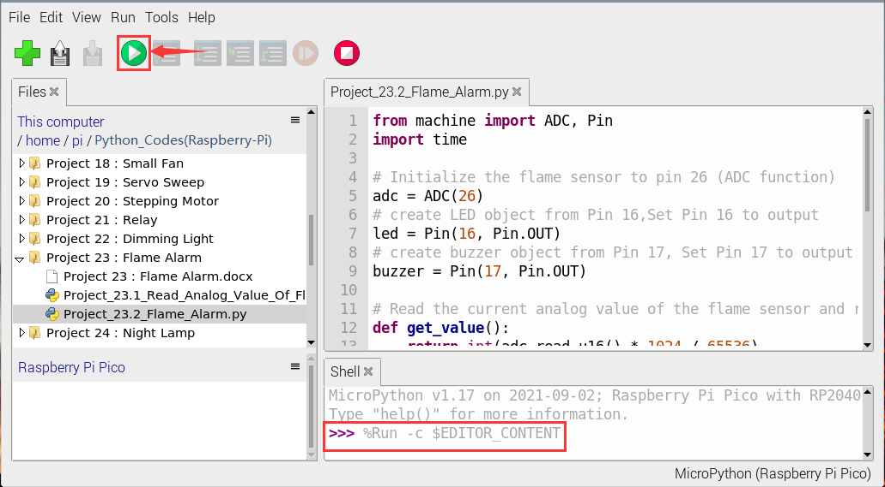


### Project 24：Night Lamp

1.**Introduction**

Sensors or components are ubiquitous in our daily life. For example, some public street lights turn on automatically at night and turn off automatically during the day. Why? In fact, this make use of a photosensitive element that senses the intensity of external ambient light. When the outdoor brightness decreases at night, the street lights will automatically turn on. In the daytime, the street lights will automatically turn off. The principle of this is very simple. In this lesson we will use Raspberry Pi Pico to control LEDs to implement the function of this street light.

2.**Components Required**

<table>
<tbody>
<tr class="odd">
<td></td>
<td></td>
<td>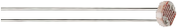</td>
<td></td>
<td></td>
</tr>
<tr class="even">
<td>Raspberry Pi Pico*1</td>
<td>Raspberry Pi Pico Expansion Board*1</td>
<td>Photoresistor*1</td>
<td>Red LED*1</td>
<td>10KΩResistor*1</td>
</tr>
<tr class="odd">
<td></td>
<td></td>
<td></td>
<td></td>
<td></td>
</tr>
<tr class="even">
<td>Breadboard*1</td>
<td>220ΩResistor*1</td>
<td>Jumper Wires</td>
<td>USB Cable*1</td>
<td></td>
</tr>
</tbody>
</table>

3.**Component Knowledge**


It is a photosensitive resistor, its principle is that the photoresistor surface receives brightness (light) to reduce the resistance. The resistance value will change with the detected intensity of the ambient light . With this property, we can use photoresistors to detect light intensity. Photoresistors and other electronic symbols are as follows:


The following circuit is used to detect changes in resistance values of photoresistors:


In the circuit above, when the resistance of the photoresistor changes due to the change of light intensity, the voltage between the photoresistor and resistance R2 will also change.  Thus, the intensity of light can be obtained by measuring this voltage.

4.**Read the Analog Value**

We first use a simple code to read the value of the photoresistor, print it in the serial monitor. For wiring, please refer to the following wiring diagram.

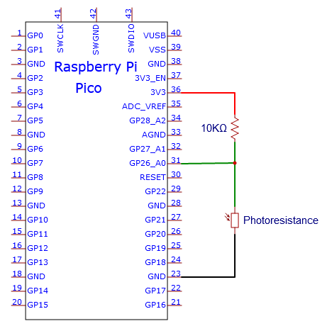


Check the code in the folder "**...\6.Codes\Python_Codes(Raspberry-Pi)**".

You can move the code anywhere. For example, We copy the **Python_Codes(Raspberry-Pi).zip** to the <span style="color: rgb(255, 76, 65);">pi</span> folder of the Raspberry Pi system.

<span style="color: rgb(255, 76, 65);">Path: home/pi/Python_Codes(Raspberry-Pi)</span>

<br>
<br>


Open“Thonny”, click“This computer”→“home”→“pi”→“Python_Codes(Raspberry-Pi)”→“Project 24：Night Lamp”. And double left-click the “Project\_24.1\_Read\_Photosensitive\_Analog\_Value.py”.

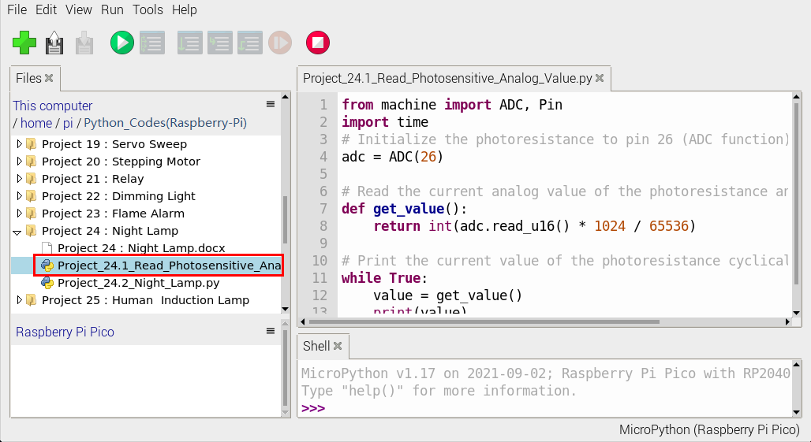

```Python
from machine import ADC, Pin
import time
# Initialize the photoresistance to pin 26 (ADC function)
adc = ADC(26)

# Read the current analog value of the photoresistance and return [0, 1023]
def get_value():
    return int(adc.read_u16() * 1024 / 65536)
 
# Print the current value of the photoresistance cyclically, value=[0, 1023]
while True:
    value = get_value()
    print(value)
    time.sleep(0.1)
```

Ensure that the Raspberry Pi Pico is connected to the computer，click“Stop/Restart backend”.

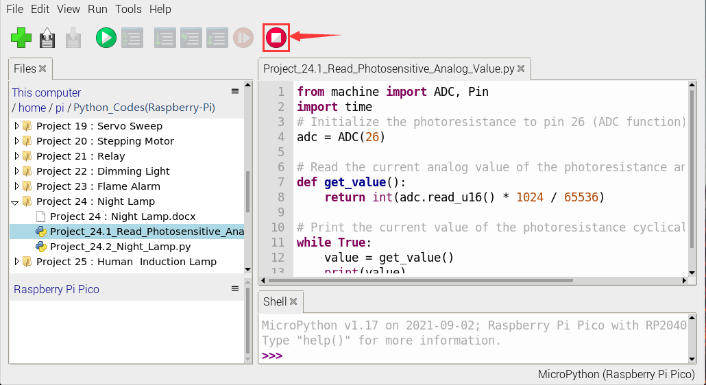

Click “Run current script”, the code starts executing, we will see that the "Shell" window of Thonny IDE will print the analog value read by the photoresistor. When the light intensity around the photoresistor is gradually reduced, the analog value will gradually increase. On the contrary, the analog value decreases gradually. Click“Stop/Restart backend”to exit the program.

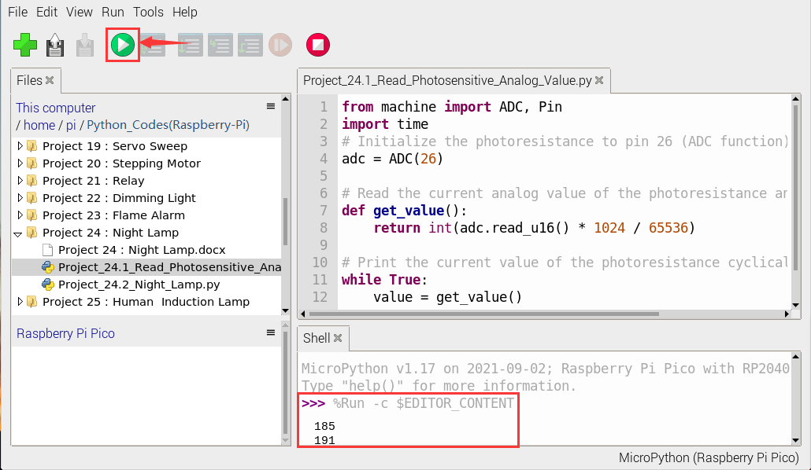


5.**Circuit Diagram and Wiring Diagram**

We made a little dimmer in the front, now let's make a light controlled lamp. The principle is the same, the Raspberry Pi Pico will be used to obtain the analog value of the sensor and then adjust the brightness of the LED.  


6.**Test Code**

Check the code in the folder "**...\6.Codes\Python_Codes(Raspberry-Pi)**".

You can move the code anywhere. For example, We copy the **Python_Codes(Raspberry-Pi).zip** to the <span style="color: rgb(255, 76, 65);">pi</span> folder of the Raspberry Pi system.

<span style="color: rgb(255, 76, 65);">Path: home/pi/Python_Codes(Raspberry-Pi)</span>

<br>
<br>


Open“Thonny”, click“This computer”→“home”→“pi”→“Python_Codes(Raspberry-Pi)”→“Project 24：Night Lamp”. And double left-click the“Project\_24.2\_Night\_Lamp.py”.


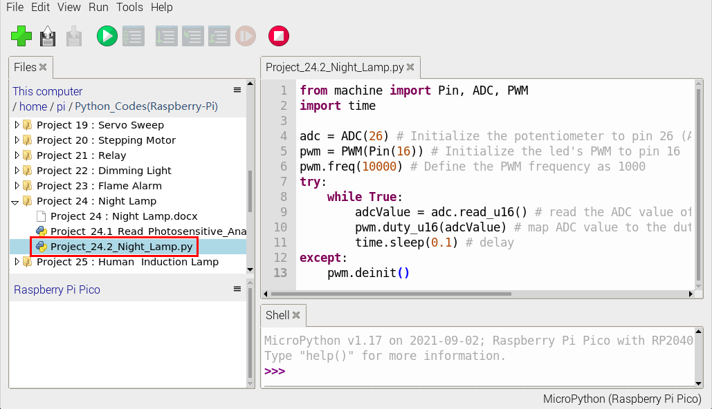

```Python
from machine import Pin, ADC, PWM
import time

adc = ADC(26) # Initialize the potentiometer to pin 26 (ADC function)
pwm = PWM(Pin(16)) # Initialize the led's PWM to pin 16
pwm.freq(10000) # Define the PWM frequency as 1000
try:
    while True:
        adcValue = adc.read_u16() # read the ADC value of photoresistance
        pwm.duty_u16(adcValue) # map ADC value to the duty cycle of PWM to control led brightness
        time.sleep(0.1) # delay
except:
    pwm.deinit()
```

7.**Test Result**
    
Ensure that the Raspberry Pi Pico is connected to the computer，click“Stop/Restart backend”.
    
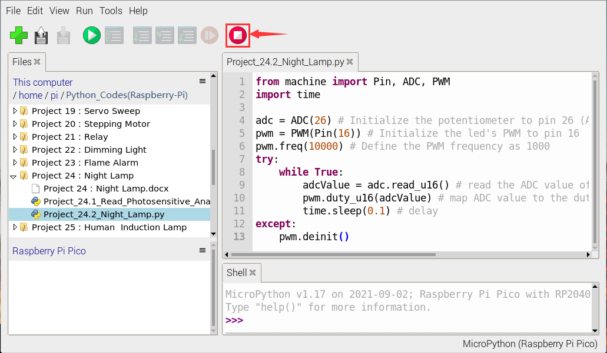
    
Click “Run current script”, the code starts executing, we will see that when the intensity of light around the photoresistor is reduced, the LED will be bright, on the contraty, the LED will be dim. Click“Stop/Restart backend”to exit the program.

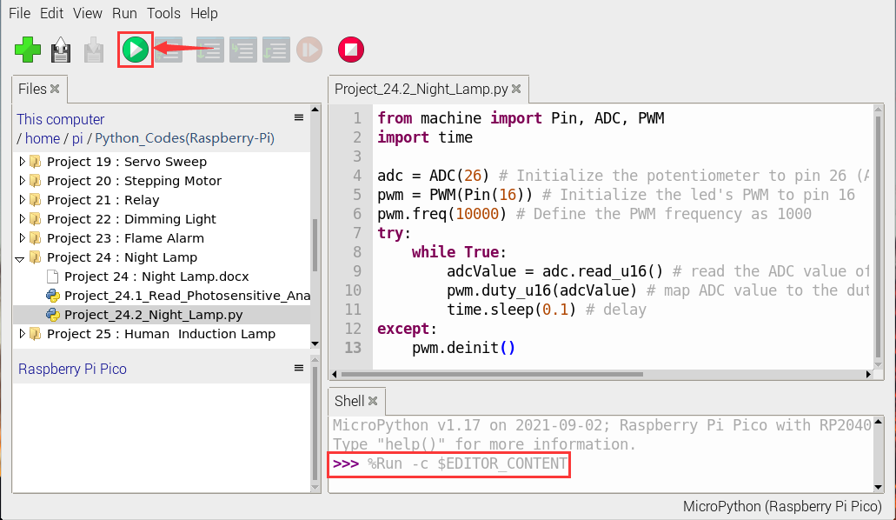


### Project 25：Human Induction Lamp

1.**Introduction**
    
With the development of science and technology, the use of human induction lamp that usually used in the dark corridor area is very common in our real life, such as the corridor of the community, the bedroom of the room, the garage of the dungeon, the bathroom and so on. The human induction lamp are generally composed of a PIR Motion Sensor, a lamp, a photoresistor sensor and so on. In this project, we will learn how to use a PIR Motion Sensor, LEDs, and a photoresistor to make a human induction lamp .
    
2.**Components Required**

<table>
<tbody>
<tr class="odd">
<td></td>
<td></td>
<td>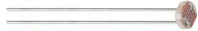</td>
<td></td>
<td></td>
<td></td>
</tr>
<tr class="even">
<td>Raspberry Pi Pico*1</td>
<td>Raspberry Pi Pico Expansion Board*1</td>
<td>Photoresistor*1</td>
<td>Red LED*1</td>
<td>10KΩResistor*1</td>
<td>USB Cable*1</td>
</tr>
<tr class="odd">
<td></td>
<td></td>
<td>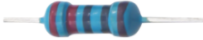</td>
<td></td>
<td></td>
<td></td>
</tr>
<tr class="even">
<td>Breadboard*1</td>
<td>PIR Motion Sensor*1</td>
<td>220ΩResistor*1</td>
<td>F-F Dupont Wires</td>
<td>Jumper Wires</td>
<td></td>
</tr>
</tbody>
</table>

3.**Circuit Diagram and Wiring Diagram**
    

    
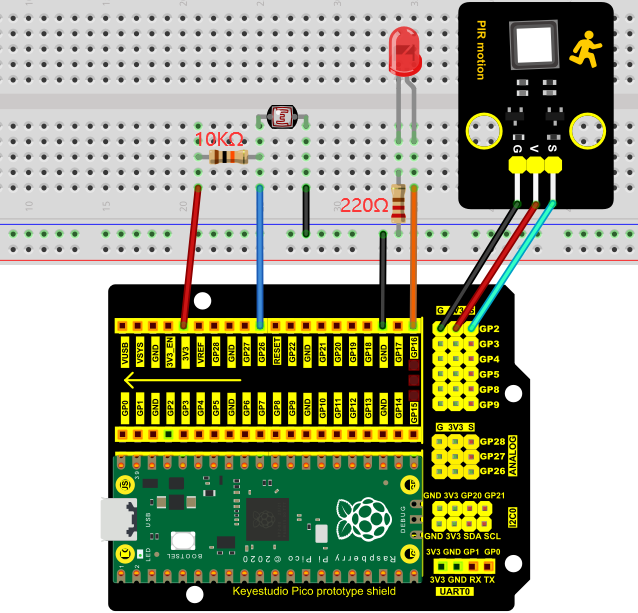

4.**Test Code**

Check the code in the folder "**...\6.Codes\Python_Codes(Raspberry-Pi)**".

You can move the code anywhere. For example, We copy the **Python_Codes(Raspberry-Pi).zip** to the <span style="color: rgb(255, 76, 65);">pi</span> folder of the Raspberry Pi system.

<span style="color: rgb(255, 76, 65);">Path: home/pi/Python_Codes(Raspberry-Pi)</span>

<br>
<br>


Open“Thonny”, click“This computer”→“home”→“pi”→“Python_Codes(Raspberry-Pi)”→“Project 25：Human Induction Lamp”. And double left-click the “Project\_25\_Human\_ Induction\_Lamp.py”.

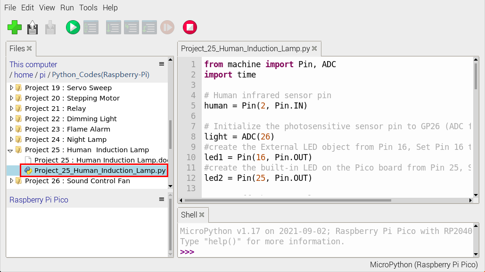

```Python
from machine import Pin, ADC
import time
 
# Human infrared sensor pin
human = Pin(2, Pin.IN)
 
# Initialize the photosensitive sensor pin to GP26 (ADC function)
light = ADC(26)
#create the External LED object from Pin 16, Set Pin 16 to output 
led1 = Pin(16, Pin.OUT)
#create the built-in LED on the Pico board from Pin 25, Set Pin 25 to output 
led2 = Pin(25, Pin.OUT) 
 
# Turn off the External LED
def led1_off():
    led1.value(0)
 
# Turn on the External LED
def led1_on():
    led1.value(1)
    
# Open the built-in LED on the Pico board
def led2_on():
    led2.value(1)
 
# Close the built-in LED on the Pico board
def led2_off():
    led2.value(0)
 
# Read the current analog value of the photosensitive sensor, range [0, 1023]
# The stronger the light intensity, the smaller the value.
def get_value():
    return int(light.read_u16() * 1024 / 65536)
 
 
def detect_someone():
    if human.value() == 1:
        return True
    return False
 
abc = 0
 
while True:
    val = get_value()
#     print('val=', val)
 
    if val >= 500:
        led2_on()
        if detect_someone() == True:
            abc += 1
            led1_on()
            print("value=", abc)
            time.sleep(1)
        else:
            if abc != 0:
                abc = 0
                led1_off()
    else:
        led2_off()
        led1_off()
 
    time.sleep(0.1)
```

Ensure that the Raspberry Pi Pico is connected to the computer，click“Stop/Restart backend”.

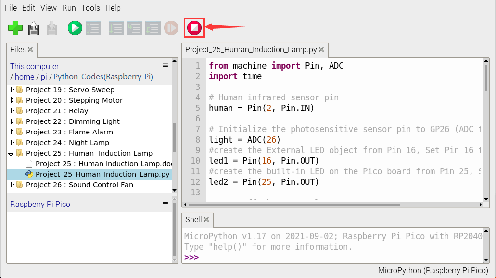

Click “Run current script”, the code starts executing, we will see that When your hand covers the light-sensitive part of the photoresistor to simulate darkness, the Raspberry Pi Pico's built-in LED will light up. Then shake it in front of the PIR motion sensor with your other hand, the external LED will light up, too, and after a delay of a few seconds, the external LED will automatically turn off.  

At the same time, the "Shell" window of Thonny IDE will print the delay time when the external LED lights up . If the sensitive part of the photoresistor is not covered, you can see that the the Raspberry Pi Pico's built-in LED lights go out , at this time, shake in front of the PIR motion sensor with your hand, the external LED is off.

Click“Stop/Restart backend”to exit the program.

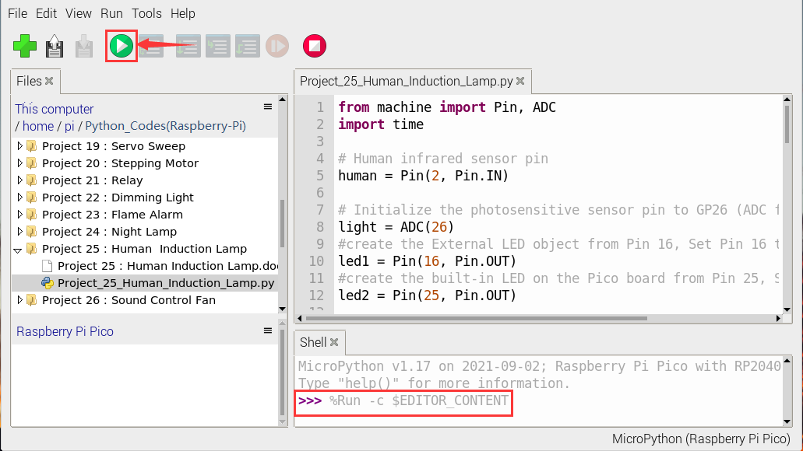

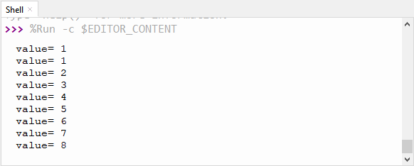


### Project 26：Sound Control Fan

1.**Introduction**

The sound sensor has a built-in capacitive electret microphone and power amplifier. It can be used to detect the sound intensity of the environment. In this project, we use a Raspberry Pi Pico to control a sound sensor and a motor module to make a voice-activated fan.

2.**Components Required**

<table>
<tbody>
<tr class="odd">
<td>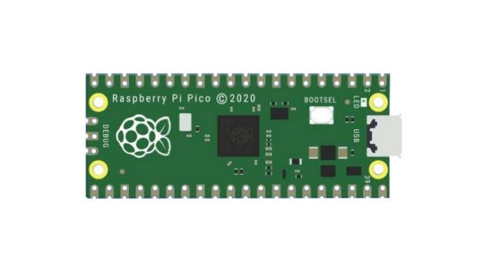</td>
<td></td>
<td>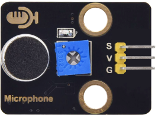</td>
<td></td>
</tr>
<tr class="even">
<td>Raspberry Pi Pico*1</td>
<td>Raspberry Pi Pico Expansion Board*1</td>
<td>Sound Sensor*1</td>
<td>USB Cable*1</td>
</tr>
<tr class="odd">
<td>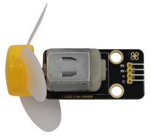</td>
<td>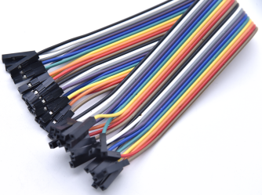</td>
<td></td>
<td></td>
</tr>
<tr class="even">
<td>130 Motor Module*1</td>
<td>F-F Dupont Wires</td>
<td>M-F Dupont Wires</td>
<td></td>
</tr>
</tbody>
</table>

3.**Component Knowledge**

**Sound sensor** is usually used to detect the loudness of the sound in the surroundings. Arduino can collect its output signal through the analog input interface. The S pin is an analog output, which is the real-time output of the microphone voltage signal. The sensor comes with a potentiometer so you can adjust the signal strength. It also has two fixing holes so that the sensor can be installed on any other equipment. You can use it to make some interactive works, such as voice-operated switches.

4.**Read the Analog Value of the Sound Sensor**

We first use a simple code to read the analog value of the sound sensor and print it to the serial monitor, please refer to the following wiring diagram for the wiring.


Check the code in the folder "**...\6.Codes\Python_Codes(Raspberry-Pi)**".

You can move the code anywhere. For example, We copy the **Python_Codes(Raspberry-Pi).zip** to the <span style="color: rgb(255, 76, 65);">pi</span> folder of the Raspberry Pi system.

<span style="color: rgb(255, 76, 65);">Path: home/pi/Python_Codes(Raspberry-Pi)</span>

<br>
<br>


Open“Thonny”, click“This computer”→“home”→“pi”→“Python_Codes(Raspberry-Pi)”→“Project 26：Sound Control Fan”. And double left-click the “Project\_26.1\_Read\_Sound\_Sensor\_Analog\_Value.py”.

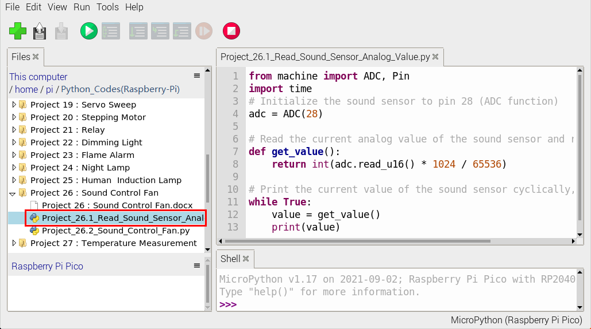

```Python
from machine import ADC, Pin
import time
# Initialize the sound sensor to pin 28 (ADC function)
adc = ADC(28)

# Read the current analog value of the sound sensor and return [0, 1023]
def get_value():
    return int(adc.read_u16() * 1024 / 65536)
 
# Print the current value of the sound sensor cyclically, value=[0, 1023]
while True:
    value = get_value()
    print(value)
    time.sleep(0.1)
```

Ensure that the Raspberry Pi Pico is connected to the computer，click“Stop/Restart backend”.

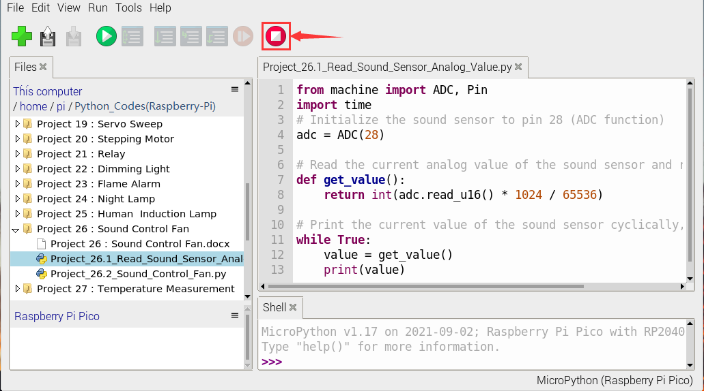

Click “Run current script”, the code starts executing, we will see that the "Shell" window of Thonny IDE will print the analog values read by the sound sensor. When you clap your hands to the sensor, the analog value of the sound sensor will change significantly. Click“Stop/Restart backend”to exit the program.

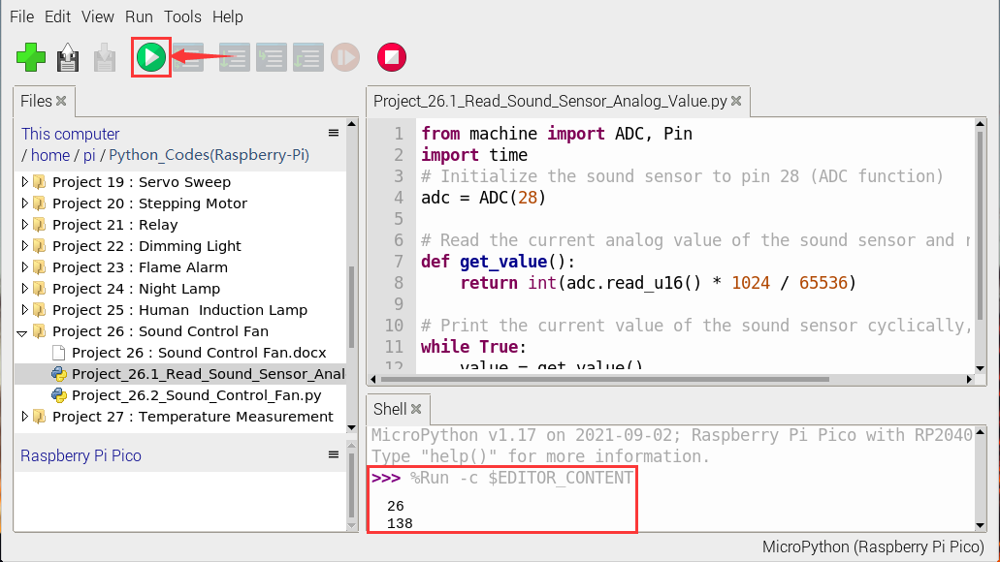

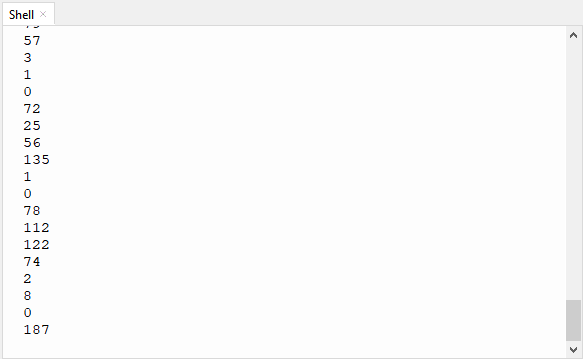

5.**Wiring Diagram**

Next, we use a sound sensor, a 130 motor module and a fan leaf to make a voice-activated fan. The wiring diagram is as follows.

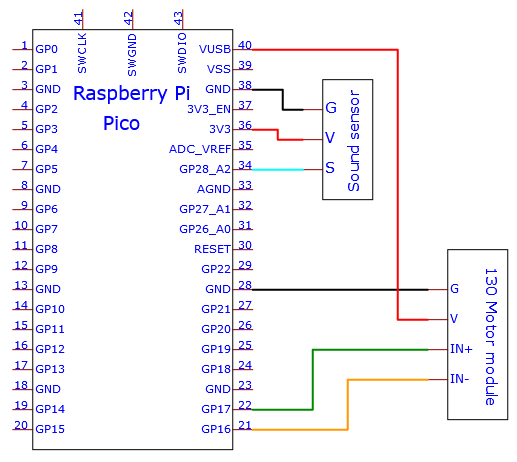

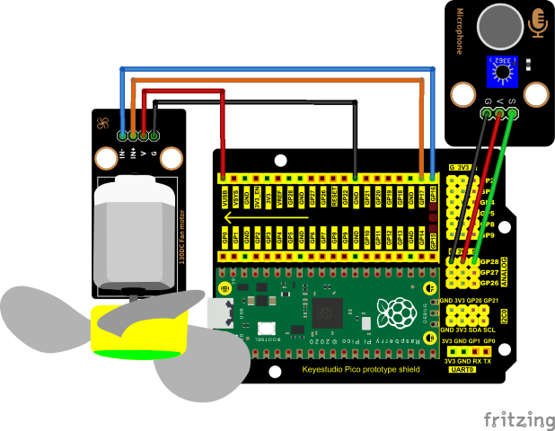

6.**Test Code**（Note：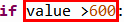The threshold 600 in the code can be reset itself as needed)

Check the code in the folder "**...\6.Codes\Python_Codes(Raspberry-Pi)**".

You can move the code anywhere. For example, We copy the **Python_Codes(Raspberry-Pi).zip** to the <span style="color: rgb(255, 76, 65);">pi</span> folder of the Raspberry Pi system.

<span style="color: rgb(255, 76, 65);">Path: home/pi/Python_Codes(Raspberry-Pi)</span>

<br>
<br>


Open“Thonny”, click“This computer”→“home”→“pi”→“Python_Codes(Raspberry-Pi)”→“Project 26：Sound Control Fan”. And double left-click the “Project\_26.2\_Sound\_Control\_Fan.py”.

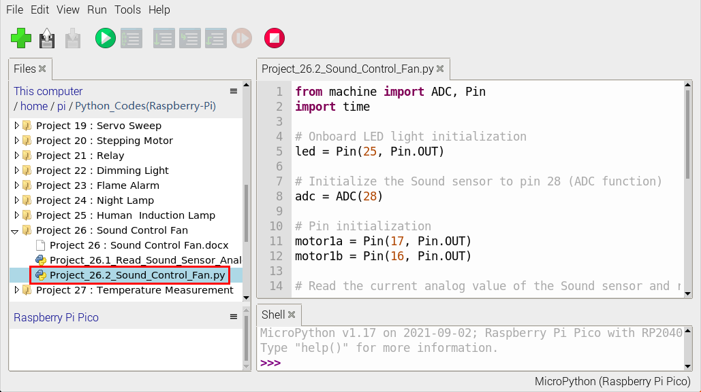

```Python
from machine import ADC, Pin
import time
 
# Onboard LED light initialization
led = Pin(25, Pin.OUT)
 
# Initialize the Sound sensor to pin 28 (ADC function)
adc = ADC(28)
 
# Pin initialization
motor1a = Pin(17, Pin.OUT) 
motor1b = Pin(16, Pin.OUT) 

# Read the current analog value of the Sound sensor and return [0, 1023]
def get_value():
    return int(adc.read_u16() * 1024 / 65536)
 
# If the Sound sensor detects Sounds, the built-in LED on the Pico board will blink
# and the motor will rotate when the analog value is greater than 600
# Otherwise, the motor does not rotate and the LED goes off    
while True:
    value = get_value()
    if value >600:
        led.value(1)    # Set led turn on 
        motor1a.high()  # Set motor1a high
        motor1b.low()   # Set motor1b low
        time.sleep(5)   # delay time 
    else:
        motor1a.low()  # Set motor1a low
        motor1b.low()  # Set motor1b low 
        led.value(0)    # Set led turn off
```

7.**Test Result**
    
Ensure that the Raspberry Pi Pico is connected to the computer，click“Stop/Restart backend”.

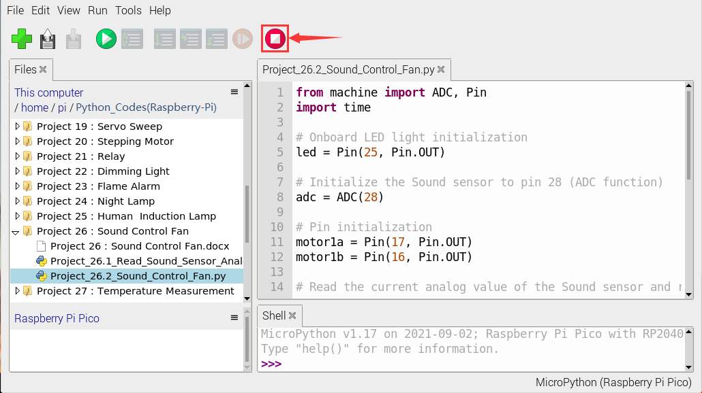

Click “Run current script”, the code starts executing, we will see that clap your hands to the sound sensor, and when the sound intensity exceeds a threshold, the small fan spins while
the Raspberry Pi Pico's built-in LED lights up.  Instead, the small fan doesn't rotate, and the Raspberry Pi Pico's built-in LEDS don't light up. Press“Ctrl+C”or click“Stop/Restart backend”to exit the program.

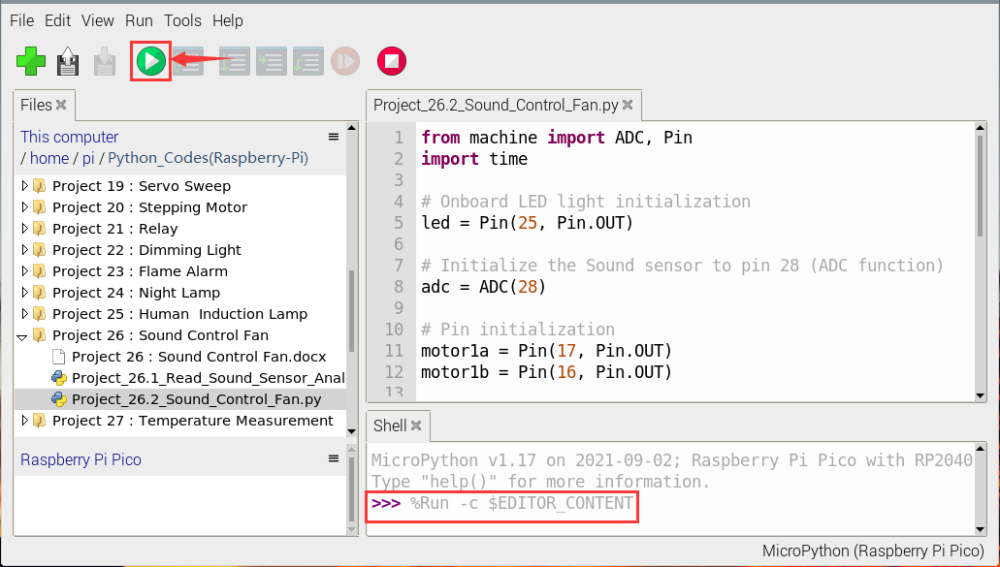


### Project 27：Temperature Measurement

1.**Introduction**

LM35 is a commonly used and easy-to-use temperature sensor. It does not require other hardware, only needs an analog port. The difficulty lies in compiling the code and converting the analog values to Celsius temperature. In this project, we use a temperature sensor and 3 LEDs to make a temperature tester. When the temperature sensor touches objects with different temperature, the LEDs will show different colors.

2.**Components Required**

<table>
<tbody>
<tr class="odd">
<td>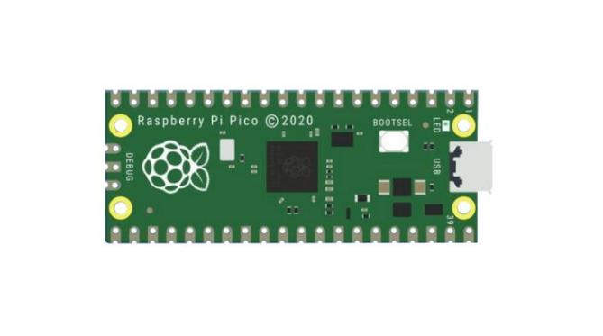</td>
<td></td>
<td>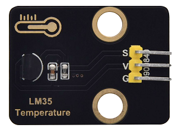</td>
<td></td>
<td>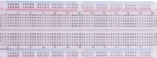</td>
<td></td>
</tr>
<tr class="even">
<td>Raspberry Pi Pico*1</td>
<td>Raspberry Pi Pico Expansion Board*1</td>
<td>LM35Temperature Sensor*1</td>
<td>USB Cable*1</td>
<td>Breadboard*1</td>
<td>Jumper Wires</td>
</tr>
<tr class="odd">
<td></td>
<td></td>
<td></td>
<td></td>
<td></td>
<td></td>
</tr>
<tr class="even">
<td>220Ω Resistor*3</td>
<td>Red LED*1</td>
<td>Yellow LED*1</td>
<td>Green LED*1</td>
<td>F-F Dupont Wires</td>
<td></td>
</tr>
</tbody>
</table>

3.**Component Knowledge**


**Working principle of LM35 temperature sensor:** LM35 is a widely used temperature sensor with many different package types. At room temperature, it can achieve the accuracy of 1/4°C without additional calibration processing. LM35 temperature sensor can produce different voltage by different temperature. When the temperature is 0 ℃, it outputs 0V. If increasing 1 ℃, the output voltage will increase 10mv. The output temperature is 0℃ to 100℃, the conversion formula is as follows.


4.**Read the Temperature Value**

We first use a simple code to read the value of the temperature sensor, print it in the serial monitor. The wiring diagram is shown below.

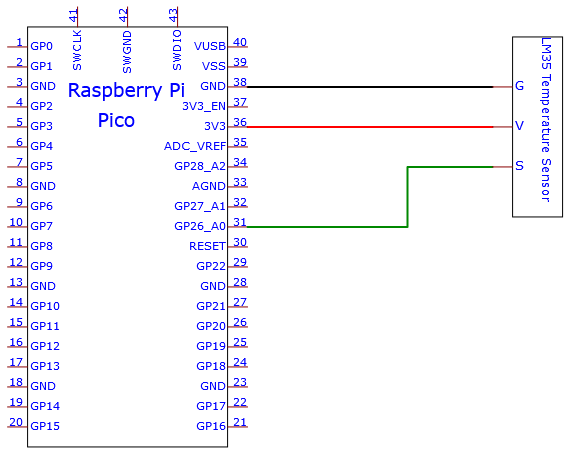

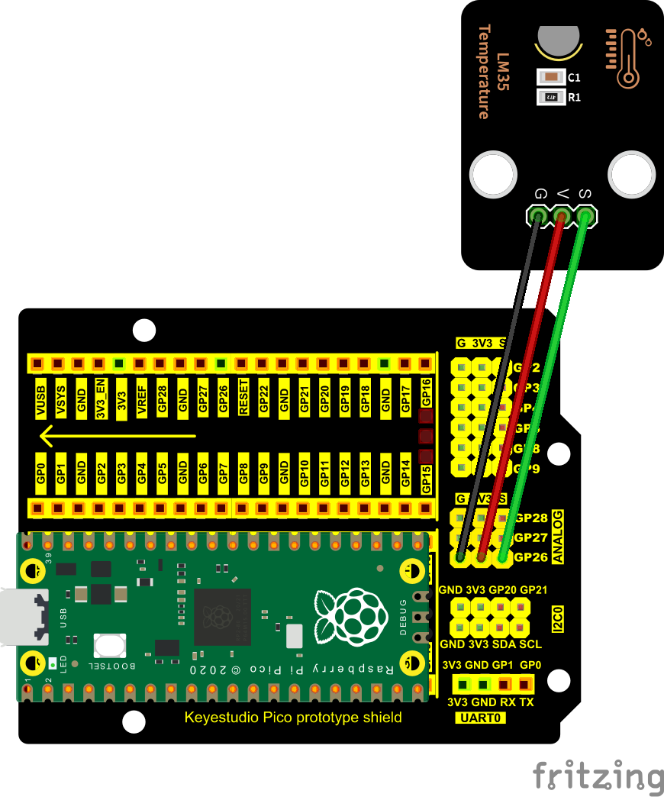

LM35 output is given to analog pin GP26 of the Raspberry Pi Pico. This analog voltage is converted to its digital form and processed to get the temperature reading.

Check the code in the folder "**...\6.Codes\Python_Codes(Raspberry-Pi)**".

You can move the code anywhere. For example, We copy the **Python_Codes(Raspberry-Pi).zip** to the <span style="color: rgb(255, 76, 65);">pi</span> folder of the Raspberry Pi system.

<span style="color: rgb(255, 76, 65);">Path: home/pi/Python_Codes(Raspberry-Pi)</span>

<br>
<br>


Open“Thonny”, click“This computer”→“home”→“pi”→“Python_Codes(Raspberry-Pi)”→“Project 27：Temperature Measurement”. And double left-click the “Project\_27.1\_Read\_LM35\_Temperature\_Value.py”.

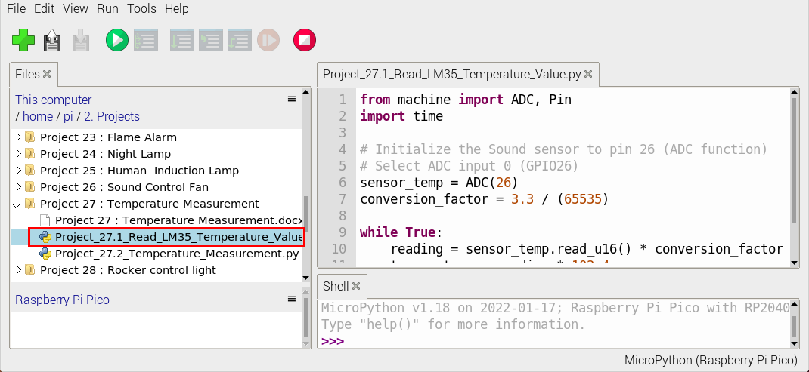

```Python
from machine import ADC, Pin
import time

# Initialize the Sound sensor to pin 26 (ADC function)
# Select ADC input 0 (GPIO26)
sensor_temp = ADC(26)
conversion_factor = 3.3 / (65535)

while True:
    reading = sensor_temp.read_u16() * conversion_factor 
    temperature = reading * 102.4 
    print(temperature)
    time.sleep(1)
```

**5. Test Result**

Ensure that the Raspberry Pi Pico is connected to the computer，click““Stop/Restart backend.

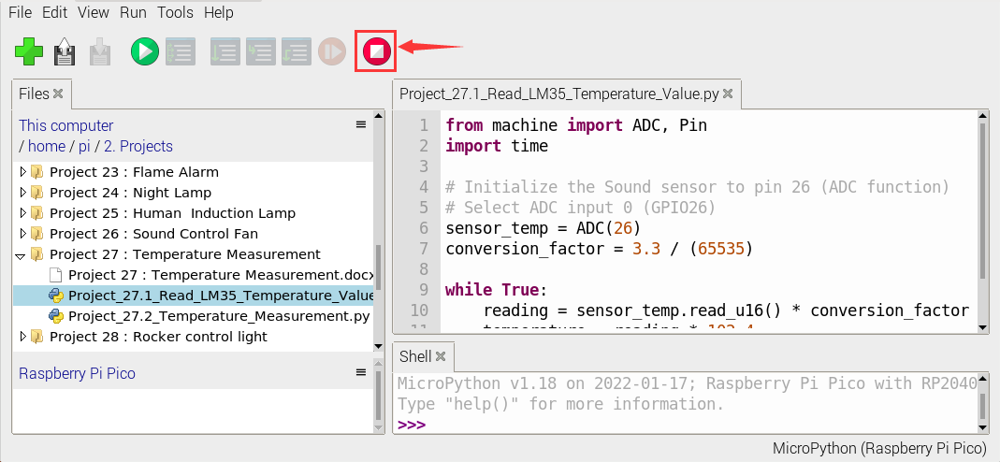

Click“Run current script”, the code starts executing, we will see that The "Shell" window of Thonny IDE will print the temperature values read by the LM35 temperature sensor. Hold the LM35 element by hand, the temperature value read by the LM35 temperature sensor will change. Press“Ctrl+C”or click“Stop/Restart backend”to exit the program.

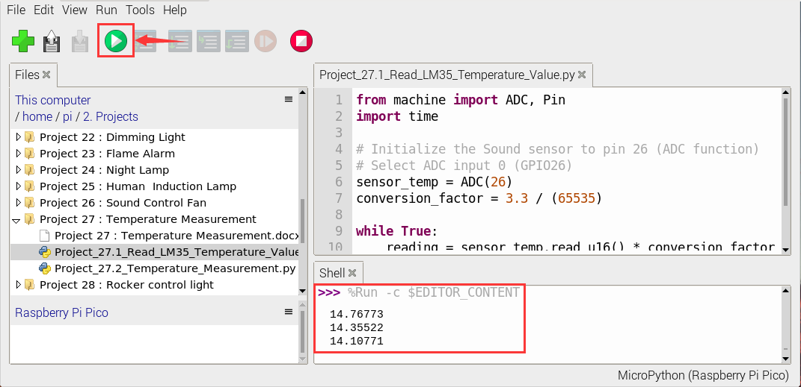


**6. Circuit Diagram and Wiring Diagram**

Now we use a LM35 temperature sensor and three LED lights to do a temperature test. When the LM35 temperature sensor senses different temperatures, different LED lights will light up. Follow the diagram below for wiring.

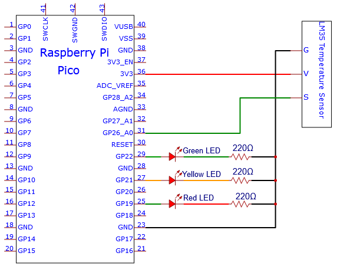

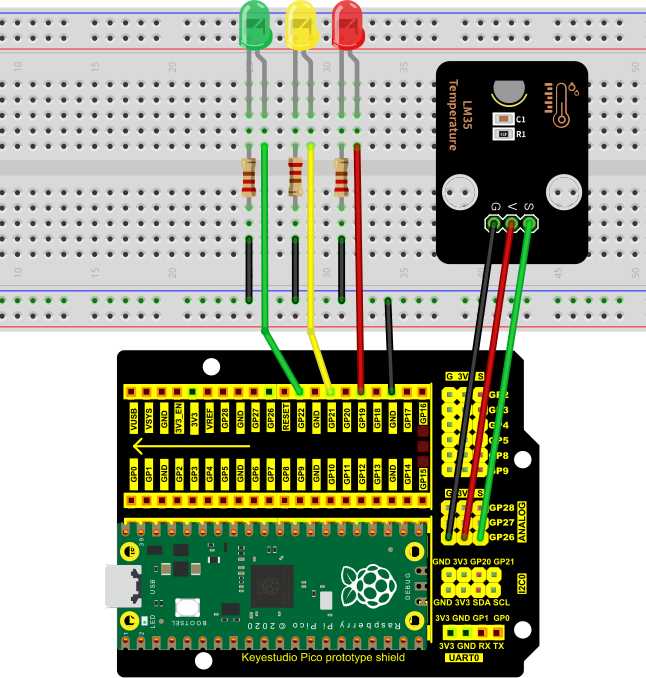

**7. Test Code**

Check the code in the folder "**...\6.Codes\Python_Codes(Raspberry-Pi)**".

You can move the code anywhere. For example, We copy the **Python_Codes(Raspberry-Pi).zip** to the <span style="color: rgb(255, 76, 65);">pi</span> folder of the Raspberry Pi system.

<span style="color: rgb(255, 76, 65);">Path: home/pi/Python_Codes(Raspberry-Pi)</span>

<br>
<br>


Open“Thonny”, click“This computer”→“home”→“pi”→“Python_Codes(Raspberry-Pi)”→“Project 27：Temperature Measurement”. And double left-click
the “Project\_27.2\_Temperature\_Measurement.py”.

Note: The temperature threshold in the code can be reset itself as required.  

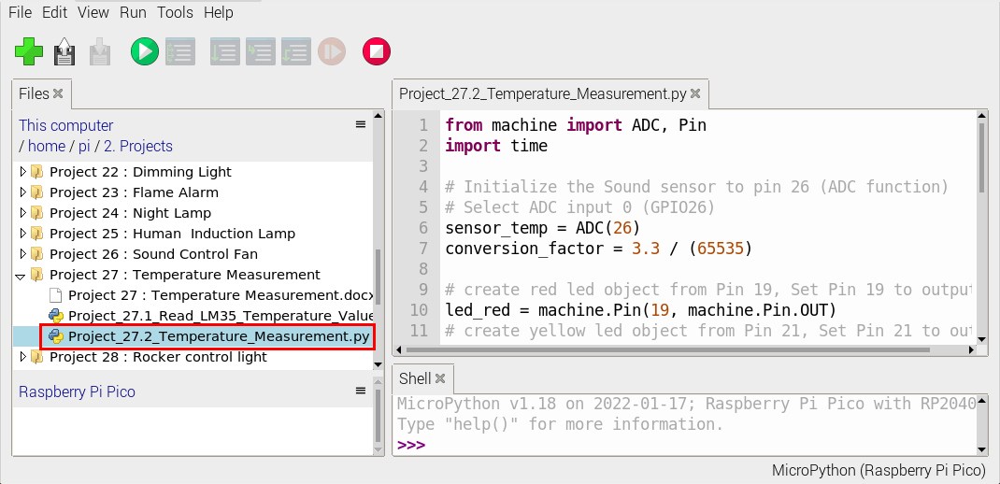

```Python
from machine import ADC, Pin
import time

# Initialize the Sound sensor to pin 26 (ADC function)
# Select ADC input 0 (GPIO26)
sensor_temp = ADC(26)
conversion_factor = 3.3 / (65535)

# create red led object from Pin 19, Set Pin 19 to output
led_red = machine.Pin(19, machine.Pin.OUT)  
# create yellow led object from Pin 21, Set Pin 21 to output
led_yellow = machine.Pin(21, machine.Pin.OUT)
# create green led object from Pin 22, Set Pin 22 to output
led_green = machine.Pin(22, machine.Pin.OUT) 

while True:
    reading = sensor_temp.read_u16() * conversion_factor 
    temperature = reading * 102.4
    print(temperature)
    time.sleep(0.2)
    if temperature <28:
        led_red.value(1)  # Set red led turn on
        led_yellow.value(0) # Set yellow led turn off 
        led_green.value(0)  # Set green led turn off
    elif temperature >28 and temperature <31:
        led_red.value(0)  # Set red led turn off
        led_yellow.value(1) # Set yellow led turn on 
        led_green.value(0)  # Set green led turn off
    else:
        led_red.value(0)  # Set red led turn off
        led_yellow.value(0) # Set yellow led turn off 
        led_green.value(1)  # Set green led turn on
```

7.**Test Result**
    
Ensure that the Raspberry Pi Pico is connected to the computer，click“Stop/Restart backend”.

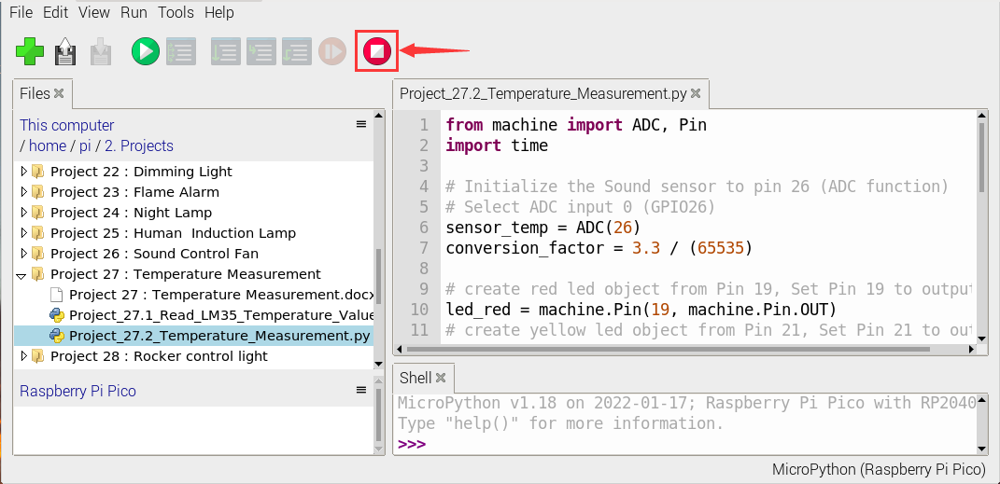

Click “Run current script”, the code starts executing, we will see that the "Shell" window of Thonny IDE will print the temperature values read by the LM35 temperature sensor. When the LM35 temperature sensor senses different temperatures, different LEDS will light up. Press“Ctrl+C”or click“Stop/Restart backend”to exit the program.

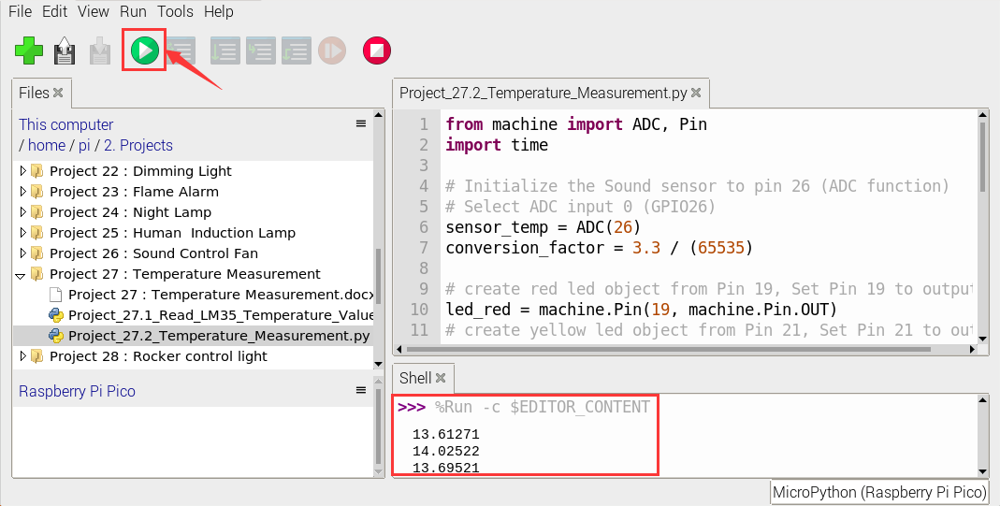


### Project 28：Rocker control light

1.**Introduction**

The joystick module is a component with two analog inputs and one digital input. It is widely used in game operation, robot control, drone control and other fields.

In this project, we will use a Raspberry Pi Pico and a joystick module to control RGB. You can have a deeper understanding of the principle and operation of the joystick module in practice.

2.**Components Required**

<table>
<tbody>
<tr class="odd">
<td></td>
<td></td>
<td>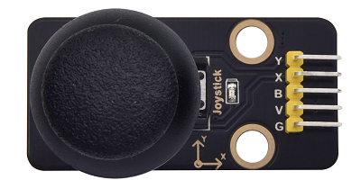</td>
<td>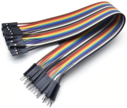</td>
<td>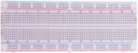</td>
</tr>
<tr class="even">
<td>Raspberry Pi Pico*1</td>
<td><blockquote>
<p>Raspberry Pi Pico Expansion Board*1</p>
</blockquote></td>
<td>Joystick Module*1</td>
<td>M-F Dupont Wires</td>
<td>Breadboard*1</td>
</tr>
<tr class="odd">
<td></td>
<td></td>
<td></td>
<td></td>
<td></td>
</tr>
<tr class="even">
<td>RGB LED*1</td>
<td>220ΩResistor*3</td>
<td>Jumper Wires</td>
<td>USB Cable*1</td>
<td></td>
</tr>
</tbody>
</table>

3.**Component Knowledge**


**Joystick module**: It mainly uses PS2 joystick components. In fact, the joystick module has 3 signal terminal pins, which simulate a three-dimensional space. The pins of the joystick module are GND, VCC, and signal terminals (B, X, Y). The signal terminals X and Y simulate the X-axis and Y-axis of the space. When controlling, the X and Y signal terminals of the module are connected to the analog port of the microcontroller. The signal terminal B simulates the Z axis of the space, it is generally connected to the digital port and used as a button.

VCC is connected to the microcontroller power output VCC (3.3V or 5V), GND is connected to the microcontroller GND, the voltage in the original state is about 1.65V or 2.5V. In the X-axis direction, when moving in the direction of the arrow, the voltage value increases, and the maximum voltage can be reached. Moving in the opposite direction of the arrow, the voltage value gradually decreases to the minimum voltage. In the Y-axis direction, the voltage value decreases gradually as it moves in the direction of the arrow on the module, decreasing to the minimum voltage. 

As the arrow is moved in the opposite direction, the voltage value increases and can reach the maximum voltage. In the Z-axis
direction, the signal terminal B is connected to the digital port and outputs 0 in the original state and outputs 1 when pressed. In this way, we can read the two analog values and the high and low level conditions of the digital port to determine the operating status of the joystick on the module.

**Features:**

Input Voltage：DC 3.3V \~ 5V

Output Signal：X/Y dual axis analog value +Z axis digital signal

[Range](javascript:;) [of](javascript:;) [Application](javascript:;)：Suitable for control point coordinate movement in plane as well as control of two degrees of freedom steering gear, etc.  

[Product](javascript:;) [feature](javascript:;)s：Exquisite appearance, joystick feel superior, simple operation, sensitive response, long service life.  

4.**Read the Value**

We have to use analog Raspberry Pi Pico pin IO to read the data from X or Y pins, and use digital IO port to read the values of the button. Please follow the wiring diagram below for wiring.


Check the code in the folder "**...\6.Codes\Python_Codes(Raspberry-Pi)**".

You can move the code anywhere. For example, We copy the **Python_Codes(Raspberry-Pi).zip** to the <span style="color: rgb(255, 76, 65);">pi</span> folder of the Raspberry Pi system.

<span style="color: rgb(255, 76, 65);">Path: home/pi/Python_Codes(Raspberry-Pi)</span>

<br>
<br>


Open“Thonny”, click“This computer”→“home”→“pi”→“Python_Codes(Raspberry-Pi)”→“Project 28：Rocker control light”. And double left-click the “Project\_28.1\_Read\_Rocker\_Value.py”.

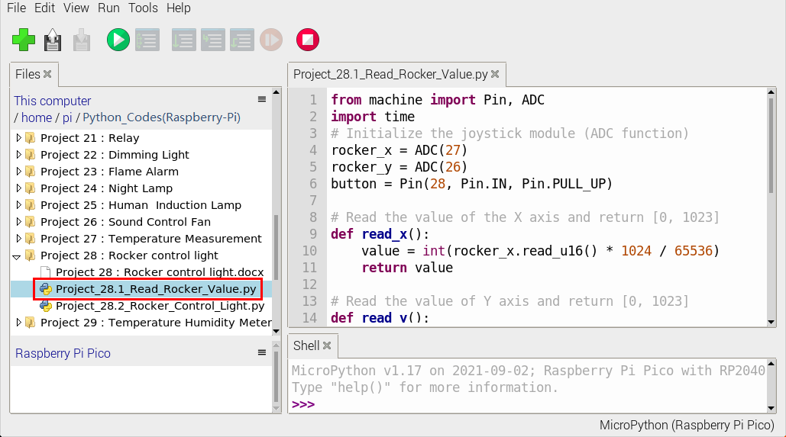

```Python
from machine import Pin, ADC
import time
# Initialize the joystick module (ADC function)
rocker_x = ADC(27)
rocker_y = ADC(26)
button = Pin(28, Pin.IN, Pin.PULL_UP)
 
# Read the value of the X axis and return [0, 1023]
def read_x():
    value = int(rocker_x.read_u16() * 1024 / 65536)
    return value
 
# Read the value of Y axis and return [0, 1023]
def read_y():
    value = int(rocker_y.read_u16() * 1024 / 65536)
    return value
 
# Read the state of the button, press to return to True, release to return to False
def btn_state():
    press = False
    if button.value() == 0:
        press = True
    return press
 
# Print the current value of the X axis,Y axis,Z axis cyclically.
while True:
    value_x = read_x()
    value_y = read_y()
    state = btn_state()
    print("x:%d, y:%d, press:%s" % (value_x, value_y, state))
    time.sleep(0.1)
```

Ensure that the Raspberry Pi Pico is connected to the computer，click“Stop/Restart backend”.

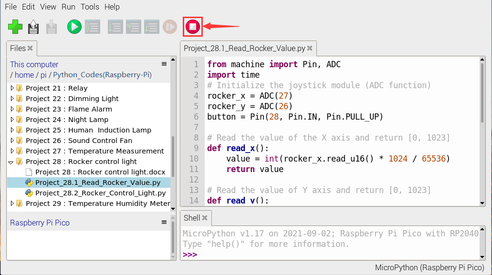

Click “Run current script”, the code starts executing, we will see that the "Shell" window of Thonny IDE will print the analog and digital values of the current joystick. Moving the joystick or pressing it will change the analog and digital values in "Shell". Click“Stop/Restart backend”to exit the program.

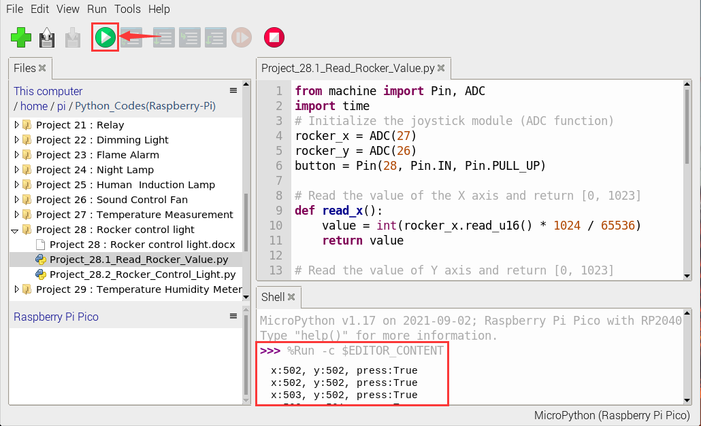

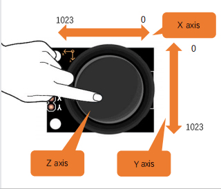

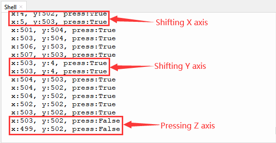

5.**Circuit Diagram and Wiring Diagram**

We just read the value of the joystick module. Now we need to do something with the joystick module and RGB, connecting according to the following diagram.

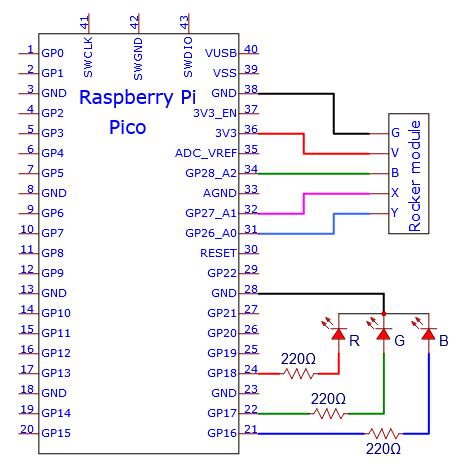


6.**Test Code**

Check the code in the folder "**...\6.Codes\Python_Codes(Raspberry-Pi)**".

You can move the code anywhere. For example, We copy the **Python_Codes(Raspberry-Pi).zip** to the <span style="color: rgb(255, 76, 65);">pi</span> folder of the Raspberry Pi system.

<span style="color: rgb(255, 76, 65);">Path: home/pi/Python_Codes(Raspberry-Pi)</span>

<br>
<br>


Open“Thonny”, click“This computer”→“home”→“pi”→“Python_Codes(Raspberry-Pi)”→“Project 28：Rocker control light”. And double left-click the “Project\_28.2\_Rocker\_Control\_Light.py”.

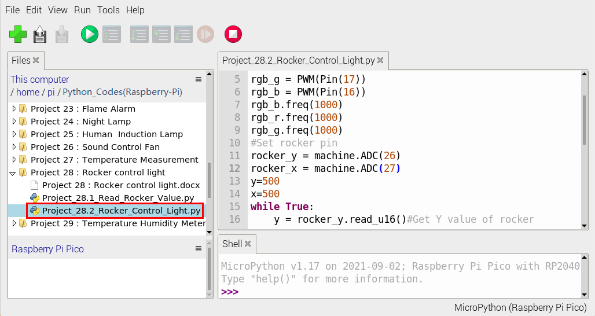

```Python
from machine import Pin, PWM
import time
#Set RGB light interface and frequency
rgb_r = PWM(Pin(18))
rgb_g = PWM(Pin(17))
rgb_b = PWM(Pin(16))
rgb_b.freq(1000)
rgb_r.freq(1000)
rgb_g.freq(1000)
#Set rocker pin
rocker_y = machine.ADC(26)
rocker_x = machine.ADC(27)
y=500
x=500
while True:
    y = rocker_y.read_u16()#Get Y value of rocker
    x = rocker_x.read_u16()#Get X value of rocker
    if x < 6400:    #left
        rgb_b.duty_u16(0)
        rgb_r.duty_u16(65535)
        rgb_g.duty_u16(0)
    elif x > 38400:    #right
        rgb_b.duty_u16(0)
        rgb_r.duty_u16(0)
        rgb_g.duty_u16(65535)
    elif y < 6400:    #down
        rgb_b.duty_u16(65535)
        rgb_r.duty_u16(0)
        rgb_g.duty_u16(0)
    elif y > 38400:    #up
        rgb_b.duty_u16(65535)
        rgb_r.duty_u16(65535)
        rgb_g.duty_u16(65535)
    time.sleep(0.01)
```

7.**Test Result**
    
Ensure that the Raspberry Pi Pico is connected to the computer，click“Stop/Restart backend”.

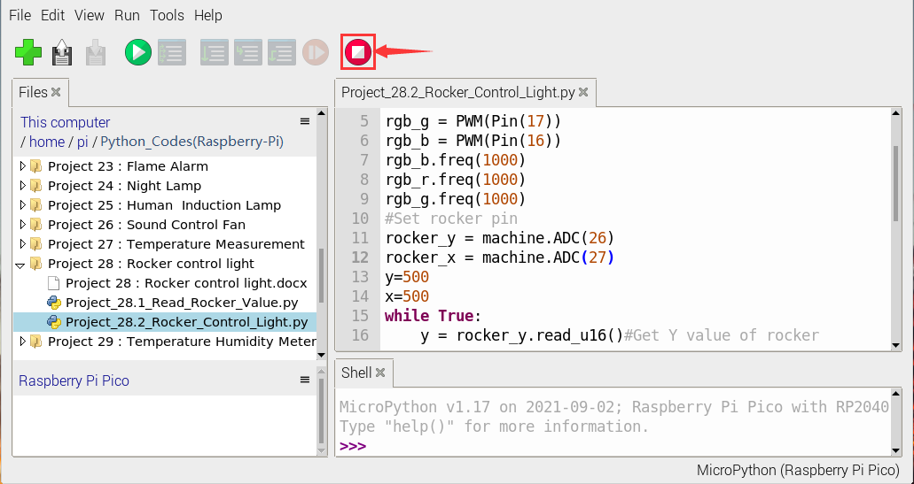

Click “Run current script”, the code starts executing, we will see that①If the joystick is moved to the far left in the X direction, the RGB light turns red. ② If the joystick is moved to the far right in the X direction, the RGB light turns green. ③If the joystick is moved to the top in the Y direction, the RGB light turns white. ④If the joystick is moved to the bottom in the Y direction, the RGB light turns blue. Press“Ctrl+C”or click“Stop/Restart backend”to exit the program.

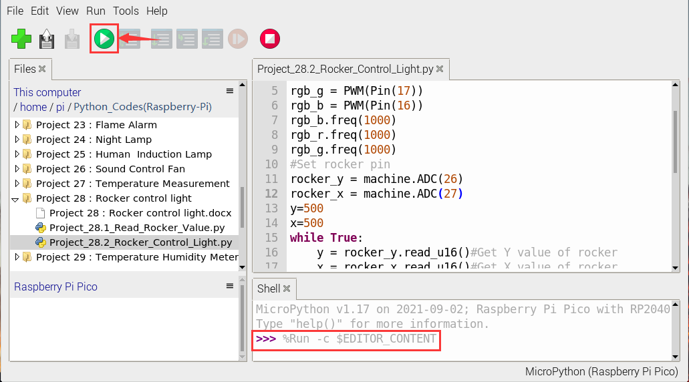


### Project 29：Temperature and Humidity Meter 

1.**Introduction**

In winter, the humidity in the air is very low, that is, the air is very dry. Coupled with the cold, the human skin is prone to crack from excessive dryness. Therefore, you need to use a humidifier to increase the humidity of the air at home. But how do you know that the air is too dry? Then you need equipment to detect air humidity. In this lesson, we will learn how to use the temperature and humidity sensor. We use the sensor to create a thermohygrometer and also combined with an LCD\_128X32\_DOT to display the temperature and humidity values.

2.**Components Required**

<table>
<tbody>
<tr class="odd">
<td></td>
<td>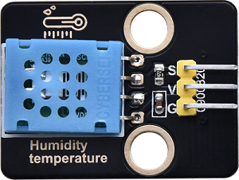</td>
<td></td>
</tr>
<tr class="even">
<td>Raspberry Pi Pico*1</td>
<td>Temperature and Humidity Sensor*1</td>
<td>LCD 128X32 DOT*1</td>
</tr>
<tr class="odd">
<td></td>
<td></td>
<td></td>
</tr>
<tr class="even">
<td>20CM M-F Dupont Wires</td>
<td>10CM M-F Dupont Wires</td>
<td>USB Cable*1</td>
</tr>
</tbody>
</table>

3.**Component Knowledge**


**Temperature and Humidity Sensor:** It is a temperature and humidity composite sensor with calibrated digital signal output. Its accuracy humidity is ±5%RH, temperature is ±2℃. Range humidity is 20 to 90%RH, and temperature is 0 to 50℃. The temperature and humidity sensor applies dedicated digital module acquisition technology and temperature and humidity sensing technology to ensure extremely high reliability and excellent long-term stability of the product. 

It includes a resistive-type humidity measurement and an NTC temperature measurement component, which is very suitable for
temperature and humidity measurement applications where accuracy and real-time performance are not required.The operating voltage is in the range of 3.3V to 5.5V.

XHT11 has three pins, which are VCC, GND, and S. S is the pin for data output, using serial communication.

**Single bus format definition:**

<table>
<tbody>
<tr class="odd">
<td><strong>Description</strong></td>
<td><strong>Definition</strong></td>
</tr>
<tr class="even">
<td>Start signal</td>
<td>Microprocessor pulls data bus (SDA) down at least 18ms for a period of time(Maximum is 30ms), notifying the sensor to prepare data.</td>
</tr>
<tr class="odd">
<td>Response signal</td>
<td>The sensor pulls the data bus (SDA) low for 83µs, and then pulls up for 87µs to respond to the host's start signal.</td>
</tr>
<tr class="even">
<td>Humidity</td>
<td>The high humidity is an integer part of the humidity data, and the low humidity is a fractional part of the humidity data.</td>
</tr>
<tr class="odd">
<td>Temperature</td>
<td>The high temperature is the integer part of the temperature data, the low temperature is the fractional part of the temperature data. And the low temperature Bit8 is 1, indicating a negative temperature, otherwise, it is a positive temperature.</td>
</tr>
<tr class="even">
<td>Parity bit</td>
<td>Parity bit=Humidity high bit+ Humidity low bit+temperature high bit+temperature low bit</td>
</tr>
</tbody>
</table>

**Data sequence diagram:**

When MCU sends a start signal, XHT11 changes from the low-power-consumption mode to the high-speed mode, waiting for MCU completing the start signal. Once it is completed, XHT11 sends a response signal of 40-bit data and triggers a signal acquisition. The signal is sent as shown in the figure.


Combined with the code, you can understand better.

The XHT11 temperature and humidity sensor can easily add temperature and humidity data to your DIY electronic projects. It is perfect for remote weather stations, home environmental control systems, and farm or garden monitoring systems.

**Specification:**

Working voltage: +5V

Temperature range: 0°C to 50°C, error of ± 2°C

Humidity range: 20% to 90% RH,± 5% RH error

Digital interface

**Schematic diagram:**


4.**Read the Value**

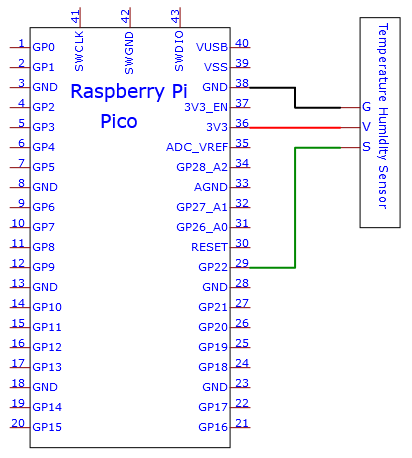


Check the code in the folder "**...\6.Codes\Python_Codes(Raspberry-Pi)**".

You can move the code anywhere. For example, We copy the **Python_Codes(Raspberry-Pi).zip** to the <span style="color: rgb(255, 76, 65);">pi</span> folder of the Raspberry Pi system.

<span style="color: rgb(255, 76, 65);">Path: home/pi/Python_Codes(Raspberry-Pi)</span>

<br>
<br>


Open“Thonny”, click“This computer”→“home”→“pi”→“Python_Codes(Raspberry-Pi)”→“Project 29：Temperature Humidity Meter”. Select“dht11\.py”,  right-click and select“**Upload to /**”，waiting for the “dht11\.py”to be uploaded to the Raspberry Pi Pico. And double left-click the“Project\_29.1\_Detect\_Temperature\_Humidity.py”.

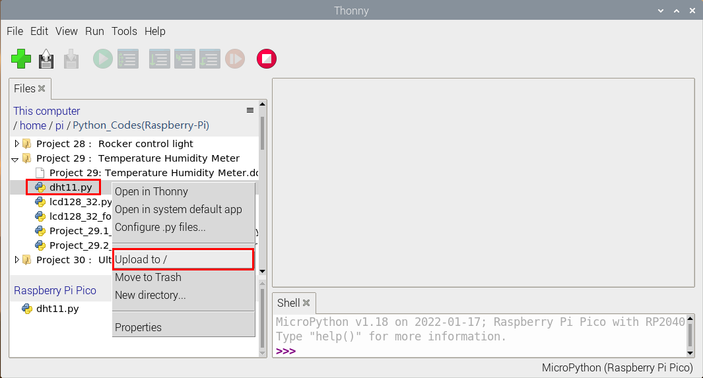

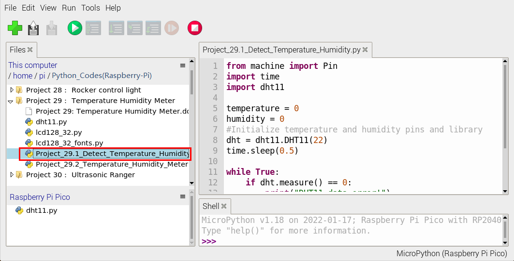

```Python
from machine import Pin
import time
import dht11

temperature = 0
humidity = 0
#Initialize temperature and humidity pins and library
dht = dht11.DHT11(22)
time.sleep(0.5)

while True:
    if dht.measure() == 0:
        print("DHT11 data error!")
        break
    time.sleep(1)
    temperature = dht.temperature()
    humidity = dht.humidity()
    print("temperature: %dC  humidity: %d"%(temperature, humidity) + "%")
```

Ensure that the Raspberry Pi Pico is connected to the computer，click“Stop/Restart backend”.

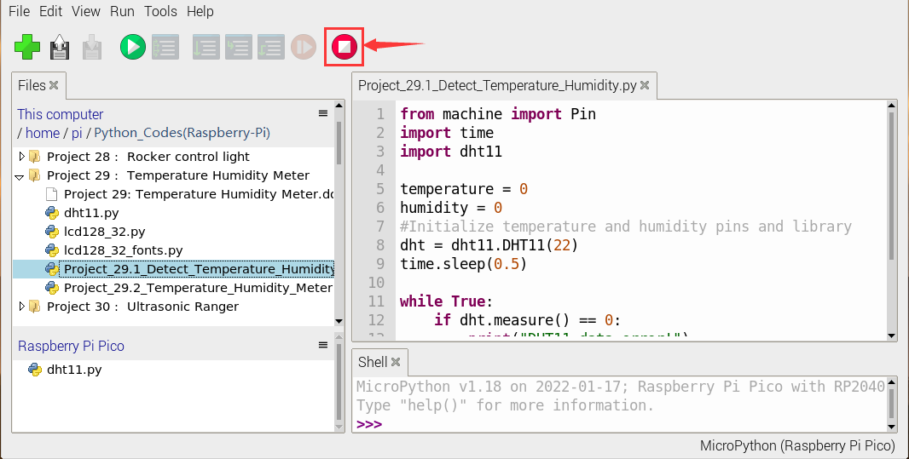

Click “Run current script”, the code starts executing, we will see that the "Shell" window of Thonny IDE will print the temperature and humidity data in the current surroundings, as shown in the following figure. Click“Stop/Restart backend”to exit the program.

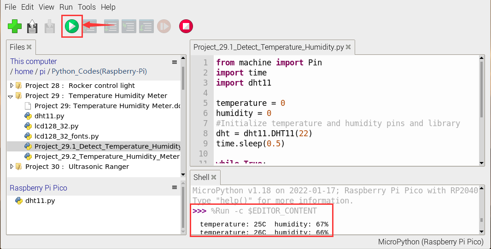

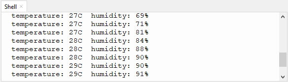

5.**Circuit Diagram and Wiring Diagram**

Now we start printing the value of the XHT11 temperature and humidity sensor with LCD screen. We will see the corresponding values on the LCD screen. Let's get started with this project. Please follow the wiring diagram below.

Note: LCD\_128X32\_DOT must be connected with 10CM M-F Dupont wires, the LCD\_128X32\_DOT will display normally;  Otherwise, using a 20CM M-F Dupont wire may cause the LCD\_128X32\_DOT display abnormally.  

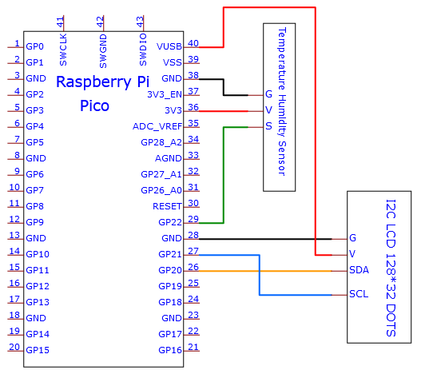


6.**Test Code**

Check the code in the folder "**...\6.Codes\Python_Codes(Raspberry-Pi)**".

You can move the code anywhere. For example, We copy the **Python_Codes(Raspberry-Pi).zip** to the <span style="color: rgb(255, 76, 65);">pi</span> folder of the Raspberry Pi system.

<span style="color: rgb(255, 76, 65);">Path: home/pi/Python_Codes(Raspberry-Pi)</span>

<br>
<br>


Open“Thonny”, click“This computer”→“home”→“pi”→“Python_Codes(Raspberry-Pi)”→“Project 29：Temperature Humidity Meter”. Select“dht11\.py”,“lcd128\_32.py”and “lcd128\_32\_fonts.py”，right-click and select“**Upload to /**”，waiting for the “dht11\.py”，“lcd128\_32.py”and“lcd128\_32\_fonts.py”to be uploaded to the Raspberry Pi Pico. And double left-click the“Project\_29.2\_Temperature\_Humidity\_Meter.py”.

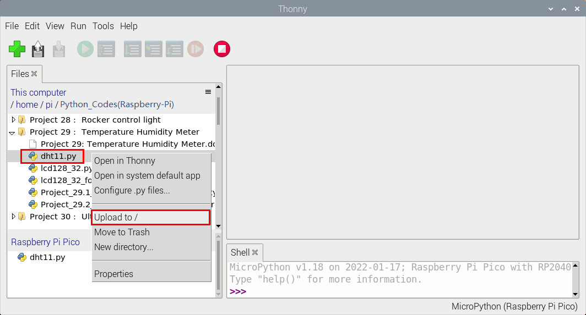

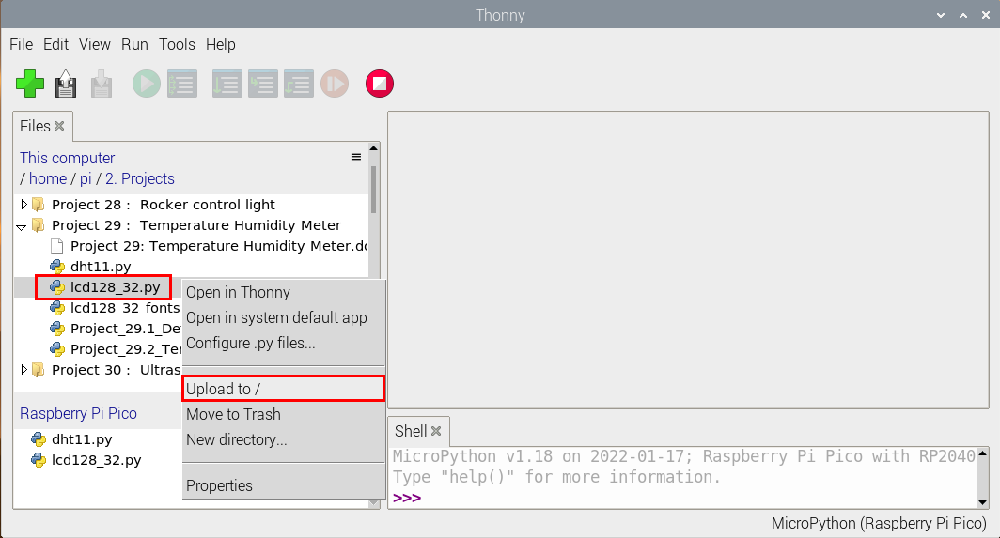

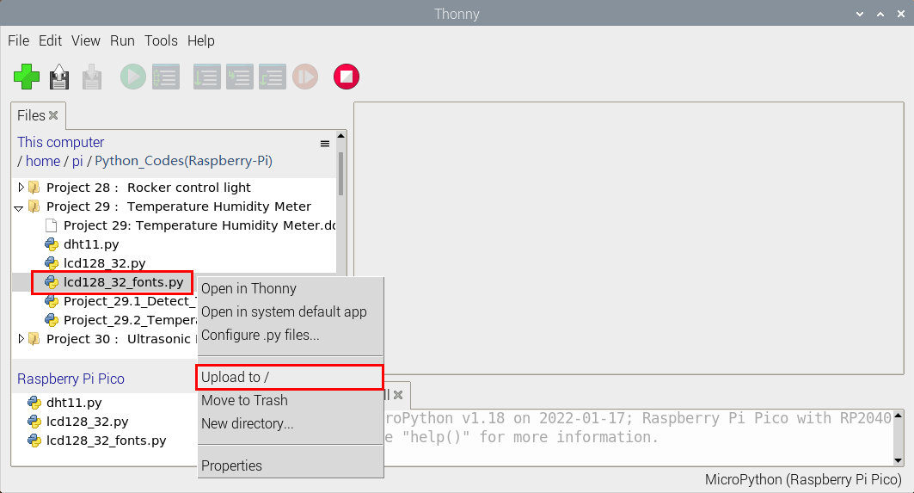

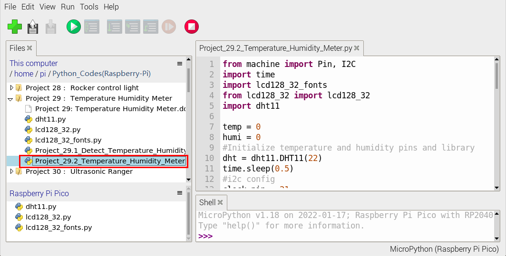

```Python
from machine import Pin, I2C
import time
import lcd128_32_fonts
from lcd128_32 import lcd128_32
import dht11

temp = 0
humi = 0
#Initialize temperature and humidity pins and library
dht = dht11.DHT11(22)
time.sleep(0.5)
#i2c config
clock_pin = 21
data_pin = 20
bus = 0
i2c_addr = 0x3f
use_i2c = True

def scan_for_devices():
    i2c = machine.I2C(bus,sda=machine.Pin(data_pin),scl=machine.Pin(clock_pin))
    devices = i2c.scan()
    if devices:
        for d in devices:
            print(hex(d))
    else:
        print('no i2c devices')

try:
    while True:
        if dht.measure() == 0:
            print("DHT11 data error")
            break
        temp = int(dht.temperature())
        humi = int(dht.humidity())

        if use_i2c:
            scan_for_devices()
            lcd = lcd128_32(data_pin, clock_pin, bus, i2c_addr)
            
        lcd.Clear()
        lcd.Cursor(0, 0)
        lcd.Display("temper:")
        lcd.Cursor(0, 8)
        lcd.Display(str(temp))
        lcd.Cursor(0, 11)
        lcd.Display("C")
        lcd.Cursor(2, 0)
        lcd.Display("Humid:")
        lcd.Cursor(2, 7)
        lcd.Display(str(humi))
        lcd.Cursor(2, 10)
        lcd.Display("%")
        time.sleep(1)
except:
    pass
```

7.**Test Result**
    
Ensure that the Raspberry Pi Pico is connected to the computer，click“Stop/Restart backend”.
    
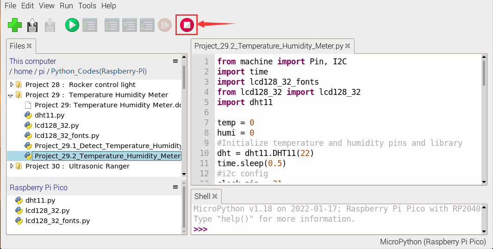
    
Click “Run current script”, the code starts executing, we will see that the LCD\_128X32\_DOT will display temperature and humidity in the current environment. Press“Ctrl+C”or click“Stop/Restart backend”to exit the program.

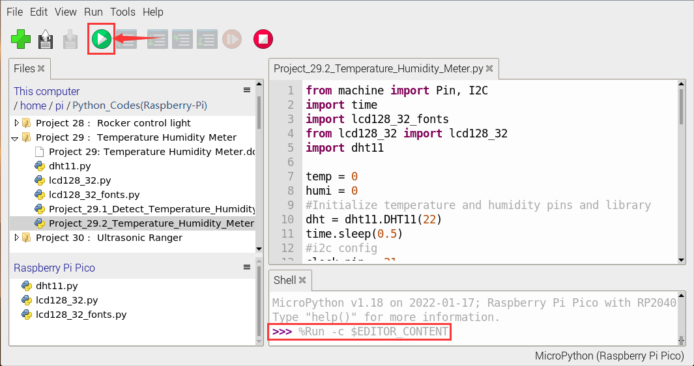


### Project 30：Ultrasonic Ranger

**1. Introduction**

The HC-SR04 ultrasonic sensor is a very affordable distance sensor, mainly used for obstacle avoidance in various robotic projects. It is also used for water level sensing and even as a parking sensor. We treat the ultrasonic sensors as bat's eyes. In the dark, bats can still identify objects in front of them and directions through ultrasound. In this project, we will use a Raspberry Pi Pico to control the ultrasonic sensor and an LED analog ultrasonic ranger.  

**2. Components Required**

<table>
<tbody>
<tr class="odd">
<td>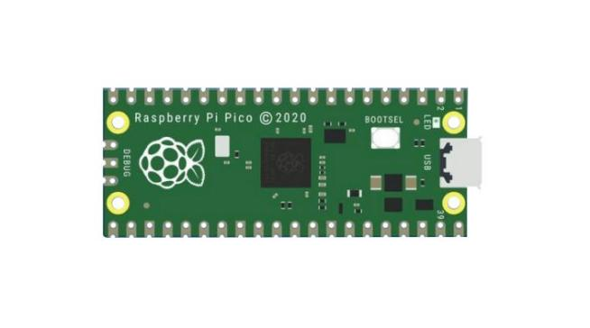</td>
<td></td>
<td></td>
<td></td>
<td></td>
</tr>
<tr class="even">
<td>Raspberry Pi Pico*1</td>
<td>Raspberry Pi Pico Expansion Board*1</td>
<td>Ultrasonic Sensor*1</td>
<td>Red LED*4</td>
<td>USB Cable*1</td>
</tr>
<tr class="odd">
<td></td>
<td></td>
<td></td>
<td></td>
<td></td>
</tr>
<tr class="even">
<td>M-F Dupont Wires</td>
<td>220ΩResistor*4</td>
<td>Jumper Wires</td>
<td>Breadboard*1</td>
<td></td>
</tr>
</tbody>
</table>

**3. Component Knowledge**

**HC-SR04 Ultrasonic Sensor:** Like bats, sonar is used to determine the distance to an object. It provides accurate non-contact range detection, high-precision and stable readings. Its operation is not affected by sunlight or black materials, just like a precision camera (acoustically softer materials like cloth are difficult to detect). It has an ultrasonic transmitter and receiver.


In front of the ultrasonic sensor are two metal cylinders, these are the converters. The converters convert the mechanical energy into an electrical signal. In the ultrasonic sensor, there are transmitting converters and receiving converters. The transmitting converter converts the electric signal into an ultrasonic pulse, and the receiving converter converts the reflected ultrasonic pulse back to an electric signal.

If you look at the back of the ultrasonic sensor, you will see an IC behind the transmitting converter, which controls the transmitting converter. There is also an IC behind the receiving converter, which is a quad operational amplifier that amplifies the signal generated by the receiving converter into a signal large enough to be transmitted to the Raspberry Pi Pico.

**Sequence diagrams:**

The figure shows the sequence diagram of the HC-SR04. To start the measurement, the Trig of SR04 must receive at least 10us high pulse(5V), which will activate the sensor to emit 8 cycles of 40kHz ultrasonic pulses, and wait for the reflected ultrasonic pulses. When the sensor detects ultrasound from the receiver, it sets the Echo pin to high (5V) and delays it by one cycle (width), proportional to the distance. To get the distance, measure the width of the Echo pin.

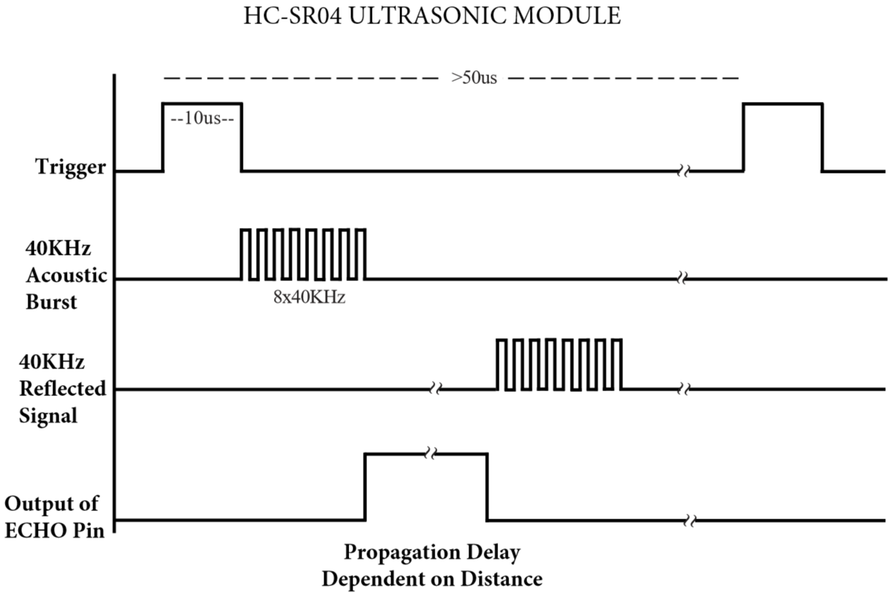

Time = Echo pulse width, its unit is “us” (microseconds)

Distance in centimeters = time / 58

Distance in inches = time / 148

4.**Read the Distance Value**
    
We will start with a simple ultrasonic distance measurement and print the measured distance on the serial monitor.
    

    
The HC-SR04 ultrasonic sensor has four pins, they are Vcc, Trig, Echo and GND. The Vcc pin provides the power source for generating ultrasonic pulses and is connected to Vcc (+5V). The GND pin is grounded. The Trig pin is where the Arduino sends a signal to start the ultrasonic pulse. The Echo pin is where the ultrasonic sensor sends information about the duration of the ultrasonic pulse to the Plus control board. Wiring as shown below.
    

    
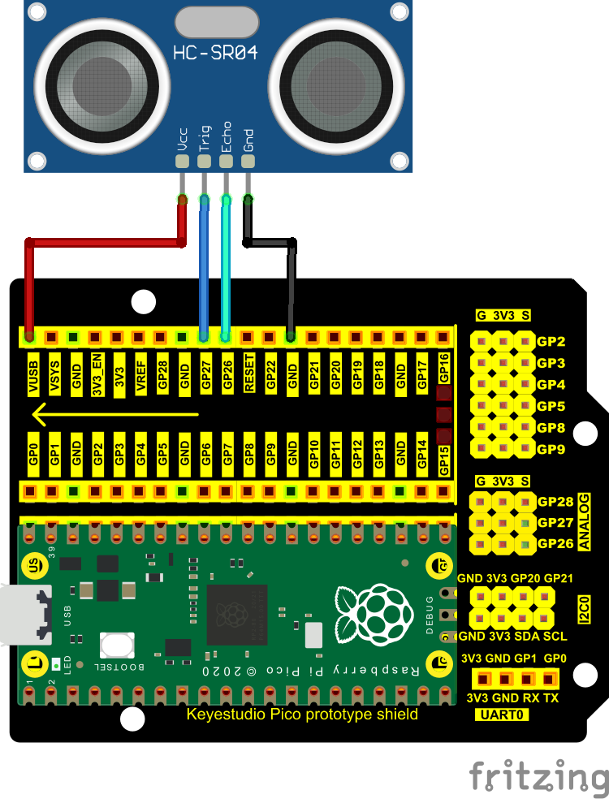

Check the code in the folder "**...\6.Codes\Python_Codes(Raspberry-Pi)**".

You can move the code anywhere. For example, We copy the **Python_Codes(Raspberry-Pi).zip** to the <span style="color: rgb(255, 76, 65);">pi</span> folder of the Raspberry Pi system.

<span style="color: rgb(255, 76, 65);">Path: home/pi/Python_Codes(Raspberry-Pi)</span>

<br>
<br>


Open“Thonny”, click“This computer”→“home”→“pi”→“Python_Codes(Raspberry-Pi)”→“Project 30：Ultrasonic Ranger”. And double left-click the“Project 30.1\_Ultrasonic\_Ranging.py”.

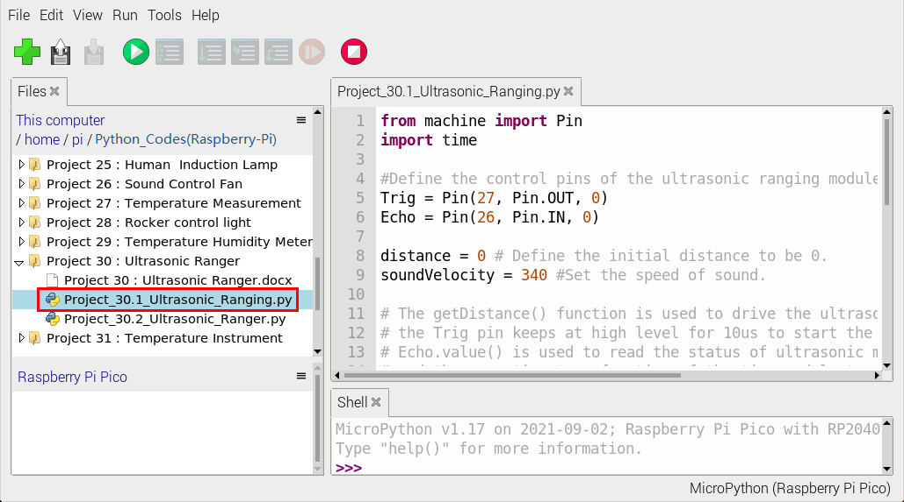

```Python
from machine import Pin
import time

#Define the control pins of the ultrasonic ranging module. 
Trig = Pin(27, Pin.OUT, 0)
Echo = Pin(26, Pin.IN, 0)

distance = 0 # Define the initial distance to be 0.
soundVelocity = 340 #Set the speed of sound.

# The getDistance() function is used to drive the ultrasonic module to measure distance,
# the Trig pin keeps at high level for 10us to start the ultrasonic module.
# Echo.value() is used to read the status of ultrasonic module’s Echo pin,
# and then use timestamp function of the time module to calculate the duration of Echo
# pin’s high level,calculate the measured distance based on time and return the value.
def getDistance():
    Trig.value(1)
    time.sleep_us(10)
    Trig.value(0)
    while not Echo.value():
        pass
    pingStart = time.ticks_us()
    while Echo.value():
        pass
    pingStop = time.ticks_us()
    distanceTime = time.ticks_diff(pingStop, pingStart) // 2
    distance = int(soundVelocity * distanceTime // 10000)
    return distance

# Delay for 2 seconds and wait for the ultrasonic module to stabilize,
# Print data obtained from ultrasonic module every 500 milliseconds. 
time.sleep(2)
while True:
    time.sleep_ms(500)
    distance = getDistance()
    print("Distance: ", distance, "cm")
```

Ensure that the Raspberry Pi Pico is connected to the computer，click“Stop/Restart backend”.

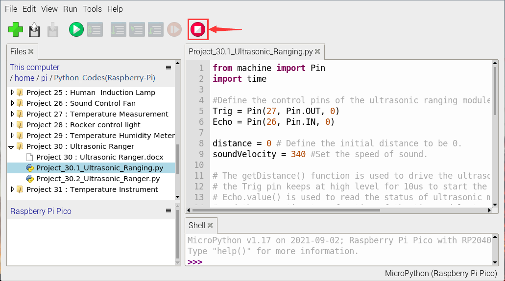

Click“Run current script”, the code starts executing, we will see that the "Shell" window of Thonny IDE will print the distance value between the ultrasonic sensor and the object. Press“Ctrl+C”or click“Stop/Restart backend”to exit the program.

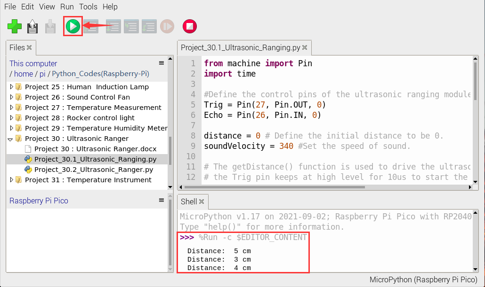


5.**Circuit Diagram and Wiring Diagram**
    
Next, we will make a simple ultrasonic ranger using a Raspberry Pi Pico to control an ultrasonic sensor and 4 LED lights. Connect the wires as shown below.

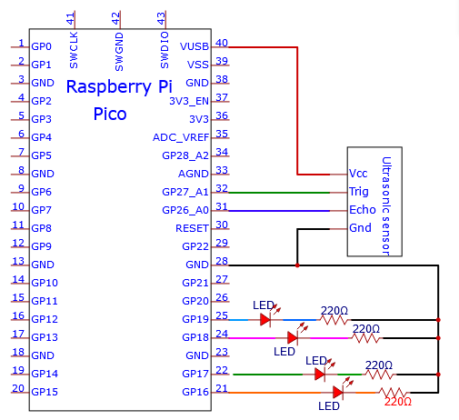

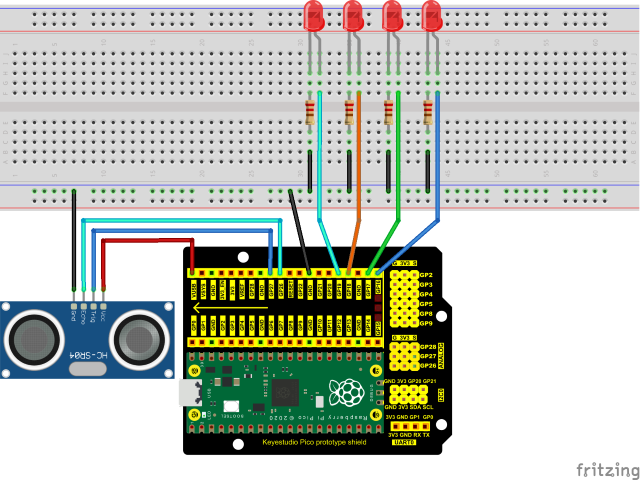

6.**Test Code**

Check the code in the folder "**...\6.Codes\Python_Codes(Raspberry-Pi)**".

You can move the code anywhere. For example, We copy the **Python_Codes(Raspberry-Pi).zip** to the <span style="color: rgb(255, 76, 65);">pi</span> folder of the Raspberry Pi system.

<span style="color: rgb(255, 76, 65);">Path: home/pi/Python_Codes(Raspberry-Pi)</span>

<br>
<br>


Open“Thonny”, click“This computer”→“home”→“pi”→“Python_Codes(Raspberry-Pi)”→“Project 30：Ultrasonic Ranger”. And double left-click the“Project\_30.2\_Ultrasonic\_Ranger.py”.

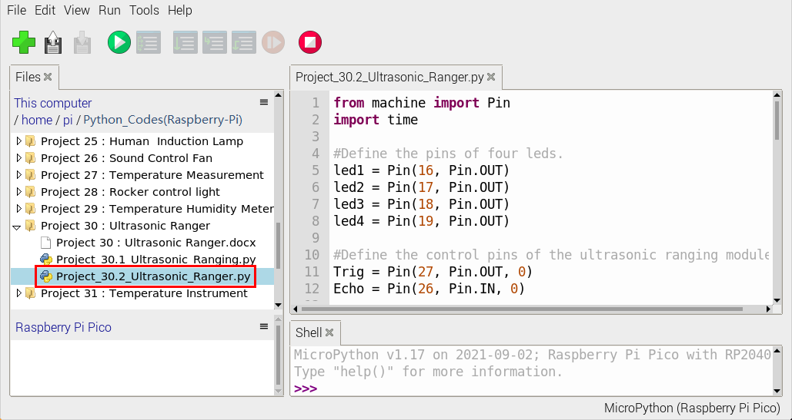

```Python
from machine import Pin
import time

#Define the pins of four leds.
led1 = Pin(16, Pin.OUT)
led2 = Pin(17, Pin.OUT)
led3 = Pin(18, Pin.OUT)
led4 = Pin(19, Pin.OUT)

#Define the control pins of the ultrasonic ranging module. 
Trig = Pin(27, Pin.OUT, 0)
Echo = Pin(26, Pin.IN, 0)

distance = 0 # Define the initial distance to be 0.
soundVelocity = 340 #Set the speed of sound.

# The getDistance() function is used to drive the ultrasonic module to measure distance,
# the Trig pin keeps at high level for 10us to start the ultrasonic module.
# Echo.value() is used to read the status of ultrasonic module’s Echo pin,
# and then use timestamp function of the time module to calculate the duration of Echo
# pin’s high level,calculate the measured distance based on time and return the value.
def getDistance():
    Trig.value(1)
    time.sleep_us(10)
    Trig.value(0)
    while not Echo.value():
        pass
    pingStart = time.ticks_us()
    while Echo.value():
        pass
    pingStop = time.ticks_us()
    distanceTime = time.ticks_diff(pingStop, pingStart) // 2
    distance = int(soundVelocity * distanceTime // 10000)
    return distance

# Delay for 2 seconds and wait for the ultrasonic module to stabilize,
# Print data obtained from ultrasonic module every 500 milliseconds. 
time.sleep(2)
while True:
    time.sleep_ms(500)
    distance = getDistance()
    print("Distance: ", distance, "cm")
    if distance <= 5:
       led1.value(1)
    else:
       led1.value(0)
    if distance <= 10:
       led2.value(1)
    else:
       led2.value(0)
    if distance <= 15:
       led3.value(1)
    else:
       led3.value(0)
    if distance <= 20:
       led4.value(1)
    else:
       led4.value(0)
```

7.**Test Result**
    
Ensure that the Raspberry Pi Pico is connected to the computer，click“Stop/Restart backend”.
    
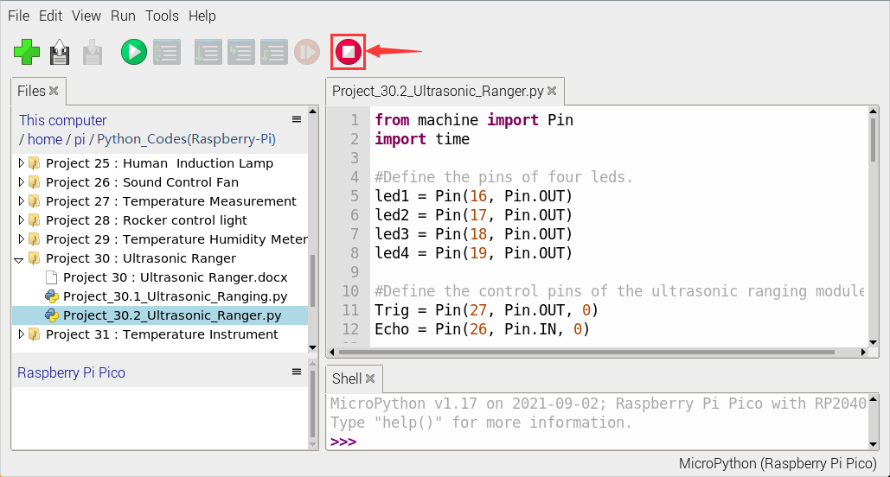
    
Click “Run current script”, the code starts executing, we will see that the "Shell" window of Thonny IDE will print the distance between the ultrasonic sensor and the object, and the corresponding LED will light up when we move our hand in front of the ultrasonic sensor. Press“Ctrl+C”or click“Stop/Restart backend”to exit the program.

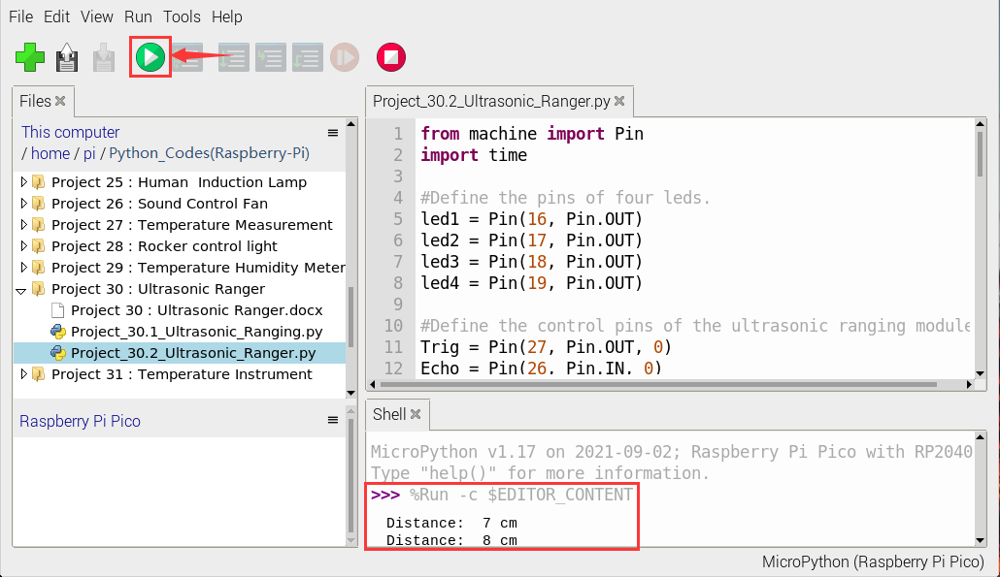


### Project 31：Temperature Instrument

1.**Introduction**
    
Thermistor is a kind of resistor whose resistance depends on temperature changes, which is widely used in gardening, home alarm system and other devices. Therefore, we can use this feature to make a temperature instrument.
    
2.**Components Required**

<table>
<tbody>
<tr class="odd">
<td>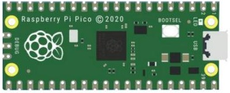</td>
<td></td>
<td>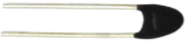</td>
<td></td>
<td></td>
</tr>
<tr class="even">
<td>Raspberry Pi Pico*1</td>
<td>Raspberry Pi Pico Expansion Board*1</td>
<td>Thermistor*1</td>
<td>10KΩResistor*1</td>
<td>USB Cable*1</td>
</tr>
<tr class="odd">
<td>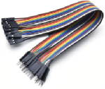</td>
<td></td>
<td></td>
<td></td>
<td></td>
</tr>
<tr class="even">
<td>10CM M-F Dupont Wires</td>
<td>Breadboard*1</td>
<td>LCD 128X32 DOT*1</td>
<td>Jumper Wires</td>
<td></td>
</tr>
</tbody>
</table>

3.**Component Knowledge**
    
Thermistor: A thermistor is a temperature sensitive resistor. When it senses a change in temperature, the thermistor's resistance changes. We can use this feature to detect temperature intensity with thermistor. Thermistors and its electronic symbols are shown below:


The relation between thermistor resistance and temperature is:

**in the formula:**

Rt is the resistance of the thermistor at T2 temperature.

R is the nominal resistance value of the thermistor at T1 room temperature.

EXP\[n\] is the nth power of e.

B is the temperature index

T1 and T2 refer to K degrees, that is, Kelvin temperature. Kelvin temperature =273.15 + Celsius temperature. For thermistor parameters, we use : B=3950, R=10KΩ，T1=25℃.The circuit connection method of thermistor is similar to that the photoresistor, as shown below :


We can use the value measured by the ADC converter to get the resistance value of the thermistor, and then use the formula to get the temperature value. Therefore, the temperature formula can be deduced as:

4.**Read the Values**
    
First we will learn the thermistor to read the current ADC value, voltage value and temperature value and print them out . Please connect the wires according to the following wiring diagram.


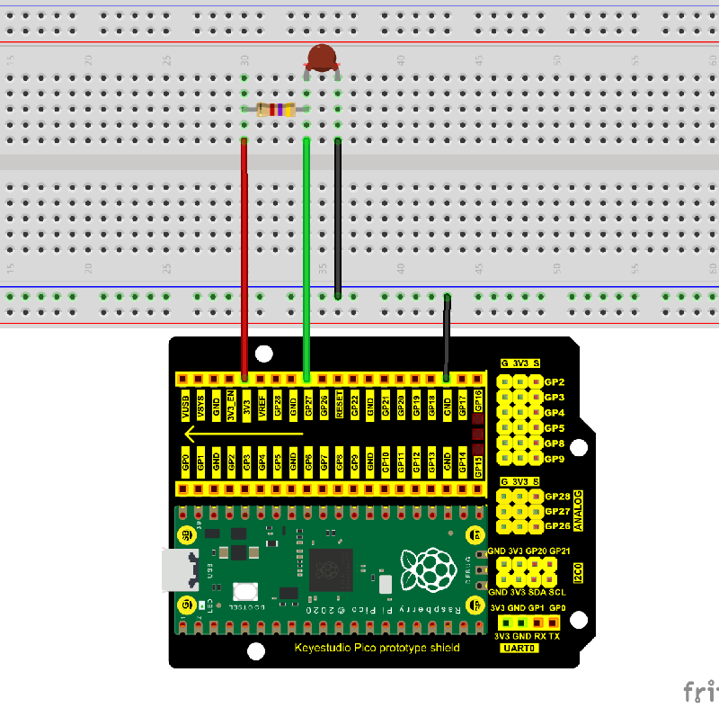

Check the code in the folder "**...\6.Codes\Python_Codes(Raspberry-Pi)**".

You can move the code anywhere. For example, We copy the **Python_Codes(Raspberry-Pi).zip** to the <span style="color: rgb(255, 76, 65);">pi</span> folder of the Raspberry Pi system.

<span style="color: rgb(255, 76, 65);">Path: home/pi/Python_Codes(Raspberry-Pi)</span>

<br>
<br>


Open“Thonny”, click“This computer”→“home”→“pi”→“Python_Codes(Raspberry-Pi)”→“Project 31: Temperature Instrument”. And double left-click the “Project\_31.1\_Read\_the\_thermistor\_analog\_value.py”.

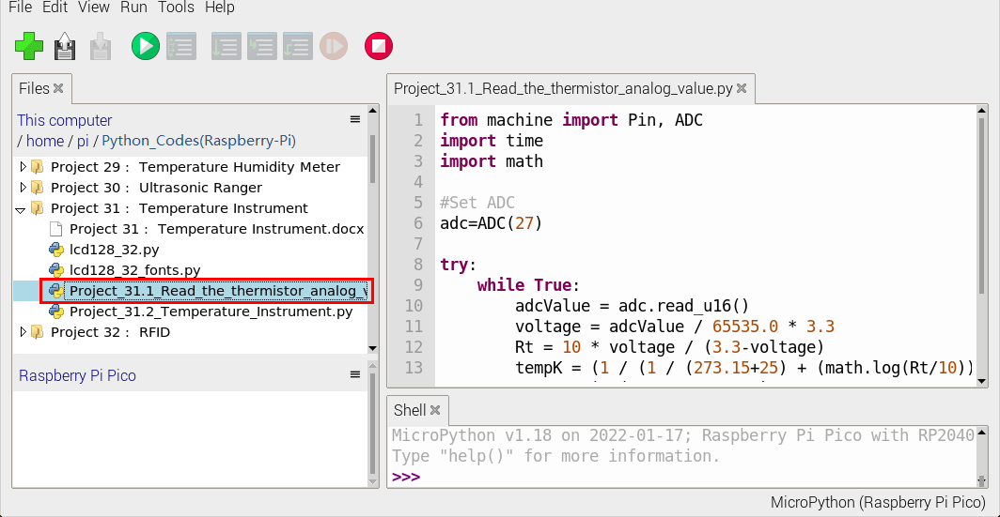

```Python
from machine import Pin, ADC
import time
import math

#Set ADC
adc=ADC(27)

try:
    while True:
        adcValue = adc.read_u16()
        voltage = adcValue / 65535.0 * 3.3
        Rt = 10 * voltage / (3.3-voltage)
        tempK = (1 / (1 / (273.15+25) + (math.log(Rt/10)) / 3950))
        tempC = int(tempK - 273.15)
        print("ADC value:", adcValue, "  Voltage: %0.2f"%voltage + "V",
              "  Temperature: " + str(tempC) + "C")
        time.sleep(1)
except:
    pass
```

Ensure that the Raspberry Pi Pico is connected to the computer，click“Stop/Restart backend”.

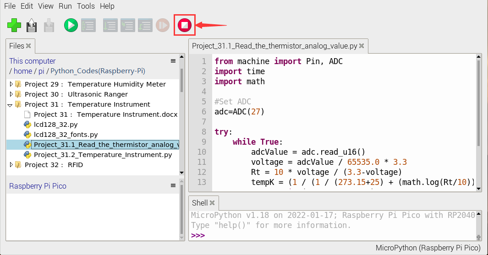

Click “Run current script”, the code starts executing, we will see that the "Shell" window of Thonny IDE will continuously display the thermistor's current ADC value, voltage value, and temperature value.  Try pinching the thermistor with your index finger and thumb (don't touch the wire) for a while, and you will see the temperature increase. Press“Ctrl+C”or click“Stop/Restart backend”to exit the program.

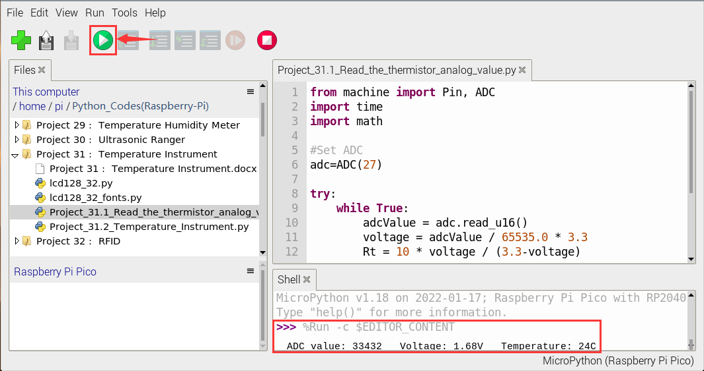


5.**Circuit Diagram and Wiring Diagram**

Note : LCD\_128X32\_DOT must be connected with a 10CM M-F Dupont wire, the LCD\_128X32\_DOT will display normally. Otherwise, using a 20CM M-F Dupont wire may cause the LCD\_128X32\_DOT display abnormally.  

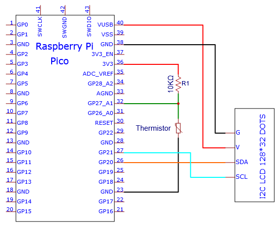


6.**Test Code**

Check the code in the folder "**...\6.Codes\Python_Codes(Raspberry-Pi)**".

You can move the code anywhere. For example, We copy the **Python_Codes(Raspberry-Pi).zip** to the <span style="color: rgb(255, 76, 65);">pi</span> folder of the Raspberry Pi system.

<span style="color: rgb(255, 76, 65);">Path: home/pi/Python_Codes(Raspberry-Pi)</span>

<br>
<br>


Open“Thonny”, click“This computer”→“home”→“pi”→“Python_Codes(Raspberry-Pi)”→“Project 31：Temperature Instrument”.
Select“lcd128\_32.py”and“lcd128\_32\_fonts.py”， right-click and select“**Upload to /**”，waiting for the “lcd128\_32.py”and“lcd128\_32\_fonts.py”to be uploaded to the Raspberry Pi Pico. And double left-click the “Project\_31.2\_Temperature\_Instrument.py”.

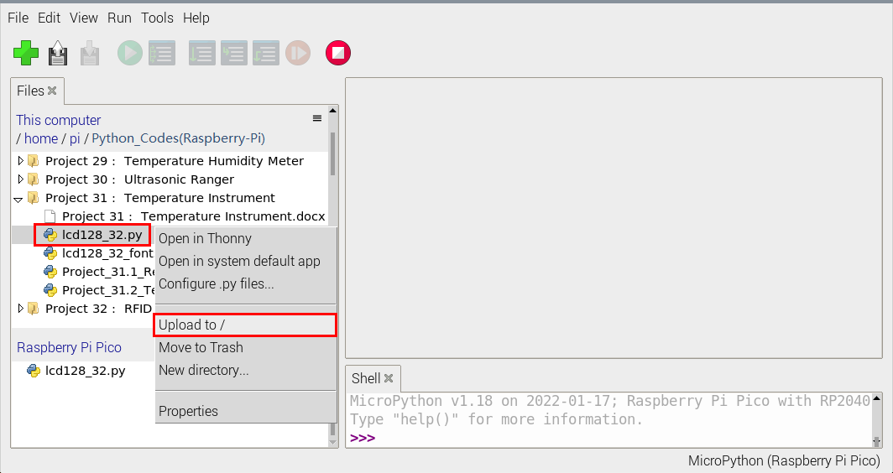

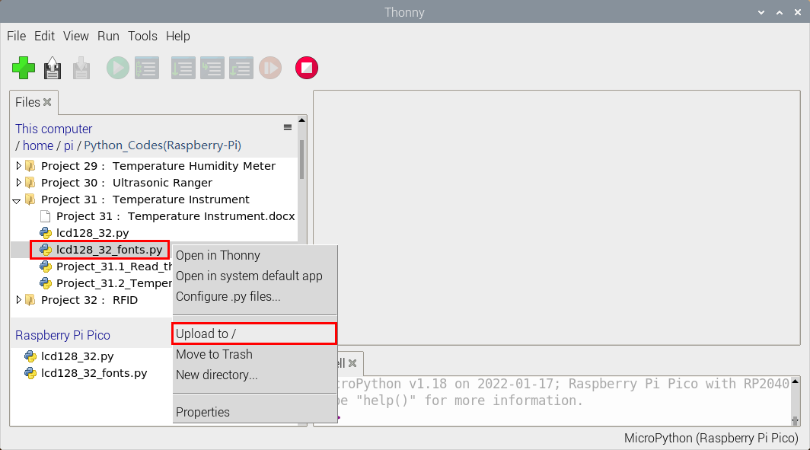

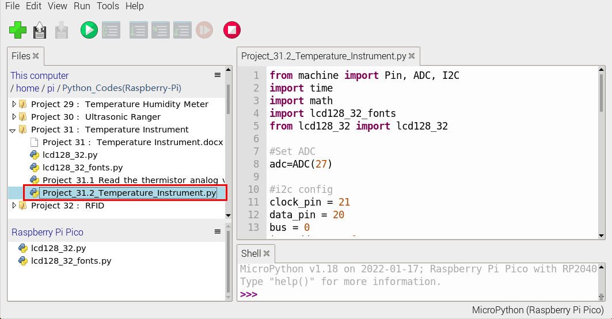

```Python
from machine import Pin, ADC, I2C
import time
import math
import lcd128_32_fonts
from lcd128_32 import lcd128_32

#Set ADC
adc=ADC(27)

#i2c config
clock_pin = 21
data_pin = 20
bus = 0
i2c_addr = 0x3f
use_i2c = True

def scan_for_devices():
    i2c = machine.I2C(bus,sda=machine.Pin(data_pin),scl=machine.Pin(clock_pin))
    devices = i2c.scan()
    if devices:
        for d in devices:
            print(hex(d))
    else:
        print('no i2c devices')

try:
    while True:
        adcValue = adc.read_u16()
        voltage = adcValue / 65535.0 * 3.3
        Rt = 10 * voltage / (3.3-voltage)
        tempK = (1 / (1 / (273.15+25) + (math.log(Rt/10)) / 3950))
        tempC = int(tempK - 273.15)
        
        if use_i2c:
            scan_for_devices()
            lcd = lcd128_32(data_pin, clock_pin, bus, i2c_addr)
            
        lcd.Clear()
        lcd.Cursor(0, 0)
        lcd.Display("Voltage:")
        lcd.Cursor(0, 8)
        lcd.Display(str(voltage))
        lcd.Cursor(0, 20)
        lcd.Display("V")
        lcd.Cursor(2, 0)
        lcd.Display("Temperature:")
        lcd.Cursor(2, 12)
        lcd.Display(str(tempC))
        lcd.Cursor(2, 15)
        lcd.Display("C")
        time.sleep(0.5)
except:
    pass

```

7.**Test Result**
    
Ensure that the Raspberry Pi Pico is connected to the computer，click“Stop/Restart backend”.
    
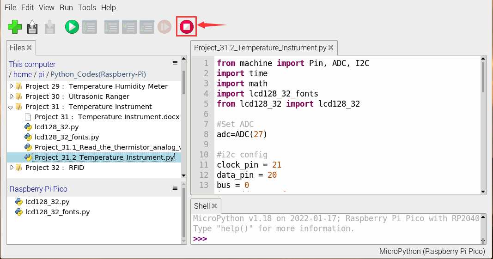
    
Click“Run current script”, the code starts executing, we will see that the LCD 128X32 DOT displays the voltage value of the thermistor and the temperature value in the current environment. Press“Ctrl+C”or click“Stop/Restart backend”to exit the program.

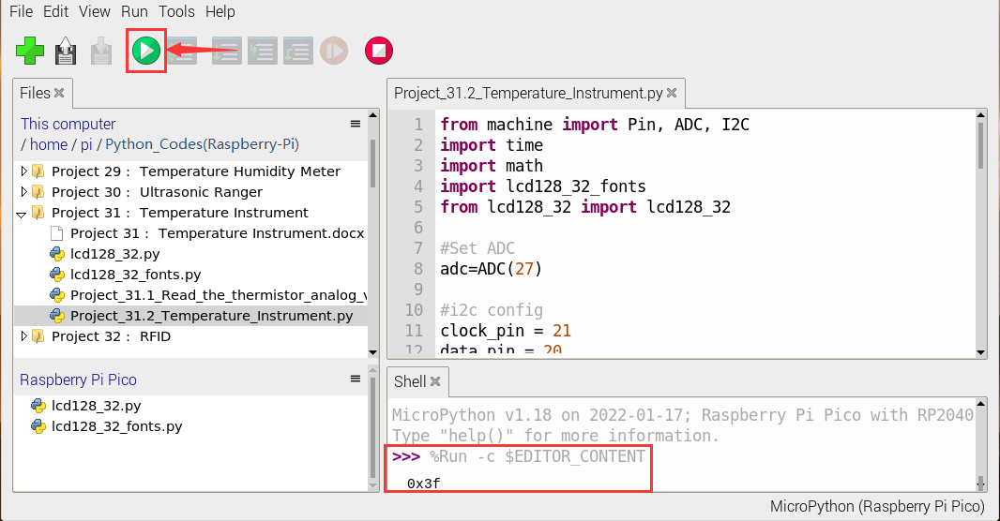


### Project 32：RFID

1.**Introduction**
    
Nowadays, many residential districts use this function to open the door by swiping the card, which is very convenient. In this lesson, we will learn how to use RFID(radio frequency identification) wireless communication technology and read and write the key chain card (white card) and control the steering gear rotation by RFID-MFRC522 module.
    
2.**Components Required**

<table>
<tbody>
<tr class="odd">
<td></td>
<td></td>
<td>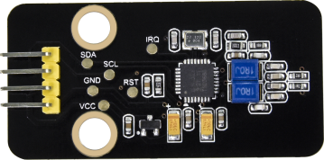</td>
<td>
</td>
</tr>
<tr class="even">
<td>Raspberry Pi Pico*1</td>
<td>Raspberry Pi Pico Expansion Board*1</td>
<td>RFID-MFRC522 Module*1</td>
<td>Key Chain*1</td>
</tr>
<tr class="odd">
<td>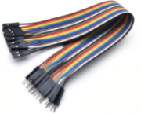
</td>
<td></td>
<td>
</td>
<td></td>
</tr>
<tr class="even">
<td>F-F Dupont Wires</td>
<td>Servo*1</td>
<td>White Card*1</td>
<td>USB Cable*1</td>
</tr>
</tbody>
</table>

3.**Component Knowledge**
    
**RFID**：RFID (Radio Frequency Identification) is a wireless communication technology. A complete RFID system generally consists of a transponder and a reader. Usually we use tags as transponders, and each tag has a unique code attached to the object to identify the target object. The reader is a device that reads (or writes) tag information.
    
Products derived from RFID technology can be divided into three categories: passive RFID products, active RFID products and
semi-active RFID products. However, the passive RFID products are the earliest, most mature and most widely used products on the market, which can be seen everywhere in our daily life, such as bus card, meal card, bank card, hotel access card, etc., which are close contact identification. 
    
The main operating frequencies of the passive RFID products are 125KHZ(low frequency), 13.56mhz (high frequency), 433MHZ(UHF), and 915MHZ(UHF). The active and the semi-active RFID products operate at higher frequencies.
    
The RFID module we use is a passive RFID product with a working frequency of 13.56MHz.  
    
    
    
**RFID-RC522 Module：** The MFRC522 is a highly integrated reader/writer IC for 13.56MHz contactless communication. Its
internal transmitter is capable of driving a read/write antenna , which is designed to communicate with ISO/IEC 14443A /MIFARE cards and transponders without the need for additional active circuits. The receiving module provides an efficient implementation of demodulation and decoding of signals from ISO/IEC 14443 A /MIFARE compatible cards and transponders. The digital module manages complete ISO/IEC 14443A framing and error detection (parity and CRC) features.  
    
The RFID module uses the MFRC522 as the control chip and adopts I2C(Inter-Integrated Circuit) interface.  
    

    
Specifications:
    
Operating voltage: DC 3.3V-5V
    
Operating current: 13—100mA/DC 5V
    
Idling current: 10-13mA/DC 5V
    
Sleep current: \<80uA

Peak current: \<100mA
    
Operating frequency: 13.56MHz
    
Maximum power: 0.5W
    
Supported card types: mifare1 S50, mifare1 S70, mifare UltraLight, mifare Pro and mifare Desfire
    
Environmental operating temperature: -20 to 80 degrees Celsius
    
Environment storage temperature: -40 to 85 degrees Celsius
    
Relative Humidity: 5% to 95%
    
Data transfer rate: The maximum is 10Mbit/s.
    
4.**Read the Card Number Value**
    
We will read the UNIQUE ID number (UID) of the RFID card and identify its type. And display relevant information through the "Shell" window of Thonny IDE. The wiring diagram is as follows:
    


Check the code in the folder "**...\6.Codes\Python_Codes(Raspberry-Pi)**".

You can move the code anywhere. For example, We copy the **Python_Codes(Raspberry-Pi).zip** to the <span style="color: rgb(255, 76, 65);">pi</span> folder of the Raspberry Pi system.

<span style="color: rgb(255, 76, 65);">Path: home/pi/Python_Codes(Raspberry-Pi)</span>

<br>
<br>


Open“Thonny”, click“This computer”→“home”→“pi”→“Python_Codes(Raspberry-Pi)”→“Project 32：RFID”.
Select“mfrc522\_config.py”,“mfrc522\_i2c.py”and“soft\_iic.py”，right-click and select “**Upload to /**”,waiting for the“mfrc522\_config.py”“mfrc522\_i2c.py”and“soft\_iic.py”to be uploaded to the Raspberry Pi Pico. And double left-click the“Project\_32.1\_RFID\_Read\_UID.py”.

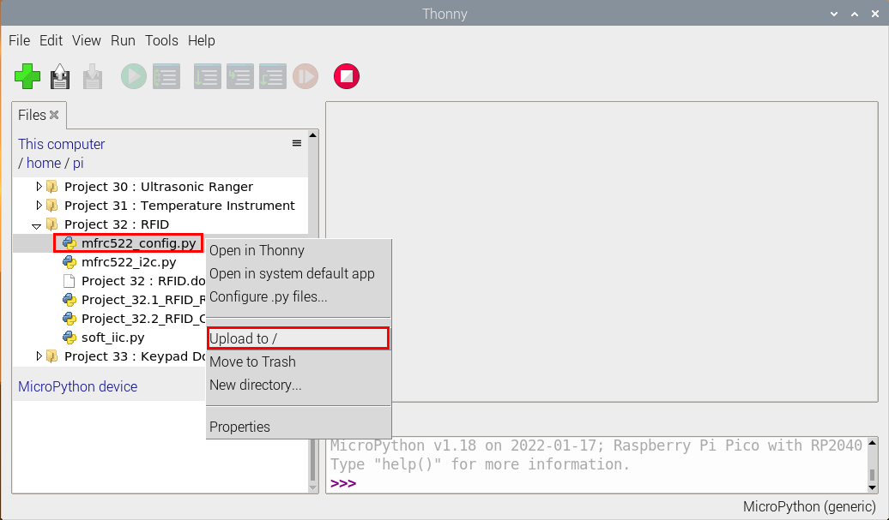

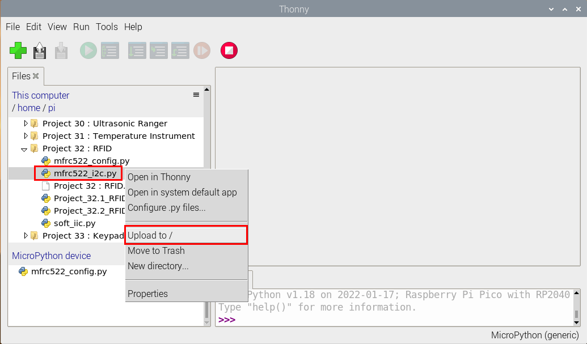

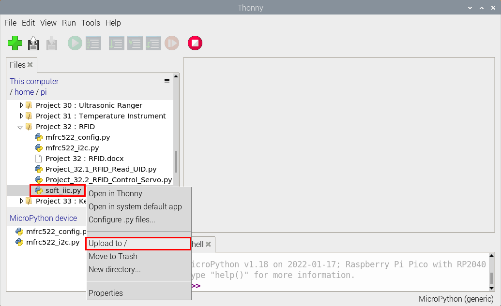

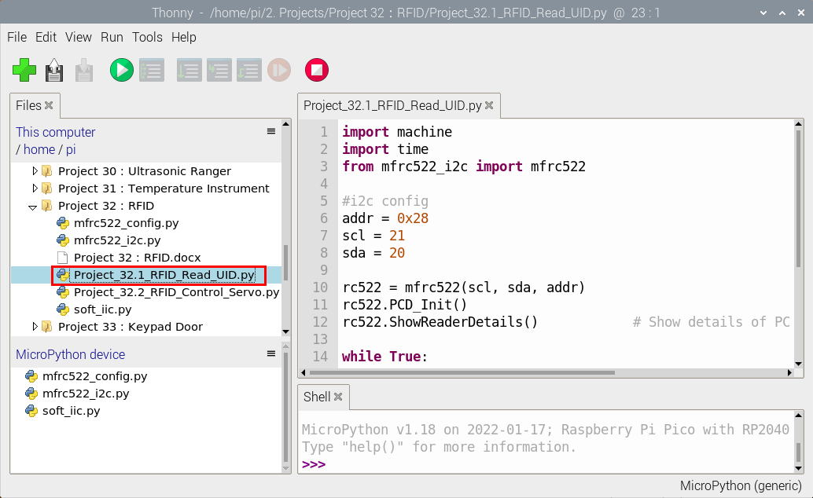

```Python
import machine
import time
from mfrc522_i2c import mfrc522

#i2c config
addr = 0x28
scl = 21
sda = 20
    
rc522 = mfrc522(scl, sda, addr)
rc522.PCD_Init()
rc522.ShowReaderDetails()            # Show details of PCD - MFRC522 Card Reader details

while True:
    if rc522.PICC_IsNewCardPresent():
        #print("Is new card present!")
        if rc522.PICC_ReadCardSerial() == True:
            print("Card UID:")
            print(rc522.uid.uidByte[0 : rc522.uid.size])
    #time.sleep(1)
```

Ensure that the Raspberry Pi Pico is connected to the computer，click“Stop/Restart backend”.

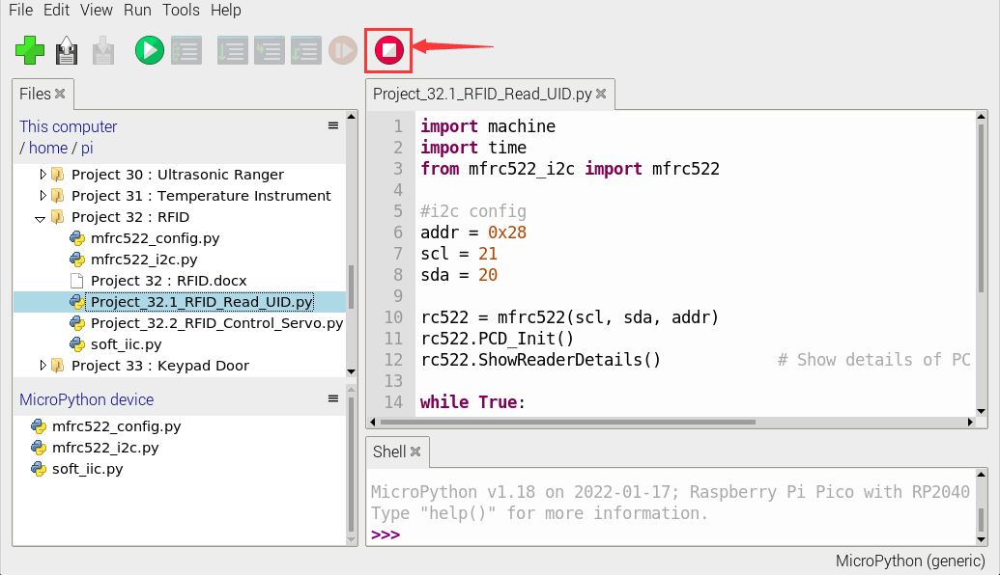

Click“Run current script”, the code starts executing, we will see that

place the door card and key chain close to the module sensor area respectively, the "Shell" window of Thonny IDE will display the card number and key chain value respectively, as shown below. Press“Ctrl+C”or click“Stop/Restart backend”to exit the program.

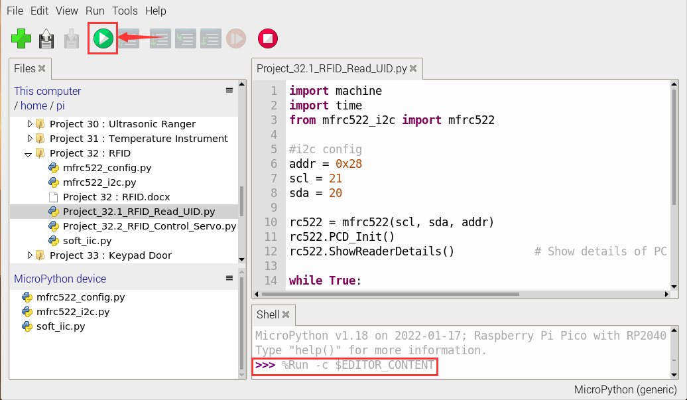

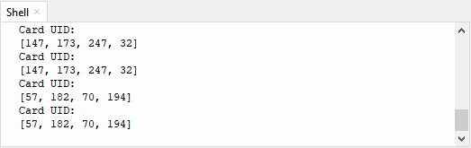

Note: the door card value and key chain value may be different for different RRFID -RC522 door cards and key chains.  

**Circuit Diagram and Wiring diagram of RFID-RC522 Controlling Servo Rotation**

Now we use a RFID-RC522 module, door card/key chain and servo to simulate an intelligent access control system. When the door card is close to the RFID-RC522 module induction area, the servo rotates. Wiring according to the figure below:

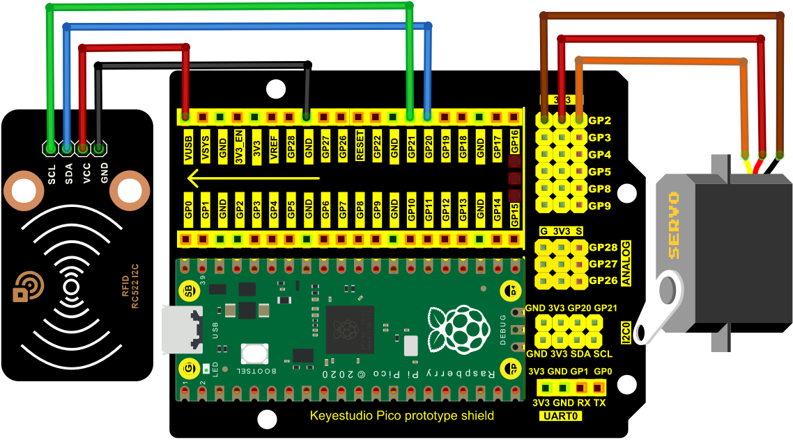

6.**Test Code**

Check the code in the folder "**...\6.Codes\Python_Codes(Raspberry-Pi)**".

You can move the code anywhere. For example, We copy the **Python_Codes(Raspberry-Pi).zip** to the <span style="color: rgb(255, 76, 65);">pi</span> folder of the Raspberry Pi system.

<span style="color: rgb(255, 76, 65);">Path: home/pi/Python_Codes(Raspberry-Pi)</span>

<br>
<br>


Open“Thonny”, click“This computer”→“home”→“pi”→“Python_Codes(Raspberry-Pi)”→“Project 32：RFID”. Select“mfrc522\_config.py”“mfrc522\_i2c.py”and“soft\_iic.py”，right-click and select“**Upload to /**”,waiting for the“mfrc522\_config.py”“mfrc522\_i2c.py”and“soft\_iic.py”to be uploaded to the Raspberry Pi Pico. And double left-click the“Project\_32.2\_RFID\_Control\_Servo.py”.


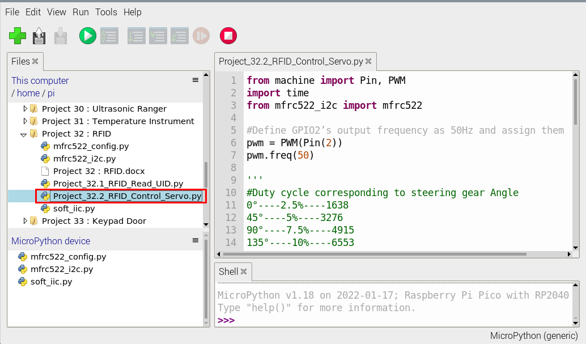

```Python
from machine import Pin, PWM
import time
from mfrc522_i2c import mfrc522

#Define GPIO2’s output frequency as 50Hz and assign them to PWM.
pwm = PWM(Pin(2))
pwm.freq(50)

'''
#Duty cycle corresponding to steering gear Angle
0°----2.5%----1638
45°----5%----3276
90°----7.5%----4915
135°----10%----6553
180°----12.5%----8192
'''
#steering gear Angle are fit to its duty cycle. 
angle_0 = 1638
angle_45 = 3276
angle_90 = 4915
angle_135 = 6553
angle_180 = 8192

#i2c config
addr = 0x28
scl = 21
sda = 20
    
rc522 = mfrc522(scl, sda, addr)
rc522.PCD_Init()
rc522.ShowReaderDetails()            # Show details of PCD - MFRC522 Card Reader details

uid1 = [147, 173, 247, 32]
uid2 = [57, 182, 70, 194]

pwm.duty_u16(angle_180)
time.sleep(1)

while True:
    if rc522.PICC_IsNewCardPresent():
        #print("Is new card present!")
        if rc522.PICC_ReadCardSerial() == True:
            print("Card UID:", end=' ')
            print(rc522.uid.uidByte[0 : rc522.uid.size])
            if rc522.uid.uidByte[0 : rc522.uid.size] == uid1 or rc522.uid.uidByte[0 : rc522.uid.size] == uid2:
                pwm.duty_u16(angle_0)
            else :
                pwm.duty_u16(angle_180)
            time.sleep(500)
```

Note: For different RFID-RC522 modules, white cards and key chains, its RFID-RC522 modules may read different UID1 and UID2 values. You should replace the uID1 and UID2 values of the white cards and key chains read by your RRFID -RC522 module with the corresponding values in the program code, otherwise, click "Run current script" to run the code may cause your swipe cards and key chains can not control the servo.

For example, you replace the 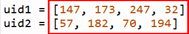 UID1 and UID2 values in the program code with the white card and key chain values read by your rFID-RC522 module.

7.**Test Result**
    
Ensure that the Raspberry Pi Pico is connected to the computer，click“Stop/Restart backend”.
    
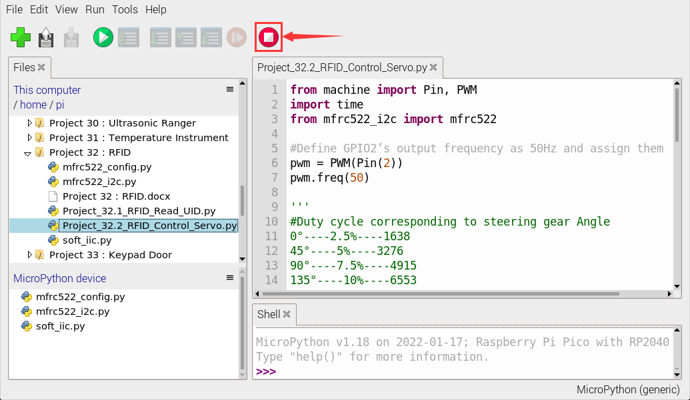
    
Click “Run current script”, the code starts executing, we will see that when using the white card or a key card swiping, the "Shell" window of Thonny IDE will display the card number value respectively, and at the same time, the servo will rotate to the corresponding angle to simulate opening the door.
    
Press“Ctrl+C”or click“Stop/Restart backend”to exit the program.

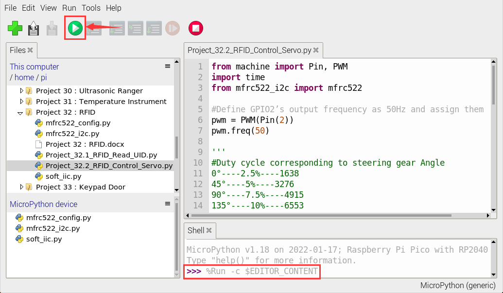


### Project 33：Keypad Door

1.**Introduction**
    
In common digital button sensors, one button uses an IO port. However, sometimes it will occupy several IO ports when we need a lot of buttons . In order to save the use of IO ports, we are supposed to make a plurality of buttons into a matrix type, through the control of lines to achieve less IO port control the multiple buttons. In this project, we will learn a Raspberry Pi Pico and a 4\*4 membrane matrix keyboard control a servo and a buzzer.   
    
2.**Components Required**

<table>
<tbody>
<tr class="odd">
<td></td>
<td></td>
<td></td>
<td></td>
</tr>
<tr class="even">
<td>Raspberry Pi Pico*1</td>
<td>Raspberry Pi Pico Expansion Board*1</td>
<td>Servo*1</td>
<td>Active Buzzer*1</td>
</tr>
<tr class="odd">
<td>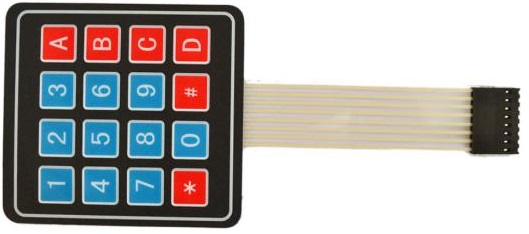</td>
<td></td>
<td></td>
<td></td>
</tr>
<tr class="even">
<td>4*4 Membrane Matrix Keyboard*1</td>
<td>Jumper Wires</td>
<td>Breadboard*1</td>
<td>USB Cable*1</td>
</tr>
</tbody>
</table>

3.**Component Knowledge**
    
**4\*4 Matrix keyboard:** The keyboard is a device that integrates many keys. As shown in the figure below, a 4x4 keyboard integrates 16 keys.
    

    
As with the LED matrix integration, in the 4x4 keyboard, each row of keys is connected to a pin, each column of keys is the same. This connection reduces the use of processor ports. The internal circuit is shown below.
    


You can use row scan or column scan methods to detect the state of the keys on each column or each line. Take the column scan method as an example. Send a low level to column 4 (Pin4), detect the state of rows 1, 2, 3 and 4, and determine whether the A, B, C and D keys are pressed. Then send the low level to columns 3, 2, 1 in turn, and detect whether other keys are pressed. Then you can get the state of all keys.

4.**Read the Value**
    
We start with a simple code to read the values of the 4\*4 matrix keyboard and print them in the serial monitor. Its wiring diagram is shown below.


Check the code in the folder "**...\6.Codes\Python_Codes(Raspberry-Pi)**".

You can move the code anywhere. For example, We copy the **Python_Codes(Raspberry-Pi).zip** to the <span style="color: rgb(255, 76, 65);">pi</span> folder of the Raspberry Pi system.

<span style="color: rgb(255, 76, 65);">Path: home/pi/Python_Codes(Raspberry-Pi)</span>

<br>
<br>


Open“Thonny”, click“This computer”→“home”→“pi”→“Python_Codes(Raspberry-Pi)”→“Project 33：Keypad Door”. Select“keypad\.py”， right-click and select“**Upload to/**”，waiting for“keypad\.py”to be uploaded to the Raspberry Pi Pico. And double left-click the “Project\_33.1\_4x4\_Matrix\_Keypad\_Display.py”.

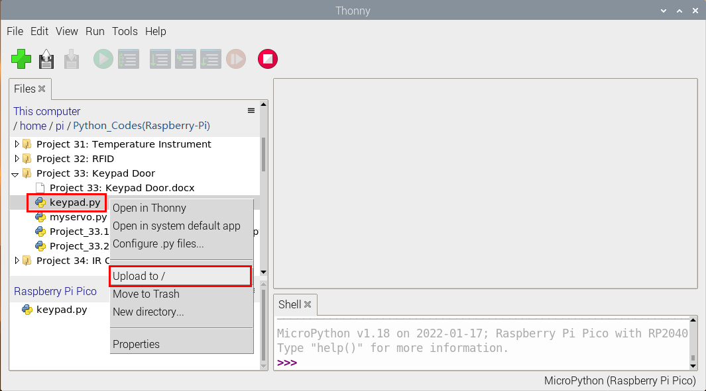

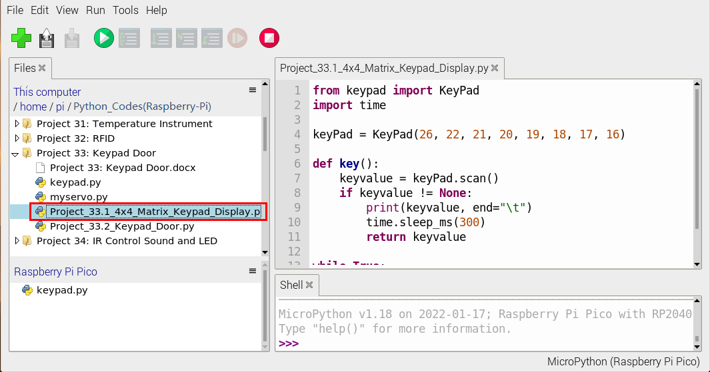

```Python
from keypad import KeyPad
import time

keyPad = KeyPad(26, 22, 21, 20, 19, 18, 17, 16)

def key():
    keyvalue = keyPad.scan()
    if keyvalue != None:
        print(keyvalue, end="\t")
        time.sleep_ms(300)
        return keyvalue
            
while True:
    key()
```

Ensure that the Raspberry Pi Pico is connected to the computer，click“Stop/Restart backend”.

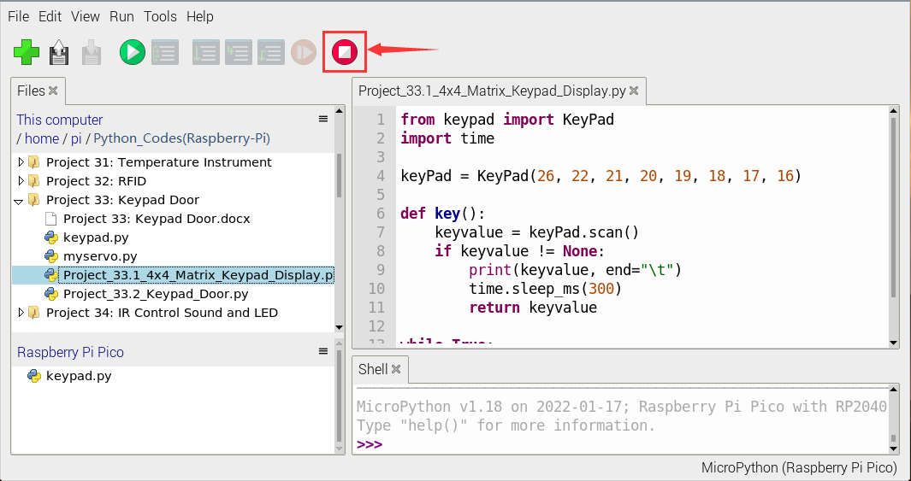

Click“Run current script”, the code starts executing, we will see that press the keyboard and the "Shell" window of Thonny IDE will print the corresponding key value, as shown below.
Click“Stop/Restart backend”to exit the program.

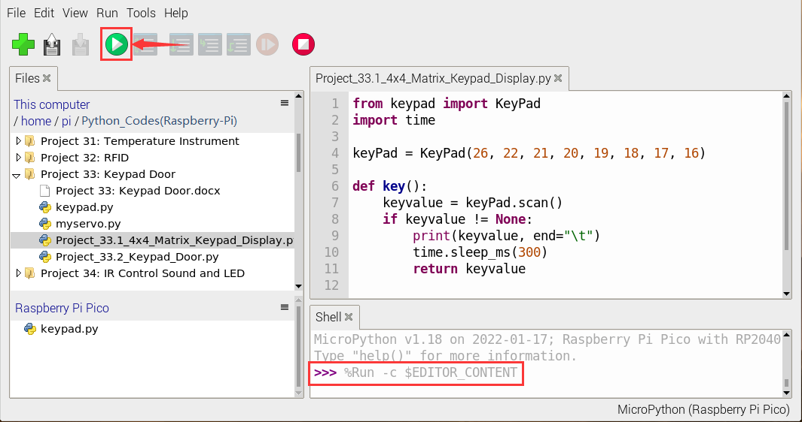

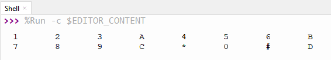

5.**Circuit Diagram and Wiring Diagram**

In the last experiment, we have known the key values of the 4\*4 matrix keyboard. Next, we use it as the keyboard to control the servo and the buzzer.  

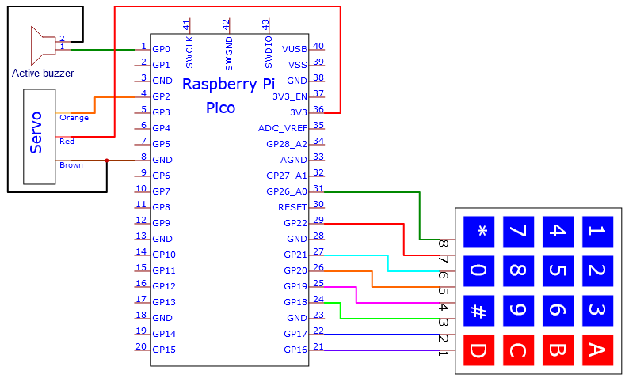

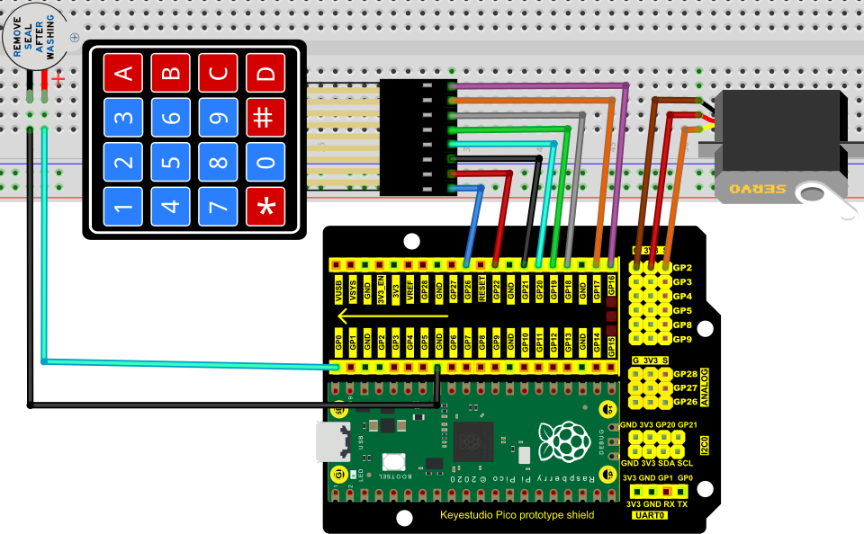

6.**Test Code**

Check the code in the folder "**...\6.Codes\Python_Codes(Raspberry-Pi)**".

You can move the code anywhere. For example, We copy the **Python_Codes(Raspberry-Pi).zip** to the <span style="color: rgb(255, 76, 65);">pi</span> folder of the Raspberry Pi system.

<span style="color: rgb(255, 76, 65);">Path: home/pi/Python_Codes(Raspberry-Pi)</span>

<br>
<br>


Open“Thonny”, click“This computer”→“home”→“pi”→“Python_Codes(Raspberry-Pi)”→“Project 33： Keypad Door”. Select“keypad\.py”and“myservo\.py”， right-click and select“**Upload to /**”，waiting for the “keypad\.py”and“myservo\.py”to be uploaded to the Raspberry Pi Pico. And double left-click the“Project\_33.2\_Keypad\_Door.py”.


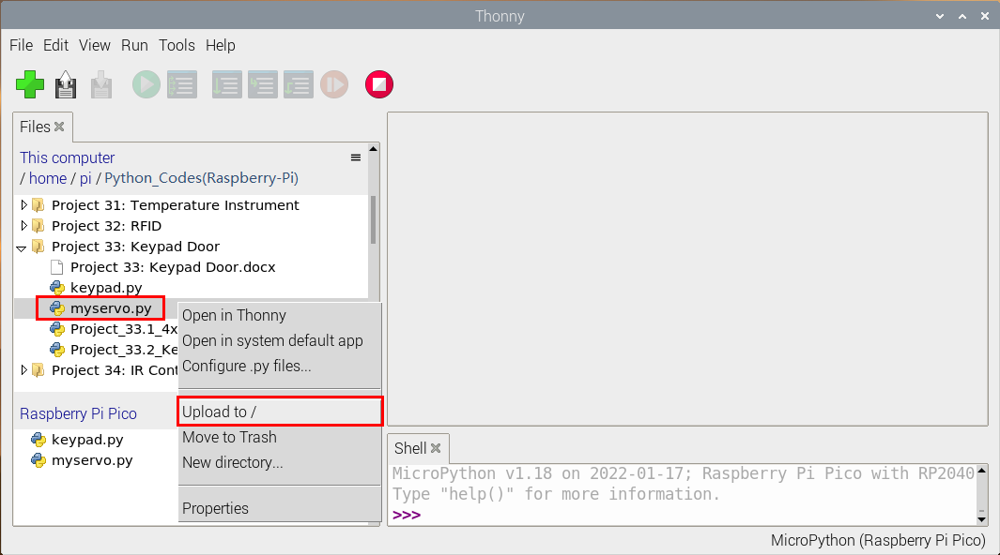

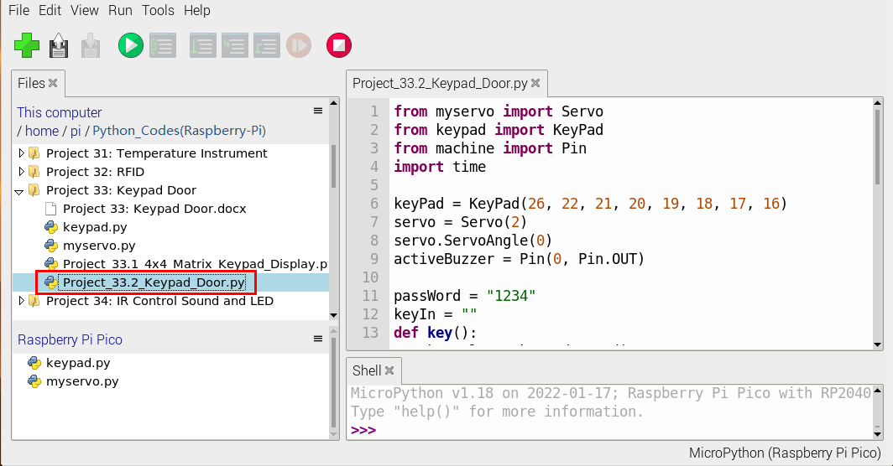

```Python
from myservo import Servo
from keypad import KeyPad
from machine import Pin
import time

keyPad = KeyPad(26, 22, 21, 20, 19, 18, 17, 16)
servo = Servo(2)
servo.ServoAngle(0)
activeBuzzer = Pin(0, Pin.OUT)

passWord = "1234"
keyIn = ""
def key():
    keyvalue = keyPad.scan()
    if keyvalue != None:
        print('Your input:', keyvalue)
        time.sleep_ms(200)
        return keyvalue

while True:
    keydata = key()
    if keydata != None:
        activeBuzzer.value(1)
        time.sleep_ms(100)
        activeBuzzer.value(0)
        keyIn += keydata 
        
    if len(keyIn) == 4:
        if keyIn == passWord:
            print("passWord right!")
            servo.ServoAngle(90)
            time.sleep_ms(1000)
            servo.ServoAngle(0)
        else:
            print("passWord error!")
            activeBuzzer.value(1)
            time.sleep_ms(1000)
            activeBuzzer.value(0)
        keyIn = ""
```

7.**Test Result**
    
Ensure that the Raspberry Pi Pico is connected to the computer，click“Stop/Restart backend”.

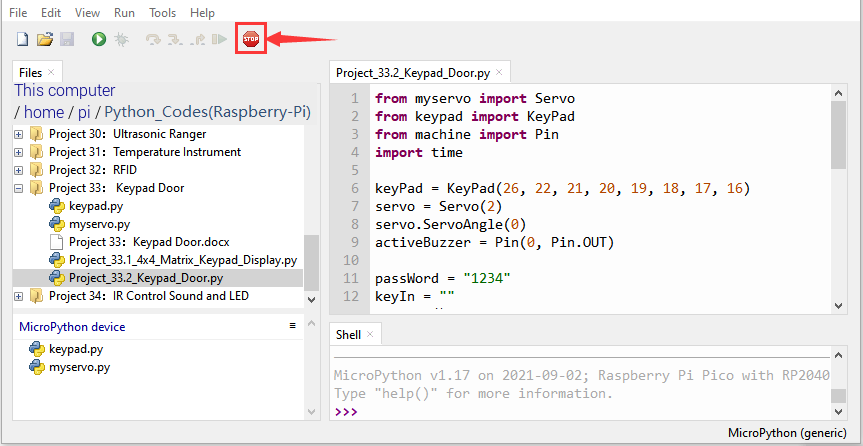

Click “Run current script”, the code starts executing, we will see that press the keyboard to enter a four-character password. If the password is correct (correct password: 1234), the servo will turn at an angle and return to its original position. If the input is incorrect, an input error alert will be issued. Click“Stop/Restart backend”to exit the program.

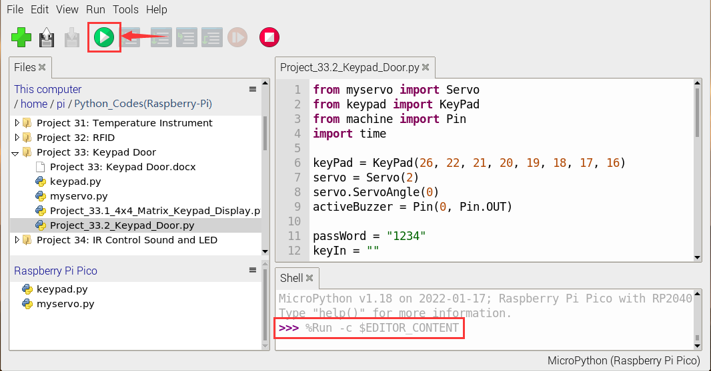


### Project 34：IR Control Sound and LED


1.**Introduction**

Infrared remote control is a low-cost, easy-to-use wireless communication technology. IR light is very similar to visible light, except that it has a slightly longer wavelength. This means that infrared rays cannot be detected by the human eye, which is perfect for wireless communication. For example, when you press a button on the TV remote control, an infrared LED will switch on and off repeatedly at a frequency of 38,000 times per second, sending information (such as volume or channel control) to the infrared sensor on the TV.

We will first explain how common IR communication protocols work. Then we will start this project with a remote control and an IR receiving component.

2.**Components Required**

<table>
<tbody>
<tr class="odd">
<td>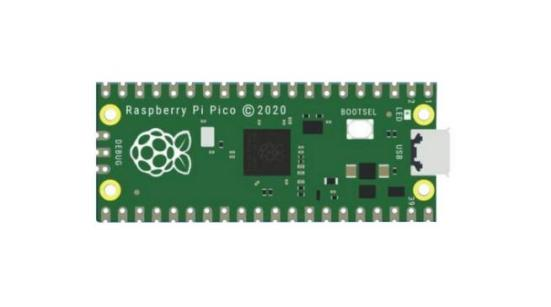</td>
<td>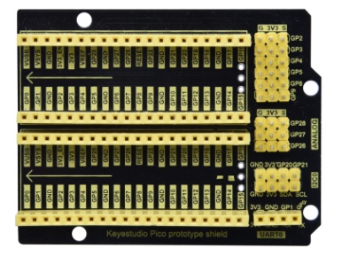</td>
<td></td>
<td></td>
<td></td>
<td></td>
</tr>
<tr class="even">
<td>Raspberry Pi Pico*1</td>
<td>Raspberry Pi Pico Expansion Board*1</td>
<td>IR Receiver *1</td>
<td>RGB LED*1</td>
<td>220ΩResistor*3</td>
<td>USB Cable*1</td>
</tr>
<tr class="odd">
<td></td>
<td></td>
<td></td>
<td></td>
<td></td>
<td></td>
</tr>
<tr class="even">
<td>IR Remote Controller*1</td>
<td>Breadboard*1</td>
<td>Passive Buzzer*1</td>
<td>10KΩResistor*1</td>
<td>Jumper Wires</td>
<td></td>
</tr>
</tbody>
</table>

3.**Component Knowledge**

**IR Remote Controller**: It is a device that has a certain number of buttons. Pressing different buttons causes the infrared transmitter tubes at the front of the remote control to send infrared signals in different codes. Infrared remote control technology is widely used, such as TV, air conditioner and so on. Therefore, in today's technologically advanced society, the infrared remote control technology makes it very convenient for us to change TV programs and adjust the temperature of the air conditioner.  

The remote control we used is as follows:

The infrared remote controller adopts NEC code and the signal cycle is 110ms.


**IR Receiver:** It is a component that can receive infrared light, which can be used to detect the infrared signal sent by the infrared remote control. The infrared signal received by the infrared receiver demodulation can be converted back to binary, then the information will be passed to a microcontroller.

**Process Diagram：**


**NEC Infrared communication protocol：**

**NEC Protocol**

To my knowledge the protocol I describe here was developed by NEC (Now Renesas). I've seen very similar protocol descriptions on the internet, and there the protocol is called Japanese Format.

I do admit that I don't know exactly who developed it. What I do know is that it was used in my late VCR produced by Sanyo and was marketed under the name of Fisher. NEC manufactured the remote control IC.

This description was taken from my VCR's service manual. Those were the days, when service manuals were filled with useful information\!

**Features**

8 bit address and 8 bit command length.

Extended mode available, doubling the address size.

Address and command are transmitted twice for reliability.

Pulse distance modulation.

Carrier frequency of 38kHz.

Bit time of 1.125ms or 2.25ms.

**Modulation**


The NEC protocol uses pulse distance encoding of the bits. Each pulse is a 560µs long 38kHz carrier burst (about 21 cycles). A logical "1" takes 2.25ms to transmit, while a logical "0" is only half of that, being 1.125ms. The recommended carrier duty-cycle is 1/4 or 1/3

**Protocol**


The picture above shows a typical pulse train of the NEC protocol. With this protocol the LSB is transmitted first. In this case Address $59 and Command $16 is transmitted. A message is started by a 9ms AGC burst, which was used to set the gain of the earlier IR receivers. This AGC burst is then followed by a 4.5ms space, which is then followed by the Address and Command. 

Address and Command are transmitted twice. The second time all bits are inverted and can be used for verification of the received message. The total transmission time is constant because every bit is repeated with its inverted length. If you're not interested in this reliability you can ignore the inverted values, or you can expand the Address and Command to 16 bits each\!

Keep in mind that one extra 560µs burst has to follow at the end of the message in order to be able to determine the value of the last bit.


A command is transmitted only once, even when the key on the remote control remains pressed. Every 110ms a repeat code is transmitted for as long as the key remains down. This repeat code is simply a 9ms AGC pulse followed by a 2.25ms space and a 560µs burst.

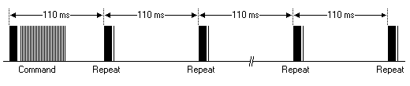

**Extended NEC protocol**

The NEC protocol is so widely used that soon all possible addresses were used up. By sacrificing the address redundancy the address range was extended from 256 possible values to approximately 65000 different values. This way the address range was extended from 8 bits to 16 bits without changing any other property of the protocol.

By extending the address range this way the total message time is no longer constant. It now depends on the total number of 1's and 0's in the message. If you want to keep the total message time constant you'll have to make sure the number 1's in the address field is 8 (it automatically means that the number of 0's is also 8). This will reduce the maximum number of different addresses to just about 13000.

The command redundancy is still preserved. Therefore each address can still handle 256 different commands.

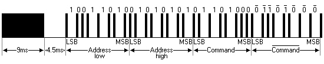

Keep in mind that 256 address values of the extended protocol are invalid because they are in fact normal NEC protocol addresses. Whenever the low byte is the exact inverse of the high byte it is not a valid extended address.

4.**Decode Infrared Signal:**
    
We connect the infrared receiving element to the Raspberry Pi Pico according to the wiring diagram below.  

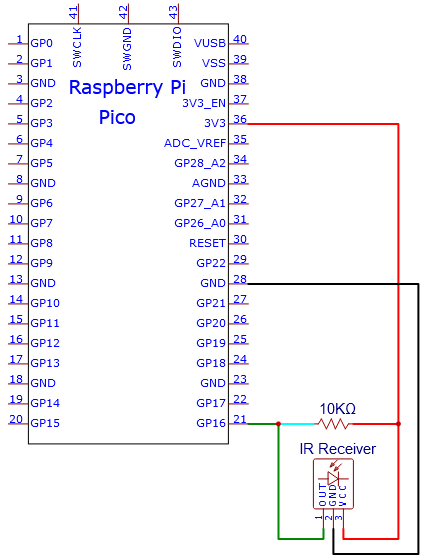


Check the code in the folder "**...\6.Codes\Python_Codes(Raspberry-Pi)**".

You can move the code anywhere. For example, We copy the **Python_Codes(Raspberry-Pi).zip** to the <span style="color: rgb(255, 76, 65);">pi</span> folder of the Raspberry Pi system.

<span style="color: rgb(255, 76, 65);">Path: home/pi/Python_Codes(Raspberry-Pi)</span>

<br>
<br>


Open“Thonny”, click“This computer”→“home”→“pi”→“Python_Codes(Raspberry-Pi)”→“Project 34：IR Control Sound and LED”. Select“irrecvdata\.py”， right-click and select“**Upload to /**”,waiting for the“irrecvdata\.py”to be uploaded to the Raspberry Pi Pico. And double left-click the “Project\_34.1\_Decoded\_IR\_Signal.py”.

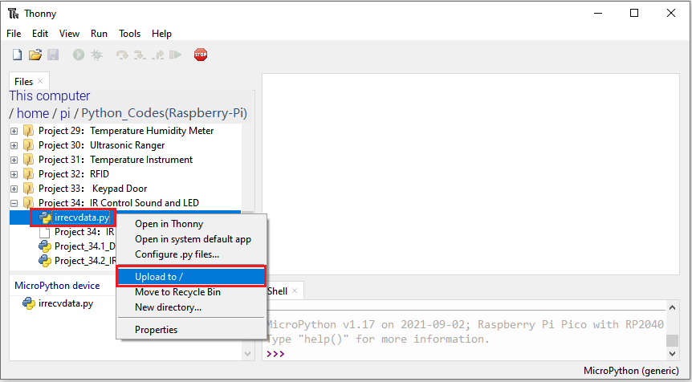

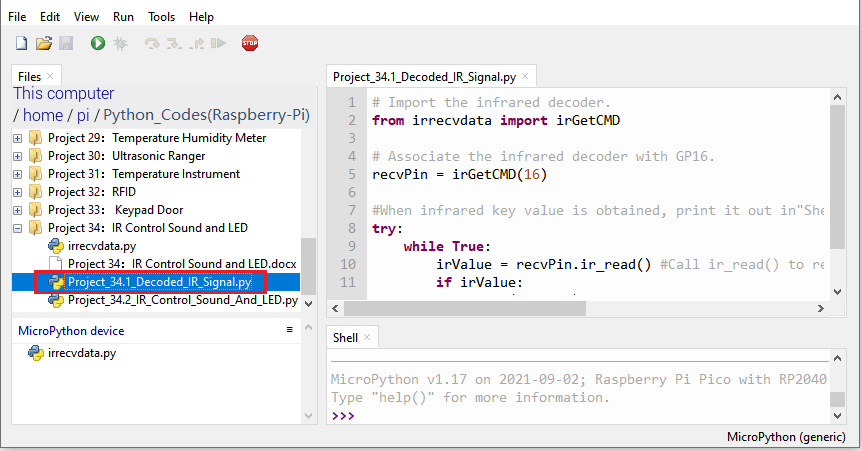

```Python
# Import the infrared decoder.
from irrecvdata import irGetCMD

# Associate the infrared decoder with GP16.
recvPin = irGetCMD(16)

#When infrared key value is obtained, print it out in"Shell". 
try:
    while True:
        irValue = recvPin.ir_read() #Call ir_read() to read the value of the pressed key and assign it to IRValue.
        if irValue:
            print(irValue)
except:
    pass
```

Ensure that the Raspberry Pi Pico is connected to the computer，click“Stop/Restart backend”.

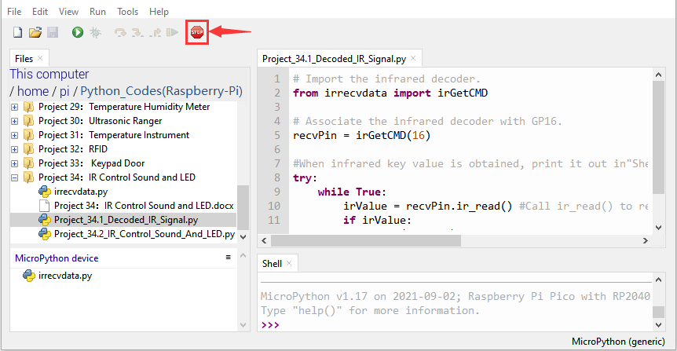

Click“Run current script”, the code starts executing, we will see that aim the infrared remote control transmitter at the infrared receiving head, press the button on the infrared controller, and the "Shell" window of Thonny IDE will print the current received key code values. Press“Ctrl+C”or click“Stop/Restart backend”to exit the program.

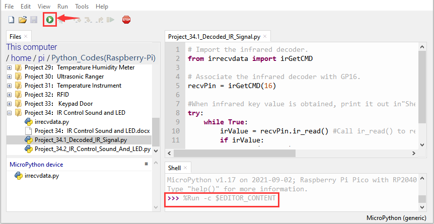

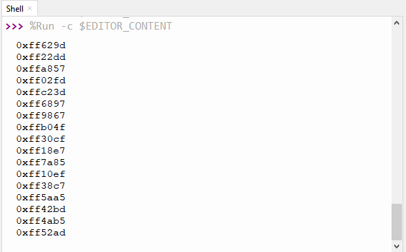

Write down the code associated with each button, because you will need that information later.

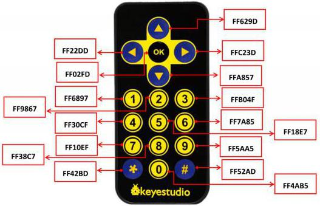

**5. Circuit Diagram and Wiring Diagram**


**6. Test Code**

Check the code in the folder "**...\6.Codes\Python_Codes(Raspberry-Pi)**".

You can move the code anywhere. For example, We copy the **Python_Codes(Raspberry-Pi).zip** to the <span style="color: rgb(255, 76, 65);">pi</span> folder of the Raspberry Pi system.

<span style="color: rgb(255, 76, 65);">Path: home/pi/Python_Codes(Raspberry-Pi)</span>

<br>
<br>


Open“Thonny”, click“This computer”→“home”→“pi”→“Python_Codes(Raspberry-Pi)”→“Project 34：IR Control Sound and LED”. Select“irrecvdata\.py”，right-click and select“**Upload to /**”,waiting for the“irrecvdata\.py”to be uploaded to the Raspberry Pi Pico. And double left-click the “Project\_34.2\_IR\_Control\_Sound\_And\_LED.py”.


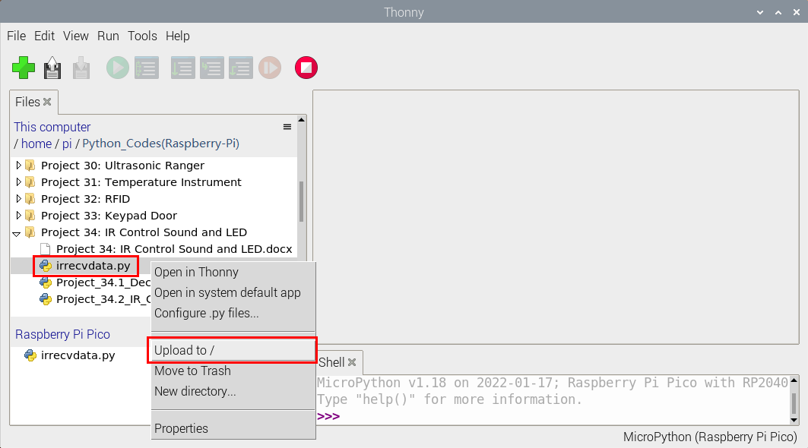

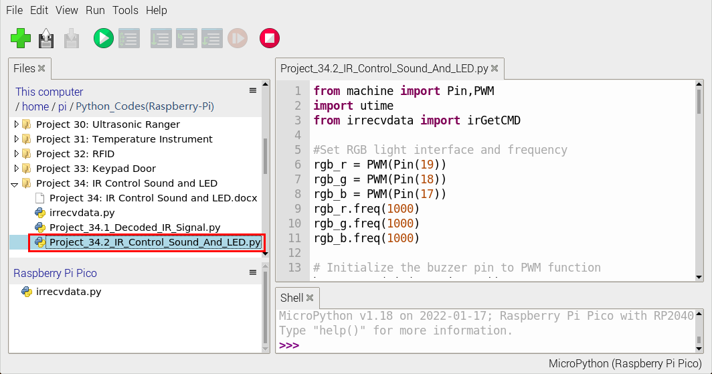

```Python
from machine import Pin,PWM
import utime
from irrecvdata import irGetCMD

#Set RGB light interface and frequency
rgb_r = PWM(Pin(19))
rgb_g = PWM(Pin(18))
rgb_b = PWM(Pin(17))
rgb_r.freq(1000)
rgb_g.freq(1000)
rgb_b.freq(1000)

# Initialize the buzzer pin to PWM function
buzzer=PWM(Pin(15, Pin.OUT))
buzzer.freq(262)
buzzer.duty_u16(0)

# Play the frequency of midrange tones 1-7
freq = [262, 294, 330, 350, 393, 441, 495]

#Configure infrared receiving pin and library
recvPin = irGetCMD(16)

# Set the buzzer to emit different tones.
# index=[0-7], where 0 is closed, and 1-7 respectively represent middle C, middle D, middle E, middle F, middle G, middle A, middle B.
# time represents the function delay time (a positive integer), in milliseconds.
# auto_off indicates whether the buzzer will be turned off automatically after the delay time.
def tone(index, time=0, auto_off=False):
    if index == 0:
        buzzer.duty_u16(0)
        utime.sleep_ms(time)
    elif index >= 1 and index <= 7:
        tone_freq = freq[int(index - 1)]
        buzzer.freq(tone_freq)
        buzzer.duty_u16(32768)
        utime.sleep_ms(time)
        if auto_off == True:
            buzzer.duty_u16(0)
        # print("----freq:", index, tone_freq)
    else:
        print("Tones must be 0-7")
 
delay = 0
 
tone(1, 100, True)

while True:
    irValue = recvPin.ir_read() # Read remote control data
# Determine whether there is a button that meets the needs 
    if irValue:
        print(irValue)
        if irValue == '0xff6897':   #1
           rgb_r.duty_u16(65535)
           rgb_g.duty_u16(0)
           rgb_b.duty_u16(0)
           tone(1, delay)
        elif irValue == '0xff9867': #2
            rgb_r.duty_u16(0)
            rgb_g.duty_u16(65535)
            rgb_b.duty_u16(0)
            tone(2, delay)
        elif irValue == '0xffb04f': #3
            rgb_r.duty_u16(0)
            rgb_g.duty_u16(0)
            rgb_b.duty_u16(65535)
            tone(3, delay)
        elif irValue == '0xff30cf': #4
            rgb_r.duty_u16(65535)
            rgb_g.duty_u16(65535)
            rgb_b.duty_u16(0)
            tone(4, delay)
        elif irValue == '0xff18e7': #5
            rgb_r.duty_u16(65535)
            rgb_g.duty_u16(0)
            rgb_b.duty_u16(65535)
            tone(5, delay)
        elif irValue == '0xff7a85': #6
            rgb_r.duty_u16(0)
            rgb_g.duty_u16(65535)
            rgb_b.duty_u16(65535)
            tone(6, delay)
        elif irValue == '0xff10ef': #7
            rgb_r.duty_u16(65535)
            rgb_g.duty_u16(65535)
            rgb_b.duty_u16(65535)
            tone(7, delay) 
        else:
            rgb_r.duty_u16(0)
            rgb_g.duty_u16(0)
            rgb_b.duty_u16(0)
            tone(0)
```
7.**Test Result**
    
Ensure that the Raspberry Pi Pico is connected to the computer，click“Stop/Restart backend”.

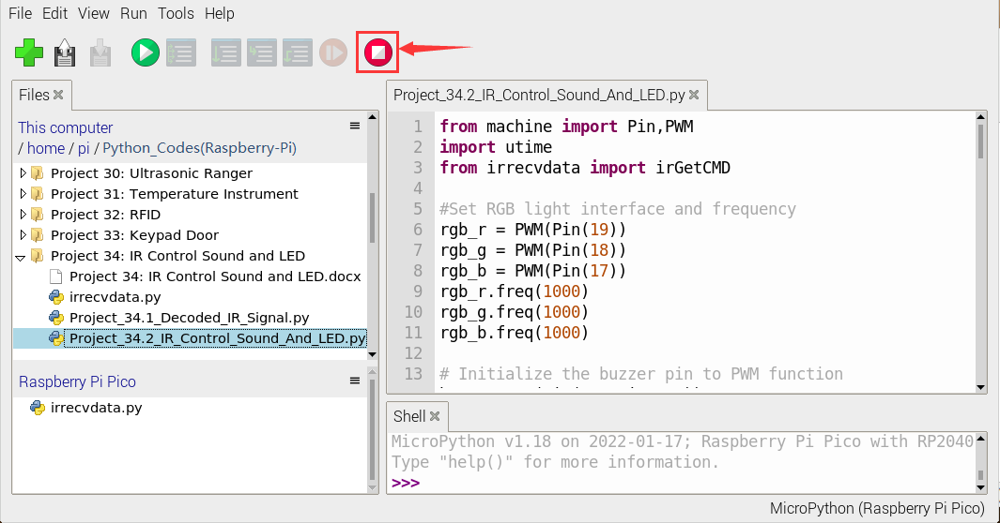

Click“Run current script”, the code starts executing, we will see that press buttons 1 to 7 on the infrared remote controller, we can hear buzzers such as do、re、mi、fa、sol、la、si ,etc. At the same time, the RGB will be red , green , blue , yellow ,magenta, blue and green, white respectively. However, if we press other buttons (except 1-7), the buzzer stops playing and the RGB goes off. Click“Stop/Restart backend”to exit the program.

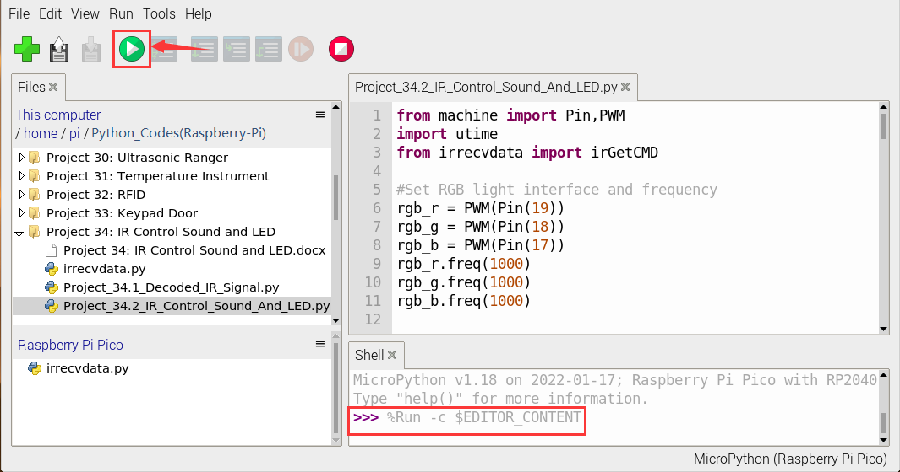

**Note**：When the code is running, the following prompt appears, you just need to click“Stop/Restart backend“, then click“Run current script”to make the code run again.

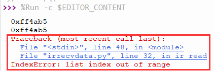

(Note: Before use, we need to remove the plastic sheet from the bottom of the infrared remote controller.)


