# Arduino_C_Tutorial(Windows)

## 1. Preparation

### 1.1. Install Windows Drivers


#### 1.1.1. Download and install Arduino software

Enter the Arduino official website: [https://www.arduino.cc/](https://www.arduino.cc/) and click "SOFTWARE" to enter the download page, as shown in the following figure.


Then, select and download the corresponding installer according to your operating system. If you are a Windows user, please select "Windows Installer" to download the correct installation driver.

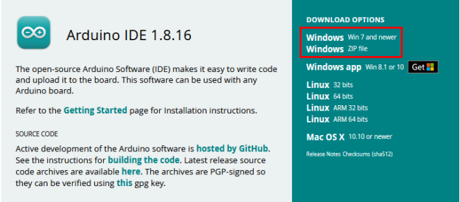

Click **Windows Win7 and newer** to download the installer for Arduino 1.8.16, which needs to be installed manually. And when clicking on the **Windows ZIP file**, the zip file of the Arduino 1.8.16 will be downloaded directly, and you only need to unzip it to complete the installation.


Generally, you can download it by clicking **JUST DOWNLOAD**. Of course, if you like, you can choose a small sponsorship to help the great Arduino open source.

Once the Arduino software is downloaded, continue to install. When you receive  **a warning from your operating system, allow the driver to install.** Click on **I Agree**, select the components you want to install and then click **Next**.


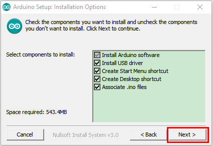

Select the installation directory (The default directory is recommended.), then click **Install**.

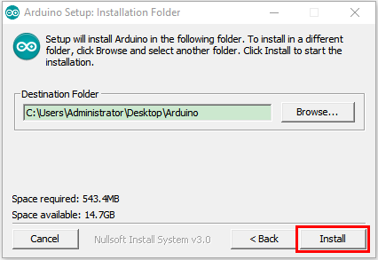

If the following interface appears, you should select **Install**.


This process will extract and install all the necessary files to properly execute the Arduino software (IDE).

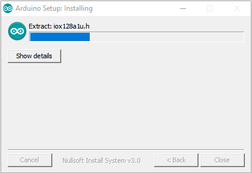

After the installation is complete, an Arduino software shortcut will be created on the desktop.

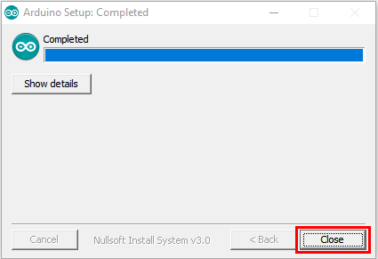

#### 1.1.2. Install the Pico development board

Open **Arduino IDE**，and click **Tools**→**Board**→**Boards Manager...**.

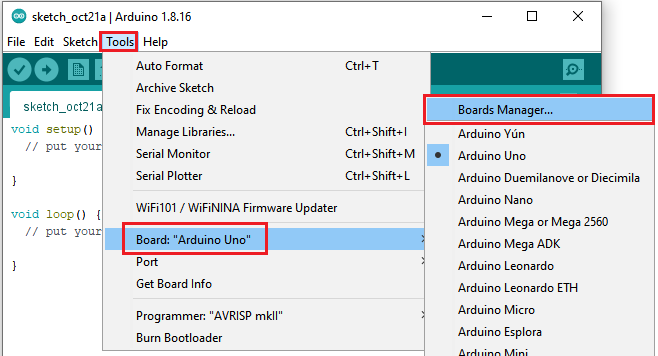

Enter **Pico** and select **Arduino Mbed OS RP2040 Boards** and click **Install**.

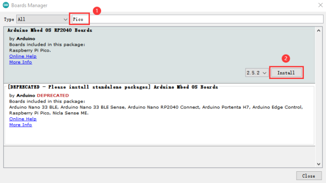

Then click **Install**.

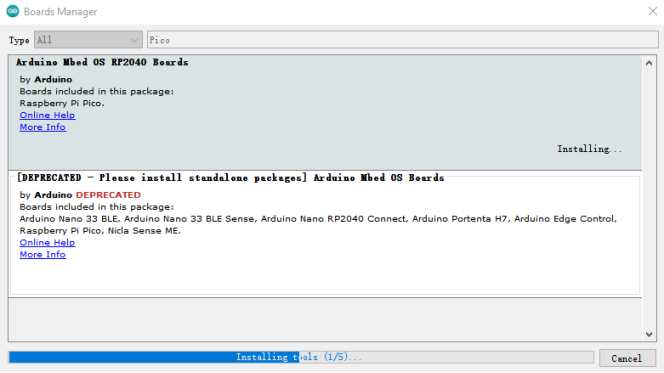


Then click **Close**.

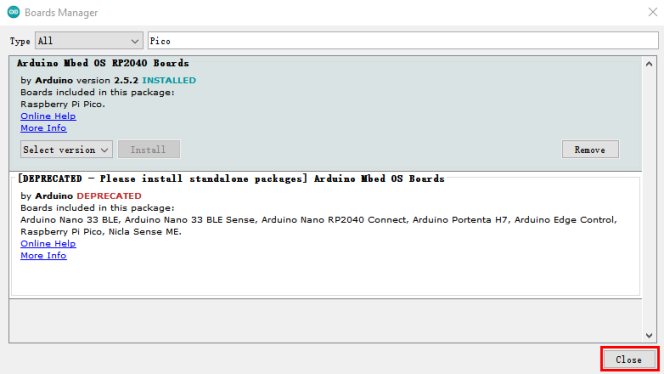

#### 1.1.3. Upload the pico firmware compatible with Arduino

You need to upload a pico firmware compatible with Arduino.

Disconnect the computer with the pico board.

Hold down the button BOOTSEL, connect them again before releasing the button.

Keep holding down the button before connecting the pico board with your computer; otherwise, the firmware can’t be downloaded.

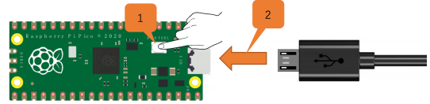

Open **Arduino IDE** and **File**→**Examples**→**01.Basics**→**Blink**.

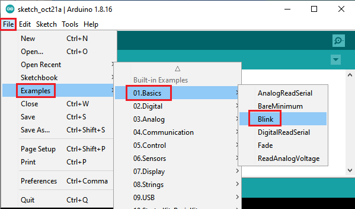

Click **Tools**→**Board**→**Arduino Mbed OS RP2040 Boards**→**Raspberry Pi Pico**.


Upload the script（Blink）to the Raspberry Pi Pico.

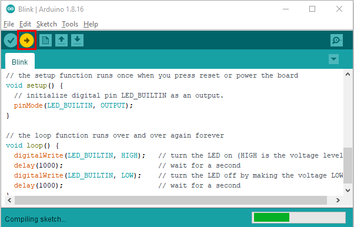

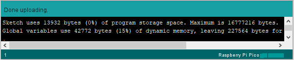

Then the indicator on the Raspberry Pi Pico will flash.

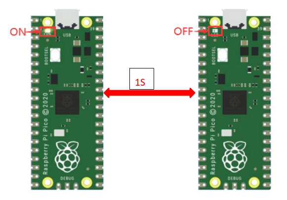

Click **Tools**→**Port**→**COMx(Raspberry Pi Pico)**

Com port is different on the computers.

Please select your correct COM port. In this tutorial, the com port is Com15.


<span style="color: rgb(255, 76, 65);">Don’t select the port if it’s your first time to upload scripts to the pico board. Select if the com port is correct when uploading the script each time; otherwise the code will fail to upload. Sometimes, Raspberry Pi Pico can’t work in light of the loss of code. At this time, you need to upload the firmware of the pico board in accordance with above steps.</span>

<br>
<br>

### 1.2. Install the driver on MAC


Download Arduino IDE:

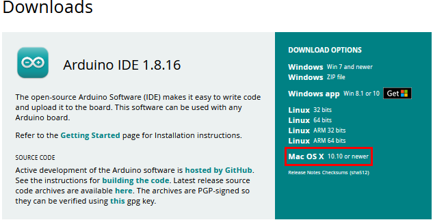

Just refer to the Windows system.


## 2. Projects

### Project 01: Hello World

**1. Introduction**

For Raspberry Pi Pico beginners, we will start with some simple things. In this project, you only need a Raspberry Pi Pico and a USB cable to complete the "Hello World!" project, which is a test of communication between Raspberry Pi Pico and the PC as well as a primary project.


**2. Components**

|  |  |
| ------------------------------------------------------------ | ------------------------------------------------------------ |
| Raspberry Pi Pico*1                                          | USB Cable*1                                                  |


**3. Wiring Up**

In this project, we use a USB cable to connect the Raspberry Pi Pico to the computer.
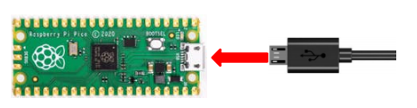


**4. Test Code**

```c
//*************************************************************************************
/*
 * Filename    : Hello World
 * Description : Enter the letter R,and the serial port displays"Hello World".
 * Auther      :http//www.keyestudio.com
*/
char val;// defines variable "val"
void setup()
{
Serial.begin(115200);// sets baudrate to 115200
}
void loop()
{
  if (Serial.available() > 0) {
    val=Serial.read();// reads symbols assigns to "val"
    if(val=='R')// checks input for the letter "R"
    {  // if so,    
     Serial.println("Hello World!");// shows “Hello World !”.
    }
  }
}
//*************************************************************************************
```

Before uploading the code to the Raspberry Pi Pico, please check the configuration of the Arduino IDE.

Click“**Tools**”，confirm the board type and port as follows:

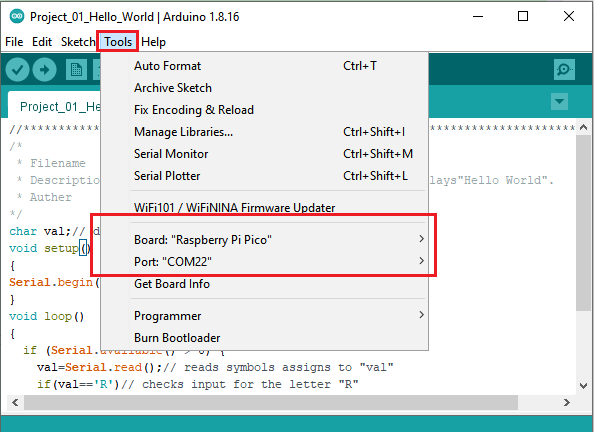

Click to upload the text code to the Raspberry Pi Pico.

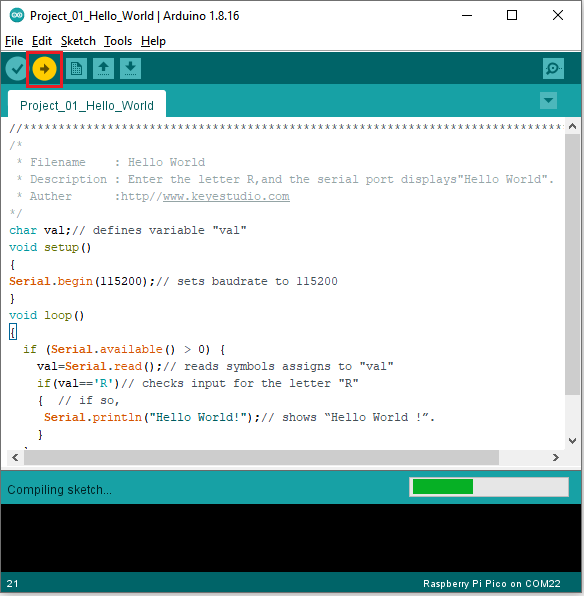

The code is uploaded successfully!


**5. Test Result**

After uploading successfully, click the icon to enter the serial display.

Set baud rate to 115200 and type "R" in the text box. Click "Send", the serial monitor will display "Hello World!”.

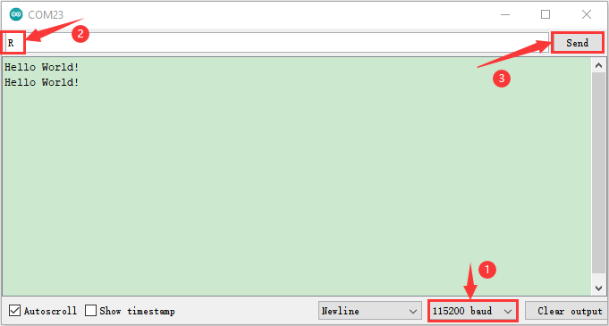


### Project 02: Onboard LED Flashing

**1. Description：**

There is an onboard LED in Raspberry Pi Pico,which is a GP25 pin attached to the Raspberry Pi Pico. In this project, we will learn the effect of making the onboard LED blink.


**2. Components**

|  | 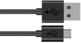 |
| ------------------------------------------------------------ | ------------------------------------------------------------ |
| Raspberry Pi Pico*1                                          | USB Cable*1                                                  |


**3. Wiring up**

In this project, Raspberry Pi Pico is connected to a computer using a USB cable. 

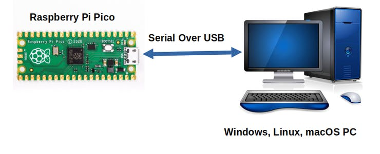

**4. Test Code：**

The onboard LED of Raspberry Pi Pico is controlled by GP25. When the GP25 outputs high, the LED will be on; when outputting LOW, the LED will be off.

```c
//**********************************************************************
/*
 * Filename    : Onboard LED flashing
 * Description : Make an led blinking.
 * Auther      : http//www.keyestudio.com
*/
#define LED_BUILTIN 25

// the setup function runs once when you press reset or power the board
void setup() {
  // initialize digital pin LED_BUILTIN as an output.
  pinMode(LED_BUILTIN, OUTPUT);
}

// the loop function runs over and over again forever
void loop() {
  digitalWrite(LED_BUILTIN, HIGH);   // turn the LED on (HIGH is the voltage level)
  delay(1000);                       // wait for a second
  digitalWrite(LED_BUILTIN, LOW);    // turn the LED off by making the voltage LOW
  delay(1000);                       // wait for a second
}
//*************************************************************************************
```


Before uploading Test Code to Raspberry Pi Pico, please check the configuration of Arduino IDE.

Click "Tools" to confirm that the board type and ports..


Click  to upload the test code to the Raspberry Pi Pico board.

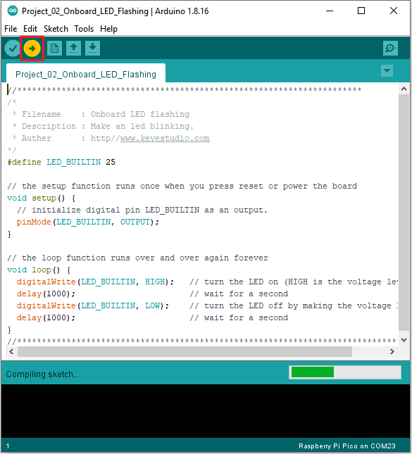

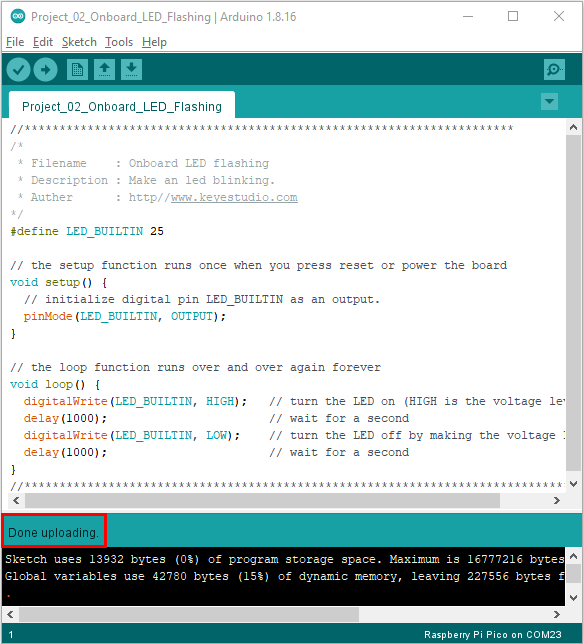

**5. Test Result**

After the project code was uploaded successfully, the LED of Raspberry Pi Pico started flashing.

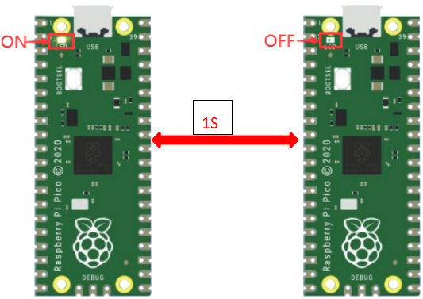

### Project 03: External LED Flashing 

**1. Description：**

There is an onboard LED in Raspberry Pi Pico, which is a GP25 pin attached to the Raspberry Pi Pico. In this project, we will learn the effect of making the onboard LED blink.


**2. Components**

|  |  |
| :----------------------------------------------------------: | :----------------------------------------------------------: |
|                     Raspberry Pi Pico*1                      |             Raspberry Pi Pico Expansion Board*1              |
|  |  |
|                          Red LED*1                           |                       220Ω Resistor*1                        |
|  |  |
|                         Breadboard*1                         |                        Jumper Wire*2                         |
|  |                                                              |
|                         USB Cable*1                          |                                                              |


**3. Component Knowledge**

**(1) LED:**


It is a kind of semiconductor called "light-emitting diode", which is an electronic device made of semiconductor materials (silicon, selenium, germanium, etc.). It has an anode and a cathode. The short lead (cathode) is grounded. The long lead (anode)is connected to 5V.


**(2) Resistor**

A resistor is an electronic component in a circuit that restricts or regulates the flow current flow. Its unit is(Ω). 1 mΩ= 1000 kΩ，1kΩ= 1000Ω.

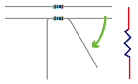

We can use resistors to protect sensitive components, such as LEDs. The strength of the resistance is marked on the body of the resistor with an electronic color code. Each color code represents a number, and you can refer to it in a resistance card.

\-Color 1 – 1st Digit

\-Color 2 – 2nd Digit

\-Color 3 – 3rd Digit

\-Color 4 – Multiplier

\-Color 5 – Tolerance


In this kit, we provide eight 5-band resistors with different resistance values. Take three 5-band resistors as an example.

220Ω resistor\*10


10KΩ resistor\*10


1KΩ resistor\*10


The connection between current, voltage, and resistance can be expressed by the formula: I=U/R.

In the figure below, if the voltage is 3V, the current through R1 is: I = U / R = 3 V / 10 KΩ= 0.0003A= 0.3mA.


**(3) Breadboard**

A breadboard is used to build and test circuits quickly before finalizing any circuit design. The breadboard has many holes into which circuit components like integrated circuits and resistors can be inserted. A typical breadboard is as follows.

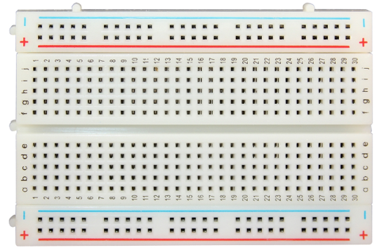

The bread board has strips of metal which run underneath the board and connect the holes on the top of the board. The metal strips are laid out as shown below. Note that the top and bottom rows of holes are connected horizontally while the remaining holes are connected vertically.


The first two rows (top) and the last two rows (bottom) of the breadboard are used for the positive (+) and negative (-) terminals of the power supply, respectively. The conductive layout of the breadboard is shown in the following diagram.


When we connect DIP (Dual In-line Packages) components, such as integrated circuits, microcontrollers, chips and so on, we can see that a groove in the middle isolates the middle part, so the top and bottom of the groove is not connected. DIP components can be connected as shown in the figure below.


**4. Circuit Diagram and Wiring Diagram**

**How to use the keyestudio raspberry pico expansion board**

Stack the pico board onto the expansion board, as shown below;


**5. Power Supply**

Interface the pico board with your computer with a USB cable.

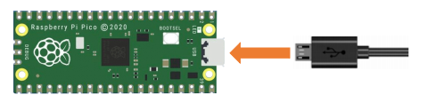

<span style="color: rgb(255, 76, 65);">Note:</span> Cut off the pico board. Build up the circuit according to the circuit and wiring diagram.

Make sure the circuit is correct then connect the pico board to the computer.

 <span style="color: rgb(255, 76, 65);">Note:</span> Avoid any possible short circuits (especially connecting 3.3V and GND)\!

<span style="color: rgb(255, 76, 65);">Warning:</span> A short circuit may cause a large current in the circuit, causing components to overheat and permanent damage to the hardware.


**6. Circuit Diagram**


Note:

How to connect an LED


How to identify the 220Ω five-band resistor


**7. Test Code：**

According to the circuit diagram, when Pico's GP16 outputs a high level, the LED will light up; when it outputs a low level, the LED light will be off. Therefore, we can make the LED flash repeatedly by controlling the GP16 to output high and low levels.


```c
//**********************************************************************
/*
 * Filename    : External LED flashing
 * Description : Make an led blinking.
 * Auther      : http//www.keyestudio.com
*/
#define PIN_LED   16   //define the led pin

// the setup function runs once when you press reset or power the board
void setup() {
  // initialize digital pin LED as an output.
  pinMode(PIN_LED, OUTPUT);
}

// the loop function runs over and over again forever
void loop() {
  digitalWrite(PIN_LED, HIGH);   // turn the LED on (HIGH is the voltage level)
  delay(500);                       // wait for 0.5s
  digitalWrite(PIN_LED, LOW);    // turn the LED off by making the voltage LOW
  delay(500);                       // wait for 0.5s
}
//**********************************************************
```


Before uploading Test Code to Raspberry Pi Pico, please check the configuration of Arduino IDE.

Click "Tools" to confirm that the board type and ports.

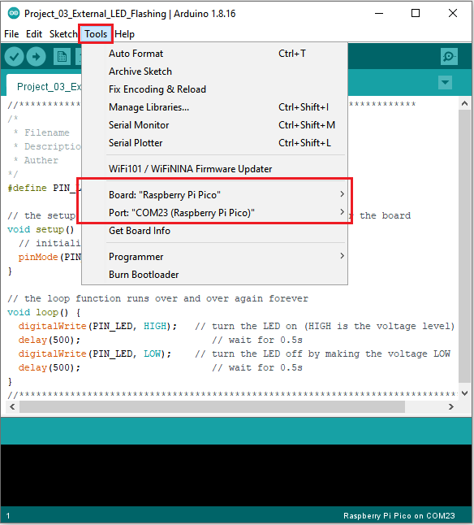

Click  to upload the test code to the Raspberry Pi Pico board

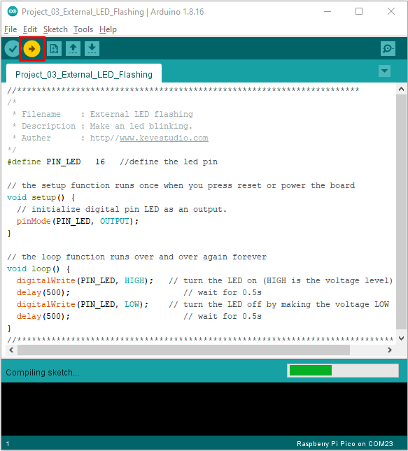


**8. Test Result**

After the project code was uploaded successfully, the LED started flashing


### Project 04: Breathing Led

**1. Introduction**

In this project, we will learn the PWM control of ARDUINO. PWM is Pulse Width Modulation, which is a technique that encodes analog signal levels into digital signal levels. We will use PWM to control the brightness of LED.

**2. Components**

|  |  |
| :----------------------------------------------------------: | :----------------------------------------------------------: |
|                     Raspberry Pi Pico*1                      |             Raspberry Pi Pico Expansion Board*1              |
|  |  |
|                          Red LED*1                           |                       220Ω Resistor*1                        |
|  |  |
|                         Breadboard*1                         |                        Jumper Wire*2                         |
|  |                                                              |
|                         USB Cable*1                          |                                                              |


**3. Component Knowledge**


**Working principle** 

It can control the brightness of LED, the speed of DC motors and Servo motors, and outputs square wave signal. If we want to dim the LED,  we can change the ON(open) and OFF(close) time of the signal. When we change the time of ON and OFF fast enough, then the brightness of the LED will change. Here are some terms related to PWM as follows.

ON (open)：When the signal is high.

OFF (close)：When the signal is low.

Period: It is the sum of the time of On and Off.

Duty cycle: The percentage of time when the signal is at a high level for a certain period of time. At 50% duty cycle and 1Hz frequency, the LED will be on for half a second and off for the other half of a second. 


**Arduino and PWM**

The Arduino IDE has a built-in function “analogWrite()” that can be used to generate PWM signals. Most of the pins generate signals with a frequency of about 490Hz and we can use this function to give values from 0 to 255.

**“analogWrite(0)”** indicates a signal with 0% duty cycle. “analogWrite(127)” indicates a signal with 50% duty cycle. 

**“analogWrite(255)”** indicates a signal with 100% duty cycle. On the Plus control board, the PWM pins are 3, 5, 6, 9, 10, and 11. PWM pins are marked with the “~”symbol. In this project, you will learn how to get the PWM output from the digital pins of the Plus control board and control the brightness of the LED by code.


**4. Circuit Diagram and** **Wiring Diagram**


Note:

How to connect the LED


How to identify the 220Ω 5-band resistor


**5. Test Code：**

The design of this project makes GP16 output PWM, and the pulse width gradually increases from 0% to 100%, and then gradually decreases from 100% to 0%.


```c
//**********************************************************************
/*
 * Filename    : Breathing Led
 * Description : Make led light fade in and out, just like breathing.
 * Auther      : http//www.keyestudio.com
*/
#define PIN_LED   16   //define the led pin

void setup() {
  pinMode(PIN_LED, OUTPUT);
}

void loop() {
  for (int i = 0; i < 255; i++) { //make light fade in
    analogWrite(PIN_LED, i);
    delay(5);
  }
  for (int i = 255; i > -1; i--) {  //make light fade out
    analogWrite(PIN_LED, i);
    delay(5);
  }
}
//******************************************************************
```


Before uploading Test Code to Raspberry Pi Pico, please check the configuration of Arduino IDE.

Click "Tools" to confirm that the board type and ports.


Click  to upload the test code to the Raspberry Pi Pico board

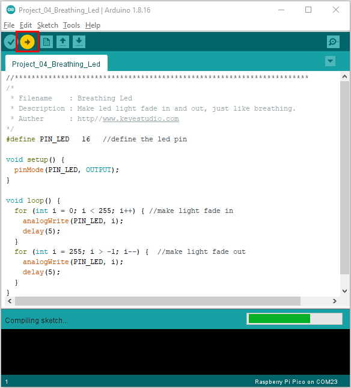

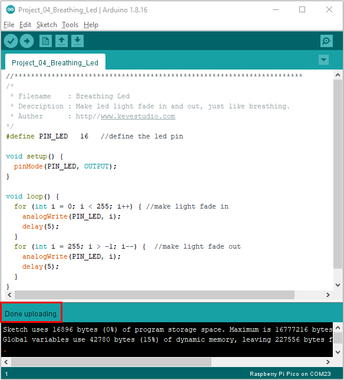

**6. Result**

After burning the project code, connecting the wires according to the wiring diagram, and powering on, the LED lights up gradually, and then gradually darkens.


### Project 05: Traffic Lights

**1. Introduction**

Traffic lights are closely related to people's daily lives. Traffic lights generally show red, yellow, and green. Everyone should obey the traffic rules, which can avoid many traffic accidents. In this project, we will use a pico board and some LEDs (red, green and yellow) to simulate the traffic lights.


**2. Component Required**

|  |  |
| :----------------------------------------------------------: | :----------------------------------------------------------: |
|                     Raspberry Pi Pico*1                      |             Raspberry Pi Pico Expansion Board*1              |
|  |  |
|                          Red LED*1                           |                         Yellow LED*1                         |
|  |  |
|                         Green LED*1                          |                         USB Cable*1                          |
|  |  |
|                       220Ω Resistor*3                        |                         Breadboard*1                         |
|  |                                                              |
|                         Jumper Wires                         |                                                              |


**3. Circuit Diagram and Wiring Diagram**

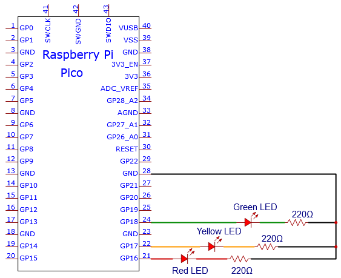


Note:

How to connect an LED


How to identify the 220Ω 5-band resistor


**4. Test Code：**


```c
//**********************************************************************
/*
 * Filename    : Traffic Lights
 * Description : Simulated traffic lights.
 * Auther      : http//www.keyestudio.com
*/
#define PIN_LED_RED   16   //define the red led pin
#define PIN_LED_YELLOW   17   //define the yellow led pin
#define PIN_LED_GREEN  18   //define the green led pin

void setup() {
  pinMode(PIN_LED_RED, OUTPUT);
  pinMode(PIN_LED_YELLOW, OUTPUT);
  pinMode(PIN_LED_GREEN, OUTPUT);
}

void loop() {
  digitalWrite(PIN_LED_GREEN, HIGH);// turns on the green led
delay(5000);// delays 5 seconds
digitalWrite(PIN_LED_GREEN, LOW); // turns off the green led
for(int i=0;i<3;i++)// flashes 3 times.
{
delay(500);// delays 0.5 second
digitalWrite(PIN_LED_YELLOW, HIGH);// turns on the yellow led
delay(500);// delays 0.5 second
digitalWrite(PIN_LED_YELLOW, LOW);// turns off the yellow led
} 
delay(500);// delays 0.5 second
digitalWrite(PIN_LED_RED, HIGH);// turns on the red led
delay(5000);// delays 5 second
digitalWrite(PIN_LED_RED, LOW);// turns off the red led
}
//**********************************************************************
```


Before uploading Test Code to Raspberry Pi Pico, please check the configuration of Arduino IDE.

Click "Tools" to confirm that the board type and ports.

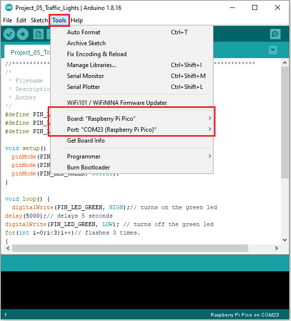

Click  to upload the test code to the Raspberry Pi Pico board

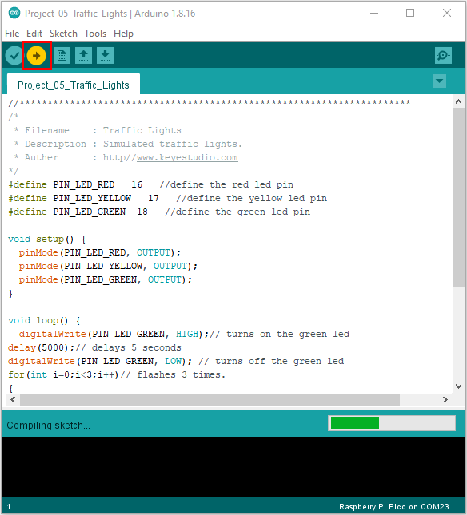

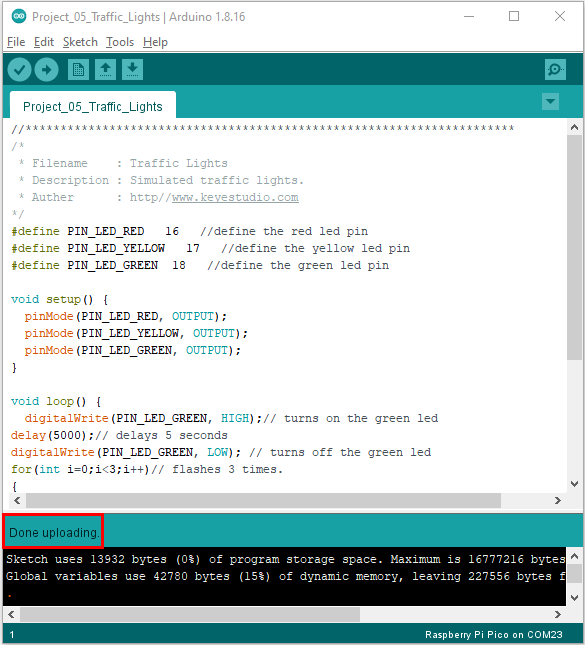

**5. Result**

Upload the code and power on, the green LED will light up for 5s then go off. Next, the yellow one will blink for 3 times and red LED will be on for 5s then go off.

### Project 06: RGB LED

**1. Introduction**


In this project, we will introduce the RGB LED and show you how to use the Plus control board to control the RGB LED. Even though RGB LED is very basic, it is also a great way to learn the fundamentals of electronics and coding.


**2. Components Required**

|  |  |
| :----------------------------------------------------------: | :----------------------------------------------------------: |
|                     Raspberry Pi Pico*1                      |             Raspberry Pi Pico Expansion Board*1              |
|  |  |
|                          RGB LED*1                           |                       220Ω Resistor*3                        |
|  |  |
|                         Breadboard*1                         |                         Jumper Wires                         |
|  |                                                              |
|                         USB Cable*1                          |                                                              |


**3. Component Knowledge**

**RGB LED：**


The monitors mostly adopt the RGB color standard, and all the colors on the computer screen are composed of the three colors of red, green and blue mixed in different proportions.


This RGB LED has pin R, G and B and a common cathode. To change its brightness, we can use the PWM pins which can give different duty cycle signals to the RGB LED to produce different colors.


**4. Circuit Diagram and Wiring Diagram**

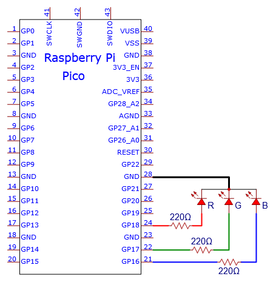

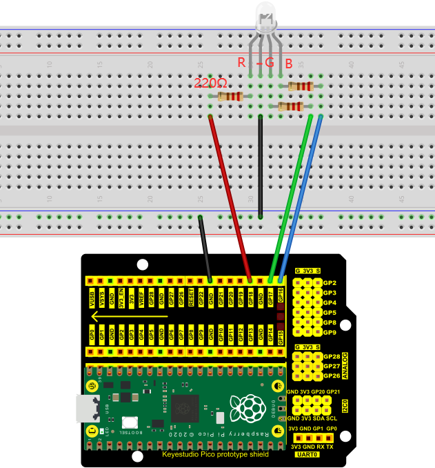

Note:

RGB LED longest pin (common cathode) connected to GND.


How to identify the 220Ω 5-band resistor


**5. Test Code：**

We need to create three PWM channels and use random duty cycles to light up the RGB LEDs randomly.


```c
//**********************************************************************
/*
 * Filename    : RGB LED
 * Description : Use RGBLED to show random color.
 * Auther      : http//www.keyestudio.com
*/
int ledPins[] = {18, 17, 16};    //define red, green, blue led pins
int red, green, blue;
void setup() {
  for (int i = 0; i < 3; i++) {   //setup the pwm channels,1KHz,8bit
    pinMode(ledPins[i], OUTPUT);
  }
}

void loop() {
  red = random(0, 255);
  green = random(0, 255);
  blue = random(0, 255);
  setColor(red, green, blue);
  delay(1000);
}

void setColor(byte r, byte g, byte b) {
  analogWrite(ledPins[0], 255-r); //Common cathode LED, high level to turn on the led.
  analogWrite(ledPins[1], 255-g);
  analogWrite(ledPins[2], 255-b);
}
//*****************************************************************
```


Before uploading Test Code to Raspberry Pi Pico, please check the configuration of Arduino IDE.

Click "Tools" to confirm that the board type and ports.

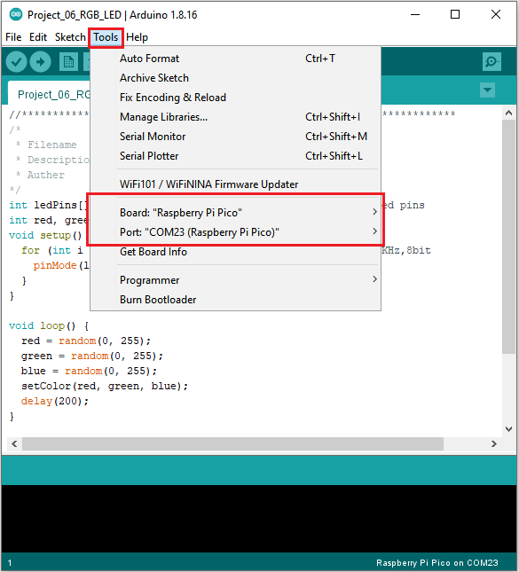

Click  to upload the test code to the Raspberry Pi Pico board

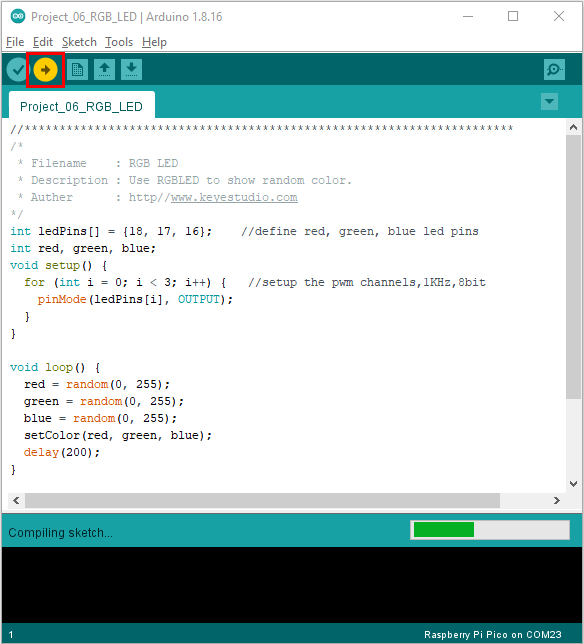


**6. Result**

Upload the project code, wire up, power up and wait a few seconds, the RGB will show random colors.

### Project 07: Flowing Light

**1. Introduction**

In our daily life, we can see many billboards made up of different colors of LED. They constantly change the light to attract the attention of customers. In this project, we will use Plus control board with 5 LEDs to achieve the effect of flowing water.


**2. Components**

|  |  |
| :----------------------------------------------------------: | :----------------------------------------------------------: |
|                     Raspberry Pi Pico*1                      |             Raspberry Pi Pico Expansion Board*1              |
|  |  |
|                          Red LED*10                          |                       220Ω Resistor*10                       |
|  |  |
|                         Breadboard*1                         |                         JumperWires                          |
|  |                                                              |
|                         USB Cable*1                          |                                                              |


**3. Circuit Diagram and Wiring Diagram**


Note:

How to connect the LED


How to identify the 220Ω 5-band resistor


**4. Test Code**


```c
//**********************************************************************
/* 
 * Filename    : Flowing Water Light
 * Description : Using ten leds to demonstrate flowing lamp.
 * Auther      : http//www.keyestudio.com
*/
byte ledPins[] = {16, 17, 18, 19, 20, 21, 22, 26, 27, 28};
int ledCounts;

void setup() {
  ledCounts = sizeof(ledPins);
  for (int i = 0; i < ledCounts; i++) {
    pinMode(ledPins[i], OUTPUT);
  }
}

void loop() {
  for (int i = 0; i < ledCounts; i++) {
    digitalWrite(ledPins[i], HIGH);
    delay(100);
    digitalWrite(ledPins[i], LOW);
  }
  for (int i = ledCounts - 1; i > -1; i--) {
    digitalWrite(ledPins[i], HIGH);
    delay(100);
    digitalWrite(ledPins[i], LOW);
  }
}
//**********************************************************************
```


Before uploading Test Code to Raspberry Pi Pico, please check the configuration of Arduino IDE.

Click "Tools" to confirm that the board type and ports.


Click  to upload the test code to the Raspberry Pi Pico board


**5. Test Result：**

After burning the project code, connecting the wires and powering on, the 10 LEDs will gradually light up and then gradually go off.


### Project 08: 1-Digit Digital Tube

**1. Introduction**

The seven-segment digital tube is an electronic display device that displays decimal numbers. It is widely used in digital clocks, electronic meters, basic calculators and other electronic devices that display digital information.  

The tubes are an alternative to more complex dot-matrix displays that are easy to use in both limited light conditions and strong sunlight. 

In this project, we will use the PLUS control board to control 1-digit digital tube to display numbers.


**2. Components Required**

|  |  |
| :----------------------------------------------------------: | :----------------------------------------------------------: |
|                     Raspberry Pi Pico*1                      |             Raspberry Pi Pico Expansion Board*1              |
|  |  |
|                    1-digit Digital Tube*1                    |                       220Ω Resistor*8                        |
|  |  |
|                         Breadboard*1                         |                         Jumper Wires                         |
|  |                                                              |
|                         USB Cable*1                          |                                                              |


**3. Component Knowledge**


**Display principle:** 

The digital tube display is a semiconductor light-emitting device.  Its basic unit is a light-emitting diode (LED). The digital tube display can be divided into 7-segment digital tube and 8-segment digital tube according to the number of segments. 

The 8-segment digital tube has one more LED unit than the 7-segment digital tube (used for decimal point display). Each segment of the 7-segment LED display is a separate LED. According to the connection mode of the LED unit, the digital tube can be divided into a common anode digital tube and a common cathode digital tube.

In the common cathode 7-segment digital tube, all the cathodes (or negative electrodes) of the segmented LEDs are connected together, so you should connect the common cathode to GND. To light up a segmented LED, you can set its associated pin to “HIGH”.

In the common anode 7-segment digital tube, the LED anodes (positive electrodes) of all segments are connected together, so you should connect the common anode to “+5V”. To light up a segmented LED, you can set its associated pin to“LOW”.


Each part of the digital tube is composed of an LED. So when you use it, you also need to use a current limiting resistor. Otherwise, the LED will be damaged. In this experiment, we use an ordinary common cathode one-bit digital tube. 

As we mentioned above, you should connect the common cathode to GND. To light up a segmented LED, you can set its associated pin to“HIGH”.

**4. Circuit Diagram and Wiring Diagram**


**Note:** The direction of the 7-segment digital tube inserted into the breadboard is the same as the wiring diagram, and there is one more point in the lower right corner.


**5. Test Code：**

The number display is divided into 7 segments, and the decimal point display is divided into 1 segment. When certain numbers are displayed, the corresponding segment will be lit. For example, when the number 1 is displayed, segments b and c will be turned on.


```c
//**********************************************************************
/* 
 * Filename    : 1-Digit Digital Tube
 * Description : One Digit Tube displays numbers from 9 to 0.
 * Auther      : http//www.keyestudio.com
*/
// sets the IO PIN for every segment
int a=17; // digital PIN 17 for segment a
int b=16; // digital PIN 16 for segment b
int c=14; // digital PIN 14 for segment c
int d=13; // digital PIN 13 for segment d
int e=12; // digital PIN 12 for segment e
int f=18; // digital PIN 18 for segment f
int g=19; // digital PIN 19 for segment g
int dp=15; // digital PIN 15 for segment dp
void digital_0(void) // displays number 0
{
digitalWrite(a,HIGH);
digitalWrite(b,HIGH);
digitalWrite(c,HIGH);
digitalWrite(d,HIGH);
digitalWrite(e,HIGH);
digitalWrite(f,HIGH);
digitalWrite(g,LOW);
digitalWrite(dp,LOW);
}
void digital_1(void) // displays number 1
{
digitalWrite(a,LOW);
digitalWrite(b,HIGH);
digitalWrite(c,HIGH);
digitalWrite(d,LOW);
digitalWrite(e,LOW);
digitalWrite(f,LOW);
digitalWrite(g,LOW);
digitalWrite(dp,LOW);
}
void digital_2(void) // displays number 2
{
digitalWrite(a,HIGH);
digitalWrite(b,HIGH);
digitalWrite(c,LOW);
digitalWrite(d,HIGH);
digitalWrite(e,HIGH);
digitalWrite(f,LOW);
digitalWrite(g,HIGH);
digitalWrite(dp,LOW);
}
void digital_3(void) // displays number 3
{
digitalWrite(a,HIGH);
digitalWrite(b,HIGH);
digitalWrite(c,HIGH);
digitalWrite(d,HIGH);
digitalWrite(f,LOW);
digitalWrite(e,LOW);
digitalWrite(dp,LOW);
digitalWrite(g,HIGH);
}
void digital_4(void) // displays number 4
{
digitalWrite(a,LOW);
digitalWrite(b,HIGH);
digitalWrite(c,HIGH);
digitalWrite(d,LOW);
digitalWrite(e,LOW);
digitalWrite(f,HIGH);
digitalWrite(g,HIGH);
digitalWrite(dp,LOW);
}
void digital_5(void) // displays number 5
{
digitalWrite(a,HIGH);
digitalWrite(b,LOW);
digitalWrite(c,HIGH);
digitalWrite(d,HIGH);
digitalWrite(e,LOW);
digitalWrite(f,HIGH);
digitalWrite(g,HIGH);
digitalWrite(dp,LOW);
}
void digital_6(void) // displays number 6
{
digitalWrite(a,HIGH);
digitalWrite(b,LOW);
digitalWrite(c,HIGH);
digitalWrite(d,HIGH);
digitalWrite(e,HIGH);
digitalWrite(f,HIGH);
digitalWrite(g,HIGH);
digitalWrite(dp,LOW);
}
void digital_7(void) // displays number 7
{
digitalWrite(a,HIGH);
digitalWrite(b,HIGH);
digitalWrite(c,HIGH);
digitalWrite(d,LOW);
digitalWrite(e,LOW);
digitalWrite(f,LOW);
digitalWrite(g,LOW);
digitalWrite(dp,LOW);
}
void digital_8(void) // displays number 8
{
digitalWrite(a,HIGH);
digitalWrite(b,HIGH);
digitalWrite(c,HIGH);
digitalWrite(d,HIGH);
digitalWrite(e,HIGH);
digitalWrite(f,HIGH);
digitalWrite(g,HIGH);
digitalWrite(dp,LOW);
}
void digital_9(void) // displays number 9
{
digitalWrite(a,HIGH);
digitalWrite(b,HIGH);
digitalWrite(c,HIGH);
digitalWrite(d,HIGH);
digitalWrite(e,LOW);
digitalWrite(f,HIGH);
digitalWrite(g,HIGH);
digitalWrite(dp,LOW);
}
void setup()
{
int i;// declares a Variable
for(i=12;i<=19;i++)
pinMode(i,OUTPUT);// sets PIN 12-19 to "output"
}
void loop()
{
while(1)
{
digital_9();// displays number 9
delay(1000); // waits a sencond
digital_8();// displays number 8
delay(1000); // waits a sencond
digital_7();// displays number 7
delay(1000); // waits a sencond
digital_6();// displays number 6
delay(1000); // waits a sencond
digital_5();// displays number 5
delay(1000); // waits a sencond
digital_4();// displays number 4
delay(1000); // waits a sencond
digital_3();// displays number 3
delay(1000); // waits a sencond
digital_2();// displays number 2
delay(1000); // waits a sencond
digital_1();// displays number 1
delay(1000);// waits a sencond
digital_0();// displays number 0
delay(1000);// waits a sencond
}}
//******************************************************************
```


Before uploading Test Code to Raspberry Pi Pico, please check the configuration of Arduino IDE.

Click "Tools" to confirm that the board type and ports.

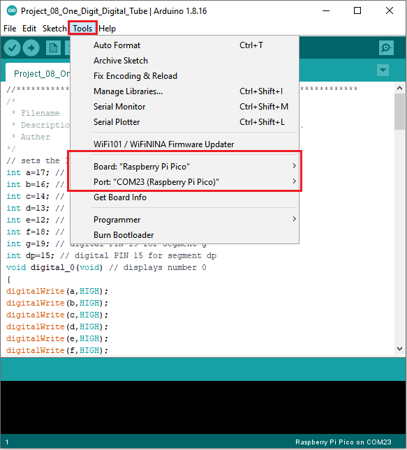

Click  to upload the test code to the Raspberry Pi Pico board


**6. Result**

After burning the project code, connecting the wires and powering on, 1-digit digital tube will display numbers from 9 to 0.


### Project 09: 4-Digit Digital Tube

**1. Introduction**

The 4-digit 7-segment digital tube is a very practical display device, and it is used for devices such as electronic clocks and score counters. Due to the low price and it is easy to use, more and more projects will use 4-digit 7-segment digital tubes. 

In this project, we will use the PLUS control board to control a 4-bit 7-segment digital tube to create a manual counter.


**2. Components Required**

|  |  |
| :----------------------------------------------------------: | :----------------------------------------------------------: |
|                     Raspberry Pi Pico*1                      |            Raspberry Pi Pico Development Board*1             |
| 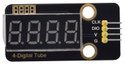 |  |
|                4-Digit Digital Tube Module*1                 |                       M-F Dupont Wires                       |
|  |                                                              |
|                         USB Cable*1                          |                                                              |


**3. Component Knowledge**

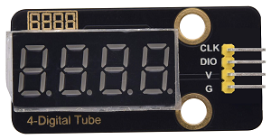

**TM1650 4-digit digital tube:** 

It is a 12-pin 4-digit tube display module with clock dots. The driver chip is TM1650 which only needs 2 signal lines to enable the microcontroller to control the 4-digit 8-segment digital tube. The control interface level can be 5V or 3.3V.

**Specifications of 4-bit digital tube module:**

- Working voltage: DC 3.3V-5V

- Maximum current: 100MA

- Maximum power: 0.5W


**Schematic diagram of 4-digit digital tube module:**


**4. Wiring Diagram**


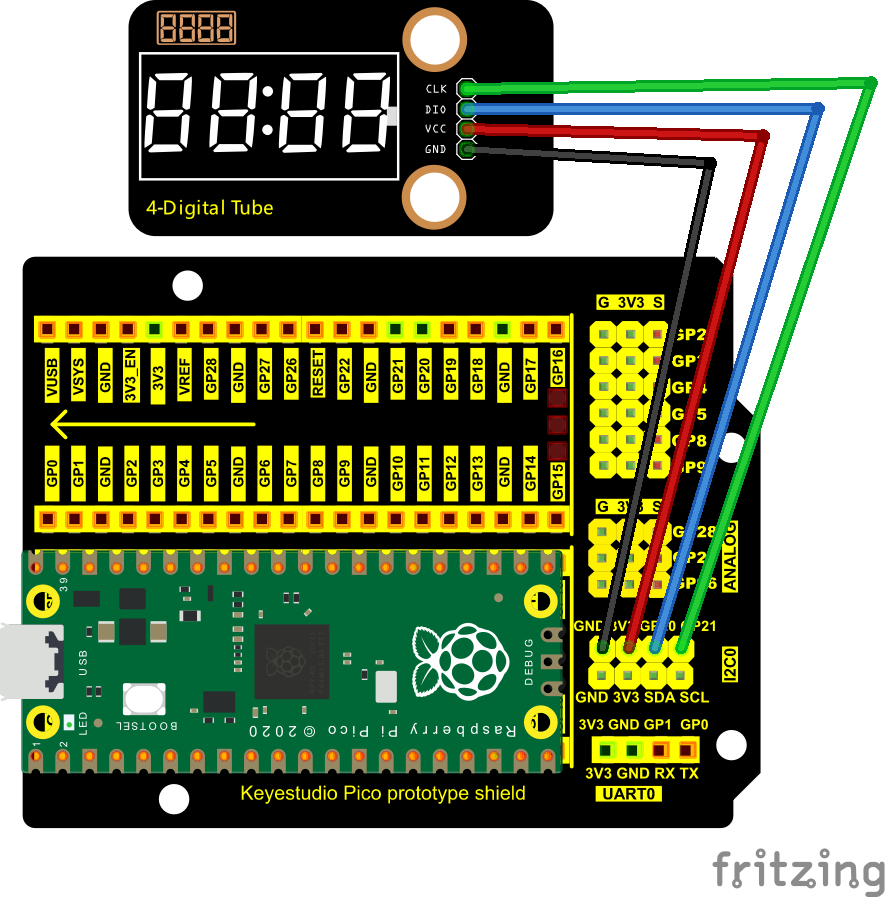

**5. Adding the TM1650 library：**

If you added the **TM1650** library, just skip this step.

**Add the library as follows:**

Open "Arduino IDE"，click “Sketch” → “Include Library” → “Add .zip Library...”. 

Go to the folder "**...\5.Libraries_Firmware_and_APP\Libraries**" and click <span style="color: rgb(255, 76, 65);">"TM1650.Zip"</span> and "**Open**".

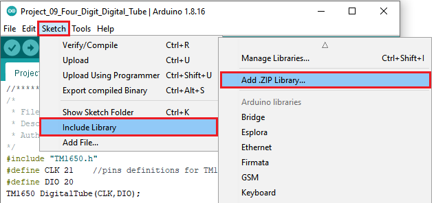

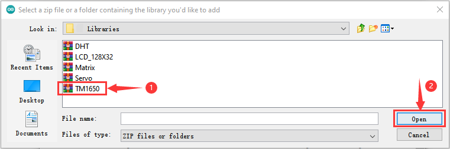

**6. Test Code:**


```c
//**********************************************************************
/* 
 * Filename    : 4-Digit Digital Tube
 * Description : Four Digit Tube displays numbers from 1111 to 9999.
 * Auther      : http//www.keyestudio.com
*/
#include "TM1650.h"
#define CLK 21    //pins definitions for TM1650 and can be changed to other ports 
#define DIO 20
TM1650 DigitalTube(CLK,DIO);

void setup(){
  //DigitalTube.setBrightness();  //stes brightness from 0 to 7(default is 2)
  //DigitalTube.displayOnOFF();   // 0= off,1= on(default is 1)
  for(char b=1;b<5;b++){
    DigitalTube.clearBit(b);      //which bit to clear
  }
  DigitalTube.displayDot(1,true); // displays the first number
  DigitalTube.displayDot(2,true);
  DigitalTube.displayDot(3,true);
  DigitalTube.displayDot(4,true);
  DigitalTube.displayBit(3,0);    //which number to display. bit=1-4, number=0-9
}

void loop(){
  for(int num=0; num<10; num++){
    DigitalTube.displayBit(1,num);
    DigitalTube.displayBit(2,num);
    DigitalTube.displayBit(3,num);
    DigitalTube.displayBit(4,num);
    delay(1000);
  }  
 }
//*****************************************************************************
```


Before uploading Test Code to Raspberry Pi Pico, please check the configuration of Arduino IDE.

Click "Tools" to confirm that the board type and ports.

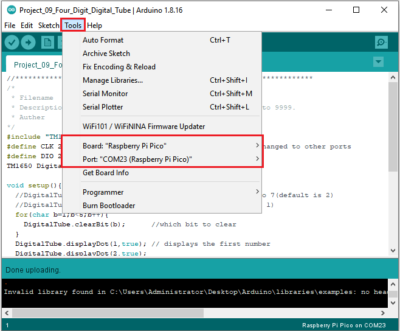

Click  to upload the test code to the Raspberry Pi Pico board

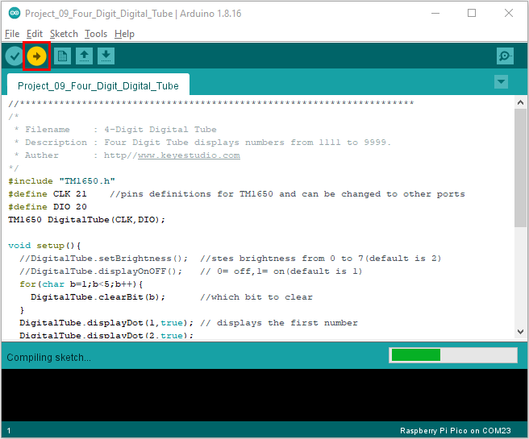

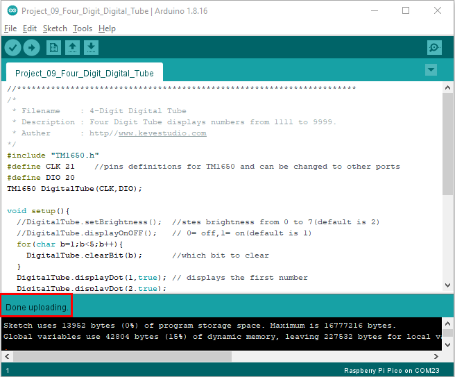

**7. Result**

Upload the project code, wire up and power on, 4-digit digital tube circularly displays numbers from 0000 to 9999.


### Project 10: 8×8 Dot-matrix Display

**1. Introduction**

The dot-matrix display is an electronic digital display device that can show information on machines, clocks and many other devices. 

In this project, we will use the pico board control the 8x8 LED dot matrix to make a“❤”pattern.


**2. Components Required**

|  |  |
| :----------------------------------------------------------: | :----------------------------------------------------------: |
|                     Raspberry Pi Pico*1                      |             Raspberry Pi Pico Expansion Board*1              |
|  |  |
|                  8*8 Dot-matrix Display *1                   |                       M-F Dupont Wires                       |
|  |                                                              |
|                         USB Cable*1                          |                                                              |


**3. Component Knowledge**

**8*8 Dot-matrix display module:**

The 8\*8 dot matrix is composed of 64 LEDs, and each LED is placed at the intersection of a row and a column. When using a single-chip microcomputer to drive an 8\*8 dot matrix, we need to use a total of 16 digital ports, which greatly wastes the data of the single-chip microcomputer. 

For this reason, we specially designed this module, using the HT16K33 chip to drive an 8\*8 dot matrix, and only need to use the I2C communication port of the single-chip microcomputer to control the dot matrix, which greatly saves the microcontroller resources.

**4. Specifications:**

- Working voltage: DC 5V

- Current: 200MA

- Maximum power: 1W


**5. Schematic diagram:**

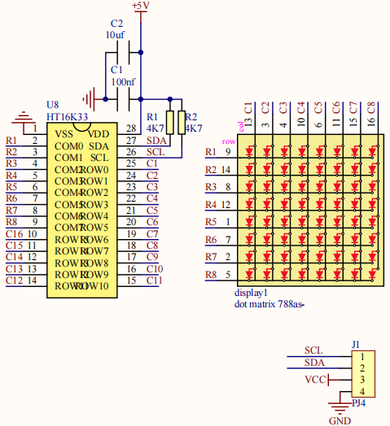

Some modules come with 3 DIP switches which allow you to toggle the switches at will. They are used to set the I2C communication address. The setting method is as follows. 

In our module, the module has fixed the communication address, A0, A1, A2 are all grounded, that is, the address is 0x70.

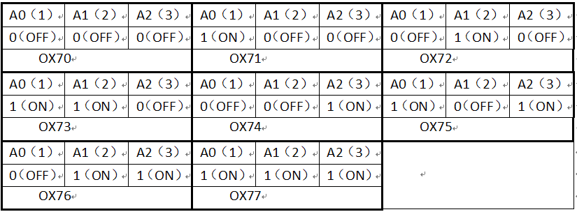


**6. Circuit diagram and wiring diagram:**

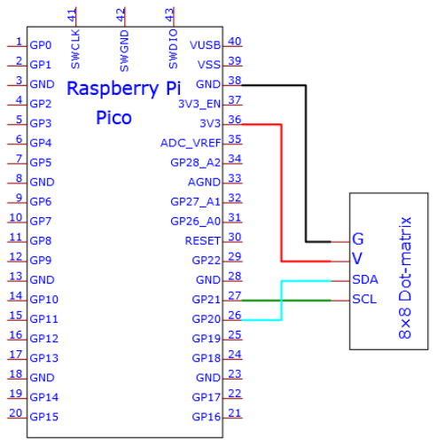


**7. Adding the Matrix library：**

The project code uses a library called Matrix. If you haven't added it yet, add it before you study. If you want to add a third-party library, please perform the following steps:

Open "Arduino IDE"，click “Sketch” → “Include Library” → “Add .zip Library...”. 

Go to the folder "**...\5.Libraries_Firmware_and_APP\Libraries**" and click <span style="color: rgb(255, 76, 65);">"Matrix.zip"</span> and "**Open**".


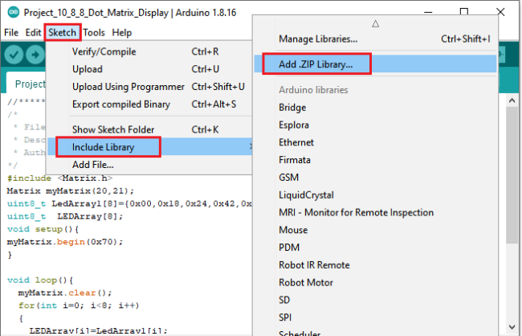

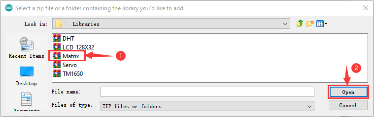


**8. Test Code**


```c
//**********************************************************************************
/*
 * Filename    : 8×8 Dot-matrix Display
 * Description : 8x8 LED dot matrix display“Heart” pattern.
 * Auther      : http//www.keyestudio.com
*/
#include <Matrix.h>
Matrix myMatrix(20,21);
uint8_t LedArray1[8]={0x00,0x18,0x24,0x42,0x81,0x99,0x66,0x00};
uint8_t  LEDArray[8];
void setup(){
myMatrix.begin(0x70);
}

void loop(){
  myMatrix.clear();
  for(int i=0; i<8; i++)
  {
    LEDArray[i]=LedArray1[i];
    for(int j=7; j>=0; j--)
    {
      if((LEDArray[i]&0x01)>0)
      myMatrix.drawPixel(j, i,1);
      LEDArray[i] = LEDArray[i]>>1;
    }
  }
  myMatrix.writeDisplay();
}
//*******************************************************************************
```


Before uploading Test Code to Raspberry Pi Pico, please check the configuration of Arduino IDE.

Click "Tools" to confirm that the board type and ports.

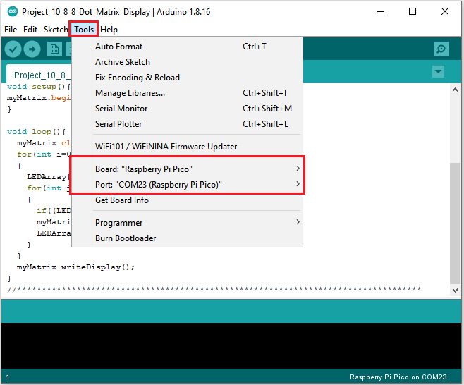

Click  to upload the test code to the Raspberry Pi Pico board

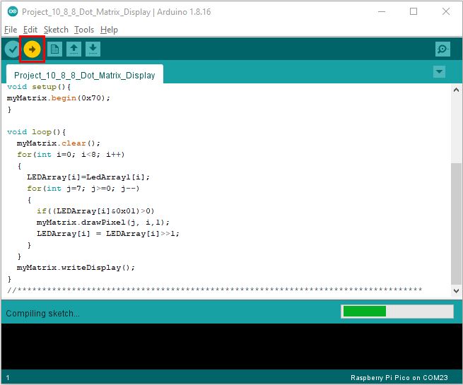

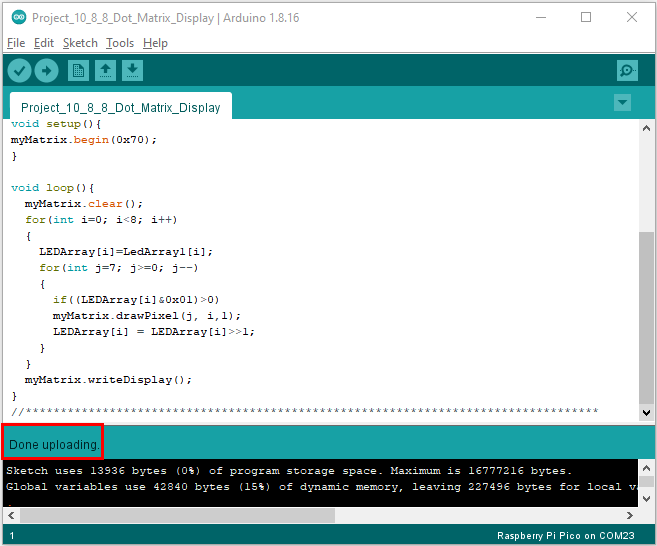

**9. Test Result：**

You will view the 8\*8 dot matrix show the“❤”pattern.


### Project 11: 74HC595N Control 8 LEDs 

**1. Introduction**

For a PLUS mainboard, it has only 22 I/O ports, how do we light up a large number of LEDs? In this project, we will use 74HC595N to control 7 LEDs to save port resources.


**2. Components Required**

|  |  |
| :----------------------------------------------------------: | :----------------------------------------------------------: |
|                     Raspberry Pi Pico*1                      |             Raspberry Pi Pico Expansion Board*1              |
|  |  |
|                       74HC595N Chip*1                        |                          Red LED*8                           |
|  |  |
|                       220Ω Resistor*8                        |                         Breadboard*1                         |
|  |  |
|                         Jumper Wires                         |                         USB Cable*1                          |


**3. Component Knowledge**

**74HC595N Chip:** 

To put it simply, 74HC595N chip is a combination of 8-digit shifting register, memorizer and equipped with tri-state output.The shift register and the memorizer are synchronized to different clocks, and the data is input on the rising edge of the shift register clock SCK and goes into the memory register on the rising edge of the memory register clock RCK. 

If the two clocks are connected together, the shift register is always one pulse earlier than the storage register. The shift register has a serial shift input (SI) and a serial output (SQH) for cascading. 

The 8-bit shift register can be reset asynchronously (low-level reset), and the storage register has an 8-bit Three-state parallel bus output, when the output enable (OE) is enabled (active low), the storage register is output to the 74HC595N pin (bus).

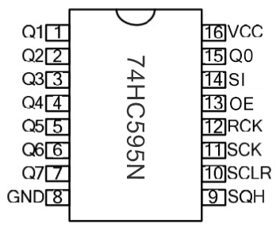

**Pins**：

|             PIN             | FUNCTION                                                     |
| :-------------------------: | ------------------------------------------------------------ |
|          Pin13 OE           | It is an output enable pin to ensure that the data of the latch is input to the Q0 to Q7 pins or not. <br />When it is low, no high level is output. <br />In this experiment, we directly connect to GND and keep the data output low. |
|          Pin14 SI           | This is the pin for 74HC595 to receive data, <br />i.e. serial data input, only one bit can be input at a time, then 8 times in a row, it can form a byte. |
|         Pin10 SCLR          | A pin to initialize the storage register pins. <br />It initializes the internal storage registers at a low level. <br />In this experiment, we connect VCC to maintain a high level. |
|         Pin11  SCK          | The clock pin of the shift register. <br />At the rising edge, the data in the shift register is shifted backward as a whole, and new data input is received. |
|          Pin12 RCK          | The clock input pin of the storage register . <br />At the rising edge, the data is transferred from the shift register to the storage register. <br />At this time, the data is output in parallel from the Q0 to Q7 ports. |
|          Pin9 SQH           | It is a serial output pin dedicated for chip cascading to the SI terminal of the next 74HC595. |
| Q0--Q7<br />(Pin 15,Pin1-7) | Eight-bit parallel output, can directly control the 8 segments of the digital tube. |

VCC and GND are used used for chip power supply, and the operating voltage is 5V.


**3. Circuit Diagram and Wiring Diagram**


Note: Pay attention to the direction in which the 74HC595N chip is inserted.


**4. Test Code：**


```c
//**********************************************************************
/* 
 * Filename    : 74HC595N Control 8 LEDs
 * Description : Use 74HC575N to drive ten leds to display the flowing light.
 * Auther      : http//www.keyestudio.com
*/
int dataPin = 18;   // Pin connected to DS of 74HC595(Pin14)  
int latchPin = 20;  // Pin connected to ST_CP of 74HC595(Pin12)
int clockPin = 21;  // Pin connected to SH_CP of 74HC595(Pin11)          

void setup() { // set pins to output
  pinMode(latchPin, OUTPUT);
  pinMode(clockPin, OUTPUT);
  pinMode(dataPin, OUTPUT);
}

void loop() {
  // Define a one-byte variable to use the 8 bits to represent the state of 8 LEDs of LED bar graph.
  // This variable is assigned to 0x01, that is binary 00000001, which indicates only one LED light on.
  byte x = 0x01;    // 0b 0000 0001
  for (int j = 0; j < 8; j++) { // Let led light up from right to left
    writeTo595(LSBFIRST, x);
    x <<= 1; // make the variable move one bit to left once, then the bright LED move one step to the left once.
    delay(100);
  }
  delay(100);
  x = 0x80;       //0b 1000 0000
  for (int j = 0; j < 8; j++) { // Let led light up from left to right
    writeTo595(LSBFIRST, x);
    x >>= 1;    
    delay(100);
  }
  delay(100);
}
void writeTo595(BitOrder order, byte _data ) {
  // Output low level to latchPin
  digitalWrite(latchPin, LOW);
  // Send serial data to 74HC595
  shiftOut(dataPin, clockPin, order, _data);
  // Output high level to latchPin, and 74HC595 will update the data to the parallel output port.
  digitalWrite(latchPin, HIGH);
}
//***********************************************************************
```


Before uploading Test Code to Raspberry Pi Pico, please check the configuration of Arduino IDE.

Click "Tools" to confirm that the board type and ports.

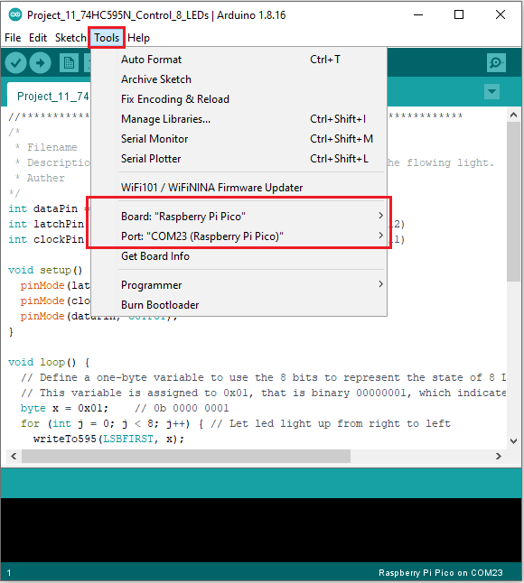

Click  to upload the test code to the Raspberry Pi Pico board.

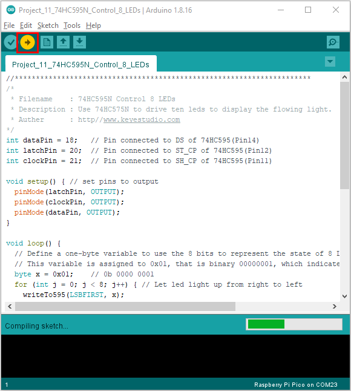

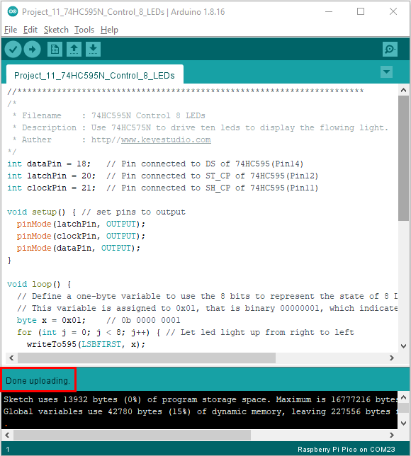

**5. Result**

Upload project code, wire up and power on, then you can see 8 LED flash like a flowing light.


### Project 12: Active Buzzer

**1. Introduction**

Active buzzer is a sound making element, widely used on computers, printers, alarms, electronic toys, telephones, timers, etc. It has an inner vibration source. 

In this project, we will use a PLUS control board to control the active buzzer to buzz.


**2. Components Required**

|  |  |
| :----------------------------------------------------------: | :----------------------------------------------------------: |
|                     Raspberry Pi Pico*1                      |             Raspberry Pi Pico Expansion Board*1              |
|  |  |
|                       Active Buzzer*1                        |                        Breadboard *1                         |
|  |  |
|                         Jumper Wires                         |                         USB Cable*1                          |


**3. Component Knowledge**


The active buzzer inside has a simple oscillator circuit which can convert constant direct current into a certain frequency pulse signal. Once active buzzer receives a high level, it will sound. 

The passive buzzer is an integrated electronic buzzer with no internal vibration source. It must be driven by 2K to 5K square wave instead of a DC signal. 

The appearance of the two buzzers is very similar, but passive buzzers come with a green circuit board, and active buzzers come with a black tape. Passive buzzers don't have positive pole, but active buzzers have.


**4. Circuit Diagram and Wiring Diagram**

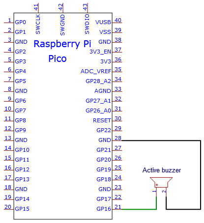


**Note**:

1). The power supply of the buzzer is 5V. With a 3.3V supply, the buzzer will work, but it will beep weakly.
2). VUSB should be connected to the positive side of the USB cable, if it is connected to GND, it may burn out the computer or Raspberry Pi Pico. Also, be careful when wiring the Raspberry Pi Pico pins 36-40 to avoid short circuits. 
3). The positive pole (“+”/long pin) of the active buzzer is connected to pin 16, and the negative pole (short pin) is connected to GND.

**5. Test Code：**


```c
//**********************************************************************
/* 
 * Filename    : Active Buzzer
 * Description : Active buzzer beeps.
 * Auther      : http//www.keyestudio.com
*/
#define buzzerPin  16   //define buzzer pins

void setup ()
{
  pinMode (buzzerPin, OUTPUT);
}
void loop ()
{
  digitalWrite (buzzerPin, HIGH);
  delay (500);
  digitalWrite (buzzerPin, LOW);
  delay (500);
}
//*************************************************************************
```

Before uploading Test Code to Raspberry Pi Pico, please check the configuration of Arduino IDE.

Click "Tools" to confirm that the board type and ports.

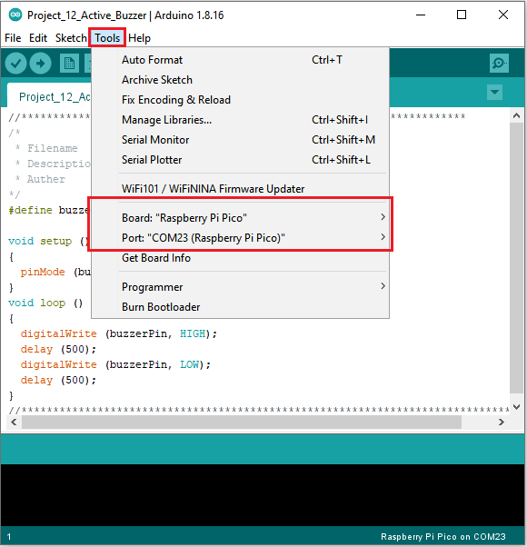

Click  to upload the test code to the Raspberry Pi Pico board

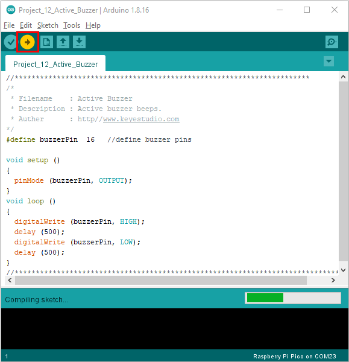

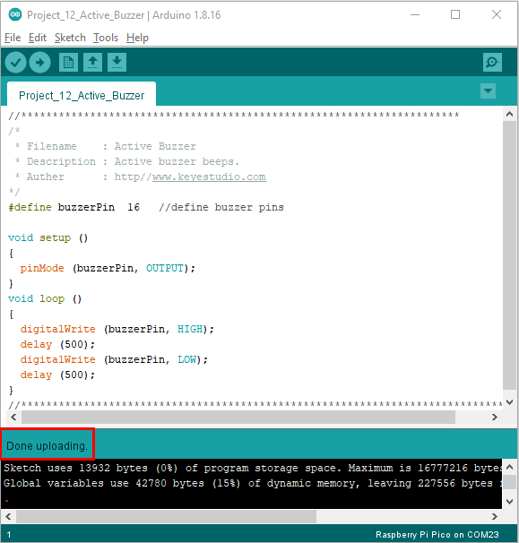

**6. Result**

Upload the project code, wire up and power up, then the active buzzer buzzes.


### Project 13: Passive Buzzer

**1. Introduction**

In this project, we will learn the passive buzzer and use the Plus control board to control the passive buzzer to play a song. Unlike an active buzzer, a passive buzzer can emit sounds of different frequencies. 


**2. Components Required**

|  |  |
| :----------------------------------------------------------: | :----------------------------------------------------------: |
|                     Raspberry Pi Pico*1                      |             Raspberry Pi Pico Expansion Board*1              |
|  |  |
|                       Passive Buzzer*1                       |                         Breadboard*1                         |
|  |  |
|                         Jumper Wires                         |                         USB Cable*1                          |


**3. Component Knowledge**


A passive buzzer is an integrated electronic buzzer with no internal vibration source. It must be driven by 2K to 5K square wave, not a DC signal. 

The two buzzers are very similar in appearance, but one buzzer with a green circuit board is a passive buzzer, while the other with black tape is an active buzzer. 

Passive buzzers cannot distinguish between positive polarity while active buzzers can.


**4. Circuit Diagram and Wiring Diagram**


**5. Test Code：**

```c
//**********************************************************************
/*
 * Filename    : Passive Buzzer
 * Description : Passive Buzzer sounds the alarm.
 * Auther      : http//www.keyestudio.com
*/
#define PIN_BUZZER 16   //define buzzer pins

void setup() {
  pinMode(PIN_BUZZER, OUTPUT);
}

void loop() {
    alert();
}

void alert() {
  float sinVal;         // Define a variable to save sine value
  int toneVal;          // Define a variable to save sound frequency
  for (int x = 0; x < 360; x += 10) {     // X from 0 degree->360 degree
    sinVal = sin(x * (PI / 180));       // Calculate the sine of x
    toneVal = 2000 + sinVal * 500;      // Calculate sound frequency according to the sine of x
    freq(PIN_BUZZER, toneVal, 10);
  }
}

void freq(int PIN, int freqs, int times) {
  if (freqs == 0) {
    digitalWrite(PIN, LOW);
  }
  else {
    for (int i = 0; i < times * freqs / 1000; i ++) {
      digitalWrite(PIN, HIGH);
      delayMicroseconds(1000000 / freqs / 2);
      digitalWrite(PIN, LOW);
      delayMicroseconds(1000000 / freqs / 2);
    }
  }
}
//********************************************************************
```


Before uploading Test Code to Raspberry Pi Pico, please check the configuration of Arduino IDE.

Click "Tools" to confirm that the board type and ports.


Click  to upload the test code to the Raspberry Pi Pico board


**6. Result**

Upload the project code, wire up and power on, then the passive buzzer will alarm.


### Project 14: Mini Table Lamp

**1. Introduction**

Did you know that Arduino can light up an LED when you press a button? In this project, we will use the Plus Mainboard, a key switch and an LED to make a small desk lamp.

**2. Components Required**

|  |  |
| :----------------------------------------------------------: | :----------------------------------------------------------: |
|                     Raspberry Pi Pico*1                      |             Raspberry Pi Pico Expansion Board*1              |
| 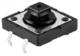 |  |
|                           Button*1                           |                          Red LED*1                           |
|  |  |
|                         Breadboard*1                         |                       220Ω Resistor*1                        |
|  |  |
|                       220Ω Resistor*1                        |                         USB Cable*1                          |
|  |  |
|                         Jumper Wires                         |                         Button Cap*1                         |


**3. Component Knowledge**

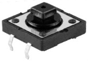

**Button:** 

The button can control the circuit on and off. The circuit is disconnected when the button is not pressed. But it breaks when you release it. 

Why does it only work when you press it? It starts from the internal structure of the button, which is shown in the figure:


Before the button is pressed, 1 and 2 are on, 3 and 4 are also on, but 1, 3 or 1, 4 or 2, 3 or 2, 4 are off (not working). Only when the button is pressed, 1, 3 or 1, 4 or 2, 3 or 2, 4 are on.

The key switch is one of the most commonly used components in circuit design.


**4. Schematic Diagram of the Button**

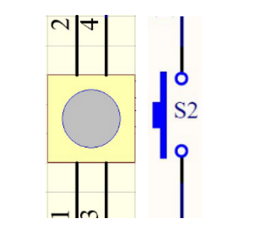


**5. Circuit Diagram and Wiring Diagram**

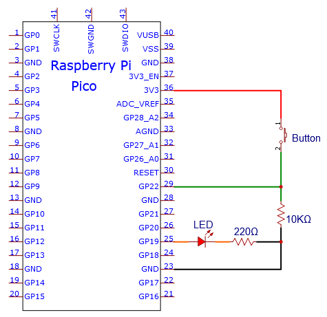


Note:

How to connect the LED


How to identify the 220Ω 5-band resistor and 10KΩ 5-band resistor


**6. Test Code：**


```c
//**********************************************************************
/* 
 * Filename    : Mini Table Lamp
 * Description : Make a table lamp.
 * Auther      : http//www.keyestudio.com
*/
#define PIN_LED    19
#define PIN_BUTTON 22
bool ledState = false;

void setup() {
  // initialize digital pin PIN_LED as an output.
  pinMode(PIN_LED, OUTPUT);
  pinMode(PIN_BUTTON, INPUT);
}

// the loop function runs over and over again forever
void loop() {
  if (digitalRead(PIN_BUTTON) == LOW) {
    delay(20);
    if (digitalRead(PIN_BUTTON) == LOW) {
      reverseGPIO(PIN_LED);
    }
    while (digitalRead(PIN_BUTTON) == LOW);
  }
}

void reverseGPIO(int pin) {
  ledState = !ledState;
  digitalWrite(pin, ledState);
}
//*******************************************************
```


Before uploading Test Code to Raspberry Pi Pico, please check the configuration of Arduino IDE.

Click "Tools" to confirm that the board type and ports.

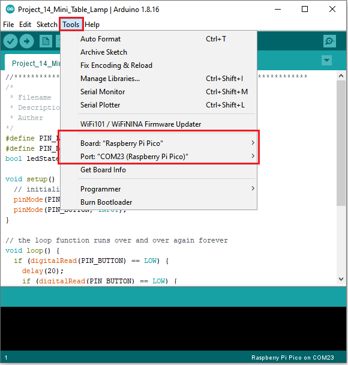

Click  to upload the test code to the Raspberry Pi Pico board.


**7. Result**

Burn the project code, connect the wires and power on first. Then press the button, the LED will turn on. Press the button again, the LED will turn off.

### Project 15: Tilt And LED

**1. Introduction**

In this lesson, we will use a PLUS mainboard , a tilt switch and 4 LEDs to make an electronic hourglass.

**2. Components Required**

| 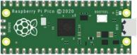 |  |
| :----------------------------------------------------------: | :----------------------------------------------------------: |
|                     Raspberry Pi Pico*1                      |             Raspberry Pi Pico Expansion Board*1              |
| 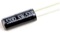 |  |
|                        Tilt Switch*1                         |                          Red LED*4                           |
|  |  |
|                       10KΩ Resistor*1                        |                       220Ω Resistor*4                        |
|  |  |
|                         Breadboard*1                         |                         USB Cable*1                          |
|  |                                                              |
|                         Jumper Wires                         |                                                              |


**3. Component Knowledge**


Tilt switch is also called digital switch. Inside is a metal ball that can roll. The principle of rolling the metal ball to contact with the conductive plate at the bottom, which is used to control the on and off of the circuit. 

When it is a rolling ball tilt sensing switch with single directional trigger, the tilt sensor is tilted toward the trigger end (two gold-plated pin ends), the tilt switch is in a closed circuit and the voltage at the analog port is about 5V (binary number is 1023).

In this way, the LED will light up. When the tilt switch is in a horizontal position or tilted to the other end, it is open and the voltage of the analog port is about 0V (binary number is 0), the LED will turn off. 

In the program, we judge the state of the switch based on whether the voltage value of the analog port is greater than 2.5V (binary number is 512).

As shown in the figure, use the internal structure of the tilt switch to illustrate how it works.


**4. Circuit Diagram and Wiring Diagram**

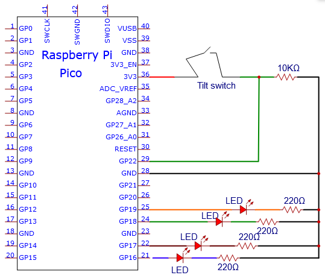


Note:

How to connect the LED


How to identify the 220Ω 5-band resistor and 10KΩ 5-band resistor


**5. Test Code**


```c
//**********************************************************************
/* 
 * Filename    : Tilt And LED
 * Description : Tilt switches and four leds to simulate an hourglass.
 * Auther      : http//www.keyestudio.com
*/
#define SWITCH_PIN  22  // the tilt switch is connected to Pin22
byte switch_state = 0;
void setup()
{
     for(int i=16;i<20;i++)
  {
        pinMode(i, OUTPUT);
  } 
    pinMode(SWITCH_PIN, INPUT);
 for(int i=16;i<20;i++)
  {
    digitalWrite(i,0);
  } 
  Serial.begin(9600);
}
void loop()
{
switch_state = digitalRead(SWITCH_PIN); 
Serial.println(switch_state);
 if (switch_state == 0) 
 {
 for(int i=16;i<20;i++)
  {
    digitalWrite(i,1);
    delay(500);
  } 
  }
   if (switch_state == 1) 
 {
   for(int i=19;i>15;i--)
   {
    digitalWrite(i,0);
    delay(500);
   }
  }
}
//**********************************************************************
```


Before uploading Test Code to Raspberry Pi Pico, please check the configuration of Arduino IDE.

Click "Tools" to confirm that the board type and ports.


Click  to upload the test code to the Raspberry Pi Pico board

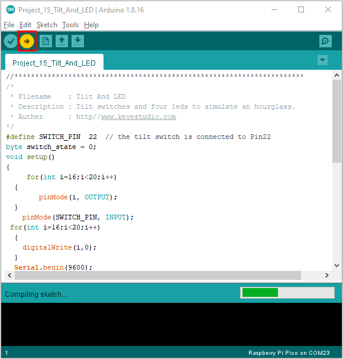

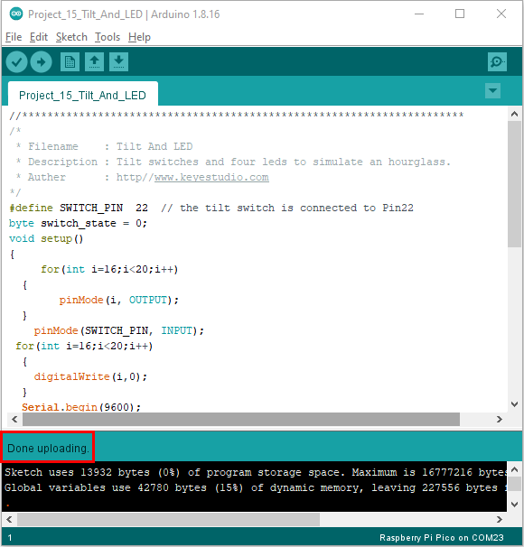

**6. Result**

Upload project code, wire up and power up, hold the breadboard. 

When you tilt the breadboard to any angle, the LEDs will light up one by one. 

When you turn the breadboard to the original angle, the LEDs will turn off one by one.


### Project 16: Burglar Alarm

**1. Introduction**

PIR motion sensor measures the thermal infrared (IR) light emitted by moving objects. The sensor can detect the movement of people, animals, and cars to trigger safety alarms and lighting. 

They are used to detect movement and ideal for security such as burglar alarms and security lighting systems. In this project, we will use a PIR motion sensor and buzzer to detect sounds when people or animals approach.

**2. Components Required**

|  |  |
| :----------------------------------------------------------: | :----------------------------------------------------------: |
|                     Raspberry Pi Pico*1                      |             Raspberry Pi Pico Expansion Board*1              |
| 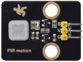 | 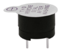 |
|                     PIR Motion Sensor*1                      |                       Active Buzzer*1                        |
|  |  |
|                          Red LED*1                           |                         Breadboard*1                         |
|  |  |
|                       F-F Dupont Wires                       |                       220Ω Resistor*1                        |
|  |  |
|                         USB Cable*1                          |                         Jumper Wires                         |


**3. Component Knowledge**

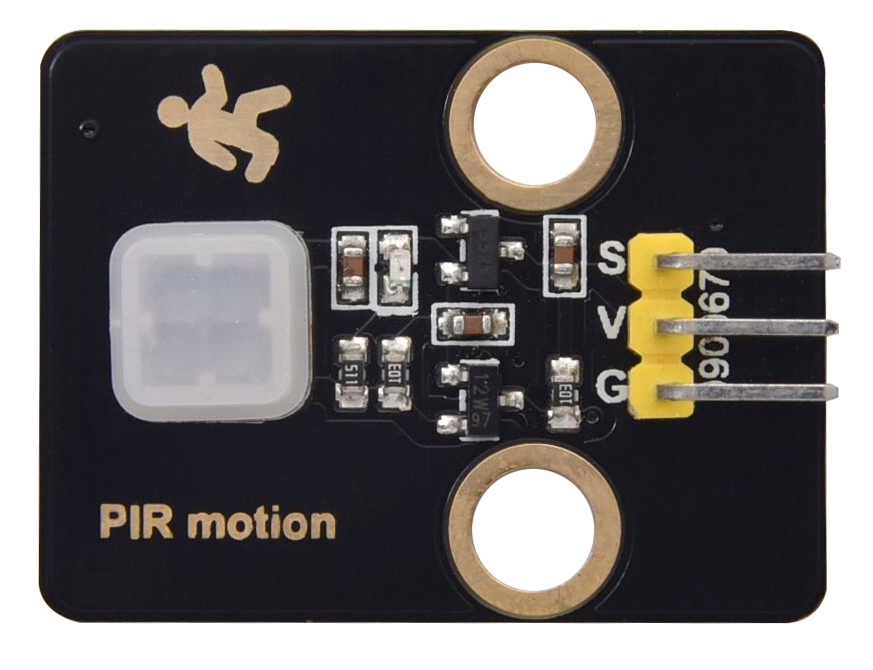

**PIR motion sensor:** The principle is that when certain crystals, such as lithium tantalate and triglyceride sulfate, are heated, the two ends of the crystal will generate an equal number of charges with opposite signs. These charges can be converted into voltage output by an amplifier. 

And the human body will release infrared light, although relatively weak, but still can be detected. When the PIR motion sensor detects the movement of a nearby person, the sensor signal terminal outputs a high level 1. Otherwise, it outputs a low level 0. Pay special attention that this sensor can detect people, animals and cars in motion. People, animals and cars at rest cannot be detected. The maximum detection distance is about 7 meters.

**Note:** 

Since vulnerable to radio frequency radiation and temperature changes, the PIR motion sensor should be kept away from heat sources like radiators, heaters and air conditioners, as well as direct irradiation of sunlight, headlights and incandescent light.

**Features:**

- Maximum input voltage: DC 3.3 \~ 5V

- Maximum operating current: 50MA

- Maximum power: 0.3W

- Operating temperature: -20 \~ 85℃

- Output high level is 3V, low level is 0V.

- Delay time: about 2.3 to 3 seconds

- Detection Angle: about 100 degrees

- Maximum detection distance: about 7 meters

- Indicator light output (when the output is high, it will light up)

- Pin limiting current: 50MA


**4. Schematic diagram:**


**5. Circuit Diagram and Wiring Diagram**


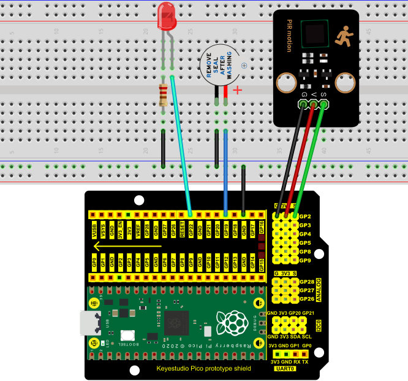

**6. Test Code：**

```c
//**********************************************************************
/* 
 * Filename    : Burglar Alarm
 * Description : Human infrared sensor buzzer and LED to simulate burglar alarm.
 * Auther      : http//www.keyestudio.com
*/
#define buzzerPin   19   // the pin of the buzzer
#define ledPin   22     // the pin of the PIR motion sensor
#define pirPin   2     // the pin of the PIR motion sensor
byte pirStat = 0;   // the state of the PIR motion sensor
void setup() {
 pinMode(buzzerPin, OUTPUT); 
 pinMode(ledPin, OUTPUT);    
 pinMode(pirPin, INPUT);     
}
void loop()
{
 pirStat = digitalRead(pirPin); 
 if (pirStat == HIGH)
 {            // if people or moving animals are detected
   digitalWrite(buzzerPin, HIGH);  // the buzzer buzzes
   digitalWrite(ledPin, HIGH);  // the led turn on
   delay(500);
   digitalWrite(buzzerPin, LOW);  // the buzzer doesn't sound
   digitalWrite(ledPin, LOW);  // the led turn off
   delay(500);
 } 
 else {
   digitalWrite(buzzerPin, LOW); // if people or moving animals are not detected, turn off buzzers
   digitalWrite(ledPin, LOW);  // the led turn off
 }
}
//*****************************************************************
```


Before uploading Test Code to Raspberry Pi Pico, please check the configuration of Arduino IDE.

Click "Tools" to confirm that the board type and ports.

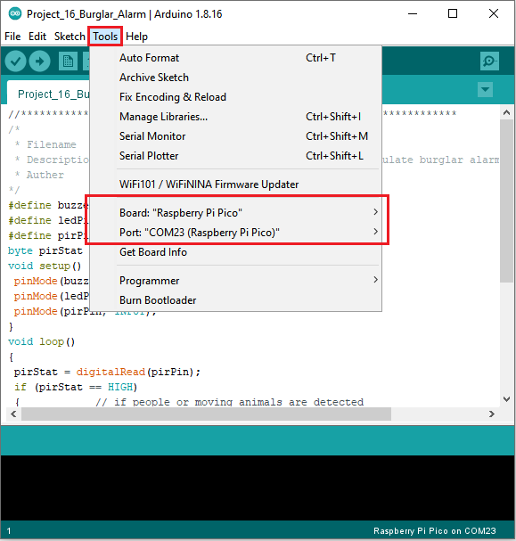

Click  to upload the test code to the Raspberry Pi Pico board


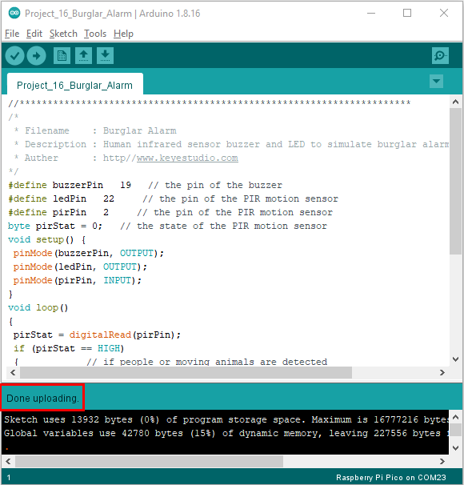

**7. Test Result：**

Upload the code and power up. The active buzzer will alarm and LED will flash, if people are detected


### Project 17: I2C 128×32 LCD

**1. Introduction**

We can use modules such as monitors to do various experiments in life. You can also DIY a variety of small objects. For example, you can make a temperature meter with a temperature sensor and display, or make a distance meter with an ultrasonic module and display.

In this project, we will use the LCD_128X32_DOT module as a display and connect it to the Plus control board. The pico board will be used to control the LCD_128X32_DOT display to show various English characters, common symbols and numbers.


**2. Components Required**

|  | 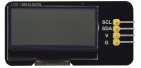 |
| :----------------------------------------------------------: | :----------------------------------------------------------: |
|                     Raspberry Pi Pico*1                      |                       LCD_128X32_DOT*1                       |
| 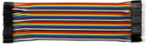 |  |
|                    10CM M-F Dupont Wires                     |                         USB Cable*1                          |


**3. Component Knowledge**


**LCD\_128X32\_DOT:** 

It is an LCD module with 128*32 pixels and its driver chip is ST7567A. 

The module uses the IIC communication mode, while the code contains a library of all alphabets and common symbols that can be called directly. 

When using, we can also set it in the code so that the  English letters and symbols show different text sizes.


4.**Schematic diagram:**


5.**Features:**

- Pixel：128\*32 character

- Operating voltage(chip)：4.5V to 5.5V

- Operating current：100mA (5.0V)

- Optimal operating voltage(module):5.0V


6.**Connection Diagram**

**Attention**: 

You must use a 10CM short male-to-female DuPont cable to connect the LCD\_128X32\_DOT, and the LCD\_128X32\_DOT will display normally; otherwise, using a 20CM long male-to-female DuPont cable may cause the LCD\_128X32\_DOT to display abnormally.


7.**Adding the lcd128\_32\_io library：**

We need the **lcd128\_32\_io** library. You can add it as follows:

Open "Arduino IDE"，click “Sketch” → “Include Library” → “Add .zip Library...”. 

Go to the folder "**...\5.Libraries_Firmware_and_APP\Libraries**" and click <span style="color: rgb(255, 76, 65);">"LCD\_128X32.zip"</span> and "**Open**".


8.**Test Code：**


```c
//**********************************************************************************
/*
 * Filename    : LCD 128*32
 * Description : LCD 128*32 display string
 * Auther      : http//www.keyestudio.com
*/
#include "lcd128_32_io.h"

//Create lCD128 *32 pin，sda--->20， scl--->21
lcd lcd(20, 21);

void setup() {
  lcd.Init(); //initialize
  lcd.Clear();  //clear
}

void loop() {
  lcd.Cursor(0, 4); //Set display position
  lcd.Display("KEYESTUDIO"); //Setting the display
  lcd.Cursor(1, 0);
  lcd.Display("ABCDEFGHIJKLMNOPQR");
  lcd.Cursor(2, 0);
  lcd.Display("123456789+-*/<>=$@");
  lcd.Cursor(3, 0);
  lcd.Display("%^&(){}:;'|?,.~\\[]");
}
//********************************************************************
```


Before uploading Test Code to Raspberry Pi Pico, please check the configuration of Arduino IDE.

Click "Tools" to confirm that the board type and ports.

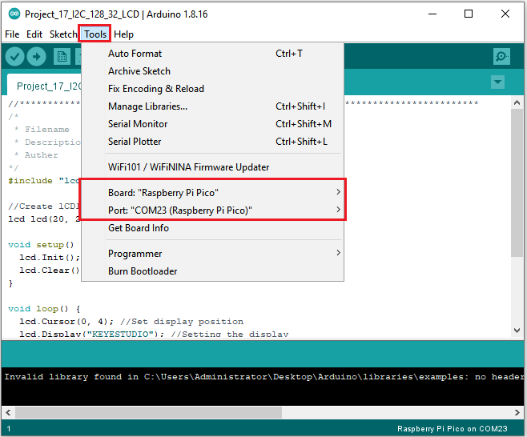

Click ![]/./media/b0d41283bf5ae66d2d5ab45db15331ba.png) to upload the test code to the Raspberry Pi Pico board

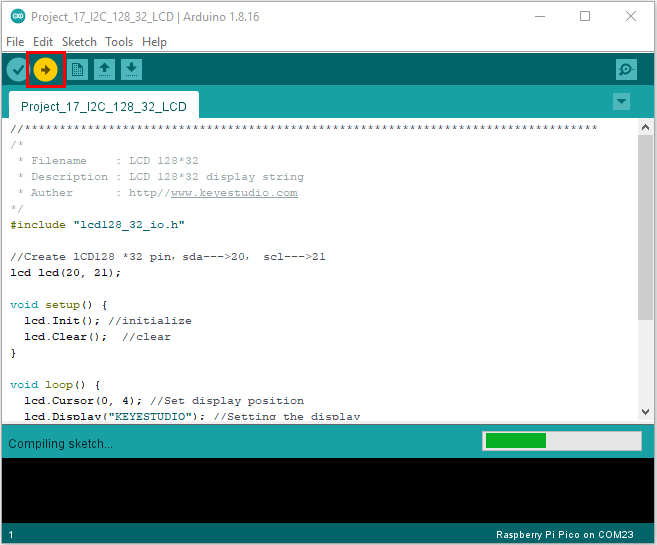

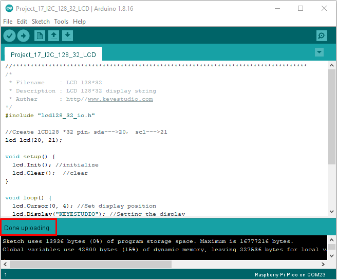

9.**Test Result：**

Upload the test code, wire up and power on, the LCD module display will show "KEYESTUDIO" at the first line. 

"ABCDEFGHIJKLMNOPQR" will be displayed at the second line. 

"123456789 + - \* / \<\> = $ @ " will shown at the third line and "% ^ & () {} :; '|?,. \~ \\\\ \[\] " will be displayed at the fourth line.


### Project 18: Small Fan

1.**Introduction**

In the hot summer, we need an electric fan to cool us down, so in this project, we will use the Plus control board to control 130 motor module and small blade to make a small fan.


2.**Components Required**

|  |  |
| :----------------------------------------------------------: | :----------------------------------------------------------: |
|                     Raspberry Pi Pico*1                      |             Raspberry Pi Pico Expansion Board*1              |
| 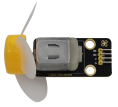 | 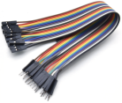 |
|                      130 Motor Module*1                      |                       M-F Dupont Wires                       |
|  |                                                              |
|                         USB Cable*1                          |                                                              |


3.**Component Knowledge**


**130 motor module:** 

The motor control module uses the HR1124S motorcontrol chip, which is a single-channel H-bridge driver chip for DC motor.

The H-bridge driving part of the HR1124S features low on-resistance PMOS and NMOS power tube. 

The low on-resistance ensures low power loss of the chip, making the chip work safely for a longer time. In addition, HR1124S has low standby current and low quiescent current, which makes HR1124S easy to be used in toy scheme.


4.**Features:**

- Working voltage: 5V

- Working current: 200MA

- Working power: 2W

- Working temperature: -10℃\~ +50℃


5.**Schematic diagram:**

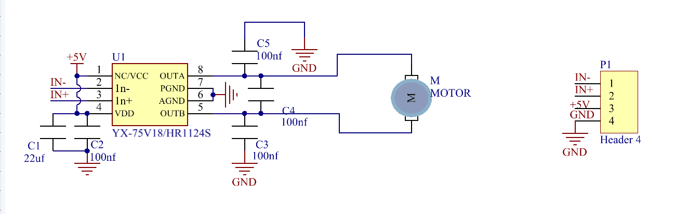


6.**Circuit Diagram and Wiring Diagram**


7.**Test Code：**


```c
//**********************************************************************************
/*
 * Filename    : Small Fan
 * Description : Fan clockwise rotation,stop,counterclockwise rotation,stop,cycle.
 * Auther      : http//www.keyestudio.com
*/
#define Motorla    17  // the Motor_IN+ pin of the motor
#define Motorlb     16  // the Motor_IN- pin of the motor

void setup(){
  pinMode(Motorla, OUTPUT);//set Motorla to OUTPUT
  pinMode(Motorlb, OUTPUT);//set Motorlb to OUTPUT
}
void loop(){
//Set to rotate for 5s anticlockwise
  digitalWrite(Motorla,HIGH);
  digitalWrite(Motorlb,LOW);
  delay(5000);
//Set to stop rotating for 2s 
  digitalWrite(Motorla,LOW);
  digitalWrite(Motorlb,LOW);
  delay(2000);
//Set to rotate for 5s clockwise
  digitalWrite(Motorla,LOW);
  digitalWrite(Motorlb,HIGH);
  delay(5000);
//Set to stop rotating for 2s 
  digitalWrite(Motorla,LOW);
  digitalWrite(Motorlb,LOW);
  delay(2000);
}
//**************************************************************************
```


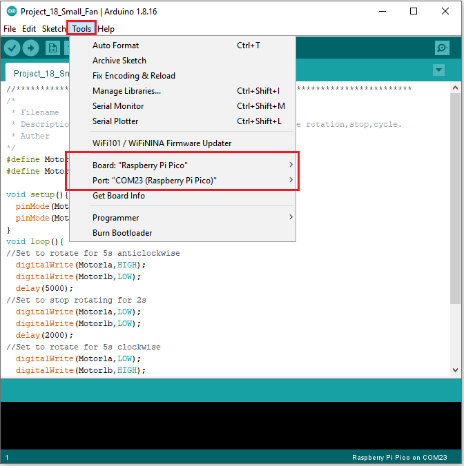

Click  to upload the test code to the Raspberry Pi Pico board


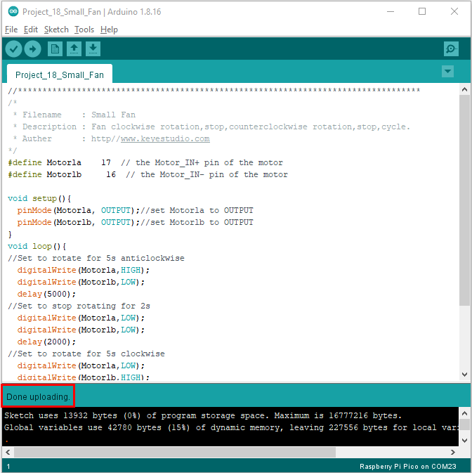


8.**Test Result**

Upload the code, power up via a USB cable. The fan will rotate clockwise for 5s, stop for 2s, anticlockwise for 5s and stop for 2s.


### Project 19: Servo Sweep

1.**Introduction**

Servo is a kind of motor that can rotate very precisely. It has been widely used in toy cars, RC helicopters, airplanes, robots, etc. In this project, we will use the pico board to control the rotation of the servo.


2.**Components Required**

|  |  |
| :----------------------------------------------------------: | :----------------------------------------------------------: |
|                     Raspberry Pi Pico*1                      |             Raspberry Pi Pico Expansion Board*1              |
|  | 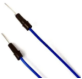 |
|                           Servo*1                            |                         Jumper Wires                         |
|  |                                                              |
|                         USB Cable*1                          |                                                              |


3.**Component Knowledge**

**Servo:**

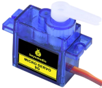

The servo is a kind of position servo driver, which is mainly composed of a housing, a circuit board, a coreless motor as well as a gear and position detector. 

The working principle is that the receiver or microcontroller sends a signal to the servo, which has an internal reference circuit that generates a reference signal with a period of 20ms and a width of 1.5ms, and compares the DC bias voltage with the voltage of the potentiometer to output voltage difference. 

The IC on the circuit board determines the direction of rotation, and then drives the coreless motor to start rotation and transmits the power to the swing arm through the reduction gear, while the position detector sends back a signal to determine whether it has reached the positioning. 

It is suitable for those control systems that require constant change of angle and can be maintained. When the motor rotates at a certain speed, the potentiometer is driven by the cascade reduction gear to rotate so that the voltage difference is 0 and the motor stops rotating. The angle range of general servo rotation is 0 to 180 degrees.

The pulse period for controlling the servo is 20ms, the pulse width is 0.5ms to 2.5ms, and the corresponding position is -90° to +90°. 

The following is an example of a 180 degree servo.


Servo motors have many specifications, but they all have three connecting wires, which are brown, red, and orange (different brands may have different colors). 

The brown is GND, the red is the positive power supply, and the orange is the signal line.


4.**Wiring Diagram**

The supply voltage should be 3.3V-5V. Make sure you don't get any errors when connecting the servos to the power supply


5.**Adding the Servo library：**

If you added the **Servo library,** just skip this step.

**Method 1**：

Search **Servo**, select **Servo** and click **Update**.

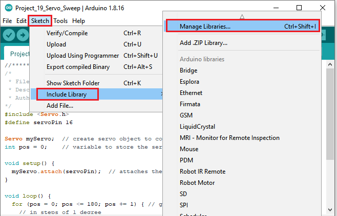


**Method 2**：

Open "Arduino IDE"，click “Sketch” → “Include Library” → “Add .zip Library...”. 

Go to the folder "**...\5.Libraries_Firmware_and_APP\Libraries**" and click <span style="color: rgb(255, 76, 65);">"Servo.zip"</span> and "**Open**".


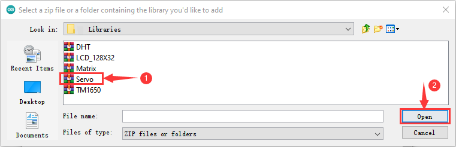

6.**Test Code：**


```c
//**********************************************************************
/*
 * Filename    : Servo Sweep
 * Description : Control the servo motor for sweeping
 * Auther      : http//www.keyestudio.com
*/
#include <Servo.h>
#define servoPin 16

Servo myServo;  // create servo object to control a servo
int pos = 0;    // variable to store the servo position

void setup() {
  myServo.attach(servoPin);  // attaches the servo on pin 16 to the servo object
}

void loop() {
  for (pos = 0; pos <= 180; pos += 1) { // goes from 0 degrees to 180 degrees
    // in steps of 1 degree
    myServo.write(pos);              // tell servo to go to position in variable 'pos'
    delay(15);                       // waits 15 ms for the servo to reach the position
  }
  for (pos = 180; pos >= 0; pos -= 1) { // goes from 180 degrees to 0 degrees
    myServo.write(pos);              // tell servo to go to position in variable 'pos'
    delay(15);                       // waits 15 ms for the servo to reach the position
  }
}
//***********************************************************************
```


Before uploading Test Code to Raspberry Pi Pico, please check the configuration of Arduino IDE.

Click "Tools" to confirm that the board type and ports.


Click  to upload the test code to the Raspberry Pi Pico board

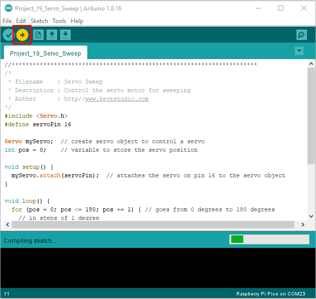


7.**Test Result：**

Upload the code and power up with a USB cable. The servo will rotate from 0° to 180°, then from 180° to 0° .


### Project 20: Stepping Motor

1.**Introduction**

Stepper motors are accurately positioned and are the most important components in industrial robots, 3D printers, large lathes, and other mechanical devices. 

In this project, we will use a stepper motor and a clock paper card to make a clock model.


2.**Components Required**

|  |  |
| :----------------------------------------------------------: | :----------------------------------------------------------: |
|                     Raspberry Pi Pico*1                      |             Raspberry Pi Pico Expansion Board*1              |
| 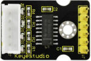 | 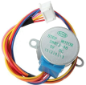 |
|             ULN2003 Stepper Motor Drive Board*1              |                       Stepper Motor *1                       |
| 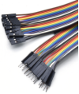 |  |
|                       M-F Dupont Wires                       |                         USB Cable*1                          |


3.**Component Knowledge**


**Stepper motor:** 

It is a motor controlled by a series of electromagnetic coils. It can rotate by the exact number of degrees (or steps) needed, allowing you to move it to a precise position and keep it there. 

It does this by supplying power to the coil inside the motor in a very short time, but you must always supply power to the motor to keep it in the position you want. 

There are two basic types of stepping motors, namely unipolar stepping motor and bipolar stepping motor. In this project, we use a 28-BYJ48 unipolar stepper motor.

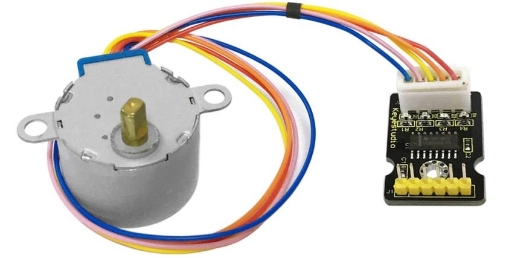

4.**Working Principle:**

The stepper motor is mainly composed of a stator and a rotor. 

The stator is fixed. As shown in the figure below, the part of the coil group A, B, C, and D will generate a magnetic field when the coil group is energized. The rotor is the rotating part. 

As follows, the middle part of the stator, two poles are permanent magnets.


**Single -phase four beat**: 

At the beginning, the coils of group A are turned on, and the poles of the rotor point at A coil. Next, the group A coil are disconnected, and the group B coils are turned on. The rotor will turn clockwise to the group B. Then, group B is disconnected, group C is turned on, and the rotor is turned to group C. After that, group C is disconnected, and group D is turned on, and the rotor is turned to group D. Finally, group D is disconnected, group A is turned on, and the rotor is turned to group A coils. 

Therefore, rotor turns 180° and continuously rotates B-C-D-A, which means it runs a circle (eight phase). As shown below, he rotation principle of stepper motor is A - B - C - D - A.

You make order inverse(D - C - B - A - D .....) if you want to make stepper motor rotate anticlockwise.


**Half-phase and eight beat**: 

8 beat adopts single and dual beat way，A - AB - B - BC - C - CD - D - DA - A ...... ，rotor will rotate half phase in this order. For example, when A coil is electrified，rotor faces to A coil  then A and B coil are connected, on this condition, the strongest magnetic field produced lies in the central part of AB coil, which means rotating half-phase clockwise.

**Stepper Motor Parameters:**

The rotor rotates one circle when the stepper motor we provide rotates 32 phases and with the output shaft driven by 1:64 reduction geared set. Therefore the rotation (a circle) of output shaft requires 2048 phases

The step angle of 4-beat mode of 5V and 4-phase stepper motor is 11.25. And the step angle of 8-beat mode is 5.625, the reduction ratio is 1:64.

**ULN2003Stepper Motor Drive Board:** 

It is stepper motor driver.

The following schematic diagram shows how to use the ULN2003 stepper motor driver board interface to connect a unipolar stepper motor to the pins of the Plus control board, and shows how to use four TIP120 interfaces.


5.**Schematic Diagram and Wiring Diagram**


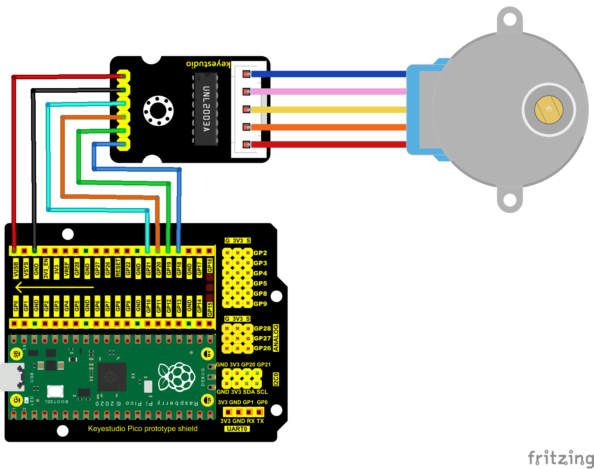

6.**Test Code：**


```c
//**********************************************************************
/*
 * Filename    : Drive Stepper Motor
 * Description : Use ULN2003 to drive the stepper motor.
 * Auther      : http//www.keyestudio.com
*/
// Conncet the port of the stepper motor driver
int outPorts[] = {21, 20, 19, 18};

void setup() {
  // set pins to output
  for (int i = 0; i < 4; i++) {
    pinMode(outPorts[i], OUTPUT);
  }
}

void loop()
{
  // Rotate a full turn
  moveSteps(true, 32 * 64, 3);
  delay(1000);
  // Rotate a full turn towards another direction
  moveSteps(false, 32 * 64, 3);
  delay(1000);
}

//Suggestion: the motor turns precisely when the ms range is between 3 and 20
void moveSteps(bool dir, int steps, byte ms) {
  for (unsigned long i = 0; i < steps; i++) {
    moveOneStep(dir); // Rotate a step
    delay(constrain(ms,3,20));        // Control the speed
  }
}

void moveOneStep(bool dir) {
  // Define a variable, use four low bit to indicate the state of port
  static byte out = 0x01;
  // Decide the shift direction according to the rotation direction
  if (dir) {  // ring shift left
    out != 0x08 ? out = out << 1 : out = 0x01;
  }
  else {      // ring shift right
    out != 0x01 ? out = out >> 1 : out = 0x08;
  }
  // Output singal to each port
  for (int i = 0; i < 4; i++) {
    digitalWrite(outPorts[i], (out & (0x01 << i)) ? HIGH : LOW);
  }
}

void moveAround(bool dir, int turns, byte ms){
  for(int i=0;i<turns;i++)
    moveSteps(dir,32*64,ms);
}
void moveAngle(bool dir, int angle, byte ms){
  moveSteps(dir,(angle*32*64/360),ms);
}
//*********************************************************************
```


Before uploading Test Code to Raspberry Pi Pico, please check the configuration of Arduino IDE.

Click "Tools" to confirm that the board type and ports.


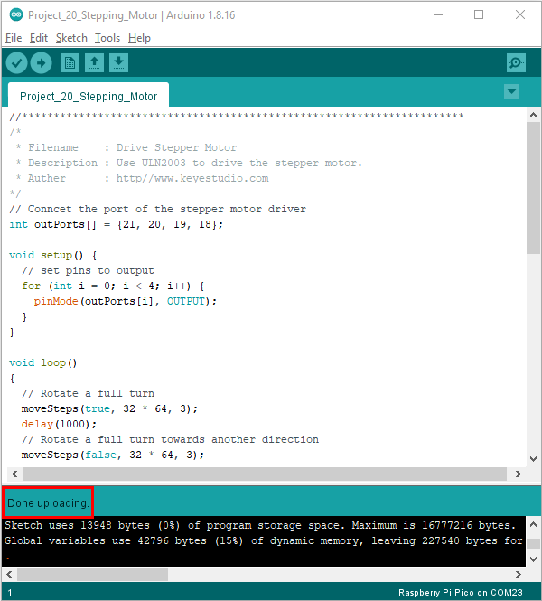

7.**Result**

Upload the project code to the pico board, wire up and power on first. 

The four LEDs D1D2D3D4 on the ULN2003 driving module will be turned on and the stepper motor will rotate clockwise first, then counterclockwise

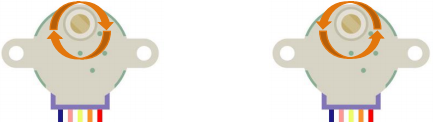


### Project 21: Relay

1.**Introduction**

In daily life, we generally use AC to drive electrical equipment, and sometimes we use switches to control electrical appliances. 

If the switch is directly connected to the AC circuit, once electricity leakage occurs, people are in danger. From a safety point of view, we specially designed this relay module with NO (normally open) and NC (normally closed) terminals. 

In this lesson we will learn a special and easy-to-use switch, which is the relay module.


2.**Components Required**

| 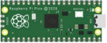 | 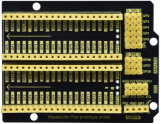 |
| :----------------------------------------------------------: | :----------------------------------------------------------: |
|                     Raspberry Pi Pico*1                      |             Raspberry Pi Pico Expansion Board*1              |
| 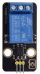 |  |
|                        Relay Module*1                        |                       M-F Dupont Wire                        |
| 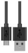 |                                                              |
|                         USB Cable*1                          |                                                              |


3.**Component Knowledge**

**Relay:** 

It is an "automatic switch" that uses a small current to control the operation of a large current.

- Input voltage：5V

- Rated load：5A 250VAC (NO/NC) 5A 24VDC (NO/NC)


The rated load means that a 5V Arduino can be used to control a device with a 24V DC voltage or a 250V AC voltage.

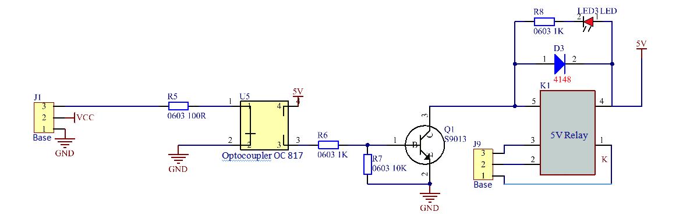


4.**Schematic Diagram and Wiring Diagram**


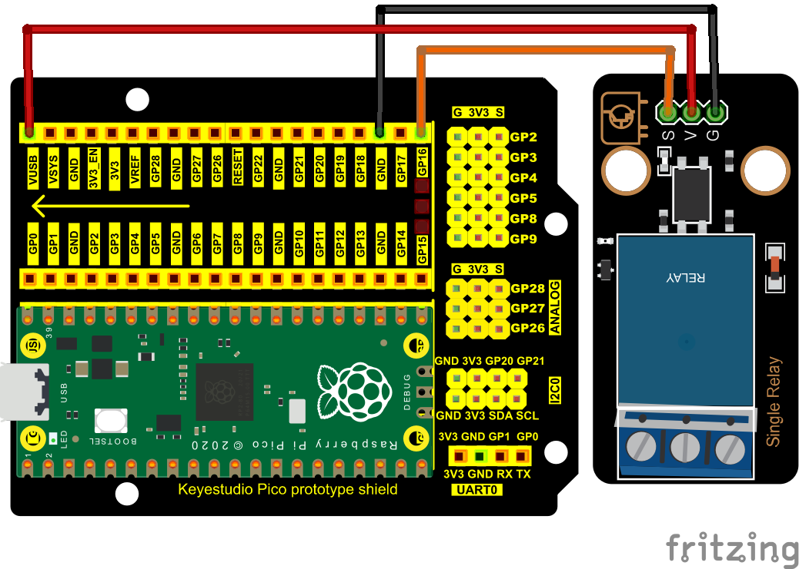

5.**Test Code：**


```c
//**********************************************************************************
/*
 * Filename    : Relay
 * Description : Relay turn on and off.
 * Auther      : http//www.keyestudio.com
*/
#define  Relay  16 // defines digital 16
void setup()
{
pinMode(Relay, OUTPUT); // sets "Relay" to "output"
}
void loop()
{
digitalWrite(Relay, HIGH); // turns on the relay
delay(1000); //delays 1 seconds
digitalWrite(Relay, LOW); // turns off the relay
delay(1000); // delays 1 seconds
}
//************************************************************************
```


Before uploading Test Code to Raspberry Pi Pico, please check the configuration of Arduino IDE.

Click "Tools" to confirm that the board type and ports.


Click  to upload the test code to the Raspberry Pi Pico board


6.**Result**

Upload the code to successfully, wire up and power on, the relay will be turned on (ON end is connected) for 1 second, and stop (NC end is connected) for 1 seconds, circularly.


### Project 22: Dimming Light

1.**Introduction**

A potentiometer is a three-terminal resistor with a sliding or rotating contact that forms an adjustable voltage divider. It works by varying the position of a sliding contact across a uniform resistance. 

In a potentiometer, the entire input voltage is applied across the whole length of the resistor, and the output voltage is the voltage drop between the fixed and sliding contact. 

In this project, we are going to learn how to use Arduino to read the values of the potentiometer, and make a dimming lamp.


2.**Components Required**

| 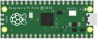 |  |
| :----------------------------------------------------------: | :----------------------------------------------------------: |
|                     Raspberry Pi Pico*1                      |             Raspberry Pi Pico Expansion Board*1              |
|  |  |
|                       Potentiometer*1                        |                          Red LED*1                           |
|  |  |
|                         Breadboard*1                         |                       200Ω Resistor*1                        |
|  |  |
|                         Jumper Wires                         |                         USB Cable*1                          |


3.**Component Knowledge**

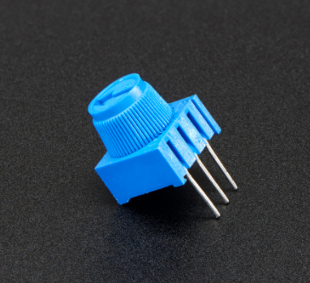

**Adjustable potentiometer:** 

It is a kind of resistor and an analog electronic component, which has two states of 0 and 1(high level and low level). The analog quantity is different, its data state presents a linear state such as 0 to 1023.


4.**Read the Potentiometer Value**

We connect the adjustable potentiometer to the analog pin of Arduino to read its value. Please refer to the following wiring diagram for wiring.


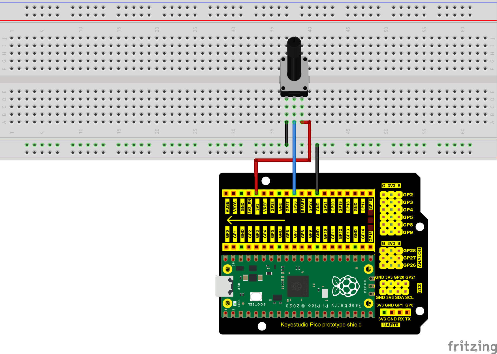

```c
//**********************************************************************************
/*  
 * Filename    : Read Potentiometer Analog Value
 * Description : Basic usage of ADC
 * Auther      : http//www.keyestudio.com
*/
#define PIN_ANALOG_IN  26  //the pin of the Potentiometer

void setup() {
  Serial.begin(115200);
}

//In loop() function, analogRead is called to get the ADC value of ADC0 and assign it to adcVal. 
//Calculate the measured voltage value through the formula, and print these data through the serial port monitor.
void loop() {
  int adcVal = analogRead(PIN_ANALOG_IN);
  double voltage = adcVal / 1023.0 * 3.3;
  Serial.println("ADC Value: " + String(adcVal) + " --- Voltage Value: " + String(voltage) + "V");
  delay(500);
}
//***************************************************************************
```


Before uploading Test Code to Raspberry Pi Pico, please check the configuration of Arduino IDE.

Click "Tools" to confirm that the board type and ports.

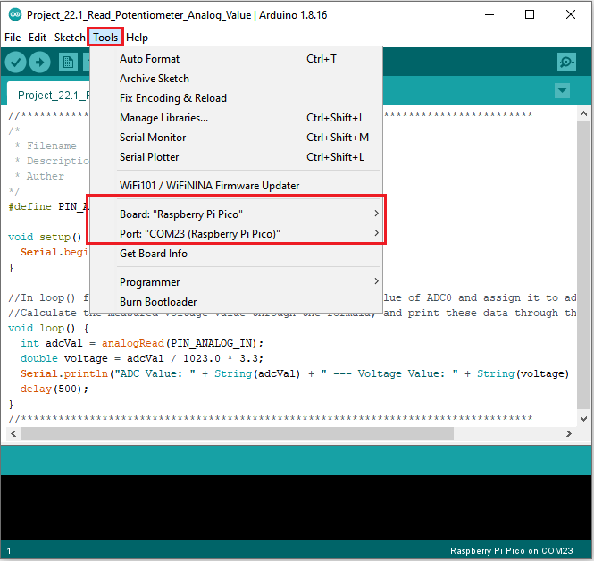

Click  to upload the test code to the Raspberry Pi Pico board

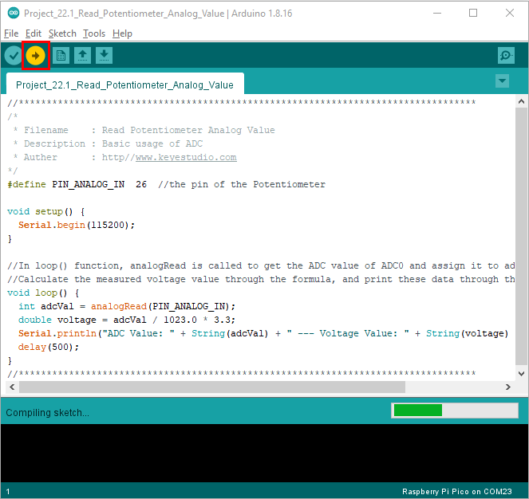

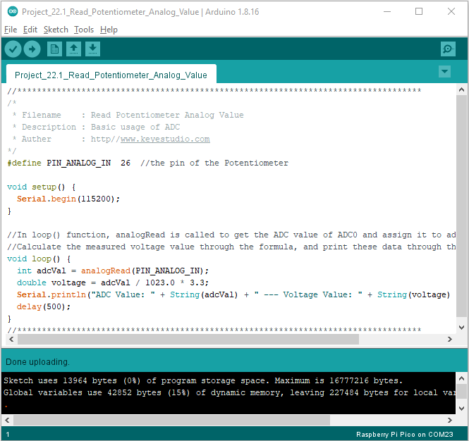

Upload the code , connect the wires and power on first. Then open the serial monitor, set the baud rate to 115200. The serial monitor window will print out the ADC value and voltage value of the potentiometer. 

When moving the knob of the potentiometer is turned, the ADC value and voltage value will change. As shown below:

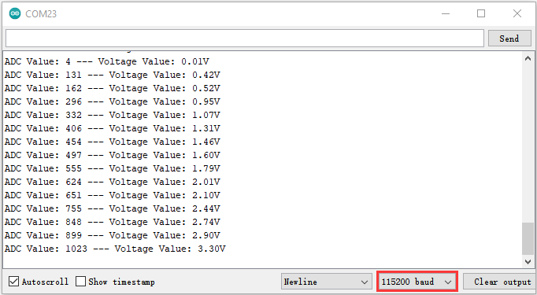

5.**Circuit diagram and wiring diagram:**

In the previous step, we read the ADC value and voltage value of the potentiometer. Then we need to convert the ADC value into the brightness of the LED to make a light with adjustable brightness. 

As shown below:


6.**Test Code：**


```c
//**********************************************************************************
/*  
 * Filename    : Dimming Light
 * Description : Controlling the brightness of LED by potentiometer.
 * Auther      : http//www.keyestudio.com
*/
#define PIN_ADC0    26  //the pin of the potentiometer
#define PIN_LED     16  // the pin of the LED

void setup() {
  pinMode(PIN_LED, OUTPUT);
  pinMode(PIN_ADC0, INPUT);
}

void loop() {
  int adcVal = analogRead(PIN_ADC0); //read the ADC value of potentiometer
  analogWrite(PIN_LED, map(adcVal, 0, 1023, 0, 255));//map ADC to the duty cycle of PWM to control LED brightness.
  delay(10);
}
//**********************************************************************************
```


Before uploading Test Code to Raspberry Pi Pico, please check the configuration of Arduino IDE.

Click "Tools" to confirm that the board type and ports.

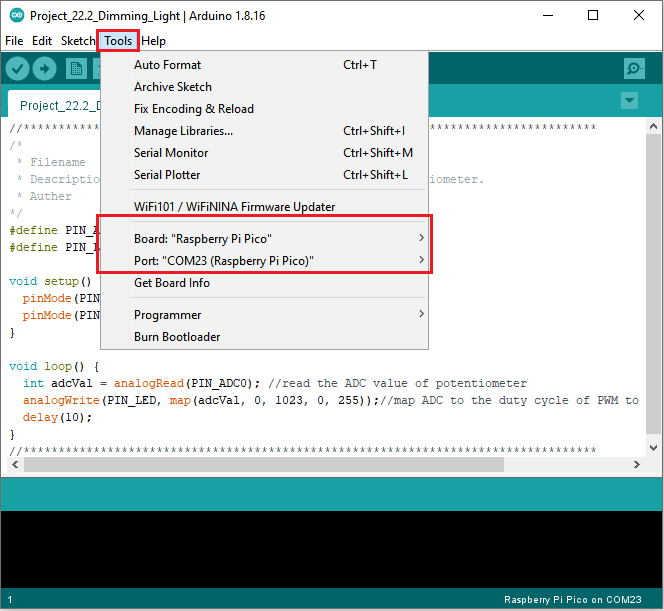

Click  to upload the test code to the Raspberry Pi Pico board

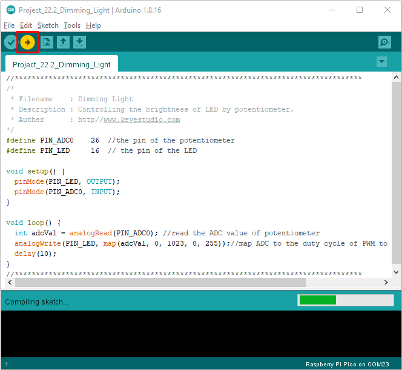

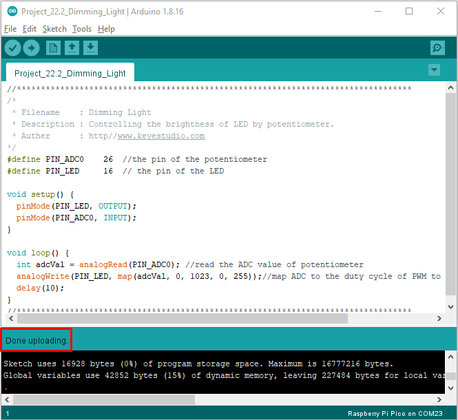

7.**Test Result:**

Upload the code to Raspberry Pi Pico, change the input voltage of GP26 by turning the potentiometer.

Raspberry Pi Pico changes the output voltage of GP16 according to this voltage value, thereby changing the brightness of the LED.


### Project 23: Flame Alarm

1.**Introduction**

In this project, we will use the pico board, a flame sensor and a buzzer to make fire alarm devices.

2.**Components Required**

|  |  |
| :----------------------------------------------------------: | :----------------------------------------------------------: |
|                     Raspberry Pi Pico*1                      |             Raspberry Pi Pico Expansion Board*1              |
|  |  |
|                        Flame Sensor*1                        |                          Red LED*1                           |
|  | 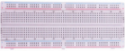 |
|                       Active Buzzer*1                        |                         Breadboard*1                         |
|  |  |
|                       220Ω Resistor*1                        |                       10KΩ Resistor*1                        |
|  |  |
|                         Jumper Wires                         |                         USB Cable*1                          |


3.**Component Knowledge**


**Flame Sensor**：

The flame emits a certain degree of IR light, which is invisible to the human eye, but our flame sensor can detect it and alert the microcontroller. 

If the Arduino has detected a fire, it has a specially designed infrared receiver to detect the flame, and then convert the flame brightness into a fluctuating level signal. 

The short pin of the receiving triode is negative pole and the other long pin is positive pole. We should connect the short pin (negative pole) to 5V and the long pin (positive pole) to the analog pin, a resistor and GND. 

As shown in the figure below.


**Note**: 

Since vulnerable to radio frequency radiation and temperature changes, the flame sensor should be kept away from heat sources like radiators, heaters and air conditioners, as well as direct irradiation of sunlight, headlights and incandescent light.


4.**Read the Simulation Value**

We start with a simple code to read the value of the flame sensor and print it on the serial monitor. For wiring, please refer to the following wiring diagram.


```c
//**********************************************************************************
/*  
 * Filename    : Read Analog Value Of Flame Sensor
 * Description : Basic usage of ADC
 * Auther      : http//www.keyestudio.com
*/
#define PIN_ANALOG_IN  26  //the pin of the Flame Sensor

void setup() {
  Serial.begin(115200);
}

//In loop() function, analogRead is called to get the ADC value of ADC0 and assign it to adcVal. 
//Calculate the measured voltage value through the formula, and print these data through the serial port monitor.
void loop() {
  int adcVal = analogRead(PIN_ANALOG_IN);
  double voltage = adcVal / 1023.0 * 3.3;
  Serial.println("ADC Value: " + String(adcVal) + " --- Voltage Value: " + String(voltage) + "V");
  delay(500);
}
//**********************************************************************************
```


Before uploading Test Code to Raspberry Pi Pico, please check the configuration of Arduino IDE.

Click "Tools" to confirm that the board type and ports.

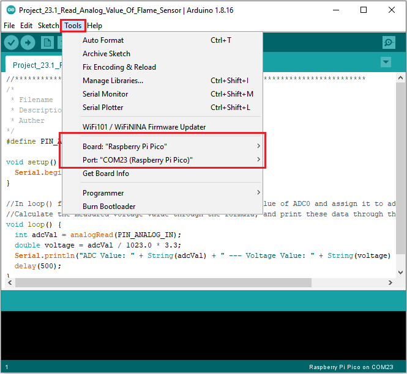

Click  to upload the test code to the Raspberry Pi Pico board

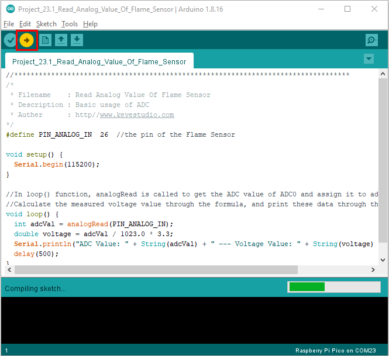

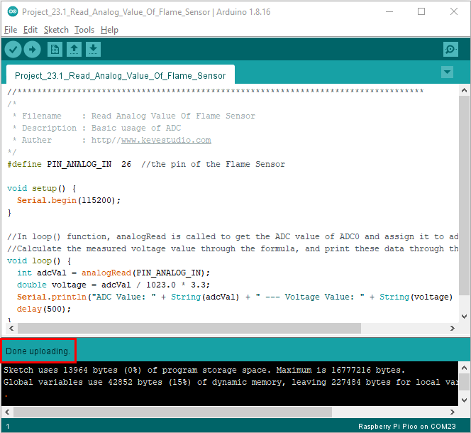

Upload the code, power up with a USB cable, open the monitor and set baud rate to 115200.

The monitor will show the analog value. When the sensor is closed to fire, the analog value will get greater.


5.**Circuit diagram and wiring diagram:**

We will make a fun project - fire alarm device using flame sensor and buzzer, LED. When the flame sensor detects a flame, the LED flashes and the buzzer alarms.

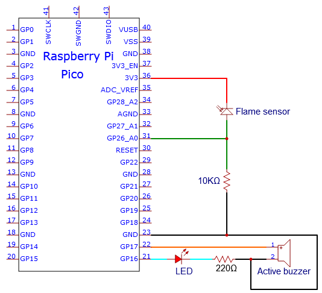


6.**Test Code:**

<span style="color: rgb(255, 76, 65);">Note：</span>you can set the threshold value.


```c
//**********************************************************************************
/*  
 * Filename    : Flame Alarm
 * Description : Controlling the buzzer and LED by flame sensor.
 * Auther      : http//www.keyestudio.com
*/
#define PIN_ADC0      26  //the pin of the flame sensor
#define PIN_LED       16  // the pin of the LED
#define PIN_BUZZER    17  // the pin of the buzzer

void setup() {
  pinMode(PIN_LED, OUTPUT);
  pinMode(PIN_BUZZER, OUTPUT);
  pinMode(PIN_ADC0, INPUT);
}

void loop() {
  int adcVal = analogRead(PIN_ADC0); //read the ADC value of flame sensor
  if (adcVal >= 500) {
    digitalWrite (PIN_BUZZER, HIGH); //turn on buzzer
    digitalWrite(PIN_LED, HIGH); // turn on LED
    delay(500); // wait a second.
    digitalWrite(PIN_LED, LOW); // turn off LED
    delay(500); // wait a second
  }
  else
  {
    digitalWrite(PIN_LED, LOW);  //turn off LED
    digitalWrite (PIN_BUZZER, LOW); //turn off buzzer
  }
}
//**********************************************************************************
```


Before uploading Test Code to Raspberry Pi Pico, please check the configuration of Arduino IDE.

Click "Tools" to confirm that the board type and ports.

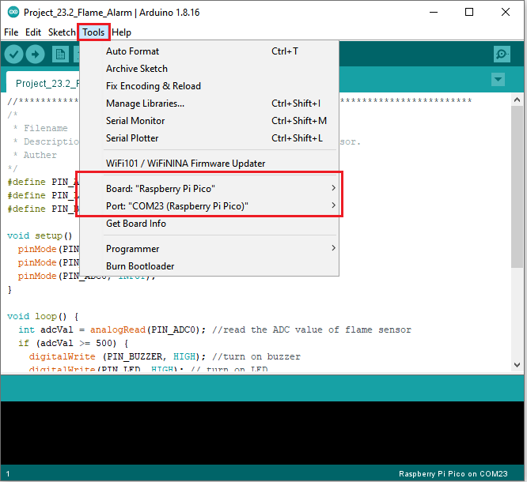

Click  to upload the test code to the Raspberry Pi Pico board

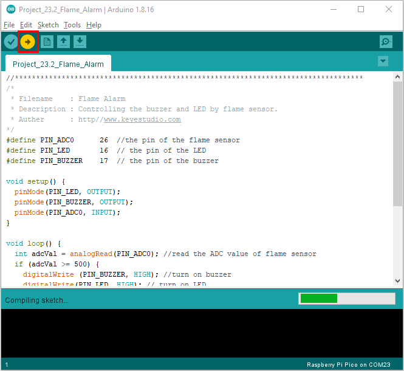

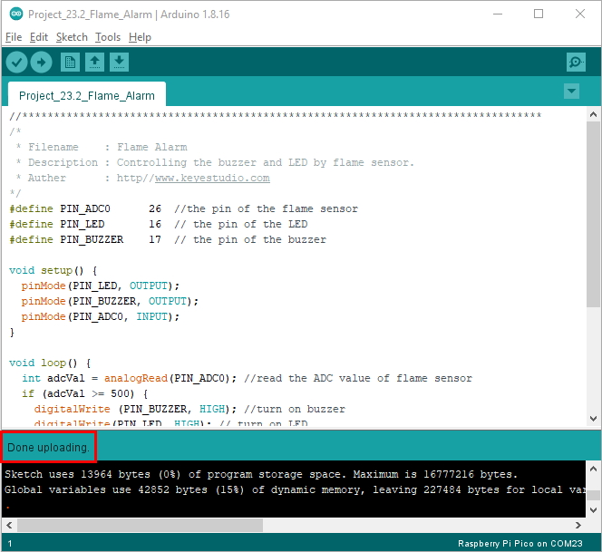

7.**Result**

Upload the code and power up. monitor will display the value of the flame sensor. 

When the flame sensor detects the flame, the LED will flash and the buzzer will alarm; otherwise, the LED does not light up and the buzzer does not sound.


### Project 24: Night Lamp

1.**Introduction**

Sensors or components are ubiquitous in our daily life. 

For example, some public street lights turn on automatically at night and turn off automatically during the day. Why? In fact, this make use of a photosensitive element that senses the intensity of external ambient light. 

When the outdoor brightness decreases at night, the street lights will automatically turn on. In the daytime, the street lights will automatically turn off. The principle of this is very simple. 

In this lesson we will use  Raspberry Pi Pico to control LEDs to implement the function of this street light.


2.**Components Required**

|  |  |
| :----------------------------------------------------------: | :----------------------------------------------------------: |
|                     Raspberry Pi Pico*1                      |             Raspberry Pi Pico Expansion Board*1              |
|  |  |
|                       Photoresistor*1                        |                          Red LED*1                           |
|  |  |
|                        10KΩResistor*1                        |                        220ΩResistor*1                        |
|  |  |
|                         Breadboard*1                         |                         Jumper Wires                         |
|  |                                                              |
|                         USB Cable*1                          |                                                              |


3.**Component Knowledge**

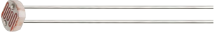

It is a photosensitive resistor, its principle is that the photoresistor surface receives brightness (light) to reduce the resistance.The resistance value will change with the detected intensity of the ambient light. With this property, we can use photoresistors to detect light intensity. 

Photoresistors and other electronic symbols are as follows: 


The following circuit is used to detect changes in resistance values of photoresistors:


In the circuit above, when the resistance of the photoresistor changes due to the change of light intensity, the voltage between the photoresistor and resistance R2 will also change. 

Thus, the intensity of light can be obtained by measuring this voltage.


4.**Read the Analog Value**

We first use a simple code to read the value of the photoresistor, print it in the serial monitor. For wiring, please refer to the following wiring diagram.


5.**Test Code**


```c
//**********************************************************************************
/*  
 * Filename    : Read Photosensitive Analog Value
 * Description : Basic usage of ADC
 * Auther      : http//www.keyestudio.com
*/
#define PIN_ANALOG_IN  26  //the pin of the photosensitive sensor

void setup() {
  Serial.begin(115200);
}

//In loop() function, analogRead is called to get the ADC value of ADC0 and assign it to adcVal. 
//Calculate the measured voltage value through the formula, and print these data through the serial port monitor.
void loop() {
  int adcVal = analogRead(PIN_ANALOG_IN);
  double voltage = adcVal / 1023.0 * 3.3;
  Serial.println("ADC Value: " + String(adcVal) + " --- Voltage Value: " + String(voltage) + "V");
  delay(500);
}
//*******************************************************************************
```


Before uploading Test Code to Raspberry Pi Pico, please check the configuration of Arduino IDE.

Click "Tools" to confirm that the board type and ports.

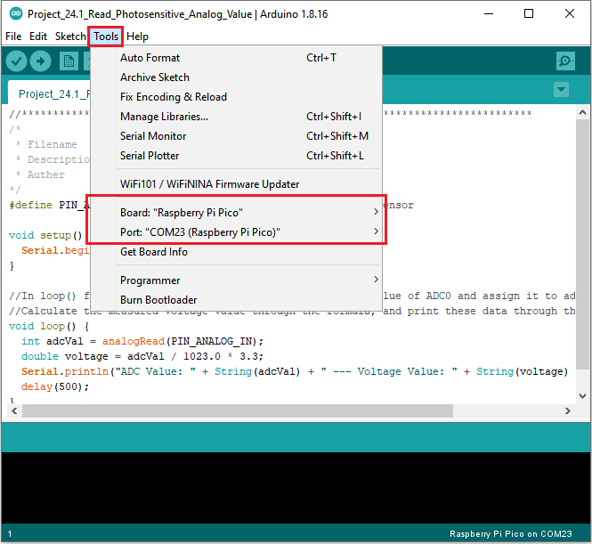

Click  to upload the test code to the Raspberry Pi Pico board

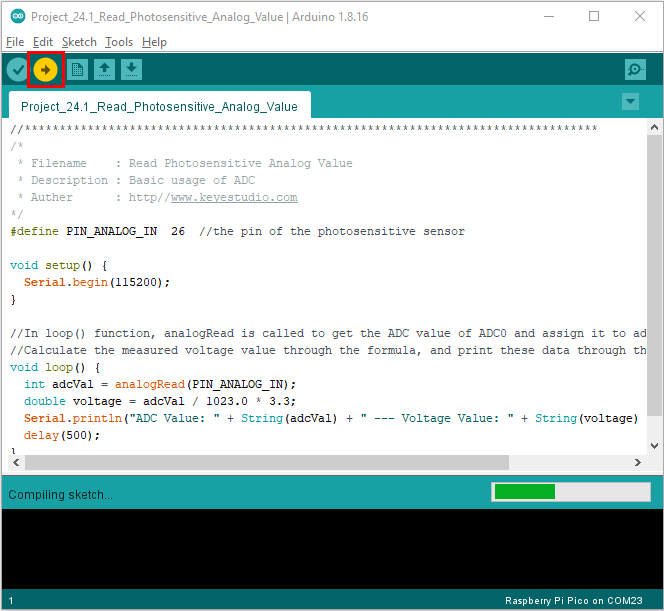


Upload the code to the Pico board, wire up and power up, open the serial monitor and set the baud rate to 115200. Then you can read the analog value of photoresistor. 

When the light intensity around the sensor gets dim, the analog value displayed on the serial monitor will gradually reduce. On the contrary, the analog value will gradually increase.


6.**Circuit Diagram and Wiring Diagram**

Next, we make a light-control lamp.

The Raspberry Pi Pico takes the analog value of the sensor and then adjusts the brightness of the LED.


```c
//**********************************************************************************
/*  
 * Filename    : Night Lamp
 * Description : Controlling the brightness of LED by photosensitive sensor.
 * Auther      : http//www.keyestudio.com
*/
#define PIN_ADC0    26  // the pin of the photosensitive sensor
#define PIN_LED     16  // the pin of the LED

void setup() {
  pinMode(PIN_LED, OUTPUT);
  pinMode(PIN_ADC0, INPUT);
}

void loop() {
  int adcVal = analogRead(PIN_ADC0); //read the ADC value of photosensitive sensor
  analogWrite(PIN_LED, map(adcVal, 0, 1023, 0, 255));//map ADC to the duty cycle of PWM to control LED brightness.
  delay(10);
}
//*********************************************************************************
```


Before uploading Test Code to Raspberry Pi Pico, please check the configuration of Arduino IDE.

Click "Tools" to confirm that the board type and ports.

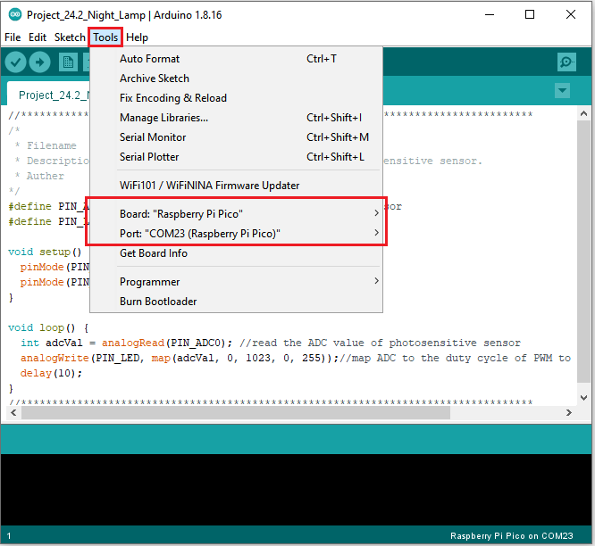

Click  to upload the test code to the Raspberry Pi Pico board


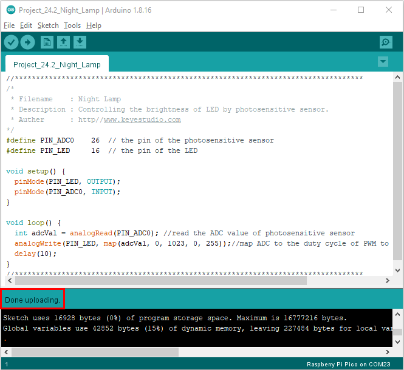

7.**Test Result:**

After the project code is uploaded successfully and power up. when the light intensity gets weak, the LED will becomes brighter; otherwise, the LED will become darker.


### Project 25: Human Induction Lamp

1.**Introduction**

With the development of science and technology, the use of human induction lamp that usually used in the dark corridor area is very common in our real life, such as the corridor of the community, the bedroom of the room, the garage of the dungeon, the bathroom and so on. The human induction lamp are generally composed of a PIR Motion Sensor, a lamp, a photoresistor sensor and so on. 

In this project, we will learn how to use a PIR Motion Sensor, LEDs, and a photoresistor to make a human induction lamp .


2.**Components Required**

| 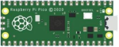 |  |
| :----------------------------------------------------------: | :----------------------------------------------------------: |
|                     Raspberry Pi Pico*1                      |             Raspberry Pi Pico Expansion Board*1              |
|  |  |
|                       Photoresistor*1                        |                          Red LED*1                           |
|  |  |
|                        10KΩResistor*1                        |                        220ΩResistor*1                        |
|  |  |
|                         Breadboard*1                         |                     PIR Motion Sensor*1                      |
|  |  |
|                       F-F Dupont Wires                       |                         Jumper Wires                         |
| 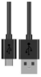 |                                                              |
|                         USB Cable*1                          |                                                              |


3.**Circuit Diagram and Wiring Diagram**

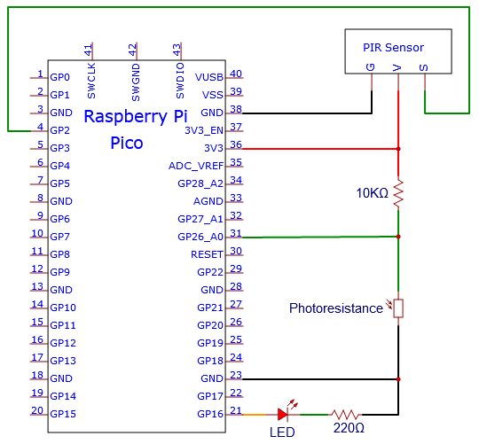


```c
//**********************************************************************************
/*  
 * Filename    : Human Induction Lamp
 * Description : Controlling the LED by photosensitive sensor and PIR motion sensor.
 * Auther      : http//www.keyestudio.com
*/
#define PIN_ADC0  26   //the pin of the photosensitive sensor
#define PIN_LED1   16  // the pin of the External LED
#define PIN_LED2   25  // the pin of the built-in LED on the Pico board
#define pirPin   2     // the pin of the PIR motion sensor
byte pirStat = 0;   // the state of the PIR motion sensor
void setup() {
  pinMode(PIN_LED1, OUTPUT);
  pinMode(PIN_LED2, OUTPUT);
  pinMode(PIN_ADC0, INPUT);
  pinMode(pirPin, INPUT);
}

void loop() {
  int adcVal = analogRead(PIN_ADC0); //read the ADC value of photosensitive sensor
  pirStat = digitalRead(pirPin); //read the value of PIR motion sensor
  if (adcVal >= 500) {
      digitalWrite(PIN_LED2, HIGH); //turn on the built-in LED on the Pico board 
      if (pirStat == HIGH){
         digitalWrite(PIN_LED1, HIGH);//turn on the External LED
         } 
      else{
         digitalWrite(PIN_LED1, LOW);//turn off the External LED   
        }
  }
   else{
      digitalWrite(PIN_LED1, LOW);//turn off the External LED
      digitalWrite(PIN_LED2, LOW);//turn off the built-in LED on the Pico board
      }
}
//**********************************************************************************
```


Before uploading Test Code to Raspberry Pi Pico, please check the configuration of Arduino IDE.

Click "Tools" to confirm that the board type and ports.


Click  to upload the test code to the Raspberry Pi Pico board


4.**Test Result：**

Upload the code and power up with a USB cable. 

If you cover the photoresistor, the light intensity will gets dim and the LED on the pico board will be on. If you wave your hand in front of the PIR motion sensor, the external LED will be on. Once you stop waving, the LED will be off.

If the photoresistor is not covered, LED will be off and at this time, if you wave your hands in front of the PIR sensor, the external LED will be off.


### Project 26: Sound Control Stepper Motor

1.**Introduction**

The sound sensor has a built-in capacitive electret microphone and power amplifier. It can be used to detect the sound intensity of the environment.

In this project, we use a sound sensor and a 130 motor to make a voice-activated smart fan.


2.**Components Required**

|  |  |
| :----------------------------------------------------------: | :----------------------------------------------------------: |
|                     Raspberry Pi Pico*1                      |             Raspberry Pi Pico Expansion Board*1              |
|  |  |
|                        Sound Sensor*1                        |                         USB Cable*1                          |
|  |  |
|                      130 Motor Module*1                      |                       F-F Dupont Wires                       |
|  |                                                              |
|                       M-F Dupont Wires                       |                                                              |


3.**Component Knowledge**

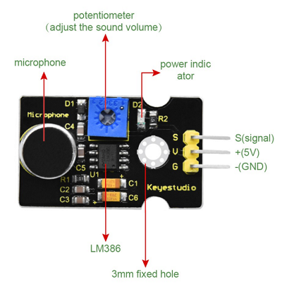

**Sound sensor** is usually used to detect the loudness of the sound in the surroundings. Arduino can collect its output signal through the analog input interface. The S pin is an analog output, which is the real-time output of the microphone voltage signal. The sensor comes with a potentiometer so you can adjust the signal strength. It also has two fixing holes so that the sensor can be installed on any other equipment. You can use it to make some interactive works, such as voice-operated switches.


4.**Read the Analog Value of the Sound Sensor**

We first use a simple code to read the analog value of the sound sensor and print it to the serial monitor, please refer to the following wiring diagram for the wiring.


```c
//**********************************************************************************
/*  
 * Filename    : Read Sound Sensor Analog Value
 * Description : Basic usage of ADC
 * Auther      : http//www.keyestudio.com
*/
#define PIN_ANALOG_IN  28  //the pin of the Sound Sensor

void setup() {
  Serial.begin(115200);
}

//In loop() function, analogRead is called to get the ADC value of ADC0 and assign it to adcVal. 
//Calculate the measured voltage value through the formula, and print these data through the serial port monitor.
void loop() {
  int adcVal = analogRead(PIN_ANALOG_IN);
  double voltage = adcVal / 1023.0 * 3.3;
  Serial.println("ADC Value: " + String(adcVal) + " --- Voltage Value: " + String(voltage) + "V");
  delay(500);
}
//**********************************************************************************
```


Before uploading Test Code to Raspberry Pi Pico, please check the configuration of Arduino IDE.

Click "Tools" to confirm that the board type and ports.

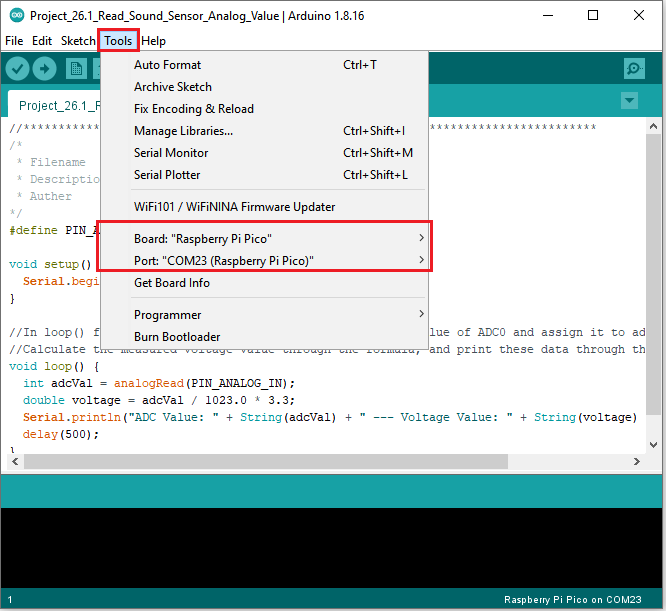

Click  to upload the test code to the Raspberry Pi Pico board

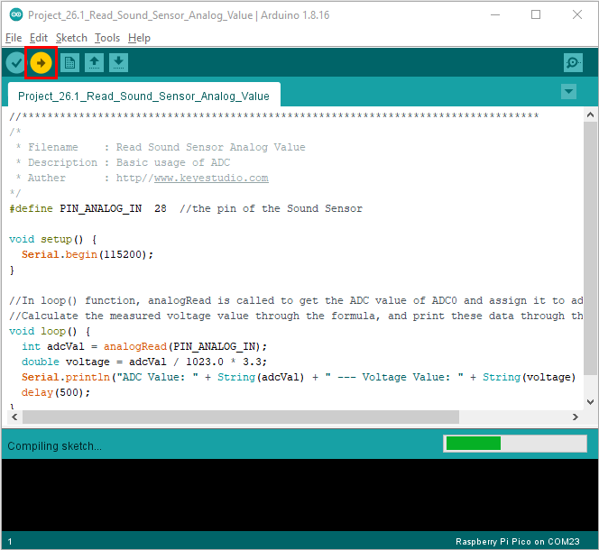

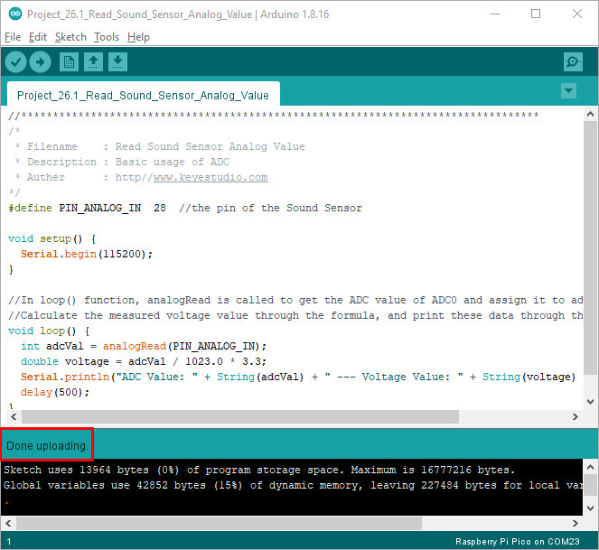

Upload the code to the pico board, power up with a USB cable and open the serial monitor and set baud rate to 115200.

The monitor will show analog values of the sound sensor.

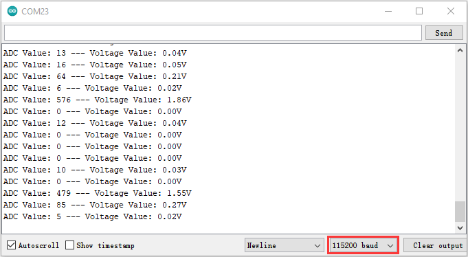

5.**Wiring Diagram：**


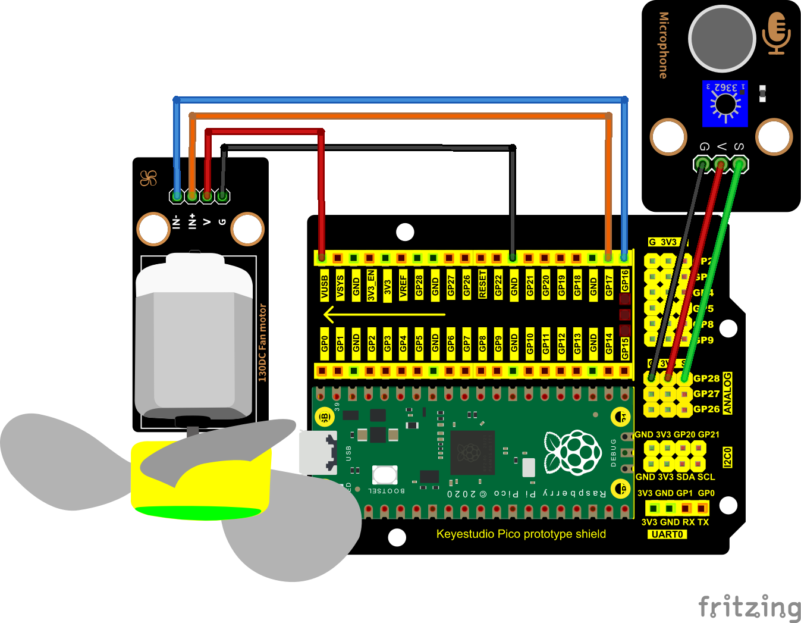

6.**Test Code：**

Note：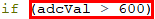you can set the thresh value in the code)


```c
//**********************************************************************************
/*  
 * Filename    : Sound Control Fan
 * Description : Controlling the fan by Sound sensor.
 * Auther      : http//www.keyestudio.com
*/
#define PIN_ADC2   28  //the pin of the Sound sensor
#define PIN_Motorla    17  // the Motor_IN+ pin of the motor
#define PIN_Motorlb    16  // the Motor_IN- pin of the motor
#define PIN_LED    25  // // the pin of the built-in LED on the Pico board

void setup() {
  pinMode(PIN_LED, OUTPUT);//set PIN_LED to OUTPUT
  pinMode(PIN_Motorla, OUTPUT);//set Motorla to OUTPUT
  pinMode(PIN_Motorlb, OUTPUT);//set Motorlb to OUTPUT
  pinMode(PIN_ADC2, INPUT);//set PIN_ADC2 to INPUT
}

void loop() {
  int adcVal = analogRead(PIN_ADC2); //read the ADC value of Sound sensor
  if (adcVal > 600) {
    digitalWrite(PIN_LED,HIGH); //turn on the built-in LED on the Pico board
    digitalWrite(PIN_Motorla,HIGH); //rotate
    digitalWrite(PIN_Motorlb,LOW);
    delay(5000); //delay 5S
  }
  else
  {
    digitalWrite(PIN_LED,LOW); //turn off the built-in LED on the Pico board
    digitalWrite(PIN_Motorla,LOW); //stop rotating
    digitalWrite(PIN_Motorlb,LOW); 
  }
}
//**********************************************************************************
```


Before uploading Test Code to Raspberry Pi Pico, please check the configuration of Arduino IDE.

Click "Tools" to confirm that the board type and ports.


Click  to upload the test code to the Raspberry Pi Pico board

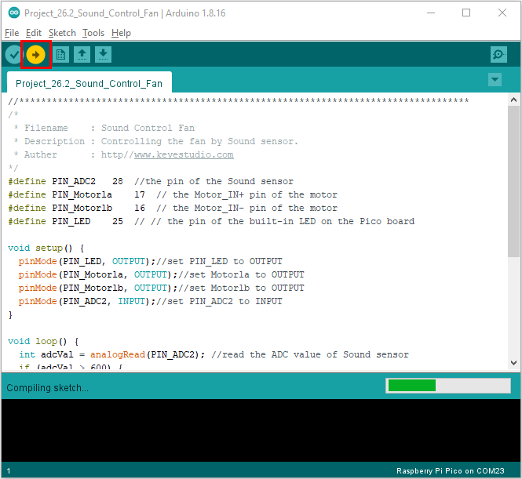

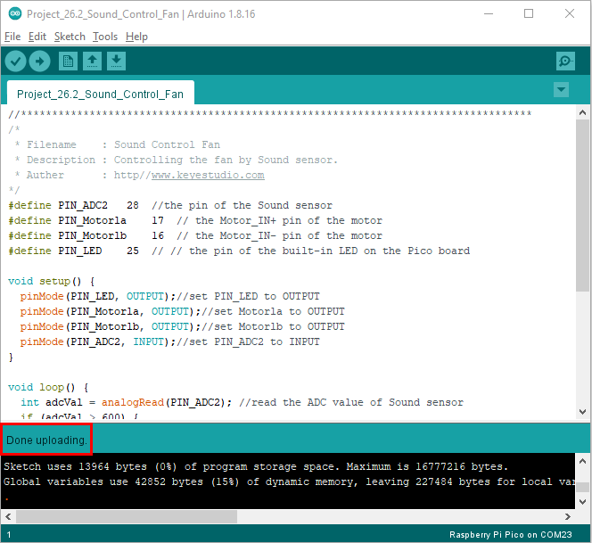

7.**Test Result**

Upload the code and power up. 

Clap your hands before the sound sensor, when the sound intensity exceeds the thresh value, the fan will rotate and the LED on the pico board will be on; on the contrary, the fan won’t rotate and the LED will be off.


### Project 27: Temperature Measurement

1.**Introduction**

LM35 is a commonly used and easy-to-use temperature sensor. It does not require other hardware, only needs an analog port. The difficulty lies in compiling the code and converting the analog values to Celsius temperature. 

In this project, we use a temperature sensor and 3 LEDs to make a temperature tester. When the temperature sensor touches objects with different temperature, the LED will show different colors.

2.**Components Required**

| 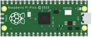 |  |
| :----------------------------------------------------------: | :----------------------------------------------------------: |
|                     Raspberry Pi Pico*1                      |             Raspberry Pi Pico Expansion Board*1              |
| 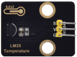 |  |
|                  LM35 Temperature Sensor*1                   |                         USB Cable*1                          |
|  |  |
|                       220Ω Resistor*3                        |                          Red LED*1                           |
|  |  |
|                         Yellow LED*1                         |                         Green LED*1                          |
| 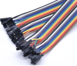 |  |
|                       F-F Dupont Wires                       |                         Breadboard*1                         |
|  |                                                              |
|                         Jumper Wires                         |                                                              |


3.**Component Knowledge**

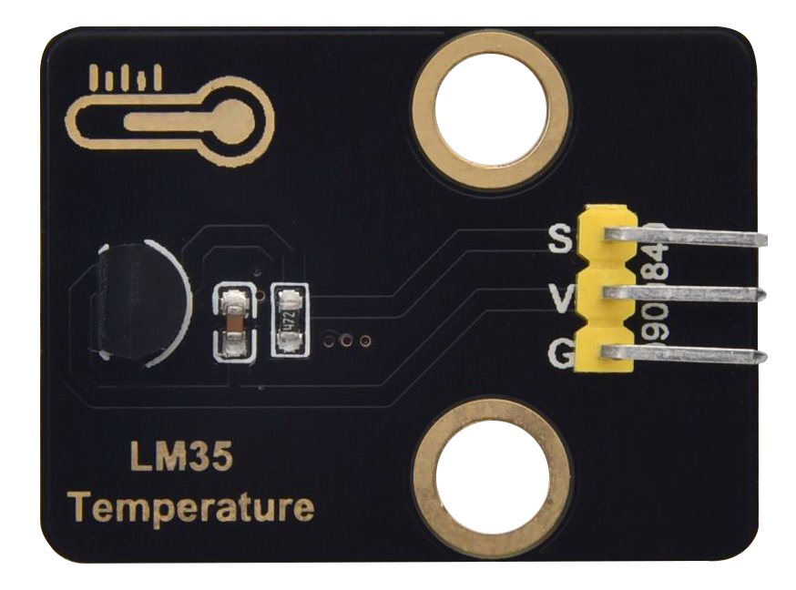

**Working principle of LM35 temperature sensor:** 

LM35 is a widely used temperature sensor with many different package types. At room temperature, it can achieve the accuracy of 1/4°C without additional calibration processing. LM35 temperature sensor can produce different voltage by different temperature. When the temperature is 0 ℃, it outputs 0V. If increasing 1 ℃, the output voltage will increase 10mv. 

The output temperature is 0℃ to 100℃, the conversion formula is as follows.


4.**Read the Temperature Value**

We first use a simple code to read the value of the temperature sensor, print it in the serial monitor. The wiring diagram is shown below.


LM35 output is given to analog pin GP26 of the pico board. This analog voltage is converted to its digital form and processed to get the temperature reading.


```c
//**********************************************************************************
/*  
 * Filename    : Read LM35 Temperature Value
 * Description : ADC value is converted to LM35 temperature value
 * Auther      : http//www.keyestudio.com
*/
#define PIN_ANALOG_IN  26  //the pin of the Sound Sensor

void setup() {
  Serial.begin(115200);
}

//In loop() function, analogRead is called to get the ADC value of ADC0 and assign it to adcVal. 
//Calculate the measured voltage value,Celsius and Fahrenheit valuesthrough the formula, 
//and print these data through the serial port monitor.
void loop() {
  int adcVal = analogRead(PIN_ANALOG_IN);
  double voltage = adcVal / 1023.0 * 3.3;
  float temperatureC = (voltage * 1000.0) / 10.0 ;
  float temperatureF = (temperatureC * 1.8) + 32.0;
  Serial.print("ADC Value: " + String(adcVal));
  Serial.print("---Voltage Value: " + String(voltage) + "V");
  Serial.print("---temperatureC: " + String(temperatureC) + "℃");
  Serial.println("---temperatureF: " + String(temperatureF) + "F");
  delay(500);
}
//**********************************************************************************
```


Before uploading Test Code to Raspberry Pi Pico, please check the configuration of Arduino IDE.

Click "Tools" to confirm that the board type and ports.

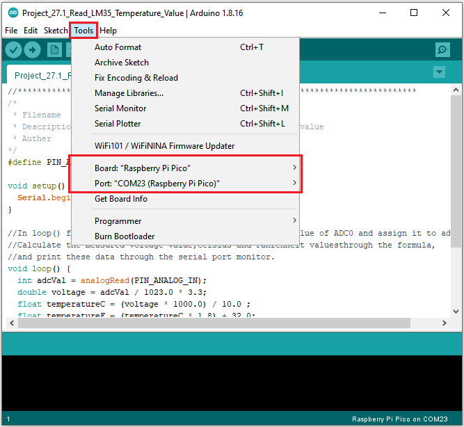

Click  to upload the test code to the Raspberry Pi Pico board

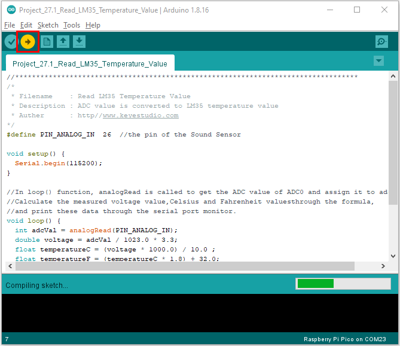

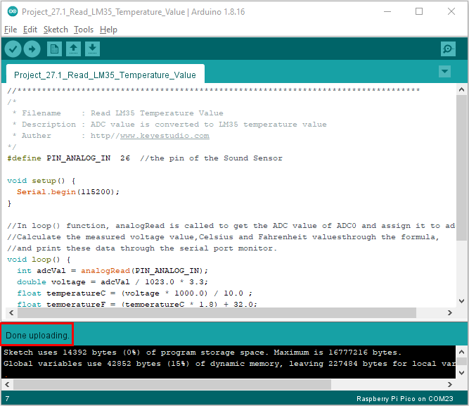

Upload the code to the pico board, power up with a USB cable and open the serial monitor and set baud rate to 115200. The serial monitor will show the temperature value.

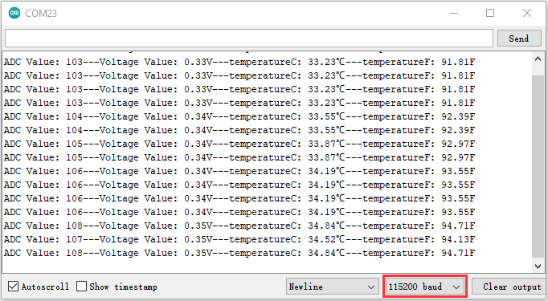

5.**Circuit Diagram and Wiring Diagram**

Now we use a LM35 temperature sensor and three LED lights to do a temperature test. When the LM35 temperature sensor senses different temperatures, different LED lights will light up. Follow the diagram below for wiring.

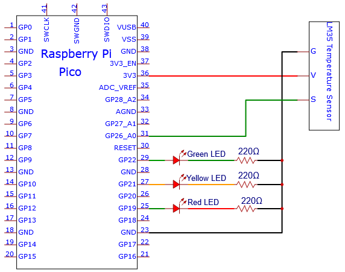


6.**Test Code：**

<span style="color: rgb(255, 76, 65);">Note:</span> The value of“temperature F”in the code can be adjusted appropriately according to the local temperature value.


```c
//**********************************************************************************
/*  
 * Filename    : Temperature Measurement
 * Description : Different leds light up when the LM35 senses different temperatures
 * Auther      : http//www.keyestudio.com
*/
#define PIN_ADC2       26      //the pin of the Sound Sensor
#define PIN_GREENLED   22      //the pin of the Green led
#define PIN_YELLOWLED  21      //the pin of the Yellow led
#define PIN_REDLED     19      //the pin of the Red led
void setup() {
  Serial.begin(115200);
  pinMode(PIN_GREENLED, OUTPUT); //set PIN_GREENLED to OUTPUT
  pinMode(PIN_YELLOWLED, OUTPUT);//set PIN_YELLOWLED to OUTPUT
  pinMode(PIN_REDLED, OUTPUT);//set PIN_REDLED to OUTPUT
  pinMode(PIN_ADC2, INPUT);//set PIN_ADC2 to INPUT
}

void loop() {
  int adcVal = analogRead(PIN_ADC2);
  double voltage = adcVal / 1023.0 * 3.3;
  float temperatureC = (voltage * 1000.0) / 10.0 ;
  float temperatureF = (temperatureC * 1.8) + 32.0;
  Serial.print("ADC Value: " + String(adcVal));
  Serial.print("---Voltage Value: " + String(voltage) + "V");
  Serial.print("---temperatureC: " + String(temperatureC) + "℃");
  Serial.println("---temperatureF: " + String(temperatureF) + "F");
  if (temperatureF >= 95) {
    digitalWrite(PIN_GREENLED, LOW);
    digitalWrite(PIN_YELLOWLED, LOW);
    digitalWrite(PIN_REDLED, HIGH);
  }
  else if (temperatureF >= 90 && temperatureF < 95) {
    digitalWrite(PIN_GREENLED, LOW);
    digitalWrite(PIN_YELLOWLED, HIGH);
    digitalWrite(PIN_REDLED, LOW);
  }
  else {
    digitalWrite(PIN_GREENLED, HIGH);
    digitalWrite(PIN_YELLOWLED, LOW);
    digitalWrite(PIN_REDLED, LOW);
  }

  delay(500);
}
//**********************************************************************************
```


Before uploading Test Code to Raspberry Pi Pico, please check the configuration of Arduino IDE.

Click "Tools" to confirm that the board type and ports.

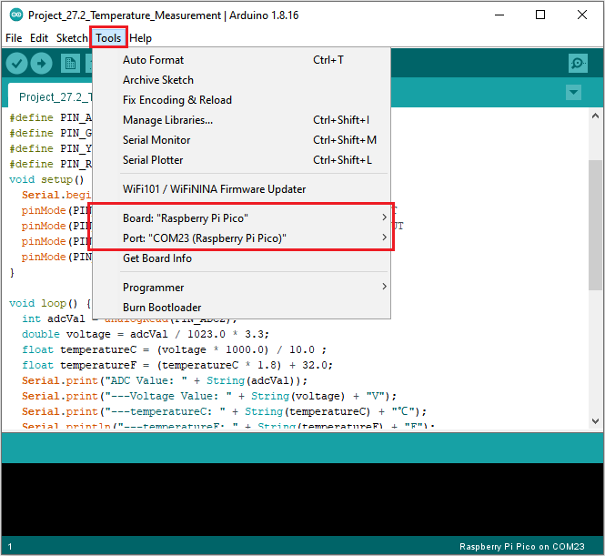

Click  to upload the test code to the Raspberry Pi Pico board


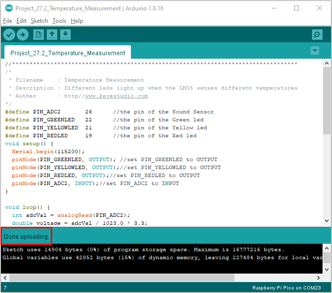

7.**Test Result**

The monitor displays the current temperature value. When the LM35 temperature sensor senses different temperatures, different LED lights will light up.

### Project 28: Rocker control light

1.**Introduction**

The joystick module is a component with two analog inputs and one digital input. It is widely used in game operation, robot control, drone control and other fields. 

In this project, we will use a Raspberry Pi Pico and a joystick module to control RGB. You can have a deeper understanding of the principle and operation of the joystick module in practice.


2.**Components Required**

|  |  | 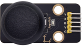 |
| :----------------------------------------------------------: | :----------------------------------------------------------: | :----------------------------------------------------------: |
|                     Raspberry Pi Pico*1                      |             Raspberry Pi Pico Expansion Board*1              |                      Joystick Module*1                       |
|  |  | 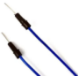 |
|                          RGB LED*1                           |                        220ΩResistor*3                        |                         Jumper Wires                         |
| 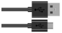 | 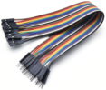 | 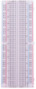 |
|                         USB Cable*1                          |                       M-F Dupont Wires                       |                         Breadboard*1                         |


3.**Component Knowledge**


**Joystick module**: 

It mainly uses PS2 joystick components. In fact, the joystick module has 3 signal terminal pins, which simulate a three-dimensional space. The pins of the joystick module are GND, VCC, and signal terminals (B, X, Y). 

The signal terminals X and Y simulate the X-axis and Y-axis of the space. When controlling, the X and Y signal terminals of the module are connected to the analog port of the microcontroller. The signal terminal B simulates the Z axis of the space, it is generally connected to the digital port and used as a button.

VCC is connected to the microcontroller power output VCC (3.3V or 5V), GND is connected to the microcontroller GND, the voltage in the original state is about 1.65V or 2.5V. 

In the X-axis direction, when moving in the direction of the arrow, the voltage value increases, and the maximum voltage can be reached. Moving in the opposite direction of the arrow, the voltage value gradually decreases to the minimum voltage. 

In the Y-axis direction, the voltage value decreases gradually as it moves in the direction of the arrow on the module, decreasing to the minimum voltage. As the arrow is moved in the opposite direction, the voltage value increases and can reach the maximum voltage. 

In the Z-axis direction, the signal terminal B is connected to the digital port and outputs 0 in the original state and outputs 1 when pressed. 

In this way, we can read the two analog values and the high and low level conditions of the digital port to determine the operating status of the joystick on the module.


4.**Features:**

Input Voltage: DC 3.3V ~ 5V

Output Signal: X/Y dual axis analog value +Z axis digital signal

Range of Application: Suitable for control point coordinate movement in plane as well as control of two degrees of freedom steering gear, etc.  

Product feature: Exquisite appearance, joystick feel superior, simple operation, sensitive response, long service life.  


5.**Read the Value**

We have to use analog Raspberry Pi Pico pin IO to read the data from X or Y pins, and use digital IO port to read the values of the button. Please follow the wiring diagram below for wiring.

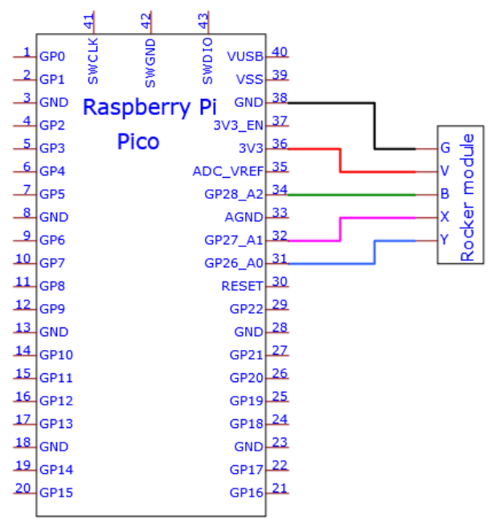

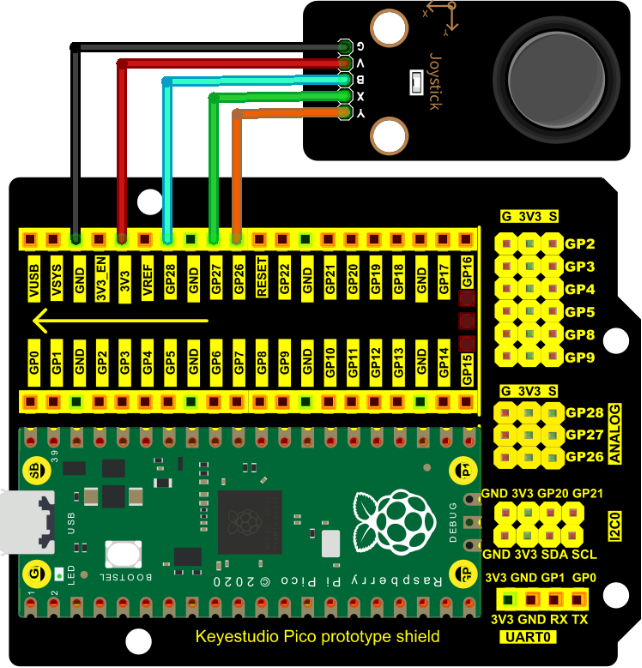


```c
//**********************************************************************************
/*  
 * Filename    : Read Rocker Value
 * Description : Read data from Rocker.
 * Auther      : http//www.keyestudio.com
*/
int xyzPins[] = {27, 26, 28};   //x,y,z pins
void setup() {
  Serial.begin(115200);
  pinMode(xyzPins[0], INPUT); //x axis. 
  pinMode(xyzPins[0], INPUT); //y axis. 
  pinMode(xyzPins[2], INPUT_PULLUP);   //z axis is a button.
}

// In loop(), use analogRead () to read the value of axes X and Y 
//and use digitalRead () to read the value of axis Z, then display them.
void loop() {
  int xVal = analogRead(xyzPins[0]);
  int yVal = analogRead(xyzPins[1]);
  int zVal = digitalRead(xyzPins[2]);
  Serial.println("X,Y,Z: " + String(xVal) + ", " +  String(yVal) + ", " + String(zVal));
  delay(500);
}
//**********************************************************************************
```


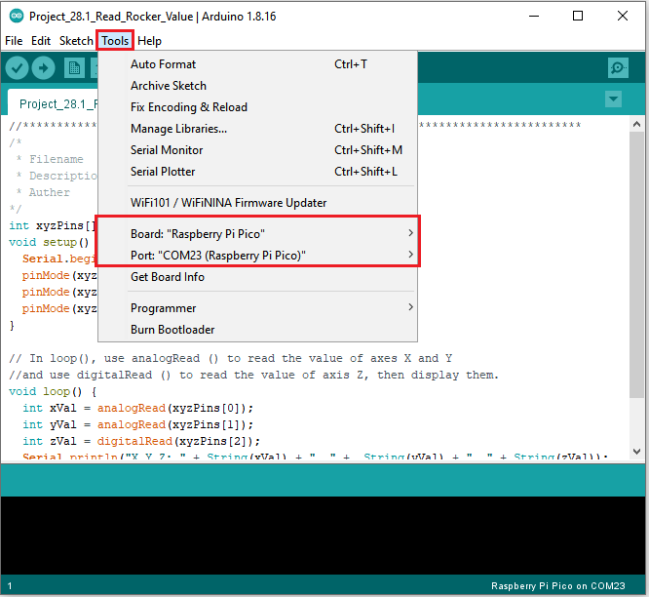

Click to upload the test code to the Raspberry Pi Pico board


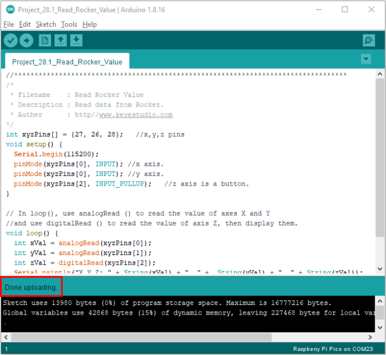

Upload the code to the pico board, power up with a USB cable and open the serial monitor and set baud rate to 115200.

The monitor will show values of the joystick module while moving the joystick

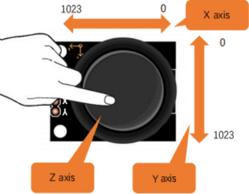

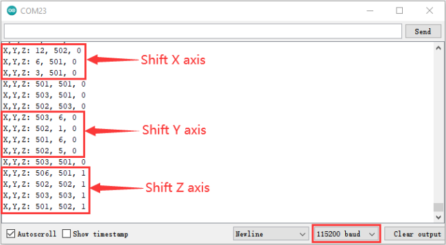

6.**Circuit Diagram and Wiring Diagram**

We just read the value of the joystick module. Now we need to do something with the joystick module and RGB, connecting according to the following diagram.

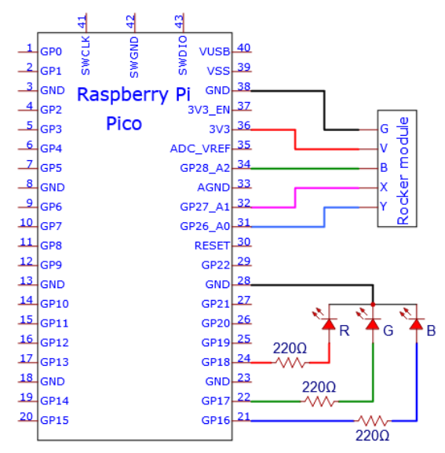

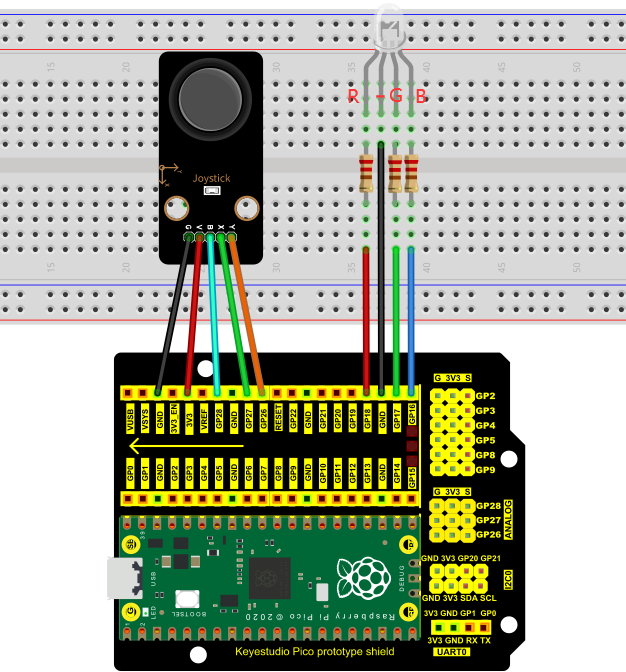


7.**Test Code：**


```c
//**********************************************************************************
/*  
 * Filename    : Rocker Control Light
 * Description : Control RGB to light different colors by Rocker.
 * Auther      : http//www.keyestudio.com
*/
int xyzPins[] = {27, 26, 28};   //x,y,z pins
int ledPins[] = {18, 17, 16};    //define red, green, blue led pins
void setup() {
  pinMode(xyzPins[0], INPUT); //x axis. 
  pinMode(xyzPins[0], INPUT); //y axis. 
  pinMode(xyzPins[2], INPUT_PULLUP);   //z axis is a button.
  for (int i = 0; i < 3; i++) {   //setup the pwm channels,1KHz,8bit
    pinMode(ledPins[i], OUTPUT);
  }
}

// In loop(), use analogRead () to read the value of axes X and Y 
//and use digitalRead () to read the value of axis Z, then display them.
void loop() {
  int xVal = analogRead(xyzPins[0]);
  int yVal = analogRead(xyzPins[1]);
  int zVal = digitalRead(xyzPins[2]);
  if (xVal < 200){
     analogWrite(ledPins[0], 255); //Common cathode LED, high level to turn on the led.
     analogWrite(ledPins[1], 0);
     analogWrite(ledPins[2], 0);
   }
  else if (xVal > 800){
     analogWrite(ledPins[0], 0); 
     analogWrite(ledPins[1], 255);
     analogWrite(ledPins[2], 0);
   }
  else if (yVal < 200){
     analogWrite(ledPins[0], 0); 
     analogWrite(ledPins[1], 0);
     analogWrite(ledPins[2], 255);
   }
  else if (yVal > 800){
     analogWrite(ledPins[0], 255); 
     analogWrite(ledPins[1], 255);
     analogWrite(ledPins[2], 255);
   }
}
//**********************************************************************************
```


Before uploading Test Code to Raspberry Pi Pico, please check the configuration of Arduino IDE.

Click "Tools" to confirm that the board type and ports.

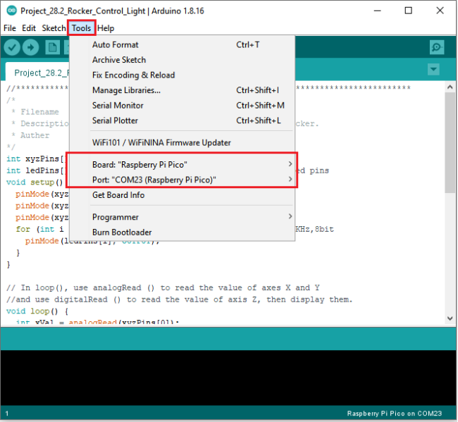

Click to upload the test code to the Raspberry Pi Pico board

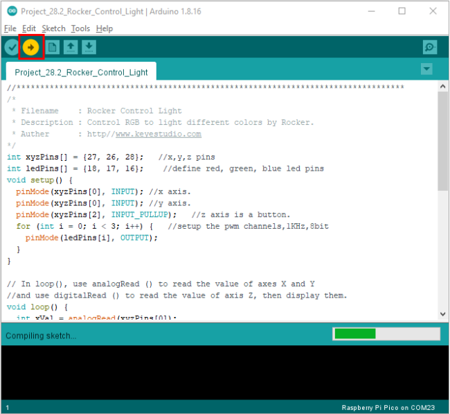

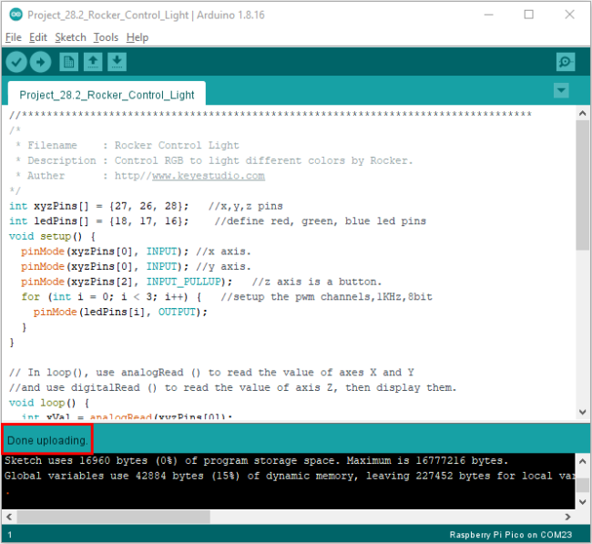

8.**Test Result：**

Upload the code and power up. If you move the joystick to the left, the RGB will turn red. If moving it to the right, the RGB will turn green; if moving it upward, the RGB will show white; if moving it downward, the RGB will become into blue.


### Project 29: Temperature Humidity Meter 

1.**Introduction**

In winter, the humidity in the air is very low, that is, the air is very dry. Coupled with the cold, the human skin is prone to crack from excessive dryness. Therefore, you need to use a humidifier to increase the humidity of the air at home. 

But how do you know that the air is too dry? Then you need equipment to detect air humidity. 

In this lesson, we will learn how to use the XHT11 temperature and humidity sensor. We use the  sensor to create a thermohygrometer and also combined with an LCD_128X32_DOT to display the temperature and humidity values.


2.**Components Required**

|  | 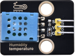 |  |
| :----------------------------------------------------------: | :----------------------------------------------------------: | :----------------------------------------------------------: |
|                     Raspberry Pi Pico*1                      |              Temperature and Humidity sensor*1               |                       LCD 128X32 DOT*1                       |
|  |  |  |
|                    20CM M-F Dupont Wires                     |                    10CM M-F Dupont Wires                     |                         USB Cable*1                          |


3.**Component Knowledge**

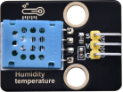

**XHT11 temperature and humidity sensor:** 

It is a temperature and humidity composite sensor with calibrated digital signal output. Its accuracy humidity is ±5%RH, temperature is ±2℃. Range humidity is 20 to 90%RH, and temperature is 0 to 50℃. 

The XHT11 temperature and humidity sensor applies dedicated digital module acquisition technology and temperature and humidity sensing technology to ensure extremely high reliability and excellent long-term stability of the product. It includes a resistive-type humidity measurement and an NTC temperature measurement component, which is very suitable for temperature and humidity measurement applications where accuracy and real-time performance are not required.

The operating voltage is in the range of 3.3V to 5.5V.

XHT11 has three pins, which are VCC, GND, and S. S is the pin for data output, using serial communication.

**Single bus format definition:**

| Description     | Definition                                                   |
| --------------- | ------------------------------------------------------------ |
| Start signal    | Microprocessor pulls data bus (SDA) down at least 18ms for a period of time(Maximum is 30ms), notifying the sensor to prepare data. |
| Response signal | The sensor pulls the data bus (SDA) low for 83µs, and then pulls up for 87µs to respond to the host's start signal. |
| Humidity        | The high humidity is an integer part of the humidity data, and the low humidity is a fractional part of the humidity data. |
| Temperature     | The high temperature is the integer part of the temperature data, the low temperature is the fractional part of the temperature data. And the low temperature Bit8 is 1, indicating a negative temperature, otherwise, it is a positive temperature. |
| Parity bit      | Parity bit=Humidity high bit+ Humidity low bit+temperature high bit+temperature low bit |

**Data sequence diagram:**

When MCU sends a start signal, XHT11 changes from the low-power-consumption mode to the high-speed mode, waiting for MCU completing the start signal. 

Once it is completed, XHT11 sends a response signal of 40-bit data and triggers a signal acquisition. The signal is sent as shown in the figure.


Combined with the code, you can understand better.

The XHT11 temperature and humidity sensor can easily add temperature and humidity data to your DIY electronic projects. It is perfect for remote weather stations, home environmental control systems, and farm or garden monitoring systems.

**Specification**:

Working voltage: +5V

Temperature range: 0°C to 50°C, error of ± 2°C

Humidity range: 20% to 90% RH,± 5% RH error

Digital interface

**Schematic diagram:**

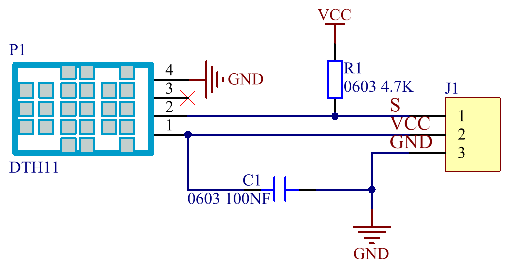

4.**Read the Value**

First we learned how to use the serial monitor to print the values of the XHT11 sensor. Please connect the wires according to the wiring diagram below.

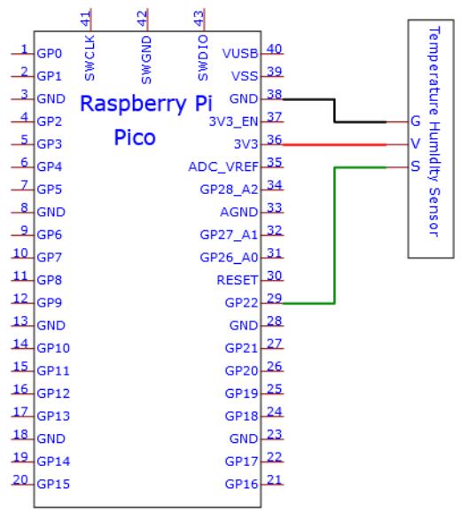

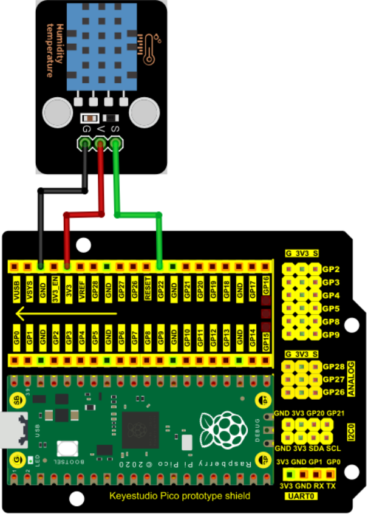


5.**Adding the DHT library：**

Open "Arduino IDE"，click “Sketch” → “Include Library” → “Add .zip Library...”. 

Go to the folder "**...\5.Libraries_Firmware_and_APP\Libraries**" and click <span style="color: rgb(255, 76, 65);">"DHT.zip"</span> and "**Open**".


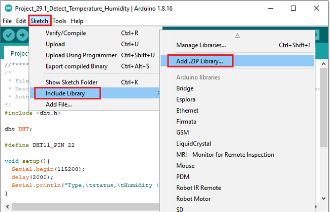

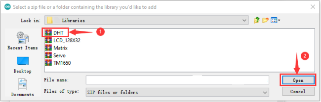


```c
//**********************************************************************
/*
 * Filename    : Temperature and Humidity Sensor
 * Description : Use DHT11 to measure temperature and humidity.Print the result to the serial port.
 * Auther      : http//www.keyestudio.com
*/
//Before using dht11, we need to include a header file. 
//Apply for a DHT object and define the pin controlling DHT as GPIO22.
#include <dht.h>

dht DHT;

#define DHT11_PIN 22

void setup(){
  Serial.begin(115200);
  delay(2000);
  Serial.println("Type,\tstatus,\tHumidity (%),\tTemperature (C)");
}

void loop(){
  int chk = DHT.read11(DHT11_PIN);//Read11() is used to read DHT11 data and assign the return value to variable chk.
//If the return value of the read11() function is not equal to DHTLIB_OK, it means that the data reading failed; 
//If they equals, humuduty() and temperature() are called to obtain the temperature and humidity data of the 
//current environment, and print it out through the serial port. 
  if(chk == DHTLIB_OK){
    Serial.println("humidity: " + String(DHT.humidity) + "%, temperature: " + String(DHT.temperature) + "C");
  }else{
    Serial.println("DHT11 Reading data error!");
  }
  delay(1000);
}
//**************************************************************************
```


Before uploading Test Code to Raspberry Pi Pico, please check the configuration of Arduino IDE.

Click "Tools" to confirm that the board type and ports.

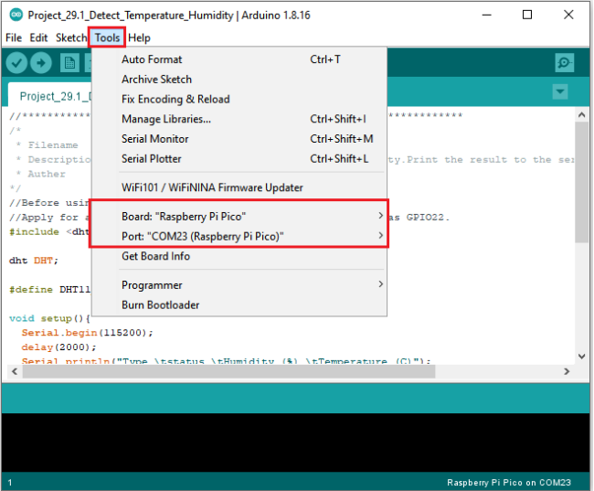

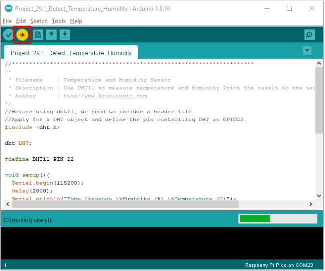

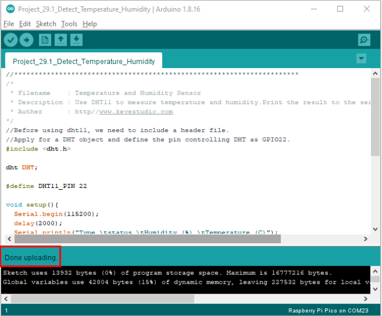

Upload the code to the pico board, power up with a USB cable and open the serial monitor and set baud rate to 115200.

You will see the current temperature and humidity value detected by the sensor.

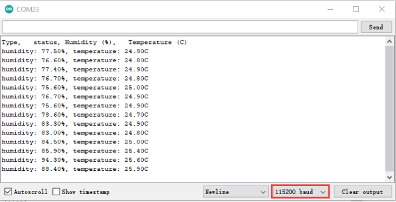


6.**Circuit Diagram and Wiring Diagram**

Now we start printing the value of the XHT11 temperature and humidity sensor with LCD screen. We will see the corresponding values on the LCD screen. Let's get started with this project. Please follow the wiring diagram below.

Note: You would better use the 10CM short male-to-female DuPont wire to connect LCD\_128X32\_DOT. The 20cm M-F Dupont wire is not proper.

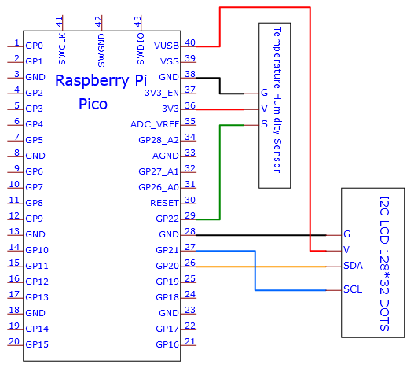

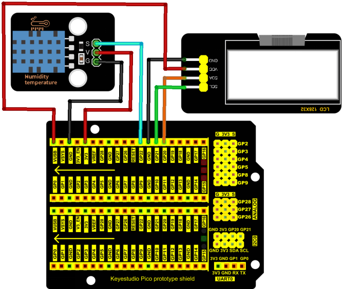


7.**Test Code：**

If the library DHT and lcd128\_32\_io are added, just skip this step.

If not, just follow the instruction above.


```c
//**********************************************************************
/*
 * Filename    : Temperature Humidity Meter
 * Description : LCD displays the value of temperature and humidity.
 * Auther      : http//www.keyestudio.com
*/
//Before using dht11, we need to include a header file. 
//Apply for a DHT object and define the pin controlling DHT as GPIO22.
#include <dht.h>
dht DHT;
#define DHT11_PIN 22
//the Library of LCD128_32 and lCD128 *32 pin
#include "lcd128_32_io.h"
lcd lcd(20, 21); //Create lCD128*32 pin，sda->20， scl->21

void setup(){
  lcd.Init(); //initialize
  lcd.Clear();  //clear
}
char string[10];

//lcd displays humidity and temperature values
void loop(){
  int chk = DHT.read11(DHT11_PIN);//Read11() is used to read DHT11 data and assign the return value to variable chk.
  lcd.Cursor(0,0); //Set display position
  lcd.Display("Temper:"); //Setting the display
  lcd.Cursor(0,8);
  lcd.DisplayNum(DHT.temperature);
  lcd.Cursor(0,11);
  lcd.Display("C");
  lcd.Cursor(2,0); 
  lcd.Display("humid:");
  lcd.Cursor(2,8);
  lcd.DisplayNum(DHT.humidity);
  lcd.Cursor(2,11);
  lcd.Display("%");
  delay(200);
}
//****************************************************************************
```


Before uploading Test Code to Raspberry Pi Pico, please check the configuration of Arduino IDE.

Click "Tools" to confirm that the board type and ports.

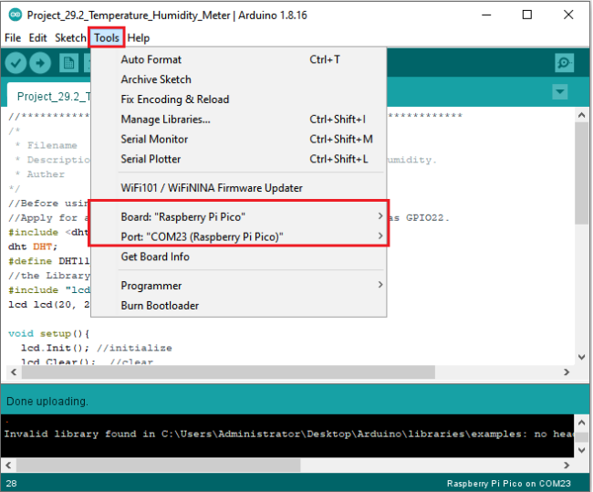

Click  to upload the test code to the Raspberry Pi Pico board

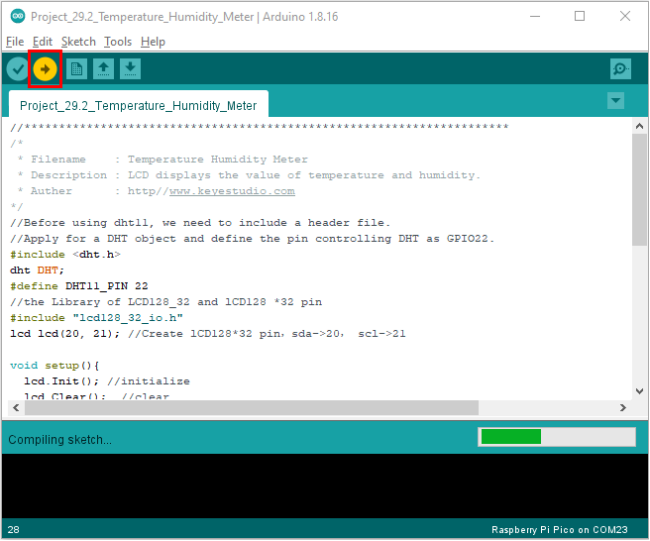

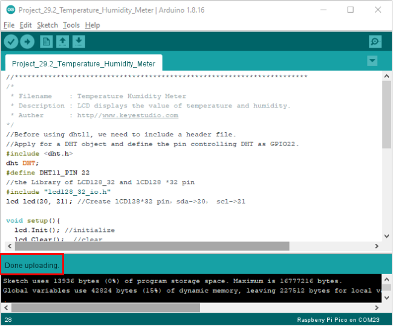

8.**Test Result：**

Upload the code to the pico board and power up. The LCD\_128X32\_DOT displays temperature and humidity in the current environment.


### Project 30: Ultrasonic Ranger

**1. Introduction**

The HC-SR04 ultrasonic sensor is a very affordable distance sensor, mainly used for obstacle avoidance in various robotic projects. It is also used for water level sensing and even as a parking sensor. We treat the ultrasonic sensors as bat's eyes. 

In the dark, bats can still identify objects in front of them and directions through ultrasound.


**2. Components Required**

|  |  | 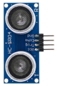 |
| :----------------------------------------------------------: | :----------------------------------------------------------: | :----------------------------------------------------------: |
|                     Raspberry Pi Pico*1                      |             Raspberry Pi Pico Expansion Board*1              |                     Ultrasonic Sensor*1                      |
|  |  |  |
|                          Red LED*4                           |                       M-F Dupont Wires                       |                        220ΩResistor*4                        |
|  |  |  |
|                         Jumper Wires                         |                         Breadboard*1                         |                         USB Cable*1                          |


**3. Component Knowledge**

**HC-SR04 ultrasonic sensor:** 

Like bats, sonar is used to determine the distance to an object. It provides accurate non-contact range detection, high-precision and stable readings. Its operation is not affected by sunlight or black materials, just like a precision camera (acoustically softer materials like cloth are difficult to detect). It has an ultrasonic transmitter and receiver.


In front of the ultrasonic sensor are two metal cylinders, these are the converters. The converters convert the mechanical energy into an electrical signal. In the ultrasonic sensor, there are transmitting converters and receiving converters. 

The transmitting converter converts the electric signal into an ultrasonic pulse, and the receiving converter converts the reflected ultrasonic pulse back to an electric signal. 

If you look at the back of the ultrasonic sensor, you will see an IC behind the transmitting converter, which controls the transmitting converter. There is also an IC behind the receiving converter, which is a quad operational amplifier that amplifies the signal generated by the receiving converter into a signal large enough to be transmitted to the Arduino.

**Sequence diagrams:**

The figure shows the sequence diagram of the HC-SR04. To start the measurement, the Trig of SR04 must receive at least 10us high pulse (5V), which will activate the sensor to emit 8 cycles of 40kHz ultrasonic pulses, and wait for the reflected ultrasonic pulses. When the sensor detects ultrasound from the receiver, it sets the Echo pin to high (5V) and delays it by one cycle (width), proportional to the distance. To get the distance, measure the width of the Echo pin.


Time = Echo pulse width, its unit is “us” (microseconds)

Distance in centimeters = time / 58

Distance in inches = time / 148

**4. Read the Distance Value**

We will start with a simple ultrasonic distance measurement and output the measured distance on the serial monitor.


The HC-SR04 ultrasonic sensor has four pins, they are Vcc, Trig, Echo and GND. 

The Vcc pin provides the power source for generating ultrasonic pulses and is connected to Vcc (+5V). The GND pin is grounded. The Trig pin is where the Arduino sends a signal to start the ultrasonic pulse. The Echo pin is where the ultrasonic sensor sends information about the duration of the ultrasonic pulse to the Plus control board. 

Wiring as shown below.

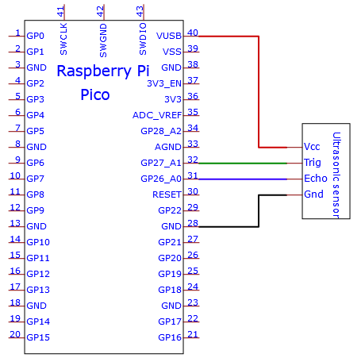

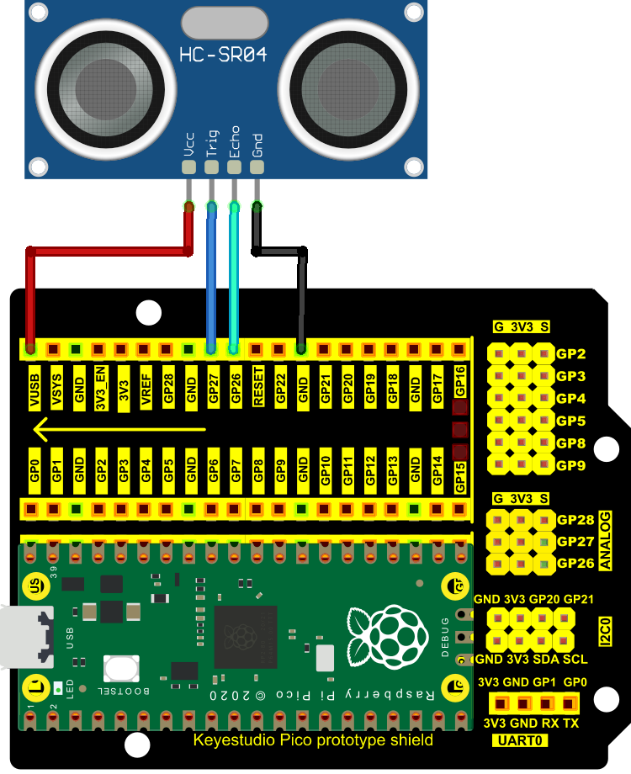


```c
//**********************************************************************************
/*  
 * Filename    : Ultrasonic Ranging
 * Description : Use the ultrasonic module to measure the distance.
 * Auther      : http//www.keyestudio.com
*/
const int TrigPin = 27; // define TrigPin
const int EchoPin = 26; // define EchoPin.
int duration = 0; // Define the initial value of the duration to be 0
int distance = 0;//Define the initial value of the distance to be 0
void setup() 
{
  pinMode(TrigPin , OUTPUT); // set trigPin to output mode
  pinMode(EchoPin , INPUT); // set echoPin to input mode
  Serial.begin(115200);  // Open serial monitor at 115200 baud to see ping results.
}
void loop()
{
 // make trigPin output high level lasting for 10μs to triger HC_SR04 
  digitalWrite(TrigPin , HIGH);
  delayMicroseconds(10);
  digitalWrite(TrigPin , LOW);
  // Wait HC-SR04 returning to the high level and measure out this waitting time
  duration = pulseIn(EchoPin , HIGH);
  // calculate the distance according to the time
  distance = (duration/2) / 28.5 ;
  Serial.print("Distance: ");
  Serial.print(distance); //Serial port print distance value
  Serial.println("cm");
  delay(100); // Wait 100ms between pings (about 20 pings/sec).
}
//**********************************************************************************
```


Before uploading Test Code to Raspberry Pi Pico, please check the configuration of Arduino IDE.

Click "Tools" to confirm that the board type and ports.

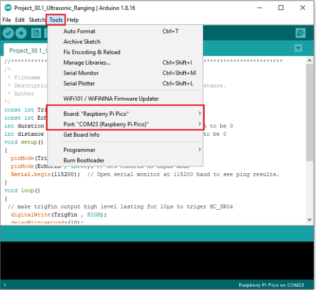

Click  to upload the test code to the Raspberry Pi Pico board

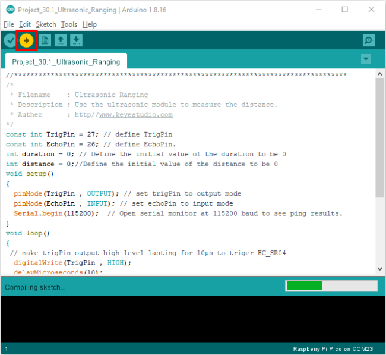

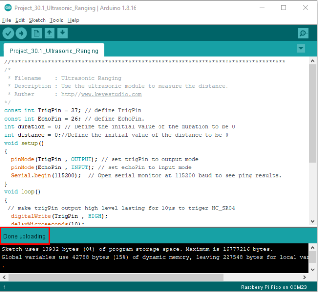

Upload the code to the pico board, power up with a USB cable and open the serial monitor and set baud rate to 115200. 

The monitor will show distance vales between the sensor and the obstacle.

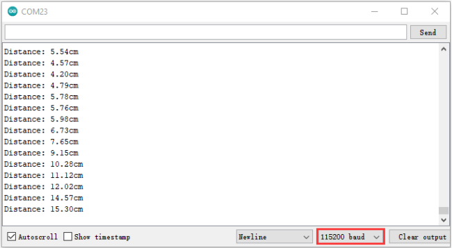


**5. Circuit Diagram and Wiring Diagram**

Next, we will make a simple ultrasonic ranger using a Raspberry Pi Pico to control an ultrasonic sensor and 4 LED lights. Connect the wires as shown below.
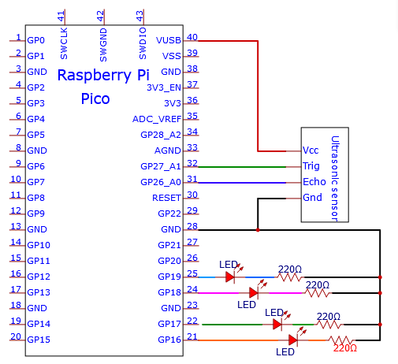	

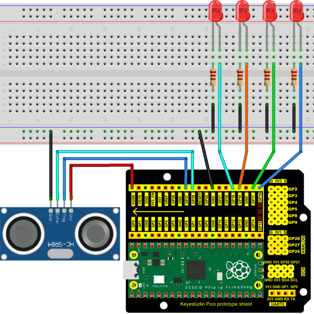


```c
//**********************************************************************************
/*  
 * Filename    : Ultrasonic Ranger
 * Description : four leds are controlled by ultrasonic ranging.
 * Auther      : http//www.keyestudio.com
*/
const int TrigPin = 27;    // define TrigPin
const int EchoPin = 26;    // define EchoPin.
const int PIN_LED1 = 19;    // define PIN_LED1
const int PIN_LED2 = 18;    // define PIN_LED2
const int PIN_LED3 = 17;    // define PIN_LED3
const int PIN_LED4 = 16;    // define PIN_LED4
int duration = 0;    // define the initial value of the duration to be 0
int distance = 0;   // define the initial value of the distance to be 0
void setup() 
{
  pinMode(TrigPin , OUTPUT); // set trigPin to output mode
  pinMode(EchoPin , INPUT); // set echoPin to input mode
  pinMode(PIN_LED1 , OUTPUT);  // set PIN_LED1 to output mode
  pinMode(PIN_LED2 , OUTPUT);  // set PIN_LED2 to output mode
  pinMode(PIN_LED3 , OUTPUT);  // set PIN_LED3 to output mode
  pinMode(PIN_LED4 , OUTPUT);  // set PIN_LED4 to output mode
  Serial.begin(115200);  // Open serial monitor at 115200 baud to see ping results.
}
void loop()
{
// make trigPin output high level lasting for 10μs to triger HC_SR04 
  digitalWrite(TrigPin , HIGH);
  delayMicroseconds(10);
  digitalWrite(TrigPin , LOW);
// Wait HC-SR04 returning to the high level and measure out this waitting time
  duration = pulseIn(EchoPin , HIGH);
// calculate the distance according to the time
  distance = (duration/2) / 28.5 ;
  Serial.print("Distance: ");
  Serial.print(distance); //Serial port print distance value
  Serial.println("cm");
  if ( distance <= 7 )
  {
    digitalWrite(PIN_LED1, HIGH);
  }
  else
  {
    digitalWrite(PIN_LED1, LOW);
  }
  if ( distance <= 14 )
  {
    digitalWrite(PIN_LED2, HIGH);
  }
  else
  {
    digitalWrite(PIN_LED2, LOW);
  }
  if ( distance <= 21 )
  {
    digitalWrite(PIN_LED3, HIGH);
  }
  else
  {
    digitalWrite(PIN_LED3, LOW);
  }
  if ( distance <= 28 )
  {
    digitalWrite(PIN_LED4, HIGH);
  }
  else
  {
    digitalWrite(PIN_LED4, LOW);
  }
}     
//**********************************************************************************
```


Before uploading Test Code to Raspberry Pi Pico, please check the configuration of Arduino IDE.

Click "Tools" to confirm that the board type and ports.

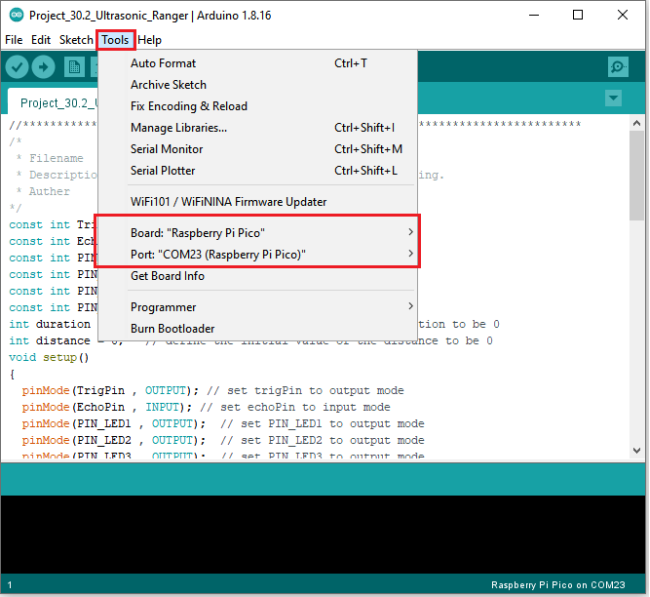

Click  to upload the test code to the Raspberry
Pi Pico board

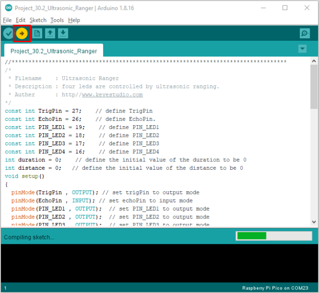

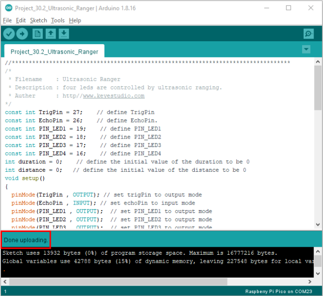

**6. Test Result：**

Upload the code to the pico board, power up with a USB cable and open the serial monitor and set baud rate to 115200. 

The monitor will show distance values between the sensor and the obstacle. If put your hand before the sensor, the LED will be on.


### Project 31: Temperature Instrument

1.**Introduction**

LM35 is a commonly used and easy-to-use temperature sensor. It does not require other hardware, only needs an analog port. The difficulty lies in compiling the code and converting the analog values to Celsius temperature. 

In this project, we use a temperature sensor and 3 LEDs to make a temperature tester. When the temperature sensor touches objects with different temperature, the LED will show different colors.


2.**Components Required**

| 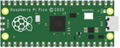 |  | 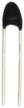 |
| :----------------------------------------------------------: | :----------------------------------------------------------: | :----------------------------------------------------------: |
|                     Raspberry Pi Pico*1                      |             Raspberry Pi Pico Expansion Board*1              |                       Photoresistor*1                        |
|  |  | 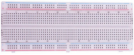 |
|                       10KΩ Resistor*1                        |                     10CMM-F Dupont Wires                     |                         Breadboard*1                         |
| 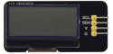 | 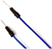 |  |
|                       LCD 128X32 DOT*1                       |                         Jumper Wires                         |                         USB Cable*1                          |


3.**Component Knowledge**

**Thermistor**: 

It is a temperature sensitive resistor. When it senses a change in temperature, the thermistor's resistance changes. We can use this feature to detect temperature intensity with thermistor. 

Thermistors and its electronic symbols are shown below:


The relation between thermistor resistance and temperature is:


**In the formula:**

**Rt** is the resistance of the thermistor at T2 temperature.

**R** is the nominal resistance value of the thermistor at T1 room temperature.

**EXP\[n\]** is the nth power of e.

**B** is the temperature index

**T1** and **T2** refer to K degrees, that is, Kelvin temperature. 

**Kelvin temperature = 273.15 + Celsius temperature**

For thermistor parameters, we use: B=3950, R=10KΩ，T1=25℃.

The circuit connection method of thermistor is similar to that the photoresistor, as shown below :


We can use the value measured by the ADC converter to get the resistance value of the thermistor, and then use the formula to get the temperature value. 

Therefore, the temperature formula can be deduced as:


4.**Read the Values**

First we will learn the thermistor to read the current ADC value, voltage value and temperature value and print them out . Please connect the wires according to the following wiring diagram.


```c
//**********************************************************************************
/*  
 * Filename    : Read the thermistor analog value
 * Description : Making a thermometer by thermistor.
 * Auther      : http//www.keyestudio.com
*/
#define PIN_ADC1   27
void setup() {
  Serial.begin(115200);
}

void loop() {
  int adcValue = analogRead(PIN_ADC1);                            //read ADC pin
  double voltage = (float)adcValue / 1023.0 * 3.3;                // calculate voltage
  double Rt = 10 * voltage / (3.3 - voltage);                     //calculate resistance value of thermistor
  double tempK = 1 / (1 / (273.15 + 25) + log(Rt / 10) / 3950.0); //calculate temperature (Kelvin)
  double tempC = tempK - 273.15;                                  //calculate temperature (Celsius)
  Serial.println("Voltage: " + String(voltage) + "V,\t\t" + "Kelvins: " + String(tempK) + "K,\t" + "Temperature: " + String(tempC) + "C");
  delay(1000);
}
//**********************************************************************************
```


Before uploading Test Code to Raspberry Pi Pico, please check the configuration of Arduino IDE.

Click "Tools" to confirm that the board type and ports.

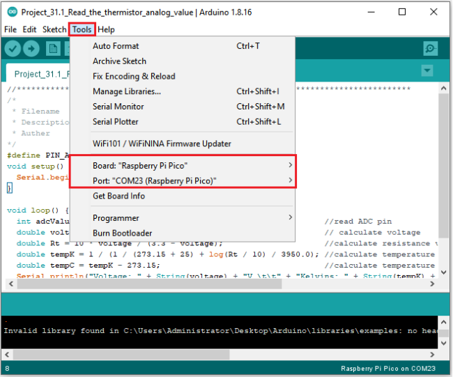

Click  to upload the test code to the Raspberry Pi Pico board

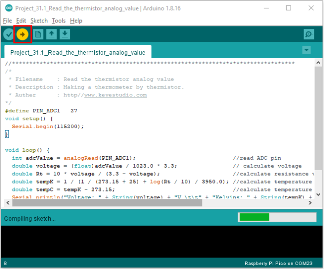

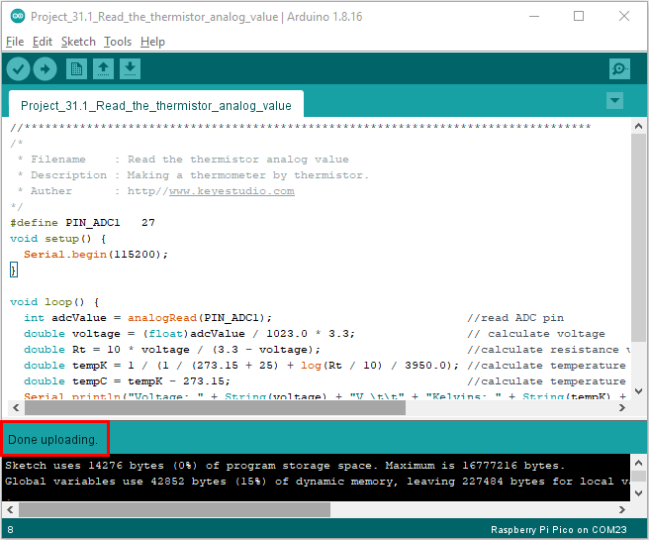

Upload the code to the Raspberry Pi Pico successfully, power up with a USB cable, open the serial monitor and set the baud rate to 115200.

The serial monitor will display the current ADC value, voltage value and temperature value of the thermistor. Press the photoresistor, the temperature value will rise.

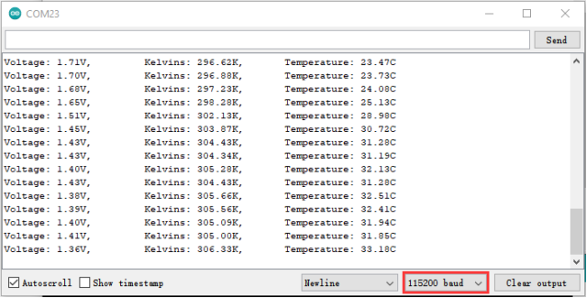

Circuit diagram and wiring diagram:


**Note:** You must use a 10CM M-F DuPont wire to connect LCD_128X32_DOT,then LCD_128X32_DOT will display normally;

A 20CM long male-to-female DuPont cable is not required because the LCD_128X32_DOT display abnormally.


5.**Adding the lcd128\_32\_io library：**

If you added the **lcd128\_32\_io** library, just skip this step.

Add the library as follows:

Open "Arduino IDE"，click “Sketch” → “Include Library” → “Add .zip Library...”. 

Go to the folder "**...\5.Libraries_Firmware_and_APP\Libraries**" and click <span style="color: rgb(255, 76, 65);">"LCD_128X32.zip"</span> and "**Open**".


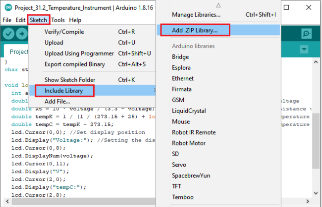

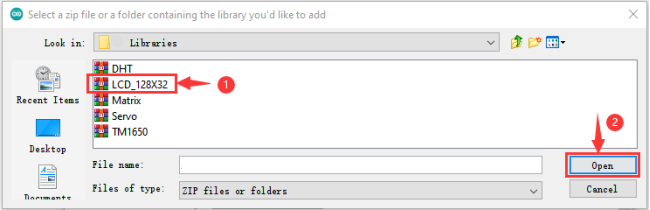

6.**Test Code：**


```c
//**********************************************************************************
/*  
 * Filename    : Temperature Instrument
 * Description : LCD displays the temperature of thermistor.
 * Auther      : http//www.keyestudio.com
*/
#include "lcd128_32_io.h"

#define PIN_ADC1  27

lcd lcd(20, 21); //Create lCD128 *32 pin，sda->20， scl->21

void setup()  {
  lcd.Init(); //initialize
  lcd.Clear();  //clear
}
char string[10];

void loop() {
  int adcValue = analogRead(PIN_ADC1);                            //read ADC pin
  double voltage = (float)adcValue / 1023.0 * 3.3;                // calculate voltage
  double Rt = 10 * voltage / (3.3 - voltage);                     //calculate resistance value of thermistor
  double tempK = 1 / (1 / (273.15 + 25) + log(Rt / 10) / 3950.0); //calculate temperature (Kelvin)
  double tempC = tempK - 273.15;                                  //calculate temperature (Celsius)
  lcd.Cursor(0,0); //Set display position
  lcd.Display("Voltage:"); //Setting the display
  lcd.Cursor(0,8);
  lcd.DisplayNum(voltage);
  lcd.Cursor(0,11);
  lcd.Display("V");
  lcd.Cursor(2,0); 
  lcd.Display("tempC:");
  lcd.Cursor(2,8);
  lcd.DisplayNum(tempC);
  lcd.Cursor(2,11);
  lcd.Display("C");
  delay(200);
}
//**********************************************************************************
```


Before uploading Test Code to Raspberry Pi Pico, please check the configuration of Arduino IDE.

Click "Tools" to confirm that the board type and ports.

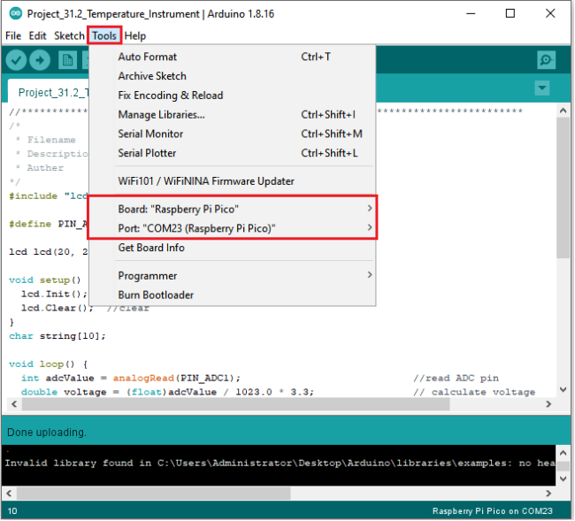

Click  to upload the test code to the Raspberry Pi Pico board

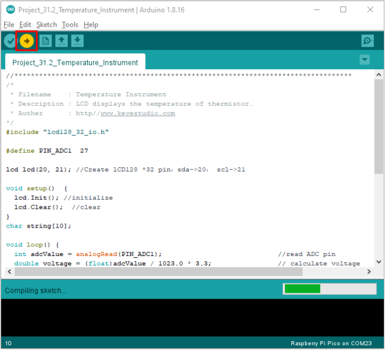

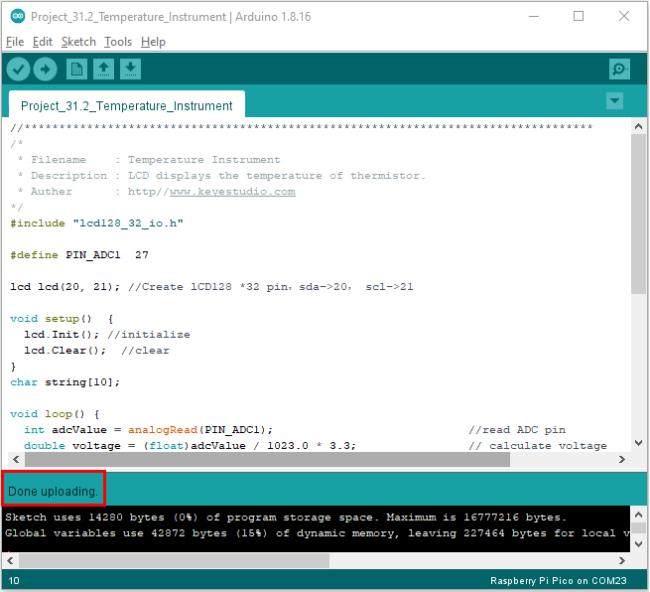

7.**Test Result：**

Upload the code and power up with a USB cable. The LCD 128X32 DOT will show the voltage value and temperature value.


### Project 32: RFID

1.**Introduction**

Nowadays, many residential districts use this function to open the door by swiping the card, which is very convenient. 

In this lesson, we will learn how to use RFID(radio frequency identification) wireless communication technology and read and write the key chain card (white card) and control the steering gear rotation by RFID-MFRC522 module.


2.**Components Required**

|  |  | 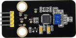 |
| :----------------------------------------------------------: | :----------------------------------------------------------: | :----------------------------------------------------------: |
|                     Raspberry Pi Pico*1                      |             Raspberry Pi Pico Expansion Board*1              |                    RFID-MFRC522 Module*1                     |
|  |  |  |
|                         Key Chain*1                          |                       F-F Dupont Wires                       |                           Servo*1                            |
|  |  |                                                              |
|                         White Card*1                         |                         USB Cable*1                          |                                                              |


3.**Component Knowledge**

**RFID**

RFID (Radio Frequency Identification) is a wireless communication technology. A complete RFID system generally consists of a transponder and a reader. Usually we use tags as transponders, and each tag has a unique code attached to the object to identify the target object. The reader is a device that reads (or writes) tag information.

Products derived from RFID technology can be divided into three categories: passive RFID products, active RFID products and semi-active RFID products. 

However, the passive RFID products are the earliest, most mature and most widely used products on the market, which can be seen everywhere in our daily life, such as bus card, meal card, bank card, hotel access card, etc., which are close contact identification. 

The main operating frequencies of the passive RFID products are 125KHZ(low frequency), 13.56mhz (high frequency), 433MHZ(UHF), and 915MHZ(UHF). The active and the semi-active RFID products operate at higher frequencies.

The RFID module we use is a passive RFID product with a working frequency of 13.56MHz. 

**RFID-RC522 Module** 

The MFRC522 is a highly integrated reader/writer IC for 13.56MHz contactless communication. Its internal transmitter is capable of driving a read/write antenna, which is designed to communicate with ISO/IEC 14443A /MIFARE cards and transponders without the need for additional active circuits . 

The receiving module provides an efficient implementation of demodulation and decoding of signals from ISO/IEC 14443 A /MIFARE compatible cards and transponders. 

The digital module manages complete ISO/IEC 14443A framing and error detection (parity and CRC) features.  

The RFID module uses the MFRC522 as the control chip and adopts I2C (Inter-Integrated Circuit) interface.

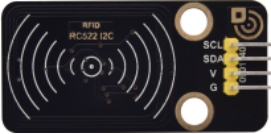

4.**Specifications:**

- Operating voltage: DC 3.3V-5V
- Operating current: 13—100mA/DC 5V
- Idling current: 10-13mA/DC 5V
- Sleep current: <80uA
- Peak current: <100mA
- Operating frequency: 13.56MHz
- Maximum power: 0.5W
- Supported card types: mifare1 S50、mifare1 S70、mifare UltraLight、mifare Pro、mifare Desfire
- Environmental operating temperature:  -20 to 80 degrees Celsius
- Environment storage temperature: -40 to 85 degrees Celsius
- Relative Humidity: 5% to 95%
- Data transfer rate: The maximum is 10Mbit/s.


5.**Read the Card Number Value**

We will read the UNIQUE ID number (UID) of the RFID card and identify its type . And display relevant information through the "Shell" window of Thonny IDE. 

The wiring diagram is as follows:


6.**Adding the MFRC522\_I2C and Wire libraries：**

Open "Arduino IDE"，click “Sketch” → “Include Library” → “Add .zip Library...”. 

Go to the folder "**...\5.Libraries_Firmware_and_APP\Libraries**" and click <span style="color: rgb(255, 76, 65);">"MFRC522_I2C.zip"</span> and "**Open**".


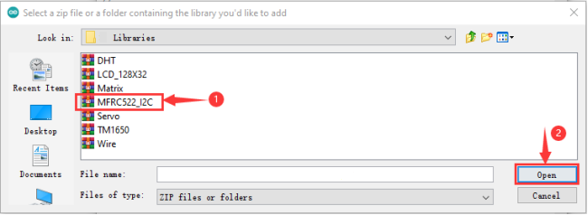

Go to the folder "**...\5.Libraries_Firmware_and_APP\Libraries**" and click <span style="color: rgb(255, 76, 65);">"Wire.zip"</span> and "**Open**".


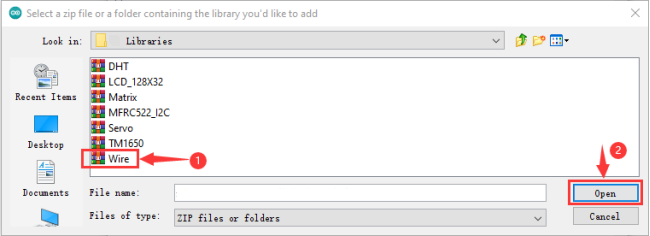

**RFID reads UID：**


```c
//**********************************************************************************
/*  
 * Filename    : RFID
 * Description : RFID reader UID
 * Auther      : http//www.keyestudio.com
*/
#include <Wire.h>
#include "MFRC522_I2C.h"
// IIC pins default to GPIO20 and GPIO21 of Raspberry Pi Pico
// 0x28 is the i2c address of SDA, if doesn't match，please check your address with i2c.
MFRC522 mfrc522(0x28);   // create MFRC522.
String rfid_str = "";

void setup() {
  Serial.begin(115200);           // initialize and PC's serial communication
  Wire.begin();                   // initialize I2C
  mfrc522.PCD_Init();             // initialize MFRC522
}

void loop() {
  // 
  if ( ! mfrc522.PICC_IsNewCardPresent() || ! mfrc522.PICC_ReadCardSerial() ) {
    delay(50);
    return;
  }
  
  rfid_str = "";//String emptying
  Serial.print(F("Card UID:"));
  for (byte i = 0; i < mfrc522.uid.size; i++) {
    rfid_str = rfid_str + String(mfrc522.uid.uidByte[i], HEX);  //Convert to string
    //Serial.print(mfrc522.uid.uidByte[i] < 0x10 ? " 0" : " ");
    //Serial.print(mfrc522.uid.uidByte[i], HEX);
  } 
  Serial.println(rfid_str);
}
//**********************************************************************************
```


Before uploading Test Code to Raspberry Pi Pico, please check the configuration of Arduino IDE.

Click "Tools" to confirm that the board type and ports.

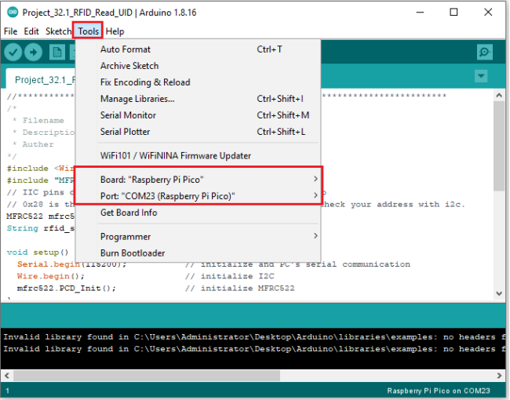


Upload the code to the pico board, power up with a USB cable and open the serial monitor and set baud rate to 115200.

Attach the key to the sensing area blank card, the monitor will show information as follows:

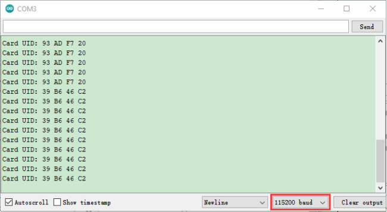

Note: the door card value and key chain value may be different for different RRFID -RC522 door cards and key chains.  


7.**Circuit Diagram and Wiring diagram**

Now we use a RFID-RC522 module, door card/key chain and servo to simulate an intelligent access control system. When the door card is close to the RFID-RC522 module induction area, the servo rotates. 

Wiring according to the figure below:


8.**Adding library MFRC522\_I2C，Wire and Servo：**

If both of them are added, just skip this step,.

Add the Servo library：

Open "Arduino IDE"，click “Sketch” → “Include Library” → “Add .zip Library...”. 

Go to the folder "**...\5.Libraries_Firmware_and_APP\Libraries**" and click <span style="color: rgb(255, 76, 65);">"Servo.zip"</span> and "**Open**".


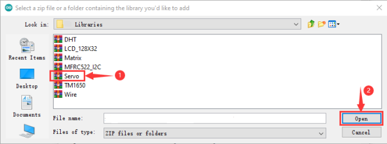

Add the library "**MFRC522\_I2C**" and "**Wire**":

If you add MFRC522\_I2Cand Wire, you don’t need to add them.


9.**Test Code：**

Values detected by the RFID-MFRC522 and the blank card are different.

Replace values in the code with values read by the RFID-MFRC522 module and the blank card. Otherwise, the servo will not be controlled.

For example, replace values marked with red boxes with values of RFID-MFRC522 and blank card:


```c
//*************************************************************************************
/* 
 * Filename    : RFID mfrc522 Control Servo
 * Description : RFID controlled steering gear simulated door opening
 * Auther      : http//www.keyestudio.com
*/
#include <Servo.h>
#include <Wire.h>
#include <MFRC522_I2C.h>
MFRC522 mfrc522(0x28);
Servo myservo;
String rfid_str = "";

void setup() {
  Serial.begin(115200);
  Wire.begin();
  mfrc522.PCD_Init();
  myservo.attach(2);//Steering gear is connected to number port 2
  myservo.write(0);//Initial Angle is 0 degrees
  delay(500);
}

void loop() {
   if ( ! mfrc522.PICC_IsNewCardPresent() || ! mfrc522.PICC_ReadCardSerial() ) {
    delay(50);
    return;
  }
  rfid_str = ""; //String emptying
  Serial.print(F("Card UID:"));
  for (byte i = 0; i < mfrc522.uid.size; i++) {
    rfid_str = rfid_str + String(mfrc522.uid.uidByte[i], HEX);  //Convert to string
    //Serial.print(mfrc522.uid.uidByte[i] < 0x10 ? " 0" : " ");
    //Serial.print(mfrc522.uid.uidByte[i], HEX);
  } 
  Serial.println(rfid_str); 
  if (rfid_str == "93adf720" || rfid_str == "39b646c2") {
    myservo.write(180);            // Open the switch
    delay(500);
    Serial.println("  open the door!");
    }
}
//***********************************************************************************
```


Before uploading Test Code to Raspberry Pi Pico, please check the configuration of Arduino IDE.

Click "Tools" to confirm that the board type and ports.

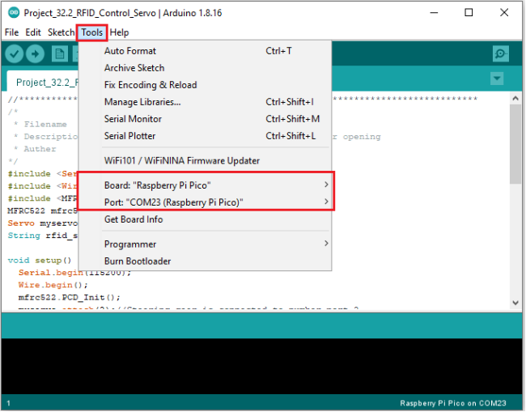

Click  to upload the test code to the Raspberry Pi Pico board


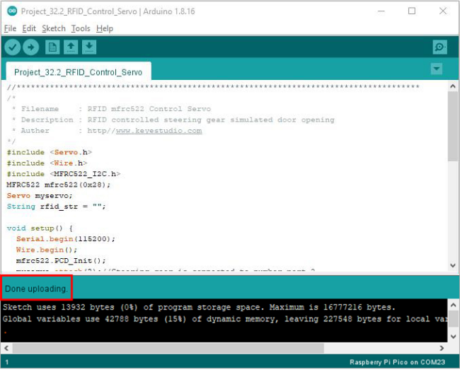

10.**Test Result：**

Upload the code to the pico board, power up with a USB cable and open the serial monitor and set baud rate to 115200.

When you use the key to open the door, the monitor will show information of the blank card and the key chain and “open the door”.

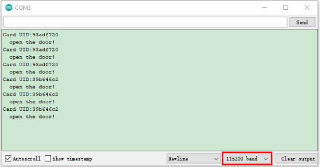


### Project 33: Keypad Door

1.**Introduction**

Matrix keypads are the kind of keypads you see on cell phones, calculators, microwaves ovens, door locks, etc. They’re practically everywhere.

In this project, we will learn Raspberry Pi Pico and membrane 4\*4 matrix keyboard to control servos and buzzers in the future.

2.**Components Required**

| 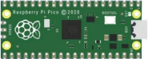 |  | 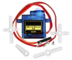 |
| :----------------------------------------------------------: | :----------------------------------------------------------: | :----------------------------------------------------------: |
|                     Raspberry Pi Pico*1                      |             Raspberry Pi Pico Expansion Board*1              |                           Servo*1                            |
| 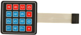 | 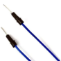 |  |
|               4\*4 Membrane Matrix Keyboard\*1               |                         Jumper Wires                         |                         Breadboard*1                         |
|  |  |                                                              |
|                       Active Buzzer*1                        |                         USB Cable*1                          |                                                              |


3.**Component Knowledge**

**4*4 Matrix keyboard:**

The keyboard is a device that integrates many keys. As shown in the figure below, a 4x4 keyboard integrates 16 keys.

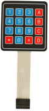

As with the LED matrix integration, in the 4x4 keyboard, each row of keys is connected to a pin, each column of keys is the same. This connection reduces the use of processor ports. 

The internal circuit is shown below.


You can use row scan or column scan methods to detect the state of the keys on each column or each line. 

Take the column scan method as an example. Send a low level to column 4 (Pin4), detect the state of rows 1, 2, 3 and 4, and determine whether the A, B, C and D keys are pressed. Then send the low level to columns 3, 2, 1 in turn, and detect whether other keys are pressed. Then you can get the state of all keys.


4.**Read the Value**

We start with a simple code to read the values of the 4\*4 matrix keyboard and print them in the serial monitor. Its wiring diagram is shown below.

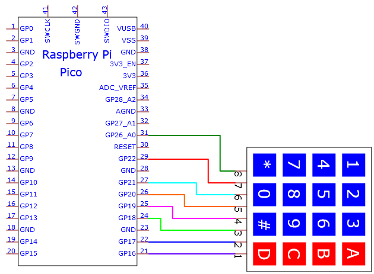


```c
//**********************************************************************************
/*  
 * Filename    : 4x4 Matrix Keypad Display 
 * Description : Get the value for the matrix keyboard
 * Auther      : http//www.keyestudio.com
*/
#include "Keypad.h"

void setup(){
  Serial.begin(115200);
  keyInit();
}

void loop(){
  char keyValue = getKey(0);
  if (keyValue != '\0')
    Serial.println(keyValue);
  delay(50);
}
//**********************************************************************************
```


Before uploading Test Code to Raspberry Pi Pico, please check the configuration of Arduino IDE.

Click "Tools" to confirm that the board type and ports.

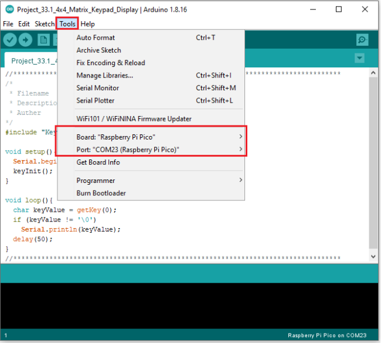

Click  to upload the test code to the Raspberry Pi Pico board

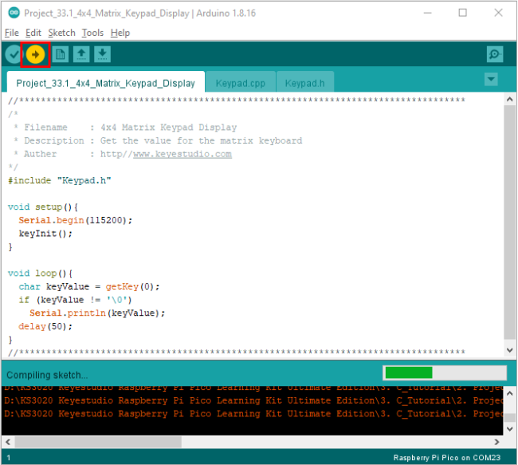

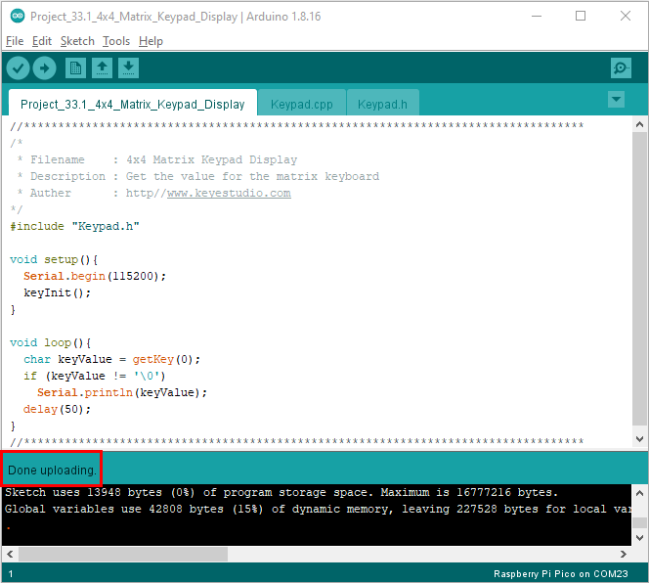

Upload the code and power up with a USB cable, open the monitor and set baud rate to 115200. Then you will see key values on the monitor.

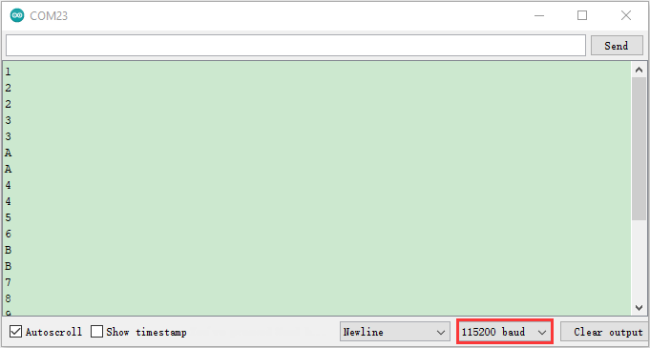


5.**Circuit diagram and wiring diagram:**

We control the servo and the buzzer with a 4\*4 dot matrix module.

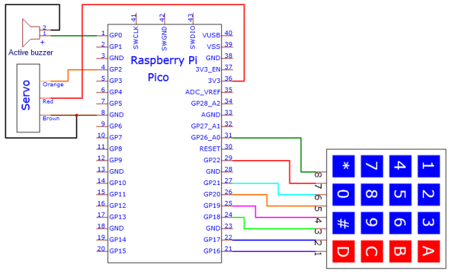

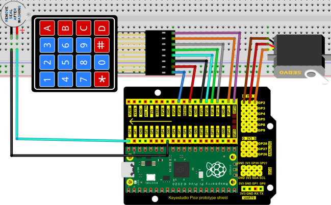

6.**Test Code：**


```c
//**********************************************************************************
/*  
 * Filename    : Keypad_Door
 * Description : Make a simple combination lock.
 * Auther      : http//www.keyestudio.com
*/
#include "Keypad.h"
#include <Servo.h>

Servo  myservo;     // Create servo object to control a servo
int servoPin = 2;   // Define the servo pin
int buzzerPin = 0; // Define the buzzer pin

String passWord = "1234"; // Save the correct password
String keyIn; 

void setup() {
  keyInit();
  myservo.attach(servoPin);  // attaches the servo on servoPin to the servo object
  myservo.write(0);                     // Set the starting position of the servo motor
  pinMode(buzzerPin, OUTPUT);
  Serial.begin(115200);
  keyIn = "";
  Serial.println(keyIn);
}

void loop() {
  char keyPressed = getKey(0);        // Get the character input
  if (keyPressed!='\0') {             // Handle the input characters
    digitalWrite(buzzerPin, HIGH);    // Make a prompt tone each time press the key
    delay(200);
    digitalWrite(buzzerPin, LOW);
    keyIn += keyPressed;              // Save the input characters
    Serial.println(keyPressed);       // Judge the correctness after input
    if (keyIn.length() == 4) {
      bool isRight = true;            // Save password is correct or not
      if( passWord != keyIn){
        isRight = !true;
      }
      if (isRight) {                  // If the input password is right
        myservo.attach(servoPin);
        myservo.write(90);            // Open the switch
        delay(2000);                  // Delay a period of time
        myservo.write(0);             // Close the switch
        Serial.println("passWord right!");
      }
      else {                          // If the input password is wrong
        digitalWrite(buzzerPin, HIGH);// Make a wrong password prompt tone
        delay(1000);
        digitalWrite(buzzerPin, LOW);
        Serial.println("passWord error!");
      }
      keyIn = ""; // Reset the number of the input characters to 0
    }
  }
  delay(200);
}
//******************************************************************************
```


Before uploading Test Code to Raspberry Pi Pico, please check the configuration of Arduino IDE.

Click "Tools" to confirm that the board type and ports.

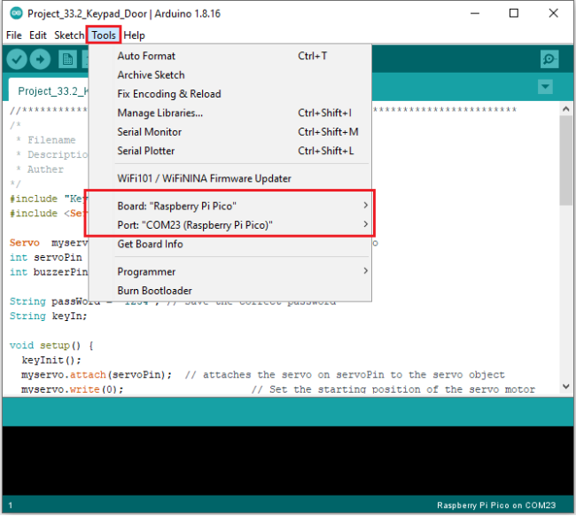

Click  to upload the test code to the Raspberry Pi Pico board

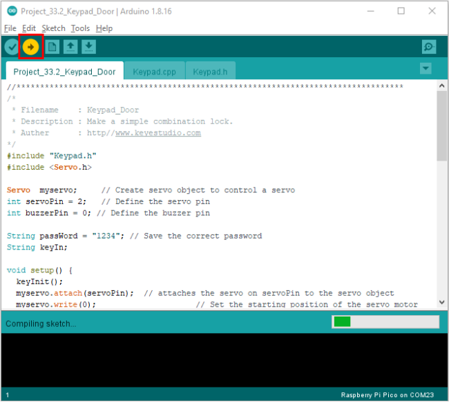

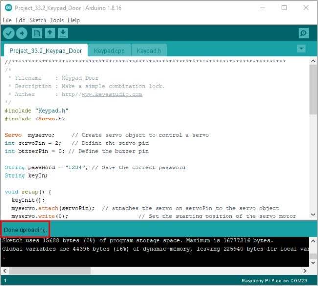

7.**Test Result:**

Upload the code and power up with a USB cable, you will see the phenomenon: press the keyboard to enter a 4-character password, if the input is correct (correct password: 1234), the servo will rotate at an angle, then return to the original location. An input error alert will be issued if an input is made incorrectly.

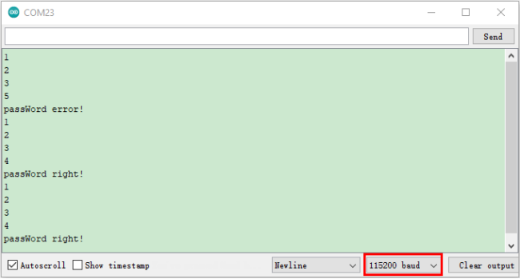

**Keypad.cpp**

```c
#include "Keypad.h"

byte rowPin[4] = {26, 22, 21, 20};
byte colPin[4] = {19, 18, 17, 16};

char keyStrings[4][4] = {
  {'1', '2', '3', 'A'},
  {'4', '5', '6', 'B'},
  {'7', '8', '9', 'C'},
  {'*', '0', '#', 'D'}
};

int lastTime = 0;
int debounceTime = 20;

int pressKeyRow=0;
int pressKeyCol=0;
bool pressState=false;

void keyInit(void){
  for (int r = 0; r < sizeof(rowPin); r++){
    pinMode(colPin[r], OUTPUT);
    digitalWrite(colPin[r], HIGH);
    pinMode(rowPin[r], INPUT_PULLUP);
  }
  for (int c = 0; c < sizeof(colPin); c++){
    pinMode(colPin[c], OUTPUT);
    digitalWrite(colPin[c], HIGH);
  }
}

void keyScan(bool state){
  for (int c = 0; c < sizeof(colPin); c++){
    digitalWrite(colPin[c], LOW);
    for (int r = 0; r < sizeof(rowPin); r++){
      if (digitalRead(rowPin[r]) == LOW){
        while (state == true && digitalRead(rowPin[r]) == LOW);
        digitalWrite(colPin[c], HIGH);
        pressKeyRow=r;
        pressKeyCol=c;
        pressState=true;
      }
    }
    digitalWrite(colPin[c], HIGH);
  }
}

char getKey(bool state){
  if (millis() - lastTime > debounceTime){
    pressState = false;
    keyScan(state);
    lastTime = millis();
    if(pressState==true)
      return keyStrings[pressKeyRow][pressKeyCol];
    else
      return '\0';
  }
}
```

### Project 34: IR Control Sound and LED

1.**Introduction**

Infrared remote control is a low-cost, easy-to-use wireless communication technology. IR light is very similar to visible light, except that it has a slightly longer wavelength. This means that infrared rays cannot be detected by the human eye, which is perfect for wireless communication. 

For example, when you press a button on the TV remote control, an infrared LED will switch on and off repeatedly at a frequency of 38,000 times per second, sending information (such as volume or channel control) to the infrared sensor on the TV.

We will first explain how common IR communication protocols work. Then we will start this project with a remote control and an IR receiving component.


2.**Components Required**

| 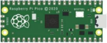 | 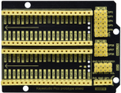 |  |
| :----------------------------------------------------------: | :----------------------------------------------------------: | :----------------------------------------------------------: |
|                     Raspberry Pi Pico*1                      |             Raspberry Pi Pico Expansion Board*1              |                        IR Receiver *1                        |
|  |  |  |
|                          RGB LED*1                           |                        220ΩResistor*3                        |                     IR Remote Control*1                      |
| 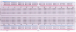 |  |  |
|                         Breadboard*1                         |                       Passive Buzzer*1                       |                        10KΩResistor*1                        |
|  |  |                                                              |
|                         Jumper Wires                         |                         USB Cable*1                          |                                                              |


3.**Component Knowledge**

**IR Remote Controller**: 

It is a device that has a certain number of buttons. Pressing different buttons causes the infrared transmitter tubes at the front of the remote control to send infrared signals in different codes. 

Infrared remote control technology is widely used, such as TV, air conditioner and so on. Therefore, in today's technologically advanced society, the infrared remote control technology makes it very convenient for us to change TV programs and adjust the temperature of the air conditioner.  

The remote control we used is as follows:

The infrared remote controller adopts NEC code and the signal cycle is 110ms.


**IR Receiver:** 

It is a component that can receive infrared light, which can be used to detect the infrared signal sent by the infrared remote control. The infrared signal received by the infrared receiver demodulation can be converted back to binary, then the information will be passed to a microcontroller.

**Process Diagram：**


NEC Infrared communication protocol：

**NEC Protocol**

To my knowledge the protocol I describe here was developed by NEC (Now Renesas). I've seen very similar protocol descriptions on the internet, and there the protocol is called Japanese Format. 

I do admit that I don't know exactly who developed it. What I do know is that it was used in my late VCR produced by Sanyo and was marketed under the name of Fisher. NEC manufactured the remote control IC. 

This description was taken from my VCR's service manual. Those were the days, when service manuals were filled with useful information! 

4.**Features**

- 8 bit address and 8 bit command length.
- Extended mode available, doubling the address size.

- Address and command are transmitted twice for reliability.

- Pulse distance modulation.

- Carrier frequency of 38kHz.

- Bit time of 1.125ms or 2.25ms.

**Modulation**


The NEC protocol uses pulse distance encoding of the bits. Each pulse is a 560µs long 38kHz carrier burst (about 21 cycles). A logical "1" takes 2.25ms to transmit, while a logical "0" is only half of that, being 1.125ms. The recommended carrier duty-cycle is 1/4 or 1/3.

Protocol

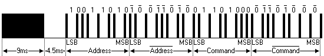

The picture above shows a typical pulse train of the NEC protocol. With this protocol the LSB is transmitted first. In this case Address $59 and Command $16 is transmitted. 

A message is started by a 9ms AGC burst, which was used to set the gain of the earlier IR receivers. This AGC burst is then followed by a 4.5ms space, which is then followed by the Address and Command. Address and Command are transmitted twice. 

The second time all bits are inverted and can be used for verification of the received message. The total transmission time is constant because every bit is repeated with its inverted length. 

If you're not interested in this reliability you can ignore the inverted values, or you can expand the Address and Command to 16 bits each! 

Keep in mind that one extra 560µs burst has to follow at the end of the message in order to be able to determine the value of the last bit.


A command is transmitted only once, even when the key on the remote control remains pressed. Every 110ms a repeat code is transmitted for as long as the key remains down. This repeat code is simply a 9ms AGC pulse followed by a 2.25ms space and a 560µs burst.


**Extended NEC protocol**

The NEC protocol is so widely used that soon all possible addresses were used up. By sacrificing the address redundancy the address range was extended from 256 possible values to approximately 65000 different values. This way the address range was extended from 8 bits to 16 bits without changing any other property of the protocol. 

By extending the address range this way the total message time is no longer constant. It now depends on the total number of 1's and 0's in the message. If you want to keep the total message time constant you'll have to make sure the number 1's in the address field is 8 (it automatically means that the number of 0's is also 8). This will reduce the maximum number of different addresses to just about 13000. 

The command redundancy is still preserved. Therefore each address can still handle 256 different commands.


Keep in mind that 256 address values of the extended protocol are invalid because they are in fact normal NEC protocol addresses. Whenever the low byte is the exact inverse of the high byte it is not a valid extended address.

5.**Decoding：**

Wire up the pico board


```c
//**********************************************************************************
/*  
 * Filename    : Decoded IR Signal
 * Description : Decode the infrared remote control and print it out through the serial port.
 * Auther      : http//www.keyestudio.com
*/
#include "IR.h"
#define IR_Pin 16

void setup() {
  Serial.begin(115200);
  IR_Init(IR_Pin);
}

void loop() {
  if(flagCode){
    int irValue = IR_Decode(flagCode);
    Serial.println(irValue, HEX);
    IR_Release();
  }
}
//**********************************************************************************
```


Before uploading Test Code to Raspberry Pi Pico, please check the configuration of Arduino IDE.

Click "Tools" to confirm that the board type and ports.


Click  to upload the test code to the Raspberry Pi Pico board

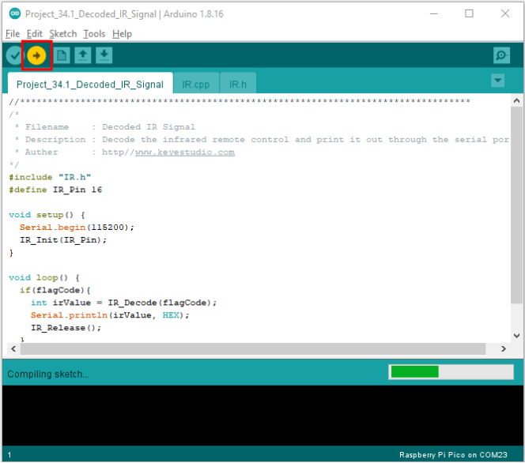


Upload the code to the pico board, power up with a USB cable and open the serial monitor and set baud rate to 115200. Point the remote control at the IR receiver, the monitor will show key values

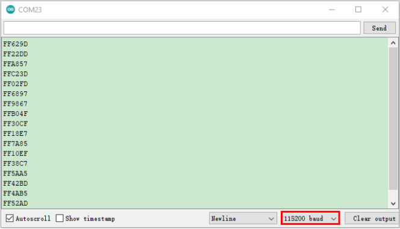

Code value of the remote control


Circuit diagram and wiring diagram:

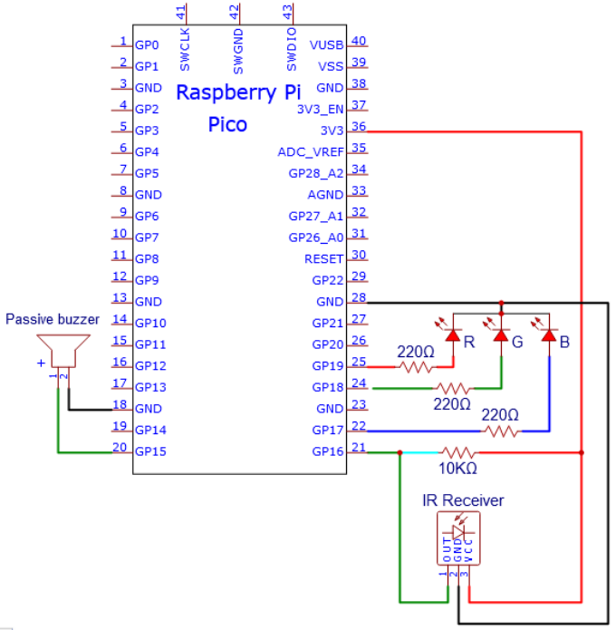


6.**Test Code**


```c
//**********************************************************************************
/*  
 * Filename    : IR Control Sound And LED
 * Description : Remote control RGB and Passive buzzer with infrared remote control.
 * Auther      : http//www.keyestudio.com
*/
#include "IR.h"

#define irPin 16
#define R_Pin 19
#define G_Pin 18
#define B_Pin 17
#define buzzerPin 15

void setup() {
  Serial.begin(115200);
  IR_Init(irPin);
  pinMode(R_Pin, OUTPUT);
  pinMode(G_Pin, OUTPUT);
  pinMode(B_Pin, OUTPUT);
  pinMode(buzzerPin, OUTPUT);
}

void loop() {
  if(flagCode){
    int irValue = IR_Decode(flagCode);
    Serial.println(irValue, HEX);
    handleControl(irValue);
    IR_Release();
  }
}

void handleControl(unsigned long value) {

  // Handle the commands
  if (value == 0xFF6897) // Receive the number '1'
  { 
      analogWrite(R_Pin, 255); //Common cathode LED, high level to turn on the led.
      analogWrite(G_Pin, 0);
      analogWrite(B_Pin, 0);
      tone(buzzerPin, 262);//DO play 1000ms
      delay(1000);
  }
   else if (value == 0xFF9867) // Receive the number '2'
   { 
      analogWrite(R_Pin, 0); 
      analogWrite(G_Pin, 255); //Common cathode LED, high level to turn on the led.
      analogWrite(B_Pin, 0);
      tone(buzzerPin, 294);//Re play 750ms
      delay(750);
   }
    else if (value == 0xFFB04F) // Receive the number '3'
   { 
      analogWrite(R_Pin, 0); 
      analogWrite(G_Pin, 0);
      analogWrite(B_Pin, 255); //Common cathode LED, high level to turn on the led.
      tone(buzzerPin, 330);//Mi play 625ms
      delay(625);
    }
    else if (value == 0xFF30CF) // Receive the number '4'
   {  
      analogWrite(R_Pin, 255); 
      analogWrite(G_Pin, 255);
      analogWrite(B_Pin, 0);
      tone(buzzerPin, 349);//Fa play 500ms
      delay(500);
    }
    else if (value == 0xFF18E7) // Receive the number '5'
   {  
      analogWrite(R_Pin, 255); 
      analogWrite(G_Pin, 0);
      analogWrite(B_Pin, 255);
      tone(buzzerPin, 392);//So play 375ms
      delay(375);
    }
    else if (value == 0xFF7A85)  // Receive the number '6'
   {  
      analogWrite(R_Pin, 0); 
      analogWrite(G_Pin, 255);
      analogWrite(B_Pin, 255);
      tone(buzzerPin, 440);//La play 250ms
      delay(250);
    }
    else if (value == 0xFF10EF)  // Receive the number '7'
   {   
      analogWrite(R_Pin, 255); 
      analogWrite(G_Pin, 255);
      analogWrite(B_Pin, 255);
      tone(buzzerPin, 494);//Si play 125ms
      delay(125);
    }
    else{
      analogWrite(R_Pin, 0); 
      analogWrite(G_Pin, 0);
      analogWrite(B_Pin, 0);
      noTone(buzzerPin);//Si play 125ms
      delay(1000);
      }
  }
//**********************************************************************************
```


Before uploading Test Code to Raspberry Pi Pico, please check the configuration of Arduino IDE.

Click "Tools" to confirm that the board type and ports.


Click  to upload the test code to the Raspberry Pi Pico board


7.**Test Result：**

Upload the code and power up. Press the key 1-7, the buzzer will emit do, re, mi, fa, sol, la and si, at same time, the RGB will show red, green, blue, yellow, dark red, blue-green and white color. If pressing the rest of keys, the buzzer will stop playing and the RGB will be off.

Note: you need to peel off the plastic film covered on the remote control.

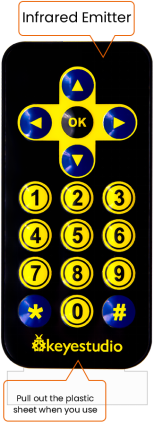

**IR.cpp**

```c
#include "IR.h"

int logList[32];
unsigned long startTime;
int endTime, end2Time;
int flagCode = 0;
int irPin;
bool irState = true;

void IR_Init(int pin) {
  irPin = pin;
  pinMode(irPin, INPUT_PULLUP);
  attachInterrupt(digitalPinToInterrupt(irPin), IR_Read, CHANGE);
}

void IR_Read() {
  if (irState == true) {
    unsigned long lowTime, highTime, intervalTime;
    int num = 0;
    while (digitalRead(irPin) == LOW) {
      startTime = micros();
      while (digitalRead(irPin) == LOW) {
        lowTime = micros();
      }
      intervalTime = lowTime - startTime;
      while (digitalRead(irPin) == HIGH) {
        highTime = micros();
        intervalTime = highTime - lowTime;
        if (intervalTime > 10000) {
          end2Time = millis();
          if (num == 32) {
            flagCode = 1;
            endTime = millis();
          }
          else if (num == 0 && end2Time - endTime > 300 && end2Time - endTime < 400) {
            flagCode = 2;
            endTime = millis();
          }
          return;
        }
      }
      if (intervalTime < 2000) {
        if (intervalTime < 700) {
          logList[num ++] = 0;
        }
        else {
          logList[num ++] = 1;
        }
      }
    }
  }
}

unsigned long IR_Decode(int &code) {
  unsigned long irData = 0;
  irState=false;
  if (code == 1) {
    code = 0;
    for (int i = 0; i < 32; i ++) {
      if (logList[i] == 0) {
        irData <<= 1;
      }
      else {
        irData <<= 1;
        irData ++;
      }
      logList[i] = 0;
    }
  }
  if (code == 2) {
    code = 0;
    irData = 0xffffffff;
  }
  return irData;
}

void IR_Release(){
  irState=true;
}
```

### Project 35: WiFi Test

1.**Introduction**

ESP8266 serial WiFi ESP-01 module is an ultra-low-power UART-WiFi transparent transmission module and designed for mobile devices and IoT applications. 

The physical device of the user can be connected to Wi-Fi wireless network for Internet or LAN communication to realize networking functions.


2.**Components Required**

| 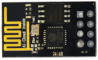 |  |
| :----------------------------------------------------------: | :----------------------------------------------------------: |
|             ESP8266 Serial WiFi ESP-01 Module*1              |          USB to ESP-01S WiFi Module Serial Shield*1          |


3.**Component Knowledge**

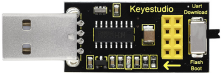

**USB to ESP-01S WiFi module serial shield:**

It is suitable for the ESP-01S WiFi module. Turn the DIP switch on the USB to ESP-01S WiFi module serial shield to Flash Boot, and plug into computer’s USB port. You can use serial debugging tool to test the AT command. 

Turn the DIP switch on the USB to ESP-01S WiFi module serial shield to the UartDownload, ESP-01 module is at download mode. You can download the firmware to ESP-01 module using AT firmware.

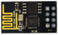

**ESP8266 serial WiFi ESP-01:** 

ESP8266 serial WiFi ESP-01 is an ultra-low-power UART-WiFi transparent transmission module. It can be widely used in smart grids, intelligent transportation, smart furniture, handheld devices, industrial control and other fields.


4.**Interface the Shield with the Computer**

Insert the ESP8266 serial WiFi ESP-01 module in the correct orientation into the USB to ESP-01S WiFi module serial shield.


First, turn the DIP switch on the USB to ESP-01S WiFi module serial shield to the UartDownload, and then insert the shield into the USB port of the computer.


The USB to serial port chip of this shield is CH340, We need to install the chip driver. The driver is usb_ch341_3.1.2009.06. We put this driver on the D: drive (i.e.: copyto D: drive). 

Then start installing the driver. The way to install drivers in different systems is pretty much the same, we will start installing drivers on the Windows 10.

When you connect the shield to your computer at the first time, right click “Computer”—>“Properties”—>“Device manager”,  you can see “**USB-Serial**”.

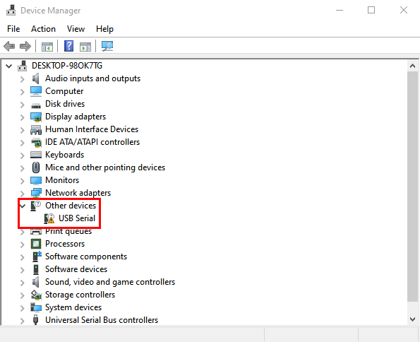

Click “**USB-Serial**” and select “**Update Driver** ”.

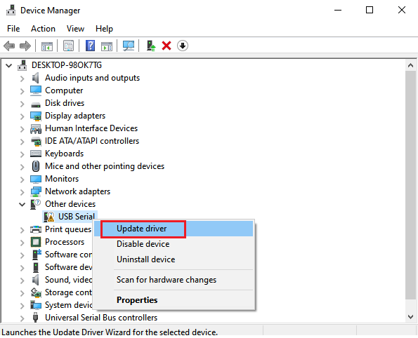

Then click on "**Browse my computer for drivers**".


Find the "**Drive File**" folder provided.(Here I put the driver file USb\_CH341\_3.1.2009.06 on disk D)

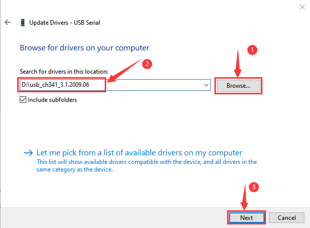

Click "**Close**" when installation is complete.

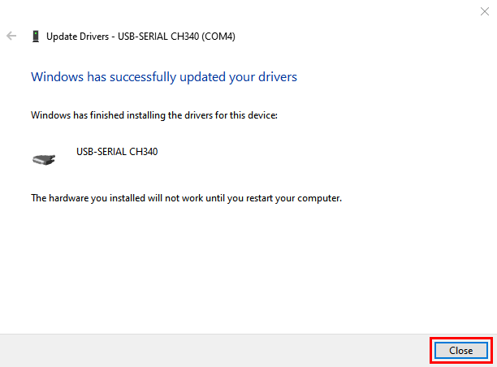

After the driver installation is complete, right click“Computer”—\>“Properties”—\>“Device manager”, you can see that the CH340 driver has been successfully installed on your computer, as follows.

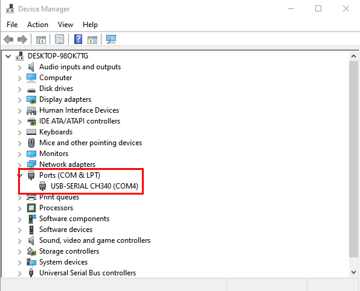

5.**Set up** **the Development Environment**

Insert the ESP8266 serial WiFi ESP-01 module into the USB to ESP-01S WiFi module serial shield correctly, and then plug the shield into the USB port of the computer. Click to enter the arduino-1.8.16 folder (you can also use the latest version). 

Find and click to enter the 1.8.16 version of the IDE interface.

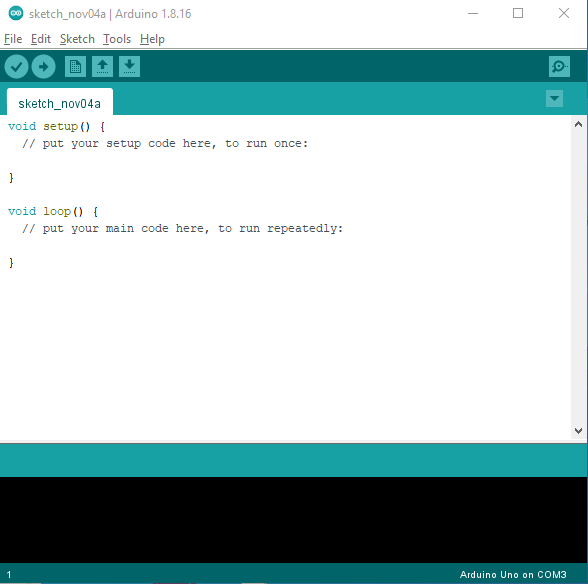

Click **File** →**Preferences**, copy and paste this address [http://arduino.esp8266.com/stable/package_esp8266com_index.json](http://arduino.esp8266.com/stable/package_esp8266com_index.json) in the ”**Additional Boards Manager URLs:**”, then click "**OK**" to save this address.


Click“**Tools**”→“**Board:**”, then click on "**Board Manager...**" to enter the "**Board Manager**" page, type "ESP8266" in the space after "All". 

Then click the following search content, select the latest version to install. The installation package is not large, click "**Install**" to start to install the relevant plug-ins.

(There may be an error in downloading and installing, possibly due to the server, so you need to click "Install" again. However, due to network reasons, most users may not be able to search esp8266 by esp8266 Community, so this method is not recommended for beginners, and **the following method 2 is recommended**.)

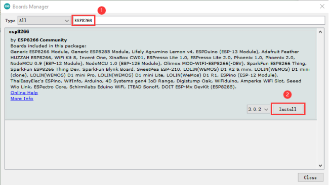

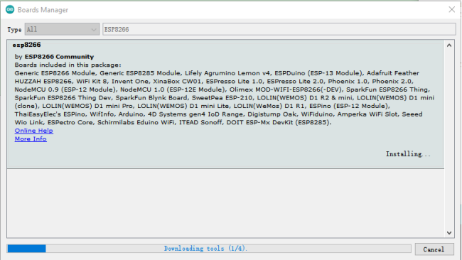

After successful installation, Click“**Close**”to close the page, and then click“**Tools**”→“**Board:**”, you can view different models of ESP8266 development boards in it. Select the corresponding ESP8266 development board model and COM port to program ESP8266.

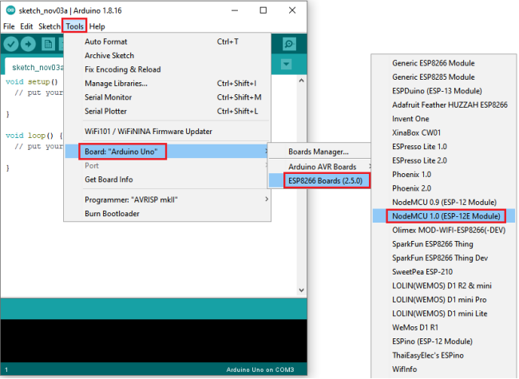


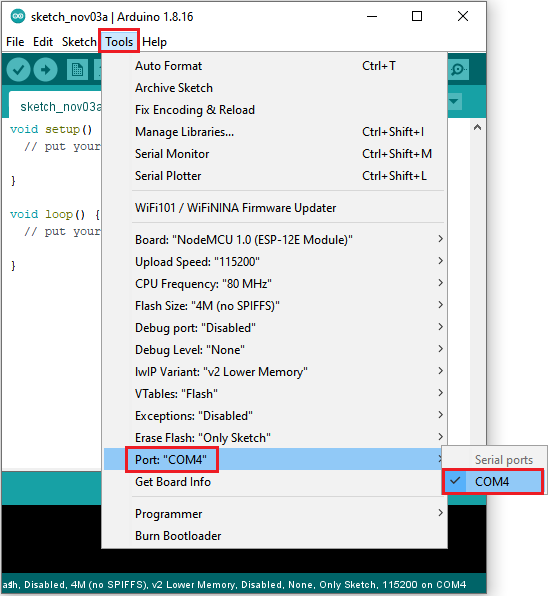

6. **Installation of ESP8266 by tools(Recommended)**

Click “**File”** →“**Preferences**”, copy [http://arduino.esp8266.com/stable/package_esp8266com_index.json](http://arduino.esp8266.com/stable/package_esp8266com_index.json) as follows, and click “**OK**”

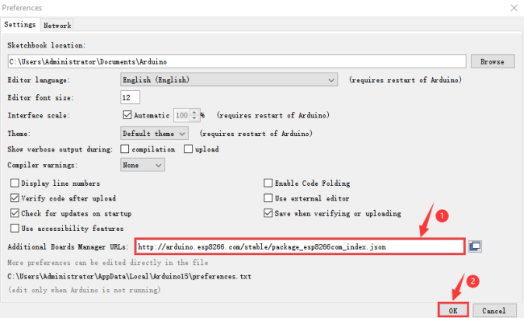

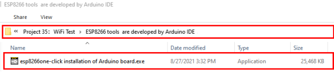

Double click “<span style="color: rgb(255, 76, 65);">ESP8266 one-click installation of Arduino board version 2.5.0.exe</span>”, then the installation is finished.

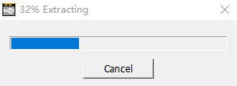

After the above tool is installed, restart the Arduino IDE software and click on the Arduino menu bar**“Tools”→“Board:” **, you can view different models of ESP8266 development boards in it. Select the corresponding ESP8266 development board model and COM port to program ESP8266.


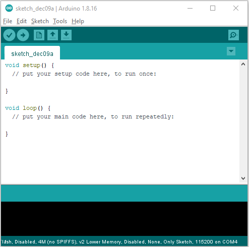


7.**WiFi Test Code**

<span style="color: rgb(255, 76, 65);">Note:</span> After opening the IDE, set the board type and COM port first. If you don't have WiFi at home, you can turn your phone hotspot on to share WiFi.

<br>
<br>

<span style="color: rgb(255, 76, 65);">Note:</span> You need to change the user WiFi name and user WiFi password in the project code to your own WiFi name and WiFi password.


```c
//**********************************************************************************
/*  
 * Filename    : Wifi test
 * Description : Wifi module test the ip of Wifi
 * Auther      : http//www.keyestudio.com
*/
#include <ESP8266WiFi.h>
#include <ESP8266mDNS.h>
#include <WiFiClient.h>

#ifndef STASSID
//#define STASSID "your-ssid"
//#define STAPSK  "your-password"
#define STASSID "ChinaNet-2.4G-0DF0"   //the name of user's wifi
#define STAPSK  "ChinaNet@233"       //the password of user's wifi
#endif

const char* ssid = STASSID;
const char* password = STAPSK;

// TCP server at port 80 will response the HTTP requirement
WiFiServer server(80);

void setup(void) {
  Serial.begin(115200);

  //  connect WiFi 
  WiFi.mode(WIFI_STA);
  WiFi.begin(ssid, password);
  Serial.println("");

  // wait connection
  while (WiFi.status() != WL_CONNECTED) {
    delay(500);
    Serial.print(".");
  }
  Serial.println("");
  Serial.print("Connected to ");
  Serial.println(ssid);
  Serial.print("IP address: ");
  Serial.println(WiFi.localIP());

  // set the mDNS responder::
  // - in this example. the first parameter is domain name
  //   The fully qualified domain name is “esp8266.local”
  // - the second parameter is IP address
  //   send the IP address via WiFi
  if (!MDNS.begin("esp8266")) {
    Serial.println("Error setting up MDNS responder!");
    while (1) {
      delay(1000);
    }
  }
  Serial.println("mDNS responder started");

  // activate TCP (HTTP) server
  server.begin();
  Serial.println("TCP server started");

  // add the server to MDNS-SD
  MDNS.addService("http", "tcp", 80);
}

void loop(void) {

  MDNS.update();
  Serial.print("Connected to ");
  Serial.println(ssid);
  Serial.print("IP address: ");
  Serial.println(WiFi.localIP());
  delay(1000); 
  // check the client side is connected or not
  WiFiClient client = server.available();
  if (!client) {
    return;
  }
  Serial.println("");
  Serial.println("New client");

  // wait the effective data from the client side
  while (client.connected() && !client.available()) {
    delay(1);
  }

  // read the first row of HTTP requirement
  String req = client.readStringUntil('\r');

  // the first row of the HTTP requirement is shown below: "GET /path HTTP/1.1"
  // Retrieve the "/path" part by finding the spaces
  int addr_start = req.indexOf(' ');
  int addr_end = req.indexOf(' ', addr_start + 1);
  if (addr_start == -1 || addr_end == -1) {
    Serial.print("Invalid request: ");
    Serial.println(req);
    return;
  }
  req = req.substring(addr_start + 1, addr_end);
  Serial.print("Request: ");
  Serial.println(req);
  client.flush();

  String s;
  if (req == "/") {
    IPAddress ip = WiFi.localIP();
    String ipStr = String(ip[0]) + '.' + String(ip[1]) + '.' + String(ip[2]) + '.' + String(ip[3]);
    s = "HTTP/1.1 200 OK\r\nContent-Type: text/html\r\n\r\n<!DOCTYPE HTML>\r\n<html>Hello from ESP8266 at ";
    s += ipStr;
    s += "</html>\r\n\r\n";
    Serial.println("Sending 200");
  } else {
    s = "HTTP/1.1 404 Not Found\r\n\r\n";
    Serial.println("Sending 404");
  }
  client.print(s);

  Serial.println("Done with client");
}
//**********************************************************************************
```


8.**Result**


Before uploaded the code, please turn the DIP switch of the shield to the UartDownload end and interface the shield to the USB port of a computer. 

Then set the board type and COM port.

The corresponding board type and COM port are displayed in the lower right corner of the IDE. Click  to upload the test code to the ESP8266 serial WiFi ESP-01 module, the upload is complete.（Note: If uploading unsuccessfully, reconnect the shield to the computer)

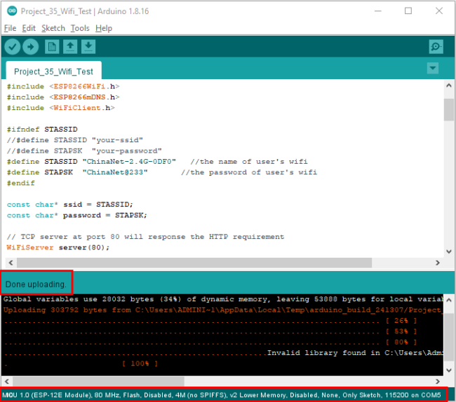

After the test code is uploaded successfully, first unplug the shield from the USB port of the computer, then turn DIP switch on the shield to the Flash Boot , and interface the shield to your PC. Open the serial monitor, set the baud rate to **115200**, and you can see your WiFi information, as shown below.

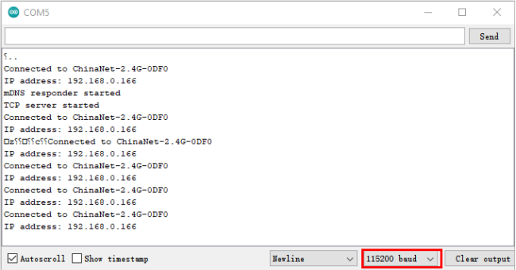


### Project 36: WiFi Smart Home

1.**Introduction**

In this project, we will use APP to control multiple sensors or modules through WiFi to achieve the effect of smart home.


2.**Components Required**

| 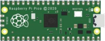 |  |  |
| :----------------------------------------------------------: | :----------------------------------------------------------: | :----------------------------------------------------------: |
|                     Raspberry Pi Pico*1                      |             Raspberry Pi Pico Expansion Board*1              |              Temperature and Humidity Sensor*1               |
|  |  |  |
|                 ESP8266 Serial WIFI ESP-01*1                 |          USB to ESP-01S WiFi Module Serial Shield*1          |                    130 DC Motor Module*1                     |
| 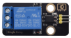 |  | 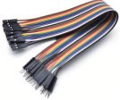 |
|                      5V Relay Module*1                       |                     Mobile Phone/iPad*1                      |                       M-F Dupont Wires                       |
|  |  |  |
|                           Servo*1                            |                     Ultrasonic sensor*1                      |                         USB Cable*1                          |
|  |  |  |
|                         Breadboard*1                         |                       F-F Dupont Wires                       |                         Jumper Wires                         |

3.**Plug the WiFi Module Serial Shield into the USB port of the computer**

Insert the ESP8266 serial WiFi ESP-01 module into the USB to ESP-01S WiFi module serial shield.


First, turn the DIP switch on the USB to ESP-01S WiFi module serial shield to the UartDownload, and then insert the shield into the USB port of the computer.


​    

4.**ESP8266 Code：**

<span style="color: rgb(255, 76, 65);">Note:</span> open Arduino IDE, set the ESP8266 board type and COM ports. If you don’t have wifi in your home, just open your hotspot of your cellphone to connect with the device.


<br>
<br>

<span style="color: rgb(255, 76, 65);">Note:</span> You need to change WiFi name and password into your own WiFi name and WiFi password.

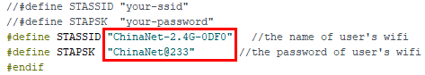

```c
//**********************************************************************************
/*
ESP8266_Code
*/
// generated by KidsBlock
#include <Arduino.h>
#include <ESP8266WiFi.h>
#include <ESP8266mDNS.h>
#include <WiFiClient.h>
//#include <WiFi.h>

#ifndef STASSID
#define STASSID "ChinaNet-2.4G-0DF0"  //the name of user's Wifi
#define STAPSK  "ChinaNet@233"       //the password of the user's wifi
#endif
const char* ssid = STASSID;
const char* password = STAPSK;

//IPAddress local_IP(192,168,4,22);
//IPAddress gateway(192,168,4,22);
//IPAddress subnet(255,255,255,0);
//
//const char *ssid = "ESP8266_AP_TEST";
//const char *password = "12345678";

WiFiServer server(80);
String unoData = "";
int ip_flag = 0;
int ultra_state = 1;
String ip_str;


void setup() {
  Serial.begin(9600); 
//   WiFi.mode(WIFI_AP); //Set to work in AP mode
//
//  WiFi.softAPConfig(local_IP, gateway, subnet); //Setting an AP Address
//  while(!WiFi.softAP(ssid, password)){}; //Start AP
//  Serial.println("AP starting success");
//
//  Serial.print("IP address: ");
//  Serial.println(WiFi.softAPIP()); // Printing the IP Address
//
//  WiFi.softAPsetHostname("myHostName"); //Set host name
//  Serial.print("HostName: ");
//  Serial.println(WiFi.softAPgetHostname()); //print host name
//
//  Serial.print("mac Address: ");
//  Serial.println(WiFi.softAPmacAddress()); //prnt mac add

  WiFi.mode(WIFI_STA);
  WiFi.begin(ssid, password);
  while (WiFi.status() != WL_CONNECTED) {
    delay(500);
    Serial.print(".");
  }
  Serial.print("IP ADDRESS: ");
  Serial.println(WiFi.localIP());
  if (!MDNS.begin("esp8266")) {
    //Serial.println("Error setting up MDNS responder!");
    while (1) {
      delay(1000);
    }
  }
 // Serial.println("mDNS responder started");
  server.begin();
  //Serial.println("TCP server started");
  MDNS.addService("http", "tcp", 80);
  ip_flag = 1;
}

void loop() {
  //Serial.println(WiFi.softAPgetStationNum()); //Prints the number of client connections
  if(ip_flag == 1)
  {
    for(int i=3; i>0; i--)
    {
      Serial.print("IP: ");
      Serial.print(WiFi.localIP());
      Serial.println('#');
      delay(500);
    }
    ip_flag = 0;
    
  }
    MDNS.update();
    WiFiClient client = server.available();
    if (!client) {
      return;
    }
    //Serial.println("");
    while (client.connected() && !client.available()) {
      delay(1);
    }
    String req = client.readStringUntil('\r');
    int addr_start = req.indexOf(' ');
    int addr_end = req.indexOf(' ', addr_start + 1);
    if (addr_start == -1 || addr_end == -1) {
      //Serial.print("Invalid request: ");
      //Serial.println(req);
      return;
    }
    req = req.substring(addr_start + 1, addr_end);
    int len_val = String(req).length();
    String M_req = String(req).substring(0,6);
    //Serial.println(M_req);
    if(M_req == "/")
    {
      String s_M_req = String(req).substring(5,len_val);
      Serial.print(s_M_req);
      Serial.print("#");
    }
    if(M_req == "/btn/v")
    {
      String s_M_req = String(req).substring(5,len_val);
      Serial.print(s_M_req);
      Serial.print("#");
    }
    client.flush();
    String s;
    if (req == "/") {
      IPAddress ip = WiFi.localIP();
      String ipStr = String(ip[0]) + '.' + String(ip[1]) + '.' + String(ip[2]) + '.' + String(ip[3]);
      s = "HTTP/1.1 200 OK\r\nContent-Type: text/html\r\n\r\n<!DOCTYPE HTML>\r\n<html>Hello from ESP8266 at ";
      s += ipStr;
      s += "</html>\r\n\r\n";
      //Serial.println("Sending 200");
      Serial.println(WiFi.localIP());
      Serial.write('*');
      client.println(WiFi.localIP());
      ip_flag = 0;
    }
    else if(req == "/btn/0")
    {
      Serial.write('a');
      client.println("turn on the relay");
    }
    else if(req == "/btn/1")
    {
      Serial.write('b');
      client.println("turn off the relay");
    }
    else if(req == "/btn/2")
    {
      Serial.write('c');
      client.println("Bring the steering gear over 180 degrees");
    }
    else if(req == "/btn/3")
    {
      Serial.write('d');
      client.println("Bring the steering gear over 0 degrees");
    }
    else if(req == "/btn/4")
    {
      Serial.write('e');
      client.println("esp8266 already turn on the fans");
    }
    else if(req == "/btn/5")
    {
      Serial.write('f');
      client.println("esp8266 already turn off the fans");
    }
    else if(req == "/btn/6")
    {
      Serial.write('g');
      while(Serial.available() > 0)
      {
        unoData = Serial.readStringUntil('#');
        client.println(unoData);
      }
    }
    else if(req == "/btn/7")
    {
      Serial.write('h');
      client.println("turn off the ultrasonic");
    }
    else if(req == "/btn/8")
    {
      Serial.write('i');
      while(Serial.available() > 0)
      {
        unoData = Serial.readStringUntil('#');
        client.println(unoData);
        //client.flush();
      }
    }
    else if(req == "/btn/9")
    {
      Serial.write('j');
      client.println("turn off the temperature");
    }
    else if(req == "/btn/10")
    {
      Serial.write('k');
      while(Serial.available() > 0)
      {
        unoData = Serial.readStringUntil('#');
        client.println(unoData);
        //client.flush();
      }
    }
    else if(req == "/btn/11")
    {
      Serial.write('l');
      client.println("turn off the humidity");
    }
    else if(req == "/btn/12")
    {
      Serial.write('m');
      client.println(F("m"));
    }
    else if(req == "/btn/13")
    {
      Serial.write('n');
      client.println(F("n"));
    }
    else if(req == "/btn/14")
    {
      Serial.write('o');
      client.println(F("o"));
    }
    else if(req == "/btn/15")
    {
      Serial.write('p');
      client.println(F("p"));
    }
    else if(req == "/btn/16")
    {
      Serial.write('q');
      client.println(F("q"));
    }
    else if(req == "/btn/17")
    {
      Serial.write('r');
      client.println(F("r"));
    }
    else if(req == "/btn/18")
    {
      Serial.write('s');
      client.println(F("s"));
    }
    else if(req == "/btn/19")
    {
      Serial.write('t');
      client.println(F("t"));
    }
    else if(req == "/btn/20")
    {
      Serial.write('u');
      client.println(F("u"));
    }
    else if(req == "/btn/21")
    {
      Serial.write('v');
      client.println(F("v"));
    }
    else if(req == "/btn/22")
    {
      Serial.write('w');
      client.println(F("w"));
    }
    else if(req == "/btn/23")
    {
      Serial.write('x');
      client.println(F("x"));
    }
    else {
      //s = "HTTP/1.1 404 Not Found\r\n\r\n";
      //Serial.println("Sending 404");
    }

    client.print(F("IP : "));
    client.println(WiFi.localIP());
}
//**********************************************************************************
```


After changing the WiFi name and WiFi password, ensure that the DIP switch on the shield has been turned to the UartDownload end and the shield has been plugged into the computer. 

Then set the board type and COM port according to the method in Project 35, and the corresponding board type and COM port are displayed in the lower right corner of the IDE. 

Click  to upload the test code to the ESP8266 serial WiFi ESP-01 module, the upload is complete. (Note: If uploading unsuccessfully, unplug the WIF shield and reboot it again.

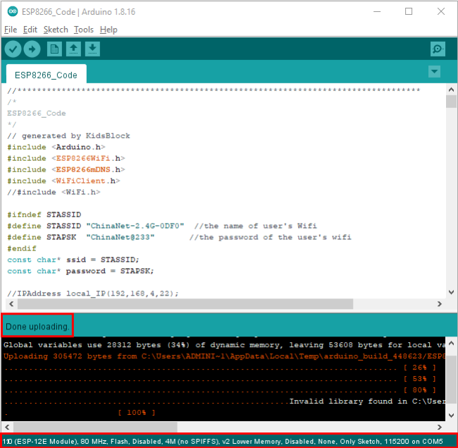

After the test code is uploaded successfully, first unplug the shield from the USB port of the computer, and then unplug the ESP8266 serial WiFi ESP-01 module from the shield.

5.**Wiring Diagram**

<table>
<tbody>
<tr class="odd">
<td>Relay module</td>
<td>Raspberry Pi Pico Expansion Board</td>
<td></td>
<td>Temperature and Humidity sensor</td>
<td>Raspberry Pi Pico Expansion Board</td>
</tr>
<tr class="even">
<td>G</td>
<td>G</td>
<td></td>
<td>G</td>
<td>G</td>
</tr>
<tr class="odd">
<td>V</td>
<td>5V</td>
<td></td>
<td>V</td>
<td>3V3</td>
</tr>
<tr class="even">
<td>S</td>
<td>GP27</td>
<td></td>
<td>S</td>
<td>GP2(S)</td>
</tr>
<tr class="odd">
<td></td>
<td></td>
<td></td>
<td></td>
<td></td>
</tr>
<tr class="even">
<td>Ultrasonic sensor</td>
<td>Raspberry Pi Pico Expansion Board</td>
<td></td>
<td>130 Fan motor</td>
<td>Raspberry Pi Pico Expansion Board</td>
</tr>
<tr class="odd">
<td>Vcc</td>
<td>5V</td>
<td></td>
<td>G</td>
<td>G</td>
</tr>
<tr class="even">
<td>Trig</td>
<td>GP17</td>
<td></td>
<td>V</td>
<td>5V</td>
</tr>
<tr class="odd">
<td>Echo</td>
<td>GP16</td>
<td></td>
<td>IN+</td>
<td>GP3</td>
</tr>
<tr class="even">
<td>Gnd</td>
<td>G</td>
<td></td>
<td>IN-</td>
<td>GP5</td>
</tr>
<tr class="odd">
<td></td>
<td></td>
<td></td>
<td></td>
<td></td>
</tr>
<tr class="even">
<td>WIFI module</td>
<td>Raspberry Pi Pico Expansion Board</td>
<td></td>
<td>Servo</td>
<td>Raspberry Pi Pico Expansion Board</td>
</tr>
<tr class="odd">
<td>3V3</td>
<td>3V3</td>
<td></td>
<td>Red line</td>
<td>3V3</td>
</tr>
<tr class="even">
<td>EN/CP</td>
<td>3V3</td>
<td></td>
<td>Brown line</td>
<td>G</td>
</tr>
<tr class="odd">
<td>TX</td>
<td>RX(GP1)</td>
<td></td>
<td>Orange line</td>
<td>GP9(S)</td>
</tr>
<tr class="even">
<td>RX</td>
<td>TX(GP0)</td>
<td></td>
<td></td>
<td></td>
</tr>
<tr class="odd">
<td>GND</td>
<td>GND</td>
<td></td>
<td></td>
<td></td>
</tr>
</tbody>
</table>

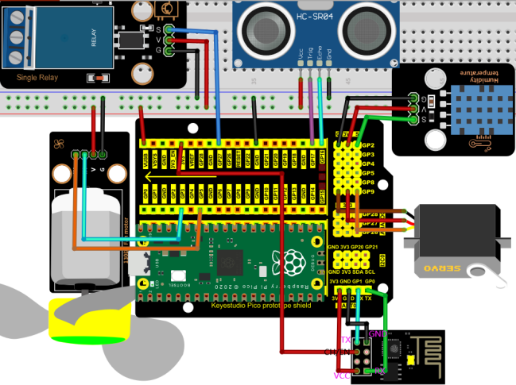

6.**Project Code**

<span style="color: rgb(255, 76, 65);">Note:</span> After opening the IDE, be sure to set the board type and COM port first. If you don't have WiFi at home, you need to turn your phone hotspot on to share WiFi.

<br>
<br>

```c
//**********************************************************************************
/*  
 * Filename    : WiFi Smart Home.
 * Description : WiFi APP controls Multiple sensors/modules work to achieve the effect of WiFi smart home.
 * Auther      : http//www.keyestudio.com
*/
#include <dht.h>
dht DHT;

#include<Servo.h>
Servo myservo;

char wifiData;
int distance1;
String dis_str;

const int dhtPin = 2;
const int relayPin = 27;
const int IN1 = 3;
const int IN2 = 5;
const int trigPin = 17;
const int echoPin = 16;
const int servoPin = 9;

int ip_flag = 1;
int ultra_state = 1;
int temp_state = 1;
int humidity_state = 1;

void setup() {
  Serial1.begin(9600);
  pinMode(dhtPin, INPUT);
  pinMode(relayPin, OUTPUT);
  pinMode(servoPin, OUTPUT);
  pinMode(IN1, OUTPUT);
  pinMode(IN2, OUTPUT);
  pinMode(trigPin, OUTPUT);
  pinMode(echoPin, INPUT);

  //turn off the fan
  digitalWrite(IN1, LOW);
  digitalWrite(IN2, LOW);

  digitalWrite(relayPin, LOW); //turn off the relay module

  myservo.attach(9);

  //dht.begin();
}

void loop() {
  int chk = DHT.read11(dhtPin);
  if(Serial1.available() > 0)
  {
    wifiData = Serial1.read();
    Serial.print(wifiData);
    if(wifiData == '#')
    {
      ip_flag = 0;
    }
    
    if(ip_flag == 1)
    {
      //String ip_addr = Serial.readStringUntil('#');
      Serial.print(wifiData);
      if(wifiData == '#')
      {
        Serial.println("");
      }
      delay(100);
    }
  }

  switch(wifiData)
    {
      case 'a': digitalWrite(relayPin, HIGH); break;
      case 'b': digitalWrite(relayPin, LOW); break;
      case 'c': myservo.write(180); delay(200); break;
      case 'd': myservo.write(0); delay(200); break;
      case 'e': digitalWrite(IN1, HIGH); digitalWrite(IN2, LOW); break;
      case 'f': digitalWrite(IN1, LOW); digitalWrite(IN2, LOW); break;
      case 'g': while(ultra_state>0)
                  {
                    Serial.print("Distance = "); 
                    Serial.print(checkdistance());
                    Serial.println("#"); 
                    Serial1.print("Distance = "); 
                    Serial1.print(checkdistance());
                    Serial1.println("#"); 
                    ultra_state = 0;
                  }
                  break;
      case 'h': ultra_state = 1; break;
      case 'i': while(temp_state>0)
                {
                  Serial.print("Temperature = "); 
                  Serial.print(DHT.temperature,1);
                  Serial.println("#");
                  Serial1.print("Temperature = "); 
                  Serial1.print(DHT.temperature,1);
                  Serial1.println("#");
                  temp_state = 0;
                }
                break;
      case 'j': temp_state = 1; break;
      case 'k': while(humidity_state > 0)
                {
                  Serial.print("Humidity = "); 
                  Serial.print(DHT.humidity,1);
                  Serial.println("#");
                  Serial1.print("Humidity = "); 
                  Serial1.print(DHT.humidity,1);
                  Serial1.println("#");
                  humidity_state = 0;
                }
                break;
      case 'l': humidity_state = 1; break;
    }
  
}

int checkdistance() {
  digitalWrite(17, LOW);
  delayMicroseconds(2);
  digitalWrite(17, HIGH);
  delayMicroseconds(10);
  digitalWrite(17, LOW);
  int distance = pulseIn(16, HIGH) / 58;
  
  delay(10);
  return distance;
}
//**********************************************************************
```


7.**Result**

<span style="color: rgb(255, 76, 65);">Note:</span> Before uploading the project code, you need to unplug the TX and RX cables connected to the pico board first, otherwise the code will not be uploaded successfully. 

<br>
<br>

Then click "Tools" → "Board:", select the Raspberry Pi Pico and choose the correct COM port. Finally, upload the project code to the pico board. 

After uploading the code successfully, connect the other end of the TX Dupont wire on the ESP8266 serial WiFi ESP-01 module to the RX(0) pin on the pico board. The other end of RX Dupont wire is connected to the TX (1) pin on the pico board. 

Click  to open the serial monitor window and set the baud rate to 9600. 

In this way, the serial monitor shows the IP address of your WiFi. (The IP address of WiFi sometimes changes. If the original IP address does not work, you need to detect the IP address again.)

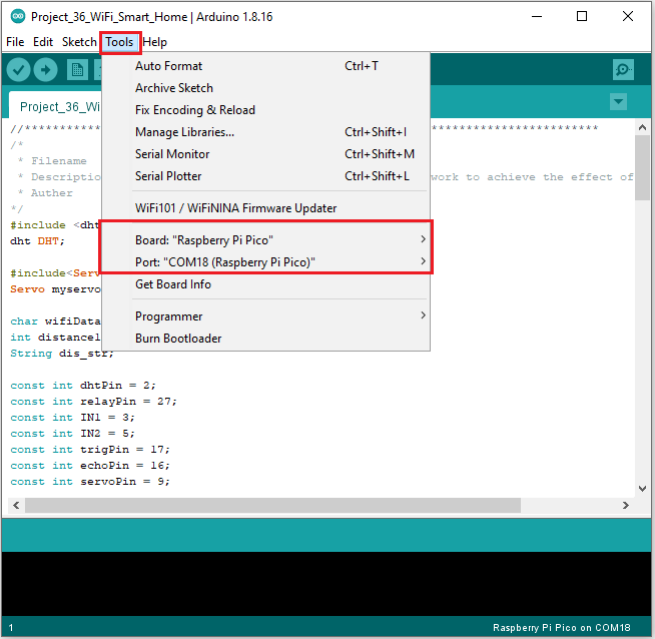

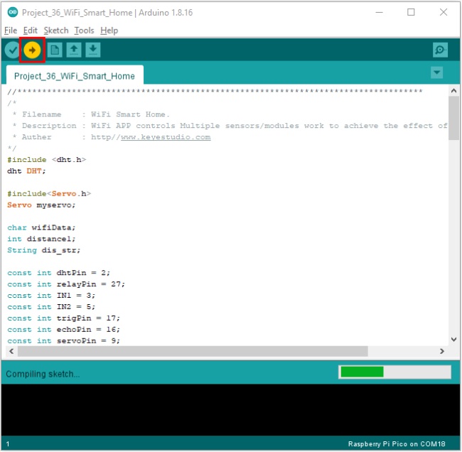


8.**App**

**For Android system devices(mobile phone/iPad)**

Now transfer the “**keyes wifi.apk**” file from the folder to your Android phone or iPad, click the “**keyes wifi.apk**” file to enter the installation page. Click the "**ALLOW**" button, and then click the "**INSTALL**" button. Click the "**Open**" button to enter the APP interface after the installation is completed.

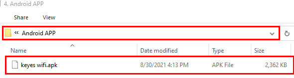


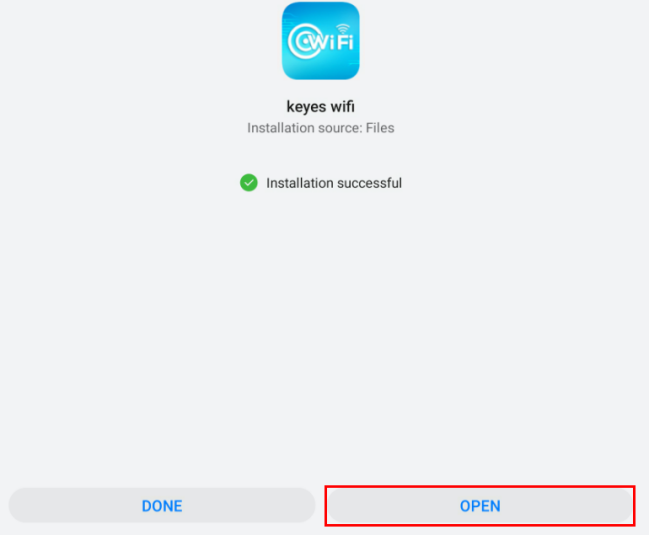


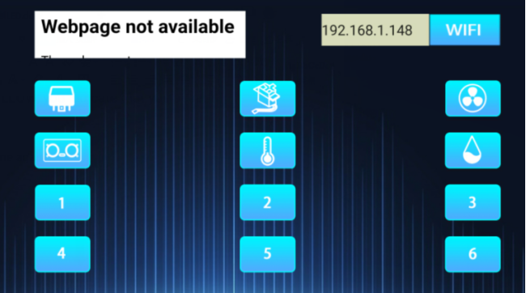

Enter the detected WiFi IP address in the text box in front of the WiFi button (For example, the IP address detected by the serial monitor above is 192.168.0.119), then click the WiFi button, “403 Forbidden” or "Webpage not available" will become "192.168.0.119". This shows that the App has been connected to WiFi.

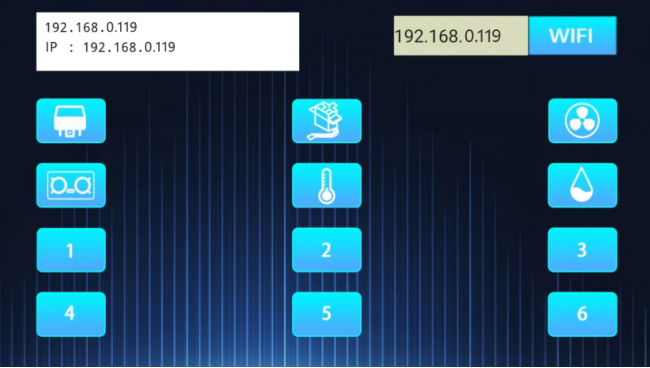

**For IOS system devices (mobile phone/iPad)**

Open App Store.


Enter “**keyes link**” in the search box, search and the download screen will appear. 

Click“”，b., you can download and install keyes link APP. The following operations are similar to those of Android system. You can refer to the steps of Android system above for operation.

<span style="color: rgb(255, 76, 65);">**Note:**</span>

<br>
<br>

Click the button on APP, the blue light on ESP8266 serial WiFi ESP-01 module will flash, indicating that APP has connected to WiFi.


After the APP has been connected to the WiFi, start the following operations.

(1) Click .Relay opens and the APP shows ,the indicator light on the module lights up. Click  again, relay is closed and the APP shows , indicator light on the module goes out.

(2) Click . The servo rotates 180° and the APP shows . Click again, the APP shows ，the servo rotates 0°.

(3) Click . Motor (with small fan leaves)rotates and the APP shows. Click  again. Turn off the motor, the APP shows .

(4) Click , ultrasonic sensor measures distance. Put an object in front of the ultrasonic sensor, and the APP shows （Different distance shows different numbers). It means that the distance of the object from the ultrasonic sensor is 14cm at this time. Click . Turn off ultrasound, the APP shows.

(5) Click ,temperature and humidity sensor measures the temperature in the environment. The APP shows , which means that the temperature in the environment is 28℃ at this time. Click , turn off the temperature and humidity sensor, the APP shows.

(6) Click , temperature and humidity sensor measures the humidity in the environment.  The APP shows , it means that the humidity in the environment is 52% at this time. Click ，turn off the temperature and humidity sensor, the APP shows.
