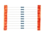
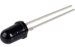
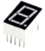
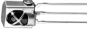
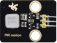
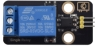
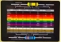

# Keyestudio Raspberry Pi Pico Ultimate Learning Kit 

# 1. Introduction:

Do you want to learn about programming?

As long as you are passionate about science and dare to explore new things, this kit is surely the best choice for you.

The kit is a learning kit for two programming methods, including Thonny, MicroPython IDE and Arduino IDE. you can create numerous fascinating experiments with the Raspberry pi, sensors, modules and electronic components.

Tutorials are provided, which contain detailed wiring diagrams, component knowledge, test code, and so on.

In addition, you can master the use of electronics, physics, science and programming by building up experiment with this kit.

# 2. Kit List:

|                     |       |    |            |              |
| ------------------------------------------ | ---------------------------- | ------------------------- | --------------------------------- | ----------------------------------- |
| Raspberry Pi Pico*1                        | Blue LED*10                  | Red LED*10                | Yellow LED*10                     | Green LED*10                        |
|                     |       |    |            |              |
| RGB*1                                      | 220Ω Resistor*10             | 10KΩ Resistor*10          | 1KΩ Resistor*10                   | Raspberry Pi Pico Expansion Board*1 |
|                     |       |    |            |              |
| 10KΩ Potentiometer*1                       | Active Buzzer*1              | Passive Buzzer*1          | Button*4                          | Tilt Switch*1                       |
|                     |       |    |            |              |
| Photoresistor*2                            | Flame Sensor*1               | Yellow Cap*4              | IC 74HC595N *1                    | ESP8266 Serial WiFi ESP-01*1        |
|                     |       |    |            |              |
| 1-Digit Tube Display*1                     | 4-Digit Tube Display*1       | 8*8 Dot Matrix Display *1 | Temperature and Humidity Sensor*1 | LCD_128X32_DOT *1                   |
|                     |       |    |            |              |
| IR Receiver*1                              | IR Remote Controller*1       | Servo*1                   | 4*4 Membrane Keypad*1             | 130 DC Motor*1                      |
|                     |       |    |            |              |
| USB to ESP-01S WiFi Module Serial Shield*1 | Stepper Motor Driver Board*1 | Stepper Motor*1           | Joystick Module*1                 | Sound Sensor*1                      |
|                     |       |    |            |              |
| PIR Motion Sensor*1                        | RFID Module*1                | Ultrasonic Sensor*1       | LM35 Temperature Sensor*1         | 5V Relay Module*1                   |
|                     |       |    |            |              |
| 10K Thermistor*1                           | ABS Key Chain*1              | White Card*1              | Breadboard*1                      | USB Cable*1                         |
|                     |       |    |            |              |
| Resistance Card*1                          | Jumper Wire*30               | M-F Dupont Wire40         | F-F Dupont Wire*40                | 10CM M-F Dupont Wires*10            |

# 3. Tutorials 

## [1.Raspberry_Pi_Pico](1.Raspberry_Pi_Pico.md)

## [2.Arduino_C_Tutorial(Windows)](2.Arduino_C_Tutorial(Windows)/Arduino_C_Tutorial(Windows).md)

## [3.Python_Tutorial(Windows)](3.Python_Tutorial(Windows)/Python_Tutorial(Windows).md)

## [4.Python_Tutorial(Raspberry-Pi)](4.Python_Tutorial(Raspberry-Pi)/Python_Tutorial(Raspberry-Pi).md)

## [5.Libraries_and_Firmware](5.Libraries_Firmware_and_APP.zip)

## [6.Codes](6.Codes.zip)

